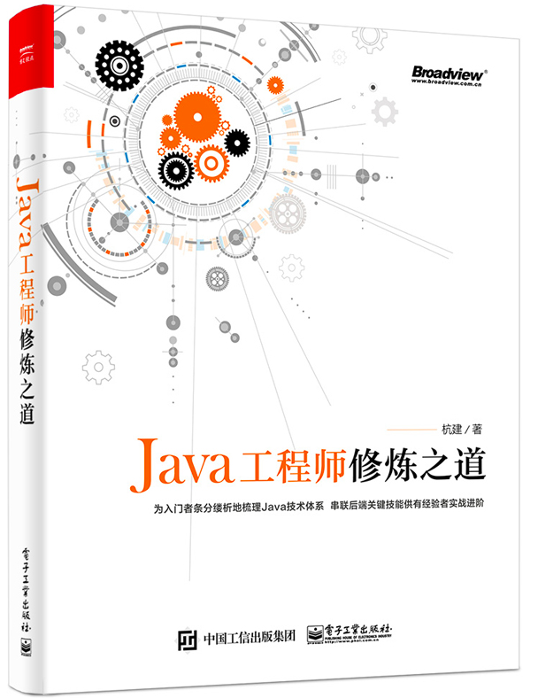

《Java工程师修炼之道》
--

购买纸质书籍可至：<https://item.jd.com/12325207.html>

- [在线书籍](https://rowkey-books.gitbook.io/pragmatic-java-engineer/)
- [代码](source)
- [勘误](https://github.com/superhj1987/pragmatic-java-engineer/wiki/Mistakes)

### 内容介绍

[**前言**](book/README.md)

### 后续计划

> 此书一开始是计划有一章专门讲述大数据开发技术，毕竟现在越来越多的公司在构建自己的大数据平台，大数据技术也逐渐成了Java工程师的必备技能。但自己此方面经验较少，自认并没有达到可以向别人输出知识的程度，于是暂时搁置此部分。

逐步把部分内容开源在此项目中，并补充一些新的内容进来。

- Zookeepr本来是想放在大数据一章，现在会作为数据存储的一节补充进来。
- 异步响应式Web框架会补充在开发框架一章，以Vert.x为主，Spring Flux为辅。
- Redis加入新版本的特性，并补充如何使用Redis实现分布式锁。
- Kafka加入最新版本的特性，尤其是Kafka Streams和Exactly one语义。
- Elasticsearch基于5.0版本更新。
- 补充协程到并发编程中。
- 补充Netty到网络编程中。
- 使用Hystrix做资源隔离和限流会补充在Java开发利器中。
- 补充RxJava的使用在Java开发利器中。
- 补充Java10和Kotlin的部分到Java新版本特性。

## Star History

