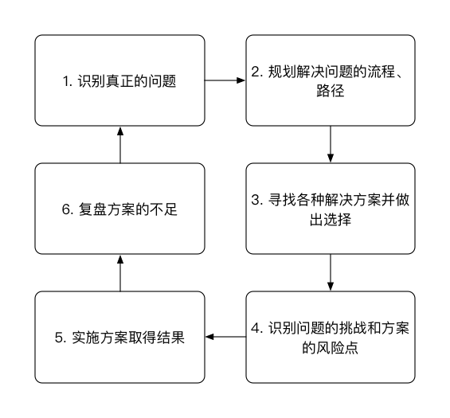
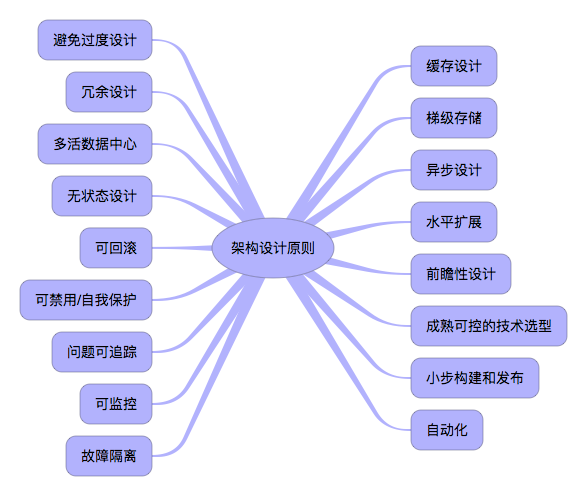
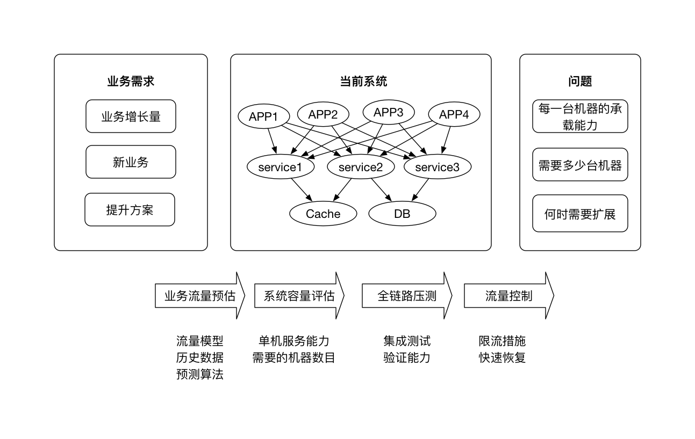

# 附录F: 架构简明指南

《Clean Architecture》一书中对于软件架构目的的解释：

> The goal of software architecture is to miminize the human resources required to build and maintain the required system.
 
即：软件架构的目的就是解决软件复杂度（高性能、高可用、可扩展、低成本、安全、规模）带来的问题，将构建和维护系统需要的人力成本降到最低。

因此，可以得出架构设计的关键思维就是判断和取舍（程序设计的关键思维是逻辑和实现），即如何选择技术、组合技术使得需要的人力资源最少。

需要注意的一点是，脱离业务谈架构是不合理的，技术架构及其演进都是业务目标驱动的。

## 架构六步思考法

此架构六部思考法是笔者对美团总架构师夏华夏一次分享提出的架构六步思考法的理解。

这里尤其需要注意的一点是在面对问题时，首先要试图将未知问题转化为已知问题，而不是创造新问题。
 
## 架构原则

- **避免过度设计**：简单的架构就是最好的架构。最简单的方案最容易实现和维护，也可以避免浪费资源。但方案中需要包括扩展。
- **冗余设计**：对服务、数据库的做结点冗余，保证服务的高可用。通过数据库主从模式、应用集群来实现。
- **多活数据中心**：为了容灾，从根本上保障应用的高可用性。需要构建多活的数据中心，以防止一个数据中心由于不可控因素出现故障后，引起整个系统的不可用。
- **无状态设计**：API、接口等的设计不能有前后依赖关系，一个资源不受其他资源改动的影响。无状态的系统才能更好地进行扩展。如果非得有状态，则要么客户端管理状态，要么服务端用分布式缓存管理状态。
- **可回滚**：对于任何业务尤其是关键业务，都具有恢复机制。可以使用基于日志的WAL、基于事件的Event sourcing等来实现可回滚。
- **可禁用/自我保护**：具有限流机制，当上游的流量超过自身的负载能力时，能够拒绝溢出的请求。可以通过手动开关或者自动开关（监测异常流量行为），在应用前端挡住流量。限流算法包括：令牌桶（支持突发流量）、漏桶（匀速流量）、计数器以及信号量（限制并发访问的数量）。此外永远不要信赖第三方服务的可靠性，依赖于第三方的功能务必有服务降级措施以及熔断管理，如：对于每一个网络操作，都需要设置超时时间，超过这个时间就放弃或者返回兜底响应。
- **问题可追踪**：当系统出现问题时，能够定位请求的轨迹、每一步的请求信息等。分布式链路追踪系统即解决的此方面的问题。
- **可监控**：可监控是保障系统能够稳定运行的关键。包括对业务逻辑的监控、应用进程的监控以及应用依赖的CPU、硬盘等系统资源的监控。每一个系统都需要做好这几个层面的监控。
- **故障隔离**：将系统依赖的资源(线程、CPU)和服务隔离开来能够使得某个服务的故障不会影响其他服务的调用。通过线程池或者分散部署结点可以对故障进行隔离。此外，为不同的用户提供单独的访问通道，不仅仅能够做故障隔离，也有利于做用户权限控制。
- **成熟可控的技术选型**：使用市面上主流、成熟、文档、支持资源多的技术，选择合适的而非最火的技术实现系统。如果面对自研和开源技术的选择，需要考虑契合度：如果功能需求契合度很高，那么选择开源即可；如果开源技术是需求的子集或者超集，那么要衡量吃透这个开源技术的成本和自研的成本那个高。
- **梯级存储**：内存->SSD硬盘->传统硬盘->磁带，可以根据数据的重要性和生命周期对数据进行分级存储。
- **缓存设计**：隔离请求与后端逻辑、存储，是就近原则的一种机制。包括客户端缓存（预先下发资源）、Nginx缓存、本地缓存以及分布式缓存。
- **异步设计**：对于调用方不关注结果或者允许结果延时返回的接口，采用队列进行异步响应能够很大程度提高系统性能；调用其他服务的时候不去等待服务方返回结果直接返回，同样能够提升系统响应性能。异步队列也是解决分布式事务的常用手段。
- **前瞻性设计**：根据行业经验和预判，提前把可扩展性、后向兼容性设计好。
- **水平扩展**：相比起垂直扩展，能够通过堆机器解决问题是最优先考虑的问题，系统的负载能力也才能接近无限扩展。此外，基于**云计算**技术根据系统的负载自动调整容量能够在节省成本的同时保证服务的可用性。
- **小步构建和发布**：快速迭代项目，快速试错。不能有跨度时间过长的项目规划。
- **自动化**：打包、测试的自动化称为持续集成，部署的自动化称为持续部署。自动化机制是快速迭代和试错的基础保证。

## 技术选型注意事项

1. 是否是生产级别、成熟的产品。**生产级、可运维、可治理、成熟稳定**的技术是首选。技术是有生命周期的，需要保持对新技术的敏感度，但切忌不要在技术的早期就开始使用。版本号、用的公司数量、文档完善度、运维支持能力（日志、命令行、控制台、故障检测恢复能力）都是成熟度的体现。
1. 新技术的引入一定要坚持**少即是多**的原则，能不引入新技术尽量不要引入新技术。毕竟新技术的引入既有学习成本，又有维护成本。并且对于一个公司来说技术栈越多，那么学习和维护成本就越高，技术栈知识无法共享，技术体系无法建立，会严重影响研发效率和业务规模化能力。如果到了必须要引入的地步，一定要有严格的技术评审流程。
1. 在引入一项新技术之前，要充分调研**了解新技术的先决条件**，不能盲目引入。对于确实需要引入但是目前还不满足先决条件的，需要做好阶段性规划，先打好基础，再适时引入新技术。
1. **不要盲目跟风大公司**。很多时候适合大公司的技术并不适合小公司。毕竟大公司有充足的人力、资源和时间，这是小公司无法相比的。
1. **技术是带有文化特性的**。在国外流行的技术，在国内未必流行。在选型的时候，尽量采用在国内有文化基础，已经落地开花的技术。此外，不同公司流行的技术文化也不相同，需要考虑自己公司的业务模式、已有技术生态和开发人员技能等。
1. **使用能掌控的技术**。需要根据业务规模、团队规模和人员水平，经过综合评估对技术进行分析，以决定是否引入。
1. 对于关键技术一定要找到**合适的人**来使用和研发。交给不合适的人，不仅无法解决问题，反而会制造更多的问题。
1. **抵制技术的宗教信仰**，技术没有绝对的好坏优劣，只有合适与不合适、使用场景等。
1. **实践出真知**。对新技术的引入一定要在仔细研究其文档的基础上跑样例、做压力测试，甚至通读其源码，经过一些试点项目验证后再逐渐扩大使用规模。
1. 对于某些复杂、重量级技术的落地是有生命周期的，务必要**通盘考虑，制定落地计划，分阶段推进**技术的落地（引入、定制改造、小规模试点再到逐步扩大生产规模）。
1. **自研、开源、购买**的选择。如果不是最擅长也提供不了差异化竞争优势的技术在成本允许的情况下直接采用开源或者购买即可；处在关键链路上的核心技术，一定要有定制或者自研的能力。此外，创业公司尽量采用开源技术或者购买云服务，而随着公司业务规模的增长，那么逐渐需要有定制和自研能力。

## 开源技术选型原则

1. **是否是一线互联网公司落地产品**。例如阿里开源的很多软件都是其在内部经过生产环境验证过的，形成了闭环的。而很多第三方软件服务商则仅仅是开源，并没有自身的需求，因此需要社区一起使用反馈从而形成闭环，这也就意味着你要和他一起踩坑形成闭环。
1. **是否有背书的大公司或者组织**。例如Google一开始推出的K8S并不具有优势，然而由于Google的强大号召力和背书能力，因此促使大批用户使用从而形成了闭环，使得K8S目前基本垄断了容器PAAS市场。同样的，Apache下的开源项目绝大多数也是可以值得信赖的。
1. **开源社区是否活跃**。Github上的stars的数量是一个重要指标，同时会参考其代码和文档更新频率（尤其是最近几年），这些指标直接反应开源产品的生命力。

## 数据设计原则

- 注意存储效率
    * 减少事务
    * 减少联表查询
    * 适当使用索引
    * 考虑使用缓存
- 避免依赖于数据库的运算功能(函数、存储器、触发器等)，将负载放在更容易扩展的业务应用端
- 数据统计场景中，实时性要求较高的数据统计可以用Redis；非实时数据则可以使用单独表，通过队列异步运算或者定时计算更新数据。此外，对于一致性要求较高的统计数据，需要依靠事务或者定时校对机制保证准确性。
- 索引区分度法则：辨识度超过20%的属性，如果有查询需求，就应该建立索引。
- 对于数值型数据，可以使用保序压缩方式在保证顺序不变的前提下减少字符串长度。如：进行36进制转化即一种保序压缩方式。
- 大量数据的去重计数如果允许误差可以选择基数估计算法（Hyperhyperlog、Loglogcount）或者布隆过滤器。

## 系统响应性能提升五板斧

- **异步**：队列缓冲、异步请求。
- **并发**：利用多CPU多线程执行业务逻辑。
- **就近原则**：缓存、梯度存储。
- **减少IO**：合并细粒度接口为粗粒度接口、频繁的覆盖操作可以只做最后一次操作。这里一个需要特别注意的地方: **代码中尽量避免在循环中调用外部服务，更好的做法是使用粗粒度批量接口在循环外面只进行一次请求。**
- **分区**：频繁访问的数据集规模保持在合理的范围。

## 系统容量规划

需要对系统/关键模块做好评估、量化，以防止超出容量时不至于压垮服务器，仍然能够服务于大部分用户。流程框架如下图所示：

1. 根据流量模型、历史数据、预测算法预估未来某一个时间点的业务量：QPS、每日数据量等。
2. 评估单点最大承载量（数据库的单点承载数据量、应用服务器的单点承载并发量）【通过性能测试】，根据业务量计算需要部署的结点数目，做1.5倍部署（DID原则）。
3. 性能压测验证整个系统的负载能力。
4. 设计达到容量预估值时的预警、限流、快速恢复措施以及后续扩展方案。

ps: 在容量预估中，机器数目的计算遵循DID原则：20倍设计、3倍实施/实现、1.5倍部署。即需要部署1.5倍的可承载预估业务流量的机器数目。

## 架构重构原则

一个系统的架构是随着业务而不断演化的，因此不可避免地会留下很多技术债。如果一味地不去管，那么总有一天技术债会爆发出来造成意想不到的破坏。因此很多时候对架构的重构是必须的。其需要遵循的原则如下：

- 确定重构的目的和必要性：为了业务需要；有无其他备选方案
- 定义“重构完成”的界限
- 渐进式重构
- 确定当前的架构状态
- 不要忽略数据
- 管理好技术债务
- 远离那些虚荣的东西
- 做好准备面对压力
- 了解业务
- 做好面对非技术因素的准备
- 对于代码质量有所掌握

## 分布式系统问题以及解决方案

1. 海量请求问题

    - 高吞吐：分层调用、异步并发
    - 低延迟：缓存、NoSQL
    - 高可用：冗余、降级

1. 大量服务器管理

    - 故障恢复和可扩展性：分布式目录服务、消息队列服务、分布式事务系统
    - 运维便利性：自动部署工具、集中日志分析系统、全链路监控
    
1. 开发效率

    - 复杂通信编程：微服务框架、异步编程工具
    - 大量模块分工：Iaas/Paas/Saas云服务  

## 高可用保障方案

- 冗余：同城多活或者异地多活
- 降级：需要对各个关键节点建立降级预案。能够在超出预估流量时，保证大部分用户的服务是正常的。包括一个请求经过的多有节点。以轮训实现的直播系统为例：

    节点 | 手段 | 说明
    ----|-----|------
    客户端   | 拉取频率降级 | 服务端实时修改轮训时间
             | 防雪崩策略 | 轮训出错后，自动指数级增大轮训时间
             | 点赞消息合并 | 在客户端合并，减少服务端处理消息数目
    Nginx    | 接口限流 | 针对接口，限制QPS
    业务容器 | 拉取条数自动降级 | 可在线修改每种消息类型的返回条数
             | 上行频率降级 | 可降级点赞、评论的频率限制
    Kafka    |  容灾队列 | Kafka故障时写入容灾队列
    消息处理BG | 自动丢弃消息 | 非重要消息可以视情况丢弃
               | 处理延迟降级 | 根据延迟大小，采用加锁串行和不加锁并行处理策略

- 全链路业务监控：对请求链路上的所有结点都加入监控。包括客户端的APM、错误日志、JVM监控、QPS、状态码、延时、服务器资源的基础监控（带宽、CPU、内存、IO）等。示例如下：

    节点 | 监控内容
    ----|-----
    客户端   | APM
    Nginx    | 错误码监控和报警；访问QPS、接口耗时分布、带宽
    业务应用 | 错误日志、QPS、状态码、延时；JVM；依赖服务的QPS、状态码、延时 
    Kafka    | 消息堆积
    消息处理BG | 错误日志；JVM；消息处理数目，消息处理延时
    基础资源     | 带宽、CPU利用率、内存、磁盘

## 其他

- 系统扩展思路
    * 通过克隆扩展->高可用
    * 通过拆分不同的东西来扩展->垂直扩展
    * 拆分类似的东西来扩展->水平扩展
- 讨论技术方案时，以是否合理为依据，而不要以工作量少为依据。
- 为了充分利用又不过分利用CPU,线程数的计算公式为CPU数目*(W+C)/C,其中W为线程平均等待时间，C为线程平均运行时间。当然，还需要考虑内存的限制（线程栈的大小）以及系统对线程数目的限制。