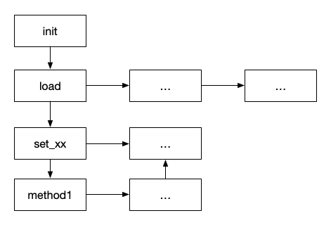
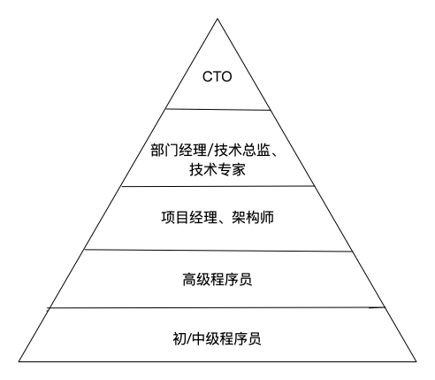

# 1.3 如何学习后端技术

学习后端技术和学习其他的技术并没有什么大的不同。因此，本章题目换做如何学习技术也是讲的通的。概括来讲，有以下几点建议：

- 扎实的计算机基础知识
- 知其然更要知其所以然
- 动手实践、频繁练习
- 持续学习
- 计算机思维
- 自我总结
- 学会规划

## 1.3.1 扎实的计算机基础知识

- 数据结构和算法：程序是由数据和算法组成的，因此这两个东西是计算机软件的基础。诸如B树、哈希表、栈以及七大排序算法、查找算法这些，在很多软件的代码中都可以看得到。有时候，一个优秀的工程师和一个普通工程师的区别也就在于是否能够合理使用合适的数据结构和算法。
- 计算机操作系统：操作系统可以说是集大成于一身的一个软件程序。资源调度、任务调度、IO调度、进程通信等等，每一个设计都是很精华的，也是很多其他应用软件设计的思想来源。
- 计算机网络：目前只要有数据传输功能的程序绝大多数都是离不开网络的。网络七层或者四层协议栈的设计非常精妙。了解网络连接如何建立、断开以及每个连接状态的意义都有助于对程序网络问题的排查。
- 计算机组成原理：这是计算机最底层的设计，也是计算机一切的基础。了解这些有助于消除你对计算机的神秘感，毕竟符合冯诺依曼原理的计算机无非就是存储数据、程序按序运行。

以上是计算机专业的一些比较普遍的基础知识课程。这里不得不说的一点是，虽然现在各大高校的计算机专业课程是比较落后的，但是这些基础课程，由于多少年也没有怎么变过，因此不管怎样都是需要扎实掌握的。也许上学的时候你感觉不到有多大的用处。但是进入实际的开发工作中，是否能够掌握扎实的基础知识往往决定了一个开发工程师的上限，这也是很多大的互联网公司无论是校招还是社招，都侧重于一些底层知识考察的原因。毕竟，你会使用什么东西只能决定你的下限，而你的基础知识和学习能力才决定了你的上限。

此外，其实很多平时开发中的一些技术都可以类比到一些基础知识的。比如，我们经常为了提高查询性能而使用的缓存技术，和为了兼容CPU和IO速度不匹配的而设计的CPU Cache就是同样的东西；操作系统中的进程间通信方式和服务之间的异步同步通信也是差不多的道理。诸如此类，其实计算机科学基础凝聚了很多精华的设计，无论是计算机硬件架构、计算机操作系统还是计算网络。

## 1.3.2 知其然更要知其所以然

经常遇到来面试的工程师，他们简历上写了很多项目，也用过很多技术，怎么看都是非常不错的候选人。但是面试一旦深入到原理或者是优化层面，很多工程师甚至是一些公司的资深架构师都会支支吾吾，答非所问或者说是没关注过。听到最多的解释就是业务压力太忙，没有时间去研究这个。其实，自我经历来看，业务忙是原因，但是没有时间却肯定是借口，毕竟阅读一个项目的源码虽然比较耗费时间，但是去网上看看已有的原理分析其实是花不了太多的时间的。归根结底，还是没有一种知其然更要知其所以然的基本意识。很多东西，你学会了使用会很兴奋，但是你有没有想过这么兴奋的功能是如何实现的呢？最简单的例子，Java中的HashMap，大家都在用，但是他到底是怎么实现的呢？很多人甚至都不知道这和数据结构课程上的哈希表是什么关系，更别说让他说出解决冲突的方式了。

这也可以映射到现在的一种现象：很多开发工程师工作了很久，看着经验丰富，但基本都是拿着一年的工作经验重复n年的。基本上每一份工作，每一个项目都在那里做重复劳动，而且也并不去考虑如何避免重复劳动这件事。

进一步的，除了遇到问题再去看源码、究底层，主动阅读经典类库、高质量开源项目的源码以及其他同事写的代码，学习其中好的架构、设计、编码风格以及类库的使用也是促进自身技术进步的一个非常有效的方式。需要注意的是，在看到好的代码实现、架构设计时最重要的是学习其中的思路，而不是仅仅学习结果。可以试着去问自己如下的问题：

- 如果自己遇到这种问题会怎么解决，与资料中的解决方案相比优劣如何？
- 别人为什么会想到这种解决方案？
- 自己是由于经验欠缺还是技能点欠缺才导致没有想到好的解决方案？
- 解决这类问题的根本思路是什么样的？

“知其然更要知其所以然”这一点其实也牵扯到了技术的广度和深度的问题。就我自己来看，对于刚刚毕业或者刚刚入职的工程师来说，首要的是深度问题，只有你在某一领域有了深入的研究和造诣了，你才能融汇贯通，迅速地扩大自己的知识面，在广度上做到突破。而对于有一定工作经验的工程师来说，虽然深度不是那么必须了，但是遇到的问题、新学到的东西还是刨根问底才好，否则一旦出现问题再去盲羊补牢会让你显得非常被动，也不利于自己的技术发展。毕竟，一个什么都做过、什么都用过却什么也不精的人可替代性太强了。

## 1.3.3 动手实践、频繁练习

学习领域有所谓721模型：个人的成长70%来自于岗位实践，20%来自向他人学习，10%来自于培训。虽然这种理论存在争议，但在笔者看来对于程序员来说按照实践、学习和培训的方式进行重要性排序是合理的。普遍公认的一种学习技术的最佳实践-“项目驱动型学习”，也就是这里说的动手实践。很多技术，只是看书，你会云里雾里，看了就忘。必须要经过你自己的实践或者项目中使用到了这种技术，你才能很快地掌握并熟练。此外，现在朋友圈、微博上都充斥各种所谓干货，很多人阅读大量的资料自以为收货满满，其实对于里面的东西根本就没有去实践过。甚至有时候就是感叹一下别人真厉害而已。真正的干货是需要自己消化的，消化的一种最好的模式就是实践，无论是对资料中的例子还是一笔带过的知识。

动手实践能够让你快速入门，但只有频繁练习才能让你熟练使用。“一万小时”理论讲的是任何一个行业都至少需要一万小时的实践才能成为专家。先不去争论此理论是否正确，可以想想当你长时间不写代码或者不用某个技术后你再去做相关的开发，那种生涩陌生感想必是每个人都有体会的。可见对于研发这个角色，频繁练习是有多么的重要。

当然，这里的频繁练习并非指的重复劳动。应该是带着自己的思考去练习，多去想一下为什么这么做？有没有更好的方式？

## 1.3.4 持续学习

“活到老，学到老”这句话用在程序员这个职业上再合适不过。IT技术尤其是互联网开发中的技术，其迭代是非常迅速的。也许你今天学的，过不了几年就成了被抛弃的。虽然相比起前端技术，后端技术算是比较稳定的，但相比起其他行业，迭代速度还是非常快的，像Struts这种当年火的一塌糊涂的技术现在也成了过时的东西。因此，一定要对新事物、新技术具有敏感性，要不断地去涉猎业界最新的知识点，扩充自己的知识库。而学习新的知识的时候，与读一些书籍和网上的博文相比，直接阅读相关知识的官方文档是笔者推崇的方式，毕竟经过二次加工的书籍、博文很多时候由于写作者水平或者个人理解的问题会有错误或者偏离原作者的意思。而由于目前IT技术绝大多数都源自欧美，欧美的技术水平也领先国内很多，因此英文对于IT技术从业者的要求也是比较高的，需要达到熟知各种计算机术语，通畅地阅读各类英文资料的水平才不至于在学习方面落后。

这里还需要提到一点就是要“逃离舒适区”。人对自己熟悉的东西都比较亲切，对自己熟练掌握的技术一般也能够自信地使用，然而当需要使用自己没接触过的技术时，很多人就望而却步、不敢尝试，进而也就丧失了学习新的知识、扩充自己知识库的机会。最好的方式应该是敢于“逃离舒适区”、敢于使用新的技术，这样才能让自己具有持续的学习兴趣，促进自己的持续进步。

还需要注意的是，现在业界有很多技术会议，动辄就是全球、全世界这种名头。经常参加这些会议的人肯定是好学的，但是这种会议上都是些流于表面的东西，把精力放在这上面的人的知识也很容易流于表面。笔者比较推荐通过多阅读书籍来学习，喜欢读书的人也习惯于深度思考，深度思考才能更新形成自己的知识体系。尤其对处于技术上升期的程序员，少参加会议，少混圈子，多看书，多做一些能够提升自己技术能力的事情。除非经济压力大，尽量避免去做一些毫无技术含量的外包项目。

此外，学习计算机知识可以多与现实世界类比，能够加强理解，快速掌握。如并发控制的信号量其实和红绿灯本质是一样的原理，银行多窗口服务其实就是负载均衡。

## 1.3.5 计算机思维

这一点主要说的是要学会用计算机思维来思索问题。所谓的计算机思维本质就是冯诺依曼体系所描述：程序存储，顺序执行。

经常听到的程序员买苹果的段子就是按照for循环、if else等逻辑来判断苹果好坏、计数，并做防御性检查等，这就是计算机思维的体现。而之前一个很火的电影《天才枪手》中记忆选择题答案如果使用计算机思维，那么用两位bit可以表示四个答案，再将四位bit转换为一个十六进制数字，记忆答案就可以减少一半的存储量。

如此，诸如二进制存储、防御编程、循环遍历、位运算、多进程/线程以及常用的数据结构和算法等都应该成为不自觉的意识。能够在遇到问题时，下意识地用这些东西来思考，将人类语言的需求转化为计算机语言。

## 1.3.6 自我总结

相信很多人在平常的工作中，经常会遇到一些问题，然后通过查阅网上资料、询问同事、翻看源码等手段解决了，当再次遇到类似的问题甚至是相同的问题时，还是一头雾水。先不提记忆力的问题，造成这种情形的很大一个原因就是没有去总结。当然，这里的总结不仅仅指的是把你平时遇到的问题记录下来，更深一层的是要找到问题发生的本质原因，如何避免发生同样的问题，从中有什么启发和收获。再进一步的则需要经常将自己一段时间内的知识收获组织成体系或者融入到自己的知识体系中，这样才能举一反三，遇到相同的问题可以有据可循。

而自我总结的方式包括记笔记、写博客、做分享。其中，比起记笔记来说，写博客、做分享是笔者更为推荐的方式。毕竟，和别人交流一方面能促使你对总结质量的把控，另一方面分享知识给别人带来的“荣誉感”反过来会产生某种正向反馈让你更加乐于总结和分享。

## 1.3.7 学会规划

平时和不少工程师聊过关于职业规划的事情，其中有些人对自己的职业道路有很清晰的认识，但更多的则是没有任何概念，只是觉得能挣钱养家就好。很明显前者是属于有规划的人，对于这种人来说，其努力是有目标的，因此走的路也会更踏实，更具有可持续性。

对于研发职位来说，学会规划是一个很关键的特质。而规划可以分为长期规划和短期规划。上面说的职业规划就是一种长期规划，需要高瞻远瞩的定下自己前进的方向。如在五年内成长为一个后端服务架构师就可以看做一个长期规划。笔者自己的长期规划如下：

- 35岁之前只做能够提高自己技术水平的事情，能够成为某个技术领域公认的专家。
- 绝不为了钱加入自己并不认同的企业或者团队。

而对于短期规划来说，则是一些具体技能、晋升、学习方面的规划。如笔者近一年的计划包括：

- 学习机器学习技术，能够成为“调参工程师”。
- 加强自身的管理技能，能够带领部门有好的业绩。
- 完成《增长黑客》、《分布式系统概念与设计》等十本书的阅读。

需要注意的是，对于这些短期规划，要设定的比较合理，具有可达性，也要设定好优先级，根据优先级逐步去完成。此外，规划不要定死，可以根据实际情况灵活调整。

## 1.3.8 如何学习一门新技术

上面主要讲述了宏观层面的如何学习技术，而具体到学习某一个新技术，其实也是有法可循的。如下图所示：

由于很多技术的模块非常多，源码也非常复杂，很多时候在看源码的时候会陷进去越看越不得章法，因此这里着重说明一下“看源码”的一个典型流程：

1. 阅读该技术的架构文档，了解其总体架构和组成。
2. 根据总体架构，将源码文件以模块或者上下层级进行分类。
3. 从未阅读过的模块中选择最独立（依赖性最小）的模块代码读起。
4. 阅读此模块的功能介绍文档。
5. 阅读此模块的源代码。
6. 一边阅读一边整理调用关系（以表或者树的形式）。
7. 转到第三步。

第六步中的调用关系表如下所示:

. | init | load | set_xx | method1 | ...
----|-----|------|----| ---- | ----
init | x |  | 2 | 1
load | | | 1 | 1 | 
set_xx | | | | 2
method1 | | | | | ...

其中，数字表示调用次数。

调用关系树也就是调用关系图，类似流程图：

## 1.3.9 总结

程序员是一个金字塔结构的职业体系，越往上，人越少也越难达到。如下图所示：

- 初/中级程序员：这一层级的程序员包括入门没有多久的新手以及相关技能不熟练的程序员。已经掌握了基本的程序编写技能，但无法保证代码质量，需要在高级以上程序员的指导才能达到工作目标。从职业发展来看，这一层级应该是一个过渡层级，长期处于此层的程序员处在非常不利的状态。
- 高级程序员：渡过了第一层级之后，除了掌握了基本的编码技能，还熟练掌握了设计模式、常用类库等工作常用技能，并能够熟练的将需求实现成程序，保质保量的完成交付。此层级的程序员才真正成为工程师，是工作的中坚力量，除了能够很好地完成自己的工作外，也能够指导初/中级程序员完成工作。
- 项目经理、架构师：高级程序员再往前发展，会有两个方向。走项目管理会成为项目经理，主要负责项目进度把控、协调沟通等，比较偏向于管理；走技术路线，会发展为资深程序员、架构师，能够把控一个系统的整体架构或者精通某一领域技术，做好技术选型和系统设计工作。
- 部门经理/技术总监、技术专家：这一层级的部门经理和技术总监已经基本脱离了程序员的含义，都不再是单纯的技术工作，管理占了日常工作的大部分。相比起之前，更需要的是对团队整体的把控，包括做事、带人、看方向等。而深钻某一领域技术的程序员在这一层级会成为技术专家，为技术团队提供领域技术的指导咨询工作。
- CTO: 这一层级是程序员最顶级的职位。其需要的能力包括资源整合规划能力、技术战略规划能力、领导艺术、企业文化和制度建设能力。其中资源整合包括技术资源整合、知识整合、自我行销、人际关系整合。

一步步走到金字塔顶部需要不断的学习和进步，包括正确的态度、正确的方法以及持续的努力。本文所述只是笔者自己的体会，也是自己一直在践行的东西。除此之外，肯定还有很多其他优秀的方法和思想能够促进这个过程。
