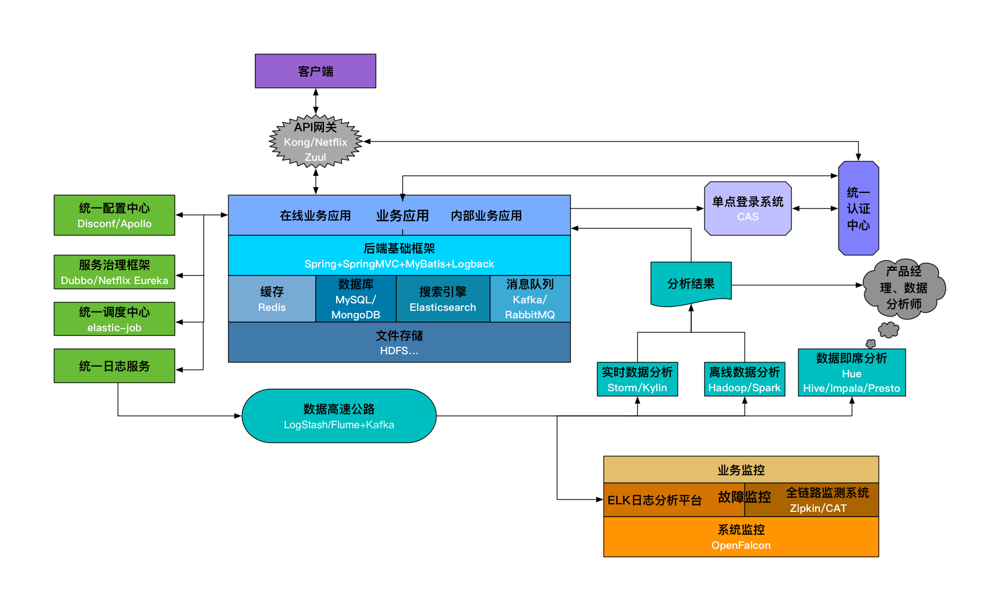
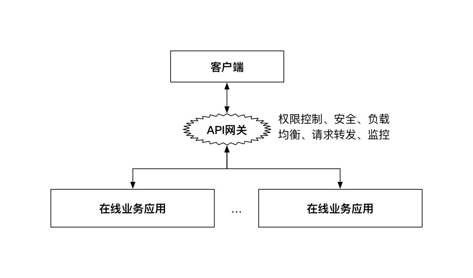
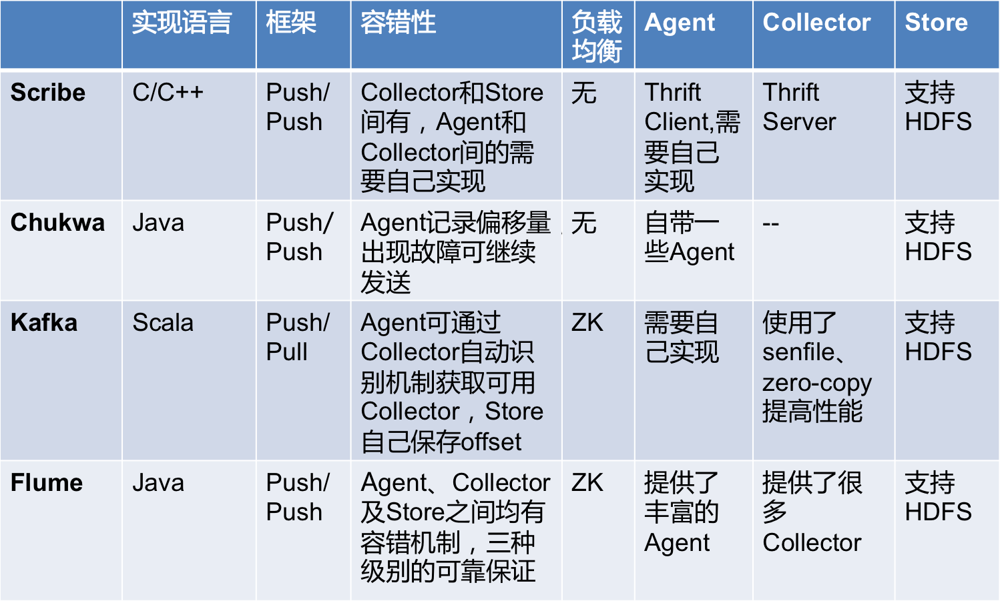
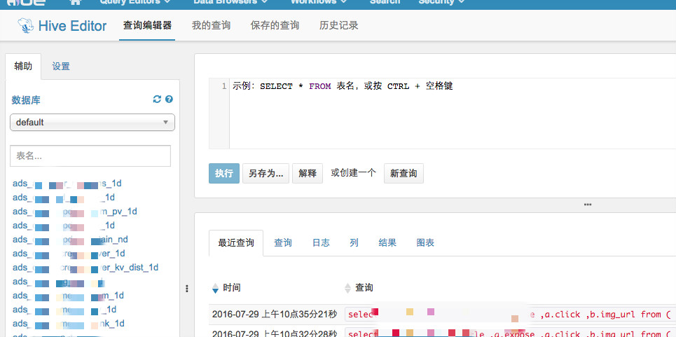

# 1.1 后端基础设施

使用Java后端技术的目的就是构建业务应用，为用户提供在线或者离线服务。因此，一个业务应用需要哪些技术、依赖哪些基础设施就决定了需要掌握的后端技术有哪些。纵观整个互联网技术体系再结合公司的目前状况，笔者认为必不可少或者非常关键的后端基础技术/设施如下图所示：

这里的后端基础设施主要指的是应用在线上稳定运行需要依赖的关键组件或者服务。开发或者搭建好以上的后端基础设施，一般情况下是能够支撑很长一段时间内的业务的。此外，对于一个完整的架构来说，还有很多应用感知不到的系统基础服务，如负载均衡、自动化部署、系统安全等，并没有包含在本章的描述范围内。

## 1.1.1 统一请求入口-API网关

在移动APP的开发过程中，通常后端提供的接口需要以下功能的支持：

- 负载均衡
- API访问权限控制
- 用户鉴权

一般的做法，使用Nginx做负载均衡，然后在每个业务应用里做API接口的访问权限控制和用户鉴权，更优化一点的方式则是把后两者做成公共类库供所有业务调用。但从总体上来看，这三种特性都属于业务的公共需求，更可取的方式则是集成到一起作为一个服务，既可以动态地修改权限控制和鉴权机制，也可以减少每个业务集成这些机制的成本。这种服务就是API网关，可以选择自己实现。也可以使用开源软件实现，如Kong和Netflix Zuul。API网关一般架构如下图所示：

但是以上方案的一个问题是由于所有API请求都要经过网关，它很容易成为系统的性能瓶颈。因此，可以采取的方案是：去掉API网关，让业务应用直接对接统一认证中心，在基础框架层面保证每个API调用都需要先通过统一认证中心的认证，这里可以采取缓存认证结果的方式避免对统一认证中心产生过大的请求压力。

## 1.1.2 业务应用和后端基础框架

业务应用分为：在线业务应用和内部业务应用。

- 在线业务应用：直接面向互联网用户的应用、接口等，典型的特点就是：请求量大、高并发、对故障的容忍度低。
- 内部业务应用：主要面向公司内部用户的应用。比如，内部数据管理平台、广告投放平台等。相比起在线业务应用，其特点: 数据保密性高、压力小、并发量小、允许故障的发生。

业务应用基于后端的基础框架开发，针对Java后端来说，应该有以下几个框架：

- MVC框架：统一开发流程、提高开发效率、屏蔽一些关键细节的Web/后端框架。典型的如SpringMVC、Jersey以及国人开发的JFinal以及阿里的WebX。
- IOC框架：实现依赖注入/控制反转的框架。Java中最为流行的Spring框架的核心就是IOC功能。
- ORM框架：能够屏蔽底层数据库细节，提供统一的数据访问接口的数据库操作框架，额外地能够支持客户端主从、分库、分表等分布式特性。MyBatis是目前最为流行的ORM框架。此外，Spring ORM中提供的JdbcTemplate也很不错。当然，对于分库分表、主从分离这些需求，一般就需要自己实现，开源的则有阿里的TDDL、当当的sharding-jdbc（从datasource层面解决了分库分表、读写分离的问题，对应用透明、零侵入）。此外，为了在服务层面统一解决分库分表、读写分离、主备切换、缓存、故障恢复等问题，很多公司都是有自己的数据库中间件的，比如阿里的Cobar、360的Atlas（基于MySQL-Proxy）、网易的DDB等；开源的则有MyCat（基于Cobar）和Kingshard,其中Kingshard已经有一定的线上使用规模。MySQL官方也提供了MySQL Proxy, 可以使用lua脚本自定义主从、读写分离、分区这些逻辑，但其性能较差，目前使用较少。
- 缓存框架：对Redis、Memcached这些缓存软件操作的统一封装，能够支持客户端分布式方案、主从等。一般使用Spring的RedisTemplate即可，也可以使用Jedis做自己的封装，支持客户端分布式方案、主从等。
- JavaEE应用性能检测框架：对于线上的JavaEE应用，需要有一个统一的框架集成到每一个业务中检测每一个请求、方法调用、JDBC连接、Redis连接等的耗时、状态等。Jwebap是一个可以使用的性能检测工具，但由于其已经很多年没有更新，有可能的话建议基于此项目做二次开发。

一般来说，以上几个框架即可以完成一个后端应用的雏形。

## 1.1.3 缓存、数据库、搜索引擎、消息队列

缓存、数据库、搜索引擎、消息队列这四者都是应用依赖的后端基础服务，他们的性能直接影响到了应用的整体性能，有时候你代码写的再好也许就是因为这些服务导致应用性能无法提升上去。

- 缓存: 缓存通常被用来解决热点数据的访问问题，是提高数据查询性能的强大武器。在高并发的后端应用中，将数据持久层的数据加载到缓存中，能够隔离高并发请求与后端数据库，避免数据库被大量请求击垮。目前常用的除了在内存中的本地缓存，比较普遍的集中缓存软件有Memcached和Redis。其中Redis已经成为最主流的缓存软件。
- 数据库：数据库可以说是后端应用最基本的基础设施。基本上绝大多数业务数据都是持久化存储在数据库中的。主流的数据库包括传统的关系型数据库（MySQL、PostgreSQL）以及最近几年开始流行的NoSQL（MongoDB、HBase）。其中HBase是用于大数据领域的列数据库，受限于其查询性能，一般并不用来做业务数据库。
- 搜索引擎：搜索引擎是针对全文检索以及数据各种维度查询设计的软件。目前用的比较多的开源软件是Solr和Elasticsearch，都是基于Lucence来实现的，不同之处主要在于termIndex的存储、分布式架构的支持等。Elasticsearch由于对集群的良好支持以及高性能的实现，已经逐渐成为搜索引擎的主流开源方案。
- 消息队列：数据传输的一种方式就是通过消息队列。目前用的比较普遍的消息队列包括为日志设计的Kafka以及重事务的RabbitMQ等。在对消息丢失不是特别敏感且并不要求消息事务的场景下，选择Kafka能够获得更高的性能；否则，RabbitMQ则是更好的选择。此外，ZeroMQ则是一种实现消息队列的网络编程Pattern库，位于Socket之上，MQ之下。

## 1.1.4 文件存储

不管是业务应用、依赖的后端服务还是其他的各种服务，最终还是要依赖于底层文件存储的。通常来说，文件存储需要满足的特性有：可靠性、容灾性、稳定性，即要保证存储的数据不会轻易丢失，即使发生故障也能够有回滚方案，也要保证高可用。在底层可以采用传统的RAID作为解决方案，再上一层，目前Hadoop的HDFS则是最为普遍的分布式文件存储方案，当然还有NFS、Samba这种共享文件系统也提供了简单的分布式存储的特性。

此外，如果文件存储确实成为了应用的瓶颈或者必须提高文件存储的性能从而提升整个系统的性能时，那么最为直接和简单的做法就是抛弃传统机械硬盘，用SSD硬盘替代。像现在很多公司在解决业务性能问题的时候，最终的关键点往往就是SSD。这也是用钱换取时间和人力成本最直接和最有效的方式。在数据库部分描述的SSDB就是对LevelDB封装之后，利用SSD硬盘的特性的一种高性能KV数据库。

至于HDFS，如果要使用上面的数据，是需要通过Hadoop的。类似xx on Yarn的一些技术就是将非Hadoop技术跑在HDFS上的解决方案。

## 1.1.5 统一认证中心

统一认证中心，主要是对APP用户、内部用户、APP等的认证服务，包括

- 用户的注册、登录验证、Token鉴权
- 内部信息系统用户的管理和登录鉴权
- APP的管理，包括APP的secret生成，APP信息的验证（如验证接口签名）等。

之所以需要统一认证中心，就是为了能够集中对这些所有APP都会用到的信息进行管理，也给所有应用提供统一的认证服务。尤其是在有很多业务需要共享用户数据的时候，构建一个统一认证中心是非常必要的。此外，通过统一认证中心构建移动APP的单点登录也是水到渠成的事情：模仿Web的机制，将认证后的信息加密存储到本地存储中供多个APP使用。

## 1.1.6 单点登录系统

目前很多大的在线Web网站都是有单点登录系统的，通俗的来说就是只需要一次用户登录，就能够进入多个业务应用（权限可以不相同），非常方便用户的操作。而在移动互联网公司中，内部的各种管理、信息系统甚至外部应用同样也需要单点登录系统。

目前，比较成熟的、用的最多的单点登录系统应该是耶鲁大学开源的CAS, 可以基于<https://github.com/apereo/cas/tree/master/cas-server-webapp>来定制开发的。

基本上，单点登录的原理都类似下图所示：

## 1.1.7 统一配置中心

在Java后端应用中，一种读写配置比较通用的方式就是将配置文件写在Propeties、YAML、HCON等文件中，修改的时候只需要更新文件重新部署即可，可以做到不牵扯代码层面改动的目的。统一配置中心，则是基于这种方式之上的统一对所有业务或者基础后端服务的相关配置文件进行管理的统一服务, 具有以下特性：

- 能够在线动态修改配置文件并生效
- 配置文件可以区分环境（开发、测试、生产等）
- 在Java中可以通过注解、XML配置的方式引入相关配置

百度开源的Disconf和携程的Apollo是可以在生产环境使用的方案，也可以根据自己的需求开发自己的配置中心，一般选择Zookeeper作为配置存储。

## 1.1.8 服务治理框架

对于外部API调用或者客户端对后端API的访问，可以使用HTTP协议或者RESTful（当然也可以直接通过最原始的socket来调用）。但对于内部服务间的调用，一般都是通过RPC机制来调用的。目前主流的RPC协议有：

- RMI
- Hessian
- Thrift
- Dubbo

这些RPC协议各有优劣点，需要针对业务需求做出最好的选择。

这样，当你的系统服务在逐渐增多，RPC调用链越来越复杂，很多情况下，需要不停的更新文档来维护这些调用关系。一个对这些服务进行管理的框架可以大大减少因此带来的繁琐的人力工作。

传统的ESB（企业服务总线）本质就是一个服务治理方案，但ESB作为一种proxy的角色存在于Client和Server之间，所有请求都需要经过ESB，使得ESB很容易成为性能瓶颈。因此，基于传统的ESB，更好的一种设计如下图所示：

如图，以配置中心为枢纽，调用关系只存在于Client和提供服务的Server之间，就避免了传统ESB的性能瓶颈问题。对于这种设计，ESB应该支持的特性如下：

- 服务提供方的注册、管理
- 服务消费者的注册、管理
- 服务的版本管理、负载均衡、流量控制、服务降级、资源隔离
- 服务的容错、熔断

阿里开源的Dubbo则对以上做了很好的实现，也是目前很多公司都在使用的方案；当当网的扩展项目Dubbox则在Dubbo之上加入了一些新特性。目前，Dubbo已经被阿里贡献给Apache，处于incubating状态。在运维监控方面，Dubbo本身提供了简单的管理控制台dubbo-admin和监控中心dubbo-monitor-simple。Github上的dubboclub/dubbokeeper则是在其之上开发的更为强大的集管理与监控于一身的服务管理以及监控系统。

此外，Netflix的Eureka也提供了服务注册发现的功能，其配合Ribbon可以实现服务的客户端软负载均衡，支持多种灵活的动态路由和负载均衡策略。

## 1.1.9 统一调度中心

在很多业务中，定时调度是一个非常普遍的场景，比如定时去抓取数据、定时刷新订单的状态等。通常的做法就是针对各自的业务依赖Linux的Cron机制或者Java中的Quartz。统一调度中心则是对所有的调度任务进行管理，这样能够统一对调度集群进行调优、扩展、任务管理等。Azkaban和Yahoo的Oozie是Hadoop的流式工作管理引擎，也可以作为统一调度中心来使用。当然，你也可以使用Cron或者Quartz来实现自己的统一调度中心。

- 根据Cron表达式调度任务
- 动态修改、停止、删除任务
- 支持任务分片执行
- 支持任务工作流：比如一个任务完成之后再执行下一个任务
- 任务支持脚本、代码、url等多种形式
- 任务执行的日志记录、故障报警

对于Java的Quartz这里需要说明一下：这个Quartz需要和Spring Quartz区分，后者是Spring对Quartz框架的简单实现也是目前使用的最多的一种调度方式。但其并没有做高可用集群的支持。而Quartz虽然有集群的支持，但是配置起来非常复杂。现在很多方案都是使用Zookeeper来实现Spring Quartz的分布式集群。

此外，当当网开源的elastic-job则在基础的分布式调度之上又加入了弹性资源利用等更为强大的功能。

## 1.1.10 统一日志服务

日志是开发过程必不可少的东西。打印日志的时机、技巧是很能体现出工程师编码水平的。毕竟，日志是线上服务能够定位、排查异常最为直接的信息。

通常的，将日志分散在各个业务中非常不方便对问题的管理和排查。统一日志服务则使用单独的日志服务器记录日志，各个业务通过统一的日志框架将日志输出到日志服务器上。

可以通过实现Log4j或者Logback的Appender来实现统一日志框架，然后通过RPC调用将日志打印到日志服务器上。

## 1.1.11 数据基础设施

数据是最近几年非常火的一个领域。从《精益数据分析》到《增长黑客》，都是在强调数据的非凡作用。很多公司也都在通过数据推动产品设计、市场运营、研发等。这里需要说明的一点是，只有当你的数据规模真的到了单机无法处理的规模才应该上大数据相关技术，千万不要为了大数据而大数据。很多情况下使用单机程序+MySQL就能解决的问题非得上Hadoop即浪费时间又浪费人力。

这里需要补充一点的是，对于很多公司，尤其是离线业务并没有那么密集的公司，在很多情况下大数据集群的资源是被浪费的。因此诞了 xx on Yarn 一系列技术让非Hadoop系的技术可以利用大数据集群的资源，能够大大提高资源的利用率，如Docker on Yarn。

### 数据高速公路

接着上面讲的统一日志服务，其输出的日志最终是变成数据到数据高速公路上供后续的数据处理程序消费的。这中间的过程包括日志的收集和传输。

- 收集：统一日志服务将日志打印在日志服务上之后，需要日志收集机制将其集中起来。目前，常见的日志收集方案有：Scribe、Chukwa、Kakfa和Flume。对比如下图所示：

    
    
    此外，Logstash也是一个可以选择的日志收集方案，不同于以上的是，它更倾向于数据的预处理，且配置简单、清晰，经常以ELK（Elasticsearch + Logstash + Kibana）的架构用于运维场景中。

- 传输：通过消息队列将数据传输到数据处理服务中。对于日志来说，通常选择Kafka这个消息队列即可。

此外，这里还有一个关键的技术就是数据库和数据仓库间的数据同步问题，即将需要分析的数据从数据库中同步到诸如Hive这种数据仓库时使用的方案。可以使用Apache Sqoop进行基于时间戳的数据同步，此外，阿里开源的Canal实现了基于binlog增量同步，更加适合通用的同步场景，但是基于Canal还是需要做不少的业务开发工作。

### 离线数据分析

离线数据分析是可以有延迟的，一般针对的是非实时需求的数据分析工作，产生的也是延迟一天的报表。目前最常用的离线数据分析技术除了Hadoop还有Spark。相比Hadoop，Spark性能上有很大优势，当然对硬件资源要求也高。其中，Hadoop中的Yarn作为资源管理调度组件除了服务于MR还可以用于Spark（Spark on Yarn），Mesos则是另一种资源管理调度系统。

对于Hadoop，传统的MR编写很复杂，也不利于维护，可以选择使用Hive来用SQL替代编写MR。而对于Spark，也有类似Hive的Spark SQL。

此外，对于离线数据分析，还有一个很关键的就是数据倾斜问题。所谓数据倾斜指的是region数据分布不均，造成有的结点负载很低，而有些却负载很高，从而影响整体的性能。处理好数据倾斜问题对于数据处理是很关键的。

### 实时数据分析

相对于离线数据分析，实时数据分析也叫在线数据分析，针对的是对数据有实时要求的业务场景，如广告结算、订单结算等。目前，比较成熟的实时技术有Storm和Spark Streaming。相比起Storm，Spark Streaming其实本质上还是基于批量计算的。如果是对延迟很敏感的场景，还是应该使用Storm。除了这两者，Flink则是最近很火的一个分布式实时计算框架，其支持Exactly Once的语义，在大数据量下具有高吞吐低延迟的优势，并且能够很好的支持状态管理和窗口统计，但其文档、API管理平台等都还需要完善。

实时数据处理一般情况下都是基于增量处理的，相对于离线来说并非可靠的，一旦出现故障（如集群崩溃）或者数据处理失败，是很难对数据恢复或者修复异常数据的。因此结合离线+实时是目前最普遍采用的数据处理方案。Lambda架构就是一个结合离线和实时数据处理的架构方案。

此外，实时数据分析中还有一个很常见的场景：多维数据实时分析，即能够组合任意维度进行数据展示和分析。目前有两种解决此问题的方案：ROLAP和MOLAP。

- ROLAP：使用关系型数据库或者扩展的关系型数据库来管理数据仓库数据，以Hive、Spark SQL、Presto为代表。
- MOLAP：基于数据立方体的多位存储引擎，用空间换时间，把所有的分析情况都物化为物理表或者视图。以Druid、Pinot和Kylin为代表，不同于ROLAP（Hive、Spark SQL）, 其原生的支持多维的数据查询。

如上一小节所述，ROLAP的方案大多数情况下用于离线数据分析，满足不了实时的需求，因此MOLAP是多维数据实时分析的常用方案。对于其中常用的三个框架，对比如下：

   . | 使用场景 | 语言 | 协议 | 特点
----|-----|------|----- | -----
Druid | 实时处理分析 | Java | JSON |  实时聚合
Pinot | 实时处理分析 | Java | JSON |  实时聚合
Kylin | OLAP分析引擎 | Java | JDBC/OLAP |  预处理、cache

其中，Druid相对比较轻量级，用的人较多，比较成熟。

### 数据即席分析

离线和实时数据分析产生的一些报表是给数据分析师、产品经理参考使用的，但是很多情况下，线上的程序并不能满足这些需求方的需求。这时候就需要需求方自己对数据仓库进行查询统计。针对这些需求方，SQL上手容易、易描述等特点决定了其可能是一个最为合适的方式。因此提供一个SQL的即席查询工具能够大大提高数据分析师、产品经理的工作效率。Presto、Impala、Hive都是这种工具。如果想进一步提供给需求方更加直观的ui操作界面，可以搭建内部的Hue。

## 1.1.12 故障监控

对于面向用户的线上服务，发生故障是一件很严重的事情。因此，做好线上服务的故障检测告警是一件非常重要的事情。可以将故障监控分为以下两个层面的监控：

- 系统监控：主要指对主机的带宽、CPU、内存、硬盘、IO等硬件资源的监控。可以使用Nagios、Cacti等开源软件进行监控。目前，市面上也有很多第三方服务能够提供对于主机资源的监控，如监控宝等。对于分布式服务集群（如Hadoop、Storm、Kafka、Flume等集群）的监控则可以使用Ganglia。此外，小米开源的OpenFalcon也很不错，涵盖了系统监控、JVM监控、应用监控等，也支持自定义的监控机制。
- 业务监控：是在主机资源层面以上的监控，比如APP的PV、UV数据异常、交易失败等。需要业务中加入相关的监控代码，比如在异常抛出的地方，加一段日志记录。

监控还有一个关键的步骤就是告警。告警的方式有很多种：邮件、IM、短信等。考虑到故障的重要性不同、告警的合理性、便于定位问题等因素，有以下建议：

- 告警日志要记录发生故障的机器ID，尤其是在集群服务中，如果没有记录机器ID，那么对于后续的问题定位会很困难。
- 要对告警做聚合，不要每一个故障都单独进行告警，这样会对工程师造成极大的困扰。
- 要对告警做等级划分，不能对所有告警都做同样的优先级处理。
- 使用微信做为告警软件，能够在节省短信成本的情况下，保证告警的到达率。

故障告警之后，那么最最关键的就是应对了。对于创业公司来说，24小时待命是必备的素质，当遇到告警的时候，需要尽快对故障做出反应，找到问题所在，并能在可控时间内解决问题。对于故障问题的排查，基本上都是依赖于日志的。只要日志打的合理，一般情况下是能够很快定位到问题所在的，但是如果是分布式服务，并且日志数据量特别大的情况下，如何定位日志就成为了难题。这里有几个方案：

- 建立ELK（Elasticsearch + Logstash + Kibana）日志集中分析平台，便于快速搜索、定位日志。搭配Yelp开源的Elastalert可以实现告警功能。
- 建立分布式请求追踪系统（也可以叫全链路监测系统），对于分布式系统尤是微服务架构，能够极大的方便在海量调用中快速定位并收集单个异常请求信息，也能快速定位一条请求链路的性能瓶颈。唯品会的Mercury、阿里的鹰眼、新浪的WatchMan、Twitter开源的Zipkin基本都是基于Google的Dapper论文而来，大众点评的实时应用监控平台CAT则在支持分布式请求追踪（代码侵入式）的基础上加入了细粒度的调用性能数据统计。此外，Apache正在孵化中的HTrace则是针对大的分布式系统诸如HDFS文件系统、HBase存储引擎而设计的分布式追踪方案。而如果你的微服务实现使用了Spring Cloud，那么Spring Cloud Sleuth则是最佳的分布式跟踪方案。还需要提到的是，Apache孵化中的SkyWalking是基于分布式追踪的一个完备的APM（应用性能监测）系统，其最大的一个特点就是基于Java agent + instrument api，对业务代码无任何侵入，Pinpoint则是类似的另一个已经用于生产环境的APM系统。

