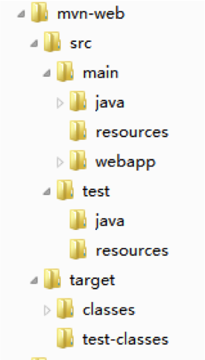
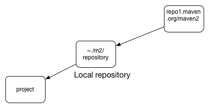
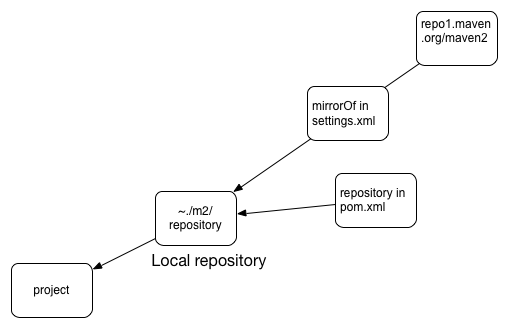
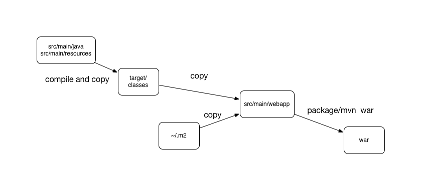

# 2.1 项目构建

对于一个完整的项目来说，一般都有很多的类、很多的包，如果是Web工程那么还有很多jsp、资源文件。这时候如果只用JDK自带的工具编译和运行，是非常困难的一件事前。再者，编译源代码只是软件开发过程的一个方面，更重要的是要把软件发布到生产环境中来产生商业价值。所以，代码编译之后，还有测试、分析代码质量、部署等步骤要做。整个过程进行自动化操作是很有必要的。

这时候就需要一个Java的工程/项目构建工具。这里所谓的项目构建就是指的完成工程发布流程需要的一系列步骤，包括编译、测试、打包、部署等等。虽然用Eclipse和Intellij这些IDE能解决这个问题，但是受限于这些IDE体积庞大且基本上都是GUI的，而后端应用的运行环境基本都是没有显示器的，所以很多时候还是需要一些专门做项目构建的工具来支持这些工作。

## 2.1.1 Ant

### 介绍

Ant的全称是Another Neat Tool，意为另一个好用的工具，是Java中比较常用的项目构建工具。构建过程包括编译、测试和部署等。概括来看具有以下三个特点：

- 和传统的Make工具相似，能为我们完成工程发布流程中一系列机械工作。并且具有良好的跨平台特性。
- 使用XML来表述构建过程与依赖关系，用task替代shell，语义清晰，便于维护。
- 具有强大的任务系统，便于扩展。其中，task以Java class的形式存在。

为了方便使用，Ant自带了很多默认的task，如：

- echo: 输出信息
- mkdir: 创建文件夹
- exec: 执行shell命令
- delete: 删除文件
- copy: 复制文件

通过组合这些默认task和自己实现的task就能够完成Java项目的构建任务。

Ant版本：1.10.1

### 使用示例

使用Ant需要编写build.xml来配置任务流程。当然，可以通过-f参数指定其他配置文件作为任务流程描述文件。一个Ant的配置文件如下：

```
<?xml version="1.0" encoding="UTF-8"?>
<project name="helloWorld" basedir="." default="usage">
    <property name="mvn" value="mvn"/>
    <property name="script.lock" value="/build_home/scripts/lock"/>

    <target name="usage" description="Prints out instructions">
        <echo message="使用 'lock' 加锁"/>
        <echo message="使用 'unlock' 解锁"/>
        <antcall target="compile">
            <param name="profile" value="test"/>
        </antcall>
    </target>

    <target name="lock">
        <exec dir="${basedir}" executable="${script.lock}" errorproperty="lock.err"/>
        <fail message="u can use 'ant unlcok to force redeploy'...'">
            <condition>
                <contains string="${lock.err}" substring="locked"/>
            </condition>
        </fail>
    </target>

    <target name="unlock">
        <delete file="${basedir}/.lock"/>
    </target>

    <target name="compile">
        <echo message="编译开始"/>
        <exec dir="${basedir}" executable="${mvn}" failonerror="true">
            <arg line="compile -P ${profile}"/>
        </exec>
        <exec executable="${mvn}" failonerror="true">
            <arg value="war:exploded"/>
        </exec>
    </target>
    
    <!--逻辑判断-->
    <target name="testIf" depends="check" if="flag">
        <echo message="if..."/>
    </target>
    
    <target name="testUnless" depends="check" unless="flag">
        <echo message="unless..."/>
    </target>
    
    <target name="check">
        <condition property="flag">
            <or>
		      <and>
			     <isset property="name"/>
			     <equals arg1="${version}" arg2="1.0" />
		      </and>
		      <available file="/project.version" type="file"/>
            </or>
        </condition>
    </target>
    <!--逻辑判断end-->
   
</project>
```
可见，Ant使用顶级元素<project>描述整个工程,使用<property>描述全局属性, 用<target>定义工程中的target以及target间的依赖, 在target中定义task的执行流程。使用antcall来调用target，通过其子节点param传递参数。

此外，在很多场景下需要用到逻辑判断，如if等。Ant中的if如上面的例子所示，是需要搭配target和condition使用的。上面配置中最后的逻辑判断部分，类似如下伪代码：

```
if (name ！= null && version.equals("1.0")) || fileExist("/project.version") ){
    echo "if..."
}else{
    echo "unless..."
}
```

执行`ant [target]`即可执行任务流程。

### 提示

- 使用Ant时，一个常见的需求就是通过命令行给Ant传递参数，可以通过`-Dname=value`这种形式来传递，在build.xml中通过`${name}`来引用即可。
- 对于配置文件中重复出现的元素，可以通过refid引用，减少重复配置。

    ```
    <project>
        <path id="project.class.path">
            <pathelement location="lib/"/>
            <pathelement location="${java.class.path}/"/>
        </path>
        
        <target ...>
            <rmic ...>
                <classpath refid="project.class.path"/>
            </rmic>
        </target>
        
        <target ...>
            <javac ...>
                <classpath refid="project.class.path"/>
            </javac>
        </target>
    </project>
    ```

## 2.1.2 Maven

### 介绍

Maven是继Ant后出现的一款基于约定优于配置原则的项目构建工具。这里所说的“约定优于配置”指的是约定的一些规范无需再配置，例如：其约定好的生命周期、项目结构等。当然，Maven也提供了打破默认约定的配置办法。

概括来讲，Maven具有以下的功能：

- 依赖管理：Maven能够帮助我们解决软件包依赖的管理问题，不再需要提交大量的jar包，引入第三方lib也不需要关心其依赖。
- 规范目录结构：标准的目录结构有助于项目构建的标准化，使得项目更整洁，还可通过配置profile根据环境的不同读取不同的配置文件。
- 可以通过每次发布都更新版本号以及统一依赖配置文件来规范软件包的发布。
- 完整的项目构建阶段：Maven能够对项目完整阶段进行构建。
- 支持多种插件：面向不同类型的工程项目提供不同的插件。
- 方便集成：能够集成在IDE中方便使用，和其他自动化构建工具也都能配合使用。

可见，相比起Ant，Maven提供了更加强大和规范的功能。

Maven版本：3.3.9

### 配置文件

Maven基于pom（Project Object Model）进行。一个项目所有的配置都放置在pom.xml文件中，包括定义项目的类型、名字，管理依赖关系，定制插件的行为等等。

```
<project xmlns="http://maven.apache.org/POM/4.0.0" xmlns:xsi="http://www.w3.org/2001/XMLSchema-instance"
         xsi:schemaLocation="http://maven.apache.org/POM/4.0.0 http://maven.apache.org/xsd/maven-4.0.0.xsd">
    <modelVersion>4.0.0</modelVersion>

    <groupId>me.rowkey</groupId>
    <artifactId>test</artifactId>
    <version>1.0.0</version>
    <packaging>jar</packaging>

    <name>rowkey</name>
    <url>http://maven.apache.org</url>

    <repositories>
        <repository>
            <id>nexus-suishen</id>
            <name>Nexus suishen</name>
            <url>http://maven.etouch.cn/nexus/content/groups/public/</url>
            <snapshots>
                <enabled>true</enabled>
                <updatePolicy>always</updatePolicy>
                <checksumPolicy>warn</checksumPolicy>
            </snapshots>
        </repository>
    </repositories>

    <properties>
        <slf4j.version>1.7.21</slf4j.version>
    </properties>

    <dependencies>

        <dependency>
            <groupId>org.slf4j</groupId>
            <artifactId>slf4j-api</artifactId>
            <version>${slf4j.version}</version>
        </dependency>

        <dependency>
            <groupId>junit</groupId>
            <artifactId>junit</artifactId>
            <version>4.8.2</version>
            <scope>test</scope>
        </dependency>

    </dependencies>

    <build>
        <plugins>
            <plugin>
                <groupId>org.apache.maven.plugins</groupId>
                <artifactId>maven-compiler-plugin</artifactId>
                <version>2.3.2</version>
                <configuration>
                    <source>1.7</source>
                    <target>1.7</target>
                </configuration>
            </plugin>
        </plugins>
    </build>
    
    <!--发布配置，用户名和密码需要在$M2_HOME/conf/settings.xml中配置server-->
    <distributionManagement>
        <repository>
            <id>suishen-release</id>
            <name>Suishen-Releases</name>
            <url>http://maven.etouch.cn/nexus/content/repositories/Suishen-Releases</url>
        </repository>

        <snapshotRepository>
            <id>suishen-snapshot</id>
            <name>Suishen-Snapshots</name>
            <url>http://maven.etouch.cn/nexus/content/repositories/Suishen-Snapshots</url>
        </snapshotRepository>
    </distributionManagement>

</project>

```

其中，

- Maven使用groupId:artifactId:version三者来唯一标识一个唯一的二进制版本，可以缩写为GAV。
- packaging代表打包方式，可选的值有: pom, jar, war, ear, custom，默认为jar。
- properties是全局属性的配置
- dependencies是对于依赖的管理
- plugins是对于插件的管理。

此外，可以通过parent实现pom的继承做统一配置管理，子pom中的配置优先级高于父pom。

```
<?xml version=”1.0″ encoding=”UTF-8″?>

<project>

…

<parent>

    <artifactId>suishen-parent</artifactId>

    <groupId>suishen</groupId>

    <version>1.0</version>

</parent>

…

</project>
```

可以继承的元素如下：

- groupId,version
- Project Config
- Dependencies
- Plugin configuration

此外，<dependencyManagement>和<pluginManagement>可以统一做依赖和插件的配置管理，不同于<dependencies>和<plugins>的是，如果子pom中没有声明<dependency>和<plugin>则并不生效。

### 标准Web项目结构

在Maven中，一个Web项目的标准结构，如下图所示：



其中：

- src/main/java 		Java代码目录
- src/main/resources 	配置文件目录
- src/main/webapp		webapp根目录
- src/test/java 		测试代码目录
- src/test/resources 	测试配置目录
- target/classes		代码编译结果目标目录
- target/test-classes	测试代码编译结果目标目录

当然，结构是可以自定义的。

```
 <build>
   <plugins>
       <plugin>
           <groupId>org.apache.maven.plugins</groupId>
           <artifactId>maven-war-plugin</artifactId>
           <configuration>
               <warSourceDirectory>WebContent/</warSourceDirectory>
           </configuration>
       </plugin>
   </plugins>
   <sourceDirectory>src</sourceDirectory>
   <testSourceDirectory>test/java</testSourceDirectory>
   <testResources>
       <testResource>
           <directory>test/resources</directory>
       </testResource>
   </testResources>
   <directory>build</directory>
</build>
```

这里，Java代码目录移到了./src中，测试代码目录到了./test/java中，测试资源也到了./test/resources,同时编译结果目录变为了./build。此外，在maven-war-plugin中，也把Web目录的war源码目录改为了./WebContent。

### 依赖管理

依赖管理是通过<dependencies>来定义的，其中：

- 一项jar包依赖可以由groupId:artifactId:version标识
- 完整的标识为：groupId:artifactId:type:classifier:version
- 依赖在编译部署中参与的情况可以由scope来指定, 分为: compile、test、provided、system、import，默认为compile。其中的import是在Maven 2.0.9后引入的，仅仅支持在<dependencyManagement>中使用，导入外部的依赖版本管理。
- 依赖是一个树状结构，采用**最近依赖**原则，也可以通过exclusions标签来排除一些包。这里的最近依赖指的是在依赖树中，离当前结点最近的依赖优先级高，同样远时第一个优先。

依赖下载的过程一般如下图所示：



但上面的示例配置中，如果有一个repsitory的配置，那么依赖下载的过程则发生了改变。



此外，Maven中还有一个镜像库的配置，即在Maven的settings.xml中配置Maven镜像库。和pom.xml中的repository不同的是镜像会拦截住对远程中央库的请求，只在镜像库中进行依赖的搜索以及下载。而如果只是配置了repository，那么在repository中找不到相应的依赖时，会继续去远程中央库进行搜索和下载。

上面所说的镜像库和repository可以通过<http://www.sonatype.org/nexus/>进行搭建。

### 项目构建流程

Maven的构建生命周期中几个常见phase如下：

- validate：验证项目以及相关信息是否正确
- compile：编译源代码和相关资源文件
- test：对测试代码进行测试
- package：根据项目类型的不同进行打包
- verify： 验证打包的正确性
- install：将打好的包安装到本地
- deploy：将打好的包发布到远程库中

当然，对应上述每一个phase,还有pre、post、proces做前缀的一些phase。还有一些在命令行中不常用的phase如：test-compile、integration-test等。

针对于Java Web项目，一个完整的项目构建流程如下图所示：




### Profile多环境支持

现实开发中一个很常见的需求就是需要根据不同的环境打包不同的文件或者读取不同的属性值。Maven中的profile即可解决此问题。

```
<profiles>
   <profile>
       <id>dev</id>
       <activation>
           <activeByDefault>true</activeByDefault>
       </activation>
       <properties>
           <resources.dir>src/main/resources/dev</resources.dir>
       </properties>
   </profile>
   <profile>
       <id>test</id>
       <properties>
           <resources.dir>src/main/resources/test</resources.dir>
       </properties>
   </profile>
   <profile>
       <id>prod</id>
       <properties>
           <resources.dir>src/main/resources/prod</resources.dir>
       </properties>
   </profile>

</profiles>

<build>
    <filters>  
        <filter>${user.home}/love.properties</filter>  
    </filters>  
   <resources>
       <resource>
           <directory>${resources.dir}</directory>
           <filtering>true</filtering>  
           <includes>  
               <include>**/*</include> 
           </includes> 
        </resource>
       <resource>
           <directory>src/main/resources</directory>
           <filtering>true</filtering>  
           <includes>  
               <include>**/*</include> 
           </includes> 
       </resource>
   </resources>
</build>
```

如此，分为dev、test以及prod三种环境，对应每一种环境，其资源文件路径都不一样。在使用mvn时，使用-P参数指定profile即可生效。

此外，示例中resource下的filtering设置为true, 是为了能够在编译过程中将资源文件中的占位符替换为Maven中相应属性对应的值。例如，在resources下的config.properties文件内容：

```
resouceDir=${resources.dir}
```

在profile为dev时，编译结束此文件会变为:

```
resouceDir=src/main/resources/dev
```

而示例中的filters配置则是将外部文件的属性引入进来，同样也能够使用占位符。

如果是Web项目，想要在webapp下使用占位符，那么则需要配置maven-war-plugin:

```
<plugin>  
    <groupId>org.apache.maven.plugins</groupId>  
    <artifactId>maven-war-plugin</artifactId>  
    <configuration>  
        <webResources>  
            <resource>  
                <filtering>true</filtering>  
                <directory>src/main/webapp</directory>  
                <includes>  
                    <include>**/*</include>  
                </includes>  
            </resource>  
        </webResources>  
        <warSourceDirectory>src/main/webapp</warSourceDirectory>  
        <webXml>src/main/webapp/WEB-INF/web.xml</webXml>  
    </configuration>  
</plugin>  
```

### 复用test

当需要将写的测试用例（src/test下的资源和类）以jar包形式发布出去的时候，需要用到test-jar。首先，在打包时配置maven-jar-plugin，如下：

```
<plugin>
    <groupId>org.apache.maven.plugins</groupId>
    <artifactId>maven-jar-plugin</artifactId>
    <executions>
         <execution>
            <goals>
                <goal>test-jar</goal>
            </goals>
            <configuration>
                <excludes>
                    <exclude>*.conf</exclude>
                    <exclude>**/*.*.conf</exclude>
                    <exclude>logback.xml</exclude>
                </excludes>
            </configuration>
        </execution>
    </executions>
    <configuration>
        <excludes>
            <exclude>*.conf</exclude>
            <exclude>**/*.*.conf</exclude>
            <exclude>*.properties</exclude>
            <exclude>logback.xml</exclude>
        </excludes>
    </configuration>
</plugin>
```

使用时，指定dependency的type为test-jar：

```
<dependency>
    <groupId>xx</groupId>
    <artifactId>xx</artifactId>
    <version>1.0-SNAPSHOT</version>
    <type>test-jar</type>
    <scope>test</scope>
</dependency>
```

### Scala支持

Scala的官方构建工具是sbt，但是由于某些原因，在国内访问很慢。Maven有插件提供了对Scala项目的支持。

```
<build>
    <plugins>
        <plugin>
            <groupId>net.alchim31.maven</groupId>
            <artifactId>scala-maven-plugin</artifactId>
            <version>3.1.6</version>
            <executions>
               <execution>
                   <id>scala-compile-first</id>
                   <phase>process-resources</phase>
                   <goals>
                       <goal>add-source</goal>
                       <goal>compile</goal>
                   </goals>
               </execution>
               <execution>
                   <id>scala-test-compile</id>
                   <phase>process-test-resources</phase>
                   <goals>
                       <goal>testCompile</goal>
                   </goals>
               </execution>
            </executions>
        </plugin>
        <plugin>
           <groupId>org.scalatest</groupId>
           <artifactId>scalatest-maven-plugin</artifactId>
           <version>1.0-RC2</version>
           <configuration>
               <reportsDirectory>${project.build.directory}/surefire-reports</reportsDirectory>
               <junitxml>.</junitxml>
               <filereports>TestSuite.txt</filereports>
               <stdout>testOutput</stdout>
           </configuration>
           <executions>
               <execution>
                   <id>test</id>
                   <goals>
                       <goal>test</goal>
                   </goals>
               </execution>
           </executions>
        </plugin>
       <plugin>
           <groupId>org.codehaus.mojo</groupId>
           <artifactId>exec-maven-plugin</artifactId>
           <version>1.2.1</version>
           <configuration>
               <executable>scala</executable>
               <arguments>
                   <argument>-classpath</argument>
                   <classpath/>
                   <argument></argument>
               </arguments>
           </configuration>
       </plugin>
</plugins>
```

net.alchim31.maven.scala-maven-plugin提供了对Scala代码的编译；org.scalatest.scalatest-maven-plugin提供了对Scala项目的测试；exec-maven-plugin配置了对Scala程序的执行。
    
### 常用插件

Maven提供了很多插件方便开发工作。

- maven-source-plugin
    
    源码发布插件，绑定在compile阶段，执行jar goal, 将源码以jar包的形式发布出去。
    
- maven-javadoc-plugin

    javadoc插件，将源码的javadoc发布出去。
    
- maven-archetype-plugin

    使用此插件可以定制/使用项目模板。定制模板可以遵循archetype的结构编写文件，也可以使用mvn archetype:create-from-project从一个现有的项目生成；使用模板通过archetype:generate即可。

- maven-tomcat7-plugin

    此插件可以直接使用Tomcat运行web项目，常用的命令是：`mvn tomcat7:run`。同样的还有jetty-maven-plugin。

- maven-shade-plugin

    此插件是maven常用打包插件，一般是将其绑定在package阶段，执行其shade goal。能够将源码和依赖的第三方资源打包在一起以供独立运行。
    
- maven-assesmbly-plugin

    和maven-shade-plugin一样也是打包插件，但是其功能更加强大，输出压缩包格式除了jar还支持tar、zip、gz等。
        
- maven-gpg-plugin

    此插件是jar包的签名插件，可以对自己发布的jar包进行签名。

### 提示

- 在项目版本号中加入`SNAPSHOT`后缀做为快照版本可以使得Maven每次都能自动获取最新版本而无需频繁更新版本号。
- `mvn -DNAME=test`可以传递给pom参数，使用${NAME}引用即可。
- 在dependency中设置optional为true, 可使得此依赖不传递出去。如下：

    ```
    ...
    <artifactId>suishen-libs</artifactId>
    ...
    
    ...
    <dependency>
       <groupId>org.apache.httpcomponents</groupId>
       <artifactId>httpasyncclient</artifactId>
       <version>4.1.3</version>
       <optional>true</optional>
    </dependency>
    ...
    ```
    如此，依赖于suishen-lib的项目除非在自己的pom里显示声明，否则不会依赖于httpasyncclient。
    
- 由于Maven自定义plugin的复杂度，不够灵活，因此很多时候都是结合ant的灵活性和maven一起使用的。

    ```
    <target name="compile" depends="clean">
      <exec executable=“mvn">
              <arg line="compile"/>
      </exec>
    </target>
    
    <target name="compile" depends="clean">
      <exec executable=“cmd">
              <arg line=“/c mvn compile"/>
      </exec>
    </target>
    ```
- 日常开发中一个工程可能比较庞大，这时可以把这个工程拆分成多个子模块来管理。一个多模块工程包含一个父pom，在其中定义了它的子模块，每个子模块都是一个独立的工程。

    ```
    <project>
        …
        <packaging>pom</packaging>
    
        <modules>
            <module>module-1</module>
            <module>module-2</module>
        </modules>
    </project>
    ```
- 可以使用第三方的takari/maven-wrapper(`mvn -N io.takari:maven:wrapper -Dmaven=3.3.3`)来做Maven操作（`./mvnw clean`），从而可以达到类似gradle wrapper的功能：不用预先安装好Maven，还能够统一项目所使用的Maven版本。
    
Maven常用命令介绍请见附录A。

## 2.1.3 Gradle

### 介绍

Gradle是目前正在开始流行的新一代构建工具，正在逐步的被大家推广使用，尤其以Android为典型。基本上现在所有的Android项目都采用Gradle做为项目构建工具。概括来讲，有以下几个特点：

- 采用了Groovy DSL来定义配置，相比起XML更加易于学习和使用，并大大简化了构建代码的行数。此外，这种“配置即代码”的方式能够大大简化配置学习和插件编写的成本，提供了更好的灵活性。
- 在构建模型上非常灵活。可以轻松创建一个task，并随时通过depends语法建立与已有task的依赖关系。这里Gradle使用了Java插件来支持Java项目的标准构建生命周期（和Maven类似）。
- 依赖的scope简化为compile、runtime、testCompile、testRuntime四种。
- 支持动态的版本依赖。在版本号后面使用+号的方式可以实现动态的版本管理。
- 支持排除传递性依赖或者干脆关闭传递性依赖。
- 完全支持Maven、Ivy的资源库（Repository）。

Gradle版本：2.4

### 使用示例

Gradle的配置写在build.gradle文件中。

```
apply plugin: 'groovy'
apply plugin: 'idea'
apply plugin: 'checkstyle'

// --- properties ---
ext.ideaInstallationPath = '/Applications/IntelliJ IDEA.app/Contents'
ext.pomCfg = {
  name 'me.rowkey.libs'
  description '<project_desc>'
  ...
}
sourceCompatibility = 1.6
// --- properties ---

//源码目录结构
sourceSets.main.java.srcDirs = []
sourceSets.main.groovy.srcDir 'src/main/java'

//增加repository
repositories {
    mavenLocal()
    maven{
        url "http://maven.etouch.cn/nexus/content/groups/public/"
    }
    mavenCentral()
}

//依赖管理
dependencies {
    compile fileTree(dir: ideaInstallationPath + '/lib', include: '*.jar')
    testCompile 'org.mockito:mockito-core:2.0.3-beta'
    testCompile 'org.assertj:assertj-core:1.7.1'
    testCompile 'org.springframework:spring-test:4.0.0.RELEASE'
    
    // 排除全部或特定的间接依赖
    runtime ('commons-dbcp:commons-dbcp:1.4') {
        transitive = false
        // 或 exclude group: xxx, module: xxx
    }

    // 然后显式声明
    runtime 'commons-pool:commons-pool:1.6'
}

//for gradle wrapper
task wrapper(type: Wrapper) {
    gradleVersion = '3.0'
}

task helloWorld

helloWorld << {
    println "Hello World!"
}

task testA(dependsOn:helloWorld)

testA << {
    println "test"
}
task copyFile(type: Copy)
//task(copyFile(type: Copy))

copyFile {
    from 'xml'
    into 'destination'
}

//发布到Maven库的配置
uploadArchives {
  repositories {
    mavenDeployer {
      repository(url: <repo_url>) {
       //身份认证信息推荐放在$HOME/.gradle/gradle.properties中
        authentication(
          userName: <repo_user>,
          password: <repo_passwd>)
      }
      pom.project pomCfg
    }
  }
}
```

可见，依赖的配置（dependencies）相比maven,得到了大大的简化，对于任务的定义（task）也非常简单。

### 多模块

- 首先，在工程的根目录下，创建settings.gradle。

	```
	include "common", "api"
	```
	
	以上即表示包含根目录下的两个子模块common和api。
	
- 在根目录的build.gradle中定义公共构建逻辑：

	```
	subprojects {
  		apply plugin: 'java'

  		repositories {
    		mavenCentral()
  		}

  		// 所有的子模块共同的依赖
  		dependencies {
    		...
  		}
	}
	```

	subprojects中定义的内容对所有子模块都有效，包括属性、依赖以及Task定义。
	
	需要注意的是在多模块配置下，gradle命令会对所有子模块都执行。如果想要针对单个模块，需要指定模块前缀，如: gradle :common:clean
	
- 在子模块下创建build.gradle，其中的配置可以增量覆盖父工程中的公共配置。如:

	```
	...

	dependencies {
  		compile project(':common')
  		...
	}
	```
	
	以上声明了此模块依赖于common模块，当构建此模块时会首先编译打包common模块。相比起Maven每次都要install所依赖的模块，大大简化了使用。

### 提示

- `gradle -Penv=test`可以传递参数，使用`env`引用即可。这里需要注意的是Gradle中默认并没有提供Maven的profile支持，但是可以利用`-P`参数自己实现此功能。
- Gradle中的配置中的语法和平常所见的Groovy非常不同, 其利用了Groovy的AST转换等特性实现了自己的一套语法。
- 建议使用**gradle wrapper**（`gradle wrapper --gradle-version 3.0`）来做gradle操作（`./gradlew clean`）。一方面可以使得项目成员不用预先安装好Gradle，还能够统一项目所使用的Gradle版本。
- 务必要保持构建脚本简洁、清晰，如：把属性、常量（如版本号）放到gradle.properties中。
- 模块化构建脚本，通过plugin机制在多个项目中重用，共享相关的配置：`apply from: <link_to_gradle>`。通过此种方式可以统一团队或者公司的一些构建规范、依赖版本等。

Gradle的常用命令介绍请见附录A。

