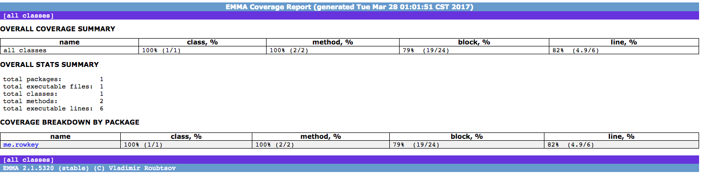
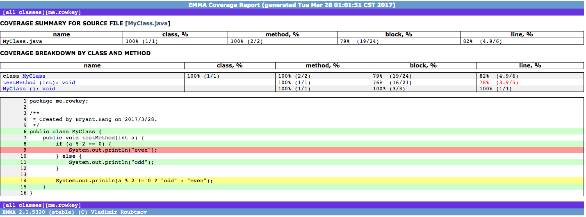

# 2.3 代码质量保证

代码质量是任何技术团队都非常重视的。一个具有良好质量代码的项目，不仅仅能够保证应用的稳定、高效运行，也能够大大减少后续维护的成本，便于重构、扩展等。因此，代码质量也是Java项目工程化至关重要的一部分。

我们可以将代码质量分成以下几个等级：

- 可编译
- 可运行
- 可测试
- 可读
- 可维护
- 可重用

其中，可编译、可运行是完成一个项目最基本的目标。而至于可维护和可重用这些，目前并没有非常好的工程化工具来保障。很多时候都是需要工程师的个人素质和团队的监督机制。因此，可测试、可读是我们至少要达到的目标。对于可测试性来说，即保证你的代码能够经受住各种黑盒和白盒测试而不会出现bug, 毕竟上线的代码面临的外部输入是不可预测的。而可读性则显得更为重要，毕竟代码是用来给人阅读的。而什么是好的可读性呢？当你自己写的代码过了一个月、三个月再让你去看，能很快说出自己的编程逻辑并定位出某个功能的代码位置，这就是一种可读的表现。

本章就主要讲述代码质量达到可测试、可读依靠的一些工程化工具。

## 2.3.1 单元测试

单元测试，即Unit Test，指的是对代码的各个接口的测试。所谓的“测试驱动开发”也依赖于此。单元测试，可以在某种程度上保证代码的健壮性，并且能够保证在做代码变更、迭代时原有代码逻辑的正确性。

### JUnit

Java中一般使用JUnit作为单元测试框架。以下是一个使用JUnit做单元测试的例子：

```
public class UtilTest {
    @BeforeClass
    public static void initClass(){
        System.out.println("i will be called only once,before the first test method");
    }
    
    @AfterClass
    public static void afterClass(){
        System.out.println("i will be called only once,after the last test method");
    }
    
    @Before
    public void initMethod(){
        System.out.println("i will be called before every test method");
    }
    
    @After
    public void afterMethod(){
        System.out.println("i will be called after every test method");
    }

    @Test
    public void testAdd() throws Exception {
        Assert.assertEquals(2, add(1,1));
    }
    
    @Test(timeout=100)
    public void testTimeout(){
        try{
            Thread.sleep(500);
        }catch(InterruptedException e){
        
        }
    }
    
    @Test(expected=IndexOutOfBoundsException.class)
    public void testException(){
        new LinkedList<String>().get(0);
    }
    
    @Ignore("ignore the test")
    @Test
    public void ignoreTest() throws Exception {
        Assert.assertEquals(2, add(1,1));
    }
        
    public int add(int n1, int n2){
        return n1 + n2;
    }
}
```
这个例子很简单，就是验证add方法的正确性。

这里使用了@Test注解来声明一个单元测试。可以通过Maven来调用这个测试。

`mvn test -Dtest=*.*.UtilTest`

在Maven的构建周期中，默认是执行所有位于src/test下的测试用例的。

如例子所示，JUnit中还有以下几个常用注解：

- 在某些阶段必然被调用的代码
    - Class级 （用在static方法）
        - @BeforeClass 在第一个测试方法运行前执行
        - @AfterClass 在最后一个测试方法执行后执行
    - Method级 （用在实例方法）
        - @Before 在每个测试方法执行前执行
        - @After 在每个测试方法执行后执行
- 对运行时间有要求的测试，测试运行时间超时则失败

    `@Test(timeout=expire-milliseconds)`
- 期待抛出异常的测试用例，测试方法中如果不抛出异常则失败

    `@Test(expected=ExpectedException.class)`
- 忽略掉不常用或者未完成的测试用例

    `@Ignore(“some message")`

- 使用@Suite.SuiteClasses将组测试用例打包运行。

    ```
    @Suite.SuiteClasses({
        UtilTest.class,
        HelloTest.class 
    })
    public class SuiteTest {
    
    }
    ```
    
JUnit还有一种比较高级的参数化测试，即需要多组参数验证的测试用例。如下所示：

```
@RunWith(Parameterized.class)
public class ParameterizedTest {
    private int param;
    private boolean result;

    //为每组数据构建测试用例
    public ParameterizedTest(int param, boolean result) {
        this.param = param;
        this.result = result;
    }

    // 生成测试数据
    @Parameterized.Parameters
    public static Collection<Object[]> genParams() {
        return Arrays.asList(new Object[][]{{1, true}, {2, false}});
    }

    //测试代码
    @Test
    public void test() {
        Assert.assertEquals(this.param % 2 == 1, this.result);
    }
}
```

此外，在对使用了Spring的项目写测试用例的时候，需要依赖SpringJUnit4ClassRunner（需要引入spring-test依赖）。

```
@RunWith(SpringJUnit4ClassRunner.class)
@ContextConfiguration(locations = {
        "classpath:applicationContext.xml",
})
public class SpringTest {
    @Resource
    private UserDao userDao;
    
    @Test
    public void testAdd(){
        User u = userDao.add(new User("张三"));
        
        Assert.assertTrue(u.getId() > 0);        
    }
}
```
    
### Mock测试

在写单元测试时会经常碰到一些依赖于外部环境的场景，比如数据库查询、网络请求。有时候，这些外部依赖并非是一直可用的或者暂时没有开发完成的，经常会对测试产生影响。而Mock测试工具则是为了解决这个问题发明的。Java中常用的Mock测试框架主要是EasyMock和PowerMock。这里的Mock就是打桩（Stub）或者模拟，当你调用一个不好在测试中创建的对象时，Mock框架为你模拟一个和真实对象类似的替身来完成相应的行为。

以EasyMock的使用举例，来看看如何使用Mock框架来写单元测试。

有一个IAppService的接口实现，依赖于AppDao这个接口。

```
public AppServiceImpl implements IAppService{
    private AppDao appDao;
    
    public App getAppById(long id){
        return appDao.getById(id);
    }
    
    public void updateAppById(long id){
        return appDao.update(app);
    }
    
    public void setAppDao(AppDao appDao){
        this.appDao = appDao;
    }
}

```
如果这时候AppDao并没有实现，那么如果对AppService做单元测试，就需要Mock出一个AppDao。

```
public class AppServiceImplTest {
    @Test
    public void testGet() {
        App expectedApp= new App();
        app.setId(1);
        AppDao mock  = EasyMock.createMock(AppDao.class);//创建Mock对象                         
        Easymock.expect(mock.getById(1)).andReturn(expectedApp);//录制Mock对象预期行为
        Easymock.replay(mock); //重放Mock对象，测试时以录制的对象预期行为代替真实对象的行为
        
        AppServiceImpl  service = new AppServiceImpl();
        service.setAppDao(mock);
        App app = service.getAppById(1);//调用测试方法
        assertEquals(expectedApp, app); //断言测试结果
        
        Easymock.verify(mock); //验证Mock对象被调用
    }
}
```

这里需要注意的是：在EasyMock3.0之前，其使用JDK的动态代理实现Mock对象创建，因此只能针对接口进行Mock。3.0后则加入了使用CGLIB的实现方式，因此支持对普通类的Mock。

以上是一个简单的测试，除此之外，还有以下常用场景：

- 基本参数匹配,即对所有匹配的参数，都做Mock。

    ```    
    Easymock.expect(mock.getById(Easymock.isA(Long.class))).andReturn(exceptedApp); //这样无论传入的id是多少，都会返回这个expectedApp而不是发生Unexpect method的Mock异常。
    ```
        
    类似于EasyMock.isA的还有anyInt()，anyObject()， isNull()，same(), startsWith()等。

- AppServiceImpl在调用AppDao的getById方法时发生异常

    ```
    Easymock.expect(mock.getById(1)).andThrow(new RuntimeException());
    ```
             
- void方法Mock
    
    ```
    mock.updateAppById(1);
    EasyMock.expectLastCall().anytimes();
    ```
    
    使用expectLastCall方法即可。

- 多次调用返回不同值的Mock。

    此种业务场景的列子就是iterator的hasNext方法，如果一直返回true,那么代码会陷入无限循环。正常的测试逻辑应该是先返回几次true执行循环体，然后再返回false退出循环。
        
    ```
    EasyMock.expect(rs.next()).andReturn(true).times(2).andReturn(false).times(1);
    ```
        
上述使用EasyMock已经可以解决大部分测试需求，但由于EasyMock使用JDK动态代理以及CGLIB实现子类的方式，其对于静态、final类型的类和方法以及私有方法是无法完成mock的。PowerMock则在EasyMock的基础上进行了扩展，使用字节码操作技术直接对生成的字节码类文件进行修改，从而能够对静态、final类型的类和方法、私有方法进行Mock，还可以对类进行部分Mock。

PowerMock的工作过程和EasyMock类似，不同之处在于需要在类层次声明@RunWith(PowerMockRunner.class)注解，以确保使用PowerMock框架引擎执行单元测试。
    
- 静态方法

    ```
    // Util.java
    public class Util{
      public static String getEnv(String name){
          return System.getenv(name);
      }
    }
       
    //UtilTest.java
    @RunWith(PowerMockRunner.class)
    @PrepareForTest({Util.class})//声明要Mock的类
    public class UtilTest {
        @Test
        public void staicMethodMockTest() throws Exception {
            PowerMock.mockStatic(System.class);//Mock静态方法
            EasyMock.expect(System.getenv("java_home"))).andReturn("env value");//录制Mock对象的静态方法
            PowerMock.replayAll();//重放Mock对象
            Assert.assertEquals("env value",Util.getEnv("java_home"));
            PowerMock.verifyAll();//验证Mock对象
        }
    }
    ```
    
    静态的final方法也是如此。这里需要注意的是：对于JDK的类如果要进行静态或final方法Mock时，@PrepareForTest()注解中只能放被测试的类，而非JDK的类，如上面例子中的UtilTest.class。对于非JDK的类如果需要进行静态final方法Mock时， @PrepareForTest()注解中直接放方法所在的类，如果上面例子中的System不是JDK的类，则可以直接放System.class。@PrepareForTest({......}) 注解既可以加在类层次上（对整个测试文件有效），也可以加在测试方法上（只对测试方法有效）。
    
- 非静态的final方法

    和非静态的一样。对于非静态的，如下：
    
    ```
    public class FinalClass {
        public final String finalMethod() {
           return "final method";
        }
    }
    
    public class FinalUtil{
        public String  callFinalMethod(FinalClass cls) {
            return cls.getName;
        }
    }
       
    @RunWith(PowerMockRunner.class)
    public class FinalMethodMockTest {
      @Test
      @PrepareForTest(FinalClass.class)
      public void testCallFinalMethod() {
          FinalClass cls = PowerMock.createMock(FinalClass.class); //创建Mock对象
          FinalUtil util = new FinalUtil();
          EasyMock.expect(cls.finalMethod()).andReturn("cls");
          PowerMock.replayAll();                                      
          Assert.assertTrue(util.callFinalMethod(cls));
          PowerMock.verifyAll();
      }
    }
    ```
        
- 私有方法

    ```
    public class PrivateMockClass
        private boolean privateMethod(final String name) {
            return true;
        }
    }
       
    @RunWith(PowerMockRunner.class)
    @PrepareForTest(PrivateMockClass.class)
    public class PrivatMethodMockTest {
      @Test
        public void testPrivateMock() throws Exception {
            PrivateMockClass mock = PowerMock.createPartialMock(PrivateMockClass.class, “privateMethod”);//只对privateMethod方法Mock
            PowerMock.expectPrivate(mock, "privateMethod", "name").andReturn(true);//录制
            PowerMock.replay(mock);
            assertTrue(mock.privateMethod(“name”));
            PowerMock.verify(mock);
        }
    }
    ```
    
    此种方式除了私有方法，还可以用在被测试方法都在同一个类，且不容易创建的场景下。
    
除了上述场景之外，经常会遇到在测试方法中调用构造函数产生对象。那么如何对构造方法进行mock呢？

    File mock = createMockAndExpectNew(File.class,“mockPath”);
    EasyMock.expect(mock.exists()).andReturn(false);
    EasyMock.expect(mock.mkdirs()).andReturn(true);
    PowerMock.replay(mock, File.class);
    
    ...
    
    PowerMock.verify(mock, File.class);
    
以上代码即可完成对File的构造方法的mock（对于mockPath的File，其exists和mkdirs方法都返回true）。

### 提示

由上述可知，对于单元测试，MOCK是一件比较麻烦的事情。因此，对依赖于外部环境（第三方服务调用、数据库访问）的代码做单元测试非常不方便。这造成了很多开发团队没有自动化单元测试，或者花费了不小的功夫才实现了自动化单元测试。其实对诸如调用业务逻辑、读写存储设备、粘合业务逻辑和存储操作等的代码是无需单元测试的。这些代码的核心在于传递上下文的数据，会依赖于外部环境，只需要做通过集成测试来测试其联通性即可。单元测试应该针对的是开发人员自己的业务代码。因此，能够单元测试、应该进行单元测试的代码应该是不依赖于外部环境的业务代码。判断要测试的方法是否是可单元测试代码可以通过以下两种方式：

- 该方法能否用一个main方法就能直接运行。
- 该方法的参数能否不依赖外部环境而进行自由模拟。

对于一些将访问代码（简单的顺序调用，一般需要和上下文打交道）和业务逻辑糅杂在一起、多线程、异步等很难进行单元测试的方法，可以使用谦卑对象模式，通过将需要的数据从上下文中抽离出来达到不依赖外部环境的目的，如：

```
@Resource
private UserDao userDao;

public void methodA（）{
	User u = userDao.getById(1);
	….//业务逻辑
}
```

可以重构为

```
public void methodA(){
    User u = userDao.getById(1);
    methodA_1(u);
}

public void methodA_1（User u）{

    ….//业务逻辑

}
```

这样，可以自由模拟User数据，来对抽离出的方法methodA_1做单元测试。

此外，编写单元测试还需要注意：

- 保持单元测试用例的运行速度，不要将性能和大的集成用例放在单元测试中。
- 保持单元测试的每个用例都用 try...finally 或 tearDown 释放资源。

    
## 2.3.2 衡量单元测试的标准

有了单元测试，那么就需要有一个能够衡量单元测试好坏的标准，即测试覆盖率。即你写的单元测试对你的项目中代码覆盖程度。对于很多比较严格的企业来说，对于测试覆盖率的要求经常是达到98%以上的。当然，在进行测试覆盖率统计的时候，是会忽略掉诸如getter、setter这些根本没必要进行单元测试的方法的。

目前常用的测试覆盖率工具有Emma、Cobertura等。使用方式基本类似，可以使用IDE的相关插件，也可以使用相应的Maven插件。但相比起Cobertura，Emma的覆盖率更为严格，并且支持Test代码和Java代码不在一个工程下的单元测试覆盖率统计。

在Maven项目下，直接执行maven emma:emma命令即可在target/site下生成报告index.html。示例如下：

```
public class MyClass {
    public void testMethod(int a) {
        if (a % 2 == 0) {
            System.out.println("even");
        } else {
            System.out.println("odd");
        }

        System.out.println(a % 2 != 0 ? "odd" : "even");
    }
}

public class MyClassTest {
    private static MyClass myClass;

    @BeforeClass
    public static void init() {
        myClass = new MyClass();
    }

    @Test
    public void testMethod() {
        myClass.testMethod(1);
    }
}
```




如图，Emma有多种级别的覆盖率指标：类、方法、语句块（basic block）和行，可以根据不同的情况选取不同的指标作为标准。第二张图是关于具体的某一个类中的覆盖信息，其中，绿色表示覆盖到的代码，红色的表示未覆盖到的，黄色的则表示部分覆盖。

## 2.3.3 开发规范与建议

代码规范是使得代码达到可读的关键。由于Java这个语言在发明的时候并没有考虑到语法和规范的统一，因此，在编写Java代码或者架构Java项目时很多人都有着自己一套个性的风格。对于一个团队来说，这并不可取。于是，很多大公司慢慢演化出了自己的一套编码规范。比较出名的有Google和阿里的Java编码规范。

这里根据笔者自己的一些经验和实践，列出一些最为需要遵循的Java编码规范。

1. 变量命名按照Java通用方式Camel命名法。常量尤其注意使用全大写_下划线连接单词的方式，如 USER_KEY。
1. 变量和类命名务必具有意义，能让人一眼看出表示的意思。如userList表示用户列表，不要使用list、set、button这种无意义的命名方式。
1. 当一个方法的主逻辑代码超过30行(经验值)，务必考虑封装方法或者类。
1. 类内方法定义的顺序依照开发者的关心程度和承载的信息价值依次是:公有方法或保护方法、私有方法、getter/setter方法。
1. 数据领域类POJO的字段
    - "不会为空"时使用基本数据类型，需要注意字段默认值不能具有特殊意义。
    - "可为空"时使用包装类型，需要做好空值判断。
1. 方法尤其是对外提供的接口（RPC、SDK）如果返回值可能为空，务必使用Optional包装返回值，否则认为返回值不会为空。
1. “异常”编码规范
    - 优先考虑使用错误码返回值而不是异常表示错误：用错误码返回值处理可能会发生的事情，用异常捕捉处理不期望发生的事情
    - 在抛出异常时，需要尽可能精确地描述问题和相关信息。如：尽可能的使用最具体的异常来声明方法，这样才能使得代码更容易理解。
    - 当在方法上声明抛出异常时，需要进行文档说明。在Javadoc中加入throws声明，描述抛出异常的场景。
    - 不要捕获Throwable。
    - 不要忽略异常，至少要记录异常的信息。
    - 不要记录并抛出异常。仅仅当想要处理异常时才去捕获，否则只需要在方法签名中声明让调用者去处理。
    - 包装异常时不要抛弃原始的异常。一定要把原始的异常设置为cause(Exception有构造方法可以传入cause)。
1. MVC规范
    - 数据库的一个表对应一个领域类，以entity、domain或者meta做为包名都可以。
    - 数据访问层命名形如xxxDao，这里应该封装所有与数据库层相关的东西，如表名、各个列等。
    - controller或者servlet中不要掺杂复杂业务逻辑代码（放到service中）
    - service类是封装业务逻辑的类，其中的方法要和此业务逻辑相关。比如UserService就是和User相关的业务方法。
    - 当一个东西具有缓存和实际值两种的时候，务必保证存储和获取的接口只有一个。比如获取用户的level，应该只在UserLevelService中暴露一个接口提供

对于这些规范，可以使用CheckStyle、PMD、FindBugs等工具进行保证，使用相关的Maven插件即可。此外，阿里巴巴也推出了其Java编码规范对应的Intellij插件。

- CheckStyle: 检查Java源文件是否与代码规范相符，主要包括：
    - Javadoc注释
    - 命名规范
    - 多余没用的Imports
    - Size度量，如过长的方法
    - 缺少必要的空格Whitespace
    - 重复代码
    
    默认规范过于严格，可以参考这个文件做自定义规则：<https://github.com/superhj1987/awesome-libs/blob/master/doc/checkstyle-checks.xml>。
    
- PMD:检查**Java源文件**中的潜在问题,主要包括：
    - 空try/catch/finally/switch语句块
    - 未使用的局部变量、参数和private方法
    - 空if/while语句
    - 过于复杂的表达式，如不必要的if语句等
    - 复杂类

    默认规范比较严格，可以参考这个文件做自定义规则：<https://github.com/superhj1987/awesome-libs/blob/master/doc/pmdrule.xml>。
    
- FindBugs: 基于Bug Patterns概念，查找**Java字节码（.class文件）**中的潜在bug。主要检查bytecode中的Bug Patterns，如NullPointerException、没有合理关闭资源、字符串相同判断错（==，而不是equals）等。大多数提示有用，值得改。可以借鉴此文件，忽略一些不必要的规则：<https://github.com/superhj1987/awesome-libs/blob/master/doc/findbugs-exclude.xml>。

虽然以上工具已经可以告警不符合规范的代码，但仍然需要通过团队成员之间的Code Review才能够进一步保证开发规范的实践。

此外，这里还有一些开发建议：

1. 务必撰写文档，尤其对于一些逻辑复杂的项目或者模块，需要包括以下文档：项目/模块的介绍文档；QuickStart，按照文档说明应该能在一小时内完成代码构建和简单使用；详细说明文档，比如主要逻辑流程、接口定义、参数含义、设计等。
1. 在代码无法阐述设计意图的时候，注释是必须的。但注释不宜过多，过多意味着代码的可读性有问题。
1. 防御性编程：做好对异常的处理，不要相信任何外部输入和依赖。
1. 接着上一条，对于所有外部调用以及内部服务调用都要做容错和超时处理。不管是RPC调用还是对于第三方服务的调用，都不能想当然的认为可用性是100%的。不允许出现服务调用超时和重试，将会对应用程序的稳定性和性能造成不利的影响。
1. 分离可靠操作和不可靠操作: 可靠操作指的是不会抛出异常或引起状态不一致，比如，操作一个Map，可以认为是可靠的，而读写数据库、调用第三方服务等，可以认为是不可靠的。在代码中尽量划分开，对不可靠的操作的失败做异常处理。
1. 简洁与抽象：最好的代码抽象，是对现实概念的映射。即只要有相关知识，每个类的作用都能第一时间明白其作用。但万万不要过度抽象，过度的抽象反而会降低代码质量。
1. 代码的可复用：代码的可复用是优秀工程师的一个本能。但切记不能为了复用而复用。
1. 程序需要状态，对象不需要状态，如果对象有了状态，就会引发多线程问题。程序的状态应该统一由数据库、缓存、任务队列这些外部容器来容纳，处理时以局部变量的形式在线程内部流转直至被回收。
1. 在做商业计算时（金融、电商交易），务必要注意选择的数据类型的存储数值范围，防止用户传入的数值溢出造成归零或者负值，从而造成交易损失。比如直播平台用户送礼物的场景，设计的接口的参数为礼物ID和礼物数目。那么如果使用int类型计算总的花费，当礼物数目非常大的时候就会造成花费超出int的存储范围而溢出为<=0的值，使得用户可以无限送礼物。
1. 编码时，在每次调用一个方法时多考虑以下问题：

    - 会不会出现空指针？
    - 有没有异常抛出？
    - 有没有并发锁间隙？
    - 会不会并发修改不可见？

