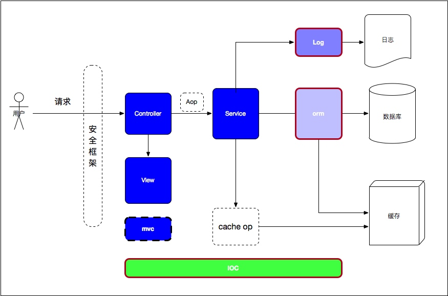

# 第三章 开发框架

说到Java开发，开发框架是逃不开的的一个话题。也是得益于Java生态圈中各种框架的层出不穷，Java的生命力才如此旺盛。在无数次被声称“Java将亡”后依然活跃在开发领域，各种Java框架都功不可没。

在Java刚开始出现的时候，写一个简单的Class，配上main方法就能完成一个可运行的程序。然而随着应用规模的越来越大以及参与人数的增多，以往一个类能够完成的功能，现在需要有许多类来完成。这时候如果没有一个开发规范或者说是约定，那么随着功能的增多，也就越来越难以维护。此外，由于开发人员水平的层次不齐，需要一些公共组件来保证一定程度的代码质量。开发框架就是一种基于约定、屏蔽了底层细节、规范了开发流程的技术。

在一个可用的Java Web应用中，一般由以下几种框架构成：

- IOC框架：依赖注入/控制反转，即将依赖从代码层面转移到了容器配置层面。在Java中是使用的最为普遍的框架。
- ORM框架：对象关系映射，即将数据库的表映射到Java中的对象的一种数据库操作框架。
- LOG框架：日志框架。即记录应用运行、异常日志的框架。
- Web框架：一般指的是model-view-controller的分层Web开发框架，将业务代码做了逻辑分层，各司其职，能够做到灵活的配置和扩展。

其层次结构如下图所示：

如图，除了上述的四种框架，还有安全框架、AOP、缓存操作框架也是关键的开发框架。

这里需要说明的一点是，虽然使用开发框架有很多好处，但任何事情都不会是绝对的优劣，都是一种权衡利弊后做出的取舍。就MVC框架来说，当提供的业务接口需要特别高的并发的时候，可以考虑不使用框架，直接使用Servlet处理请求并直接输出流数据（不走视图解析引擎和JSON等序列化）。毕竟请求经过框架的一层层调用性能肯定会受到影响。其他的诸如ORM框架也类似。

