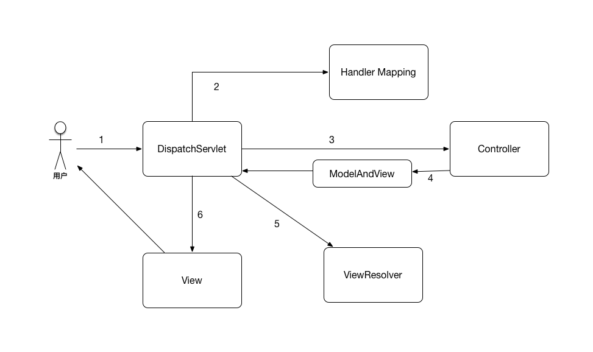

# 3.4 Web MVC

Web开发最终肯定是需要一个Web开发框架的，而MVC（Model View Controller）是Web开发中最常用的框架。从Struts1到Struts2，再到现在的Spring MVC、Jersy等等，都是MVC模式的实现框架。它将Web开发分为了模型、视图以及控制器三层，做到了职责分离，使得应用的模块能够高内聚、低耦合。

- 模型：代表业务数据和业务逻辑或者可以控制这些数据访问的模块
- 视图：对模型的展现
- 控制器：定义应用的各种行为

目前，互联网领域主要以Spring MVC为主要的Web开发框架，因此本节主要讲述Spring MVC的使用。Spring版本为4.3.7.RELEASE。

## 3.4.1 为什么是Spring MVC

Spring MVC是Spring Web的一个重要模块。其结构简单，强大不失灵活，性能也很优秀。相比起其他的框架，具有但不限于以下特点：

- 学习门槛低，易上手。
- 由于Spring MVC框架封装的比较好，因此使用Spring MVC很容易写出优秀的程序。
- Spring MVC继承了Spring框架的灵活性，非常易于扩展。
- 框架的各个组件之间松耦合。
- 支持多种视图展现。
- 可以很方便的使用Spring生态下的组件。

## 3.4.2 Spring MVC处理流程



如图所示是Spring MVC的几个关键组件。对于一个用户的Web请求的处理流程一般如下：

1. 用户发起请求到DispatchServlet（在web.xml中配置, 是Spring mvc的前置控制器）。
2. 从HandlerMapping中匹配此次请求信息的handler，匹配的条件包括：请求路径、请求方法、header信息等。常用的几个HandlerMapping有：

    - SimpleUrlHandlerMapping：简单的映射一个URL到一个Handler。
    - RequestMappingHandlerMapping: 扫描RequestMapping注解，根据相关配置，绑定URL到一个Handler。
    
3. 获取到对应的Handler（Controller,控制器）后, 调用相应的方法。这里牵扯到一个关键组件：HandlerAdapter，是Controller的适配器，Spring MVC最终是通过HandlerAdapter来调用实际的Controller方法的。常用的有以下几个：
    
    - SimpleControllerHandlerAdapter: 处理实现了Controller接口的Controller。
    - RequestMappingHandlerAdapter: 处理类型为HandlerMethod的handlder, 这里使用RequestMapping注解的Controller的方法就是一种HandlerMethod。

4. Handler执行完毕，返回相应的ModelAndView。
5. 使用配置好的ViewResolver来解析返回结果。常用的几个ViewResolver:
    
    - UrlBasedViewResolver: 通过配置文件，根据URL把一个视图名交给到一个View来处理。
    - InternalResourceViewResolver类: 根据配置好的资源路径，解析为jsp视图,支持jstl。
    - FreeMarkerViewResolver：Freemarker的视图解析器。

6. 生成视图返回给用户。常用的几个的视图类如下：

    - MappingJackson2JsonView：使用mappingJackson输出JSON数据的视图，数据来源于ModelMap
    - FreeMarkerView: 使用FreeMarker模板引擎的视图。
    - JSTLView: 输出jsp页面，可以使用jsp标准标签库。

此外，还有HandlerInterceptor和HandlerExceptionResolver两个重要组件。

- HandlerInterceptor是请求路径上的拦截器，需要自己实现这个接口，以拦截请求，做一些对Handler的前置和后置处理工作。
- HandlerExceptionResolver是异常处理器。可以实现自己的处理器在全局层面拦截Handler抛出的Exception再做进一步的处理。Spring MVC自带了几个处理器：

    - SimpleMappingExceptionResolver： 可以将不同的异常映射到不同的jsp页面。
    - ExceptionHandlerExceptionResolver： 解析使用了@ExceptionHandler注解的方法来处理异常。
    - ResponseStatusExceptionResolver：处理@ResponseStatus注解的Exception。
    - DefaultHandlerExceptionResolver：默认的处理器，包括不支持method、不支持mediaType等等。 

## 3.4.3 典型配置

要使用Spring MVC，首先就是需要配置DispatchServlet负责分发所有请求。

```
<!--web.xml-->
<servlet>
   <servlet-name>mvc-dispatcher</servlet-name>
   <servlet-class>org.springframework.web.servlet.DispatcherServlet</servlet-class>
   <init-param>
       <param-name>contextConfigLocation</param-name>
       <param-value>
           classpath:mvc-dispatcher-servlet.xml
       </param-value>
   </init-param>
   <load-on-startup>1</load-on-startup><!--是启动顺序，让这个Servlet随Servlet容器一起启动。-->
</servlet>
<servlet-mapping>
   <servlet-name>mvc-dispatcher</servlet-name>
   <url-pattern>/</url-pattern>
</servlet-mapping>
```

上面配置中,对应于servlet-mapping的url-pattern配置为/，是表示默认的URL映射，即当此次request匹配不到其他Servlet时，会默认进入此Servlet，包括静态资源请求。此外，对应于contextConfigLocation参数的mvc-dispatcher-servlet.xml则是对Spring MVC的一些配置。如果想要使用Spring的注解配置，则可以这么配置:

```
<servlet>
   <servlet-name>mvc-dispatcher</servlet-name>
   <servlet-class>org.springframework.web.servlet.DispatcherServlet</servlet-class>
   <init-param>
       <param-name>contextClass</param-name>
       <param-value>org.springframework.web.context.support.AnnotationConfigWebApplicationContext</param-value>
   </init-param>
   <init-param>
       <param-name>contextConfigLocation</param-name>
       <param-value>
           me.rowkey.config.SpringWebConfig
       </param-value>
   </init-param>
   <load-on-startup>1</load-on-startup>
</servlet>
```

接着需要配置MVC相关的组件，如下：

```
<mvc:default-servlet-handler/>

<context:annotation-config/>

<mvc:annotation-driven>
   <mvc:message-converters>
       <bean
               class="org.springframework.http.converter.ByteArrayHttpMessageConverter"/>
       <bean class="org.springframework.http.converter.FormHttpMessageConverter"/>
       <bean
               class="org.springframework.http.converter.xml.SourceHttpMessageConverter"/>
       <bean
               class="org.springframework.http.converter.json.MappingJackson2HttpMessageConverter"/>
       <bean class="org.springframework.http.converter.StringHttpMessageConverter">
           <constructor-arg value="UTF-8"/>
       </bean>
   </mvc:message-converters>
</mvc:annotation-driven>

<bean
         class="org.springframework.web.servlet.view.InternalResourceViewResolver">
     <property name="cache" value="false"/>
     <property name="prefix" value="/WEB-INF/jsp/"/>
     <property name="suffix" value=".jsp"/>
     <property name="contentType" value="text/html;charset=UTF-8"/>
</bean>

<bean id="exceptionResolver"
     class="me.rowkey.exception.AppsExceptionResolver">
</bean>

<bean id="multipartResolver"
     class="org.springframework.web.multipart.commons.CommonsMultipartResolver">
   <!-- one of the properties available; the maximum file size in bytes -->
   <property name="maxUploadSize" value="1000000000"/>
</bean>

<bean
      class="org.springframework.context.support.PropertyPlaceholderConfigurer">
  <property name="order" value="0"/>
  <property name="ignoreUnresolvablePlaceholders" value="true"/>
  <property name="locations">
      <list>
          <value>classpath:xx.properties</value>
      </list>
  </property>
</bean>
```

1. mvc:default-servlet-handler是配置默认的Servlet作为静态资源的Handler。
2. context:annotation-config是开启Spring的注解配置功能。
3. mvc:annotation-driven是开启MVC的注解驱动，如创建了RequestMappingHandlerMapping和RequestMappingHandlerAdapter来处理注解handler。此外，上面配置了一些MessageConverter来处理各种使用了@ResposneBody标记返回数据的Handler。
4. 配置了一个InternalResourceViewResolver处理返回数据。
5. 配置exceptionResolver来处理异常。
6. 配置CommonsMultipartResolver来处理文件上传。
7. 配置PropertyPlaceholderConfigurer来读取相关资源文件，从而使得在配置文件中可以使用占位符填充，在代码中可以使用@Value注解来引用properties中的值。

此外，对应于MVC的namespace，还有以下几个常用配置：

- mvc:interceptors: 配置拦截器
    
    ```
   <mvc:interceptors>  
        <mvc:interceptor>
            <mvc:mapping path="/**" />
            <bean class="me.rowkey.web.interceptor.MyInteceptor" /> 
        </mvc:interceptor> 
    </mvc:interceptors>
    ```

- mvc:argument-resolvers: 配置自己实现的参数解析器，可用于参数的名称转换，如：API传递的参数是underScore时，可以统一转换为lowCamel。

这里需要注意的是，如果倾向于使用注解配置，那么对应于这些XML配置，Spring都提供了对应的注解，可以参考官方文档。一个简单的注解配置如下：

```
@EnableWebMvc
@Configuration
@ComponentScan("me.rowkey.pje.web")
public class SpringWebConfig {
    
}

@ControllerAdvice
public class ExceptionCatcher {
    @ExceptionHandler
    @ResponseBody
    public String paramMissing(RuntimeException e) {
        ...
    }

}
```

上面的@ControllerAdvice是Spring Web3.2后引入的注解。主要是为了统一对Controller添加@ExceptionHandler、@InitBinder、@ModelAttribute等注解，相比起之前写一个Base Controller做好相关配置然后每一个Controller去继承这种方式简化了很多。

## 3.4.4 零XML配置

自从Servlet3.0开始，可以完全脱离XML对Spring Web项目进行配置，如下所示：

```
public class MyWebApplicationInitializer implements
                WebApplicationInitializer {

        @Override
        public void onStartup(ServletContext appContext)
                        throws ServletException {
                AnnotationConfigWebApplicationContext rootContext = new AnnotationConfigWebApplicationContext();
                rootContext.register(SpringWebConfig.class);

                appContext.addListener(new ContextLoaderListener(rootContext));

                ServletRegistration.Dynamic dispatcher = appContext.addServlet(
                                "dispatcher", new DispatcherServlet(rootContext));
                dispatcher.setLoadOnStartup(1);
                dispatcher.addMapping("/");

        }
}
```

以上就不需要再配置任何XML文件即可使得Spring MVC项目得以运行。原理如下：

1. Servlet3.0加入了一个特性: 容器启动时会使用Java的SPI（Service Provider Interface）机制在启动的时候去读取META-INF/services下的javax.servlet.ServletContainerInitializer文件，并会对其中列出的每一个ServletContainerInitializer进行实例化并调用onStartup方法。
2. Spring Web在自己的classpath：META-INF/services下的javax.servlet.ServletContainerInitializer文件中加入了org.springframework.web.SpringServletContainerInitializer一行，于是此类被实例化并调用。
3. SpringServletContainerInitializer使用HandlesTypes声明自己处理实现了WebApplicationInitializer的类，于是上面我们新建的MyWebApplicationInitializer会被实例化并调用onStartup方法。

## 3.4.5 单元测试

Spring MVC支持对Controller的单元测试。

```
@RunWith(SpringJUnit4ClassRunner.class)
@ContextConfiguration(locations = {
        "classpath:mvc-dispatcher-servlet.xml",
})
@WebAppConfiguration
public class ControllerJUnitBase {

    @Resource
    private RequestMappingHandlerMapping handlerMapping;

    @Resource
    private RequestMappingHandlerAdapter handlerAdapter;

    /**
     * 执行request对象请求的action
     *
     * @param request
     * @param response
     * @return
     * @throws Exception
     */
    public ModelAndView excuteAction(HttpServletRequest request, HttpServletResponse response) throws Exception

    {
        HandlerExecutionChain chain = handlerMapping.getHandler(request);

        final ModelAndView model = handlerAdapter.handle(request, response, chain.getHandler());
        return model;
    }
    
    @Test
    public void test throws Exception(){
        MockHttpServletRequest request = new MockHttpServletRequest();         
        request.setRequestURI("/api/user/login");
        request.addParameter("mobile", "180xxxx3360");
        request.setMethod("POST");  
        
        MockHttpServletResponse response = new MockHttpServletResponse();  
        final ModelAndView mav = this.excuteAction(request, response);  
        Assert.assertEquals("user_login", mav.getViewName());    
    }
}

```

## 3.4.6 Web参数验证

Web开发中对前端传入的参数验证是一个关键的环节，对于每一个Controller都单独做验证是一种方式，但是更好的方式则是用一套框架将这个验证流程统一起来。

在Spring Web开发中,常用的验证方式主要有两种：

- 支持Spring框架定义的Validator接口定义的校验。
- 支持JSR303 Bean Validation定义的校验规范。

###  Spring Validator 

此种方式是Spring框架自带的。

首先需要实现org.springframework.validation.Validator接口。

```
pulic class User{
    private String name;
    
    ...
}

public class UserValidator implements Validator {  
   
     @Override  
     public boolean supports(Class<?> clazz) {  
         return clazz.equals(User.class);  
     }  

    @Override  
    public void validate(Object target, Errors errors) { 
        ValidationUtils.rejectIfEmpty(errors, "name", "user.name.required", "用户名不能为空");  
        
        User user = (User)target;  
        int length = user.getName().length();  
        if(length > 10){  
            errors.rejectValue("name", "user.name.too_long", "用户名不能超过{20}个字符");  
        } 
    }
}   
```

其次，需要设置Validator并触发校验。在Controller里增加方法并以@InitBinder注解，并在对应的Controller method中触发。

```
@InitBinder  
protected void initBinder(WebDataBinder binder){  
    binder.setValidator(new UserValidator());  
}  

@RequestMapping (method = RequestMethod.POST)  
public String reg(@Validated User user, BindingResult result){  
    //校验没有通过  
    if(result.hasErrors()){  
        return "user";  
    }  
      
    if(user != null){  
        userService.saveUser(user);  
    }  
      
    return "user";  
}
```

如此，从页面提交的User对象可以通过我们实现的UserValidator类来校验，校验的结果信息存入BindingResult对象中。

### JSR303 Bean Validation

在Spring3.1中增加了对JSR303 Bean Validation规范的支持，不仅可以对Spring的MVC进行校验，也可以对Hibernate的存储对象进行校验，是一个通用的校验框架。

这里必须要引入hibernate-validator，并开启MVC注解支持（<mvc:annotation-driven />）, 它是JSR303规范的具体实现。

此外，需要对要校验的meta类的属性做注解Constraints限制。JSR303定义的Constraint如下：

- @Null：验证对象是否为空  
- @NotNull：验证对象是否为非空  
- @AssertTrue：验证 Boolean 对象是否为 true  
- @AssertFalse：验证 Boolean 对象是否为 false  
- @Min：验证 Number 和 String 对象是否大等于指定的值  
- @Max：验证 Number 和 String 对象是否小等于指定的值  
- @DecimalMin:验证 Number 和 String 对象是否大等于指定的值，需要注意小数的精度问题 
- @DecimalMax: 验证 Number 和 String 对象是否小等于指定的值，需要注意小数的精度问题  
- @Size: 验证对象（Array,Collection,Map,String）长度是否在给定的范围之内  
- @Digits: 验证 Number 和 String 的构成是否合法  
- @Past: 验证 Date 和 Calendar 对象是否在当前时间之前  
- @Future: 验证 Date 和 Calendar 对象是否在当前时间之后  
- @Pattern: 验证 String 对象是否符合正则表达式的规则 

此外，hibernate-validator也提供了一些注解支持，如：

- @NotEmpty: 验证对象不为null也不为empty。
- @NotBlank: 验证对象不为null也不为empty，连续的空格也认为是empty。
- @Range：验证对象在指定的范围内。

配置很简单，只要对被校验的meta注解Constraint即可。

```
pulic class User{
    @NotNull
    private String name;
    
    ...
}
```

然后，在Controller的对应方法中，给对应的参数加@Valid注解。

```
public String doRegister(@Valid User user, BindingResult result){  
   
   //校验没有通过  
   if(result.hasErrors()){  
       return "user";  
   }  
      
    if(user != null){  
        userService.saveUser(user);  
    }  
      
    return "user";  
}  
```

这样就可以完成针对输入数据User对象的校验了，校验结果保存在BindingResult对象中。需要注意的一点是，BindingResult参数如果放在验证参数的后面，那么错误信息是会绑定到此BindingResult上的，否则会抛出MethodArgumentNotValidException异常。

## 3.4.7 异步Servlet

Servlet3.0引入了异步Servlet，即Connector的线程只负责将请求派发到业务逻辑线程池即可，业务逻辑处理完成后再通过Servlet的异步上下文句柄将结果返回并响应, 能够避免Web Server的连接池被长期占用而引起性能问题。此外，异步Servlet还经常用在长轮训消息通知：客户端发起HTTP请求，设置一个较长的超时事件，服务端接受请求后如果有消息则直接返回，如果没有则hold住请求，一直等到有消息到达再发送响应。而客户端如果请求超时没有获取到消息，则继续循环/递归进行再一次的请求（超时时间可以自适应调整）。

Spring MVC提供了对异步Servlet的支持。

1. 在web.xml启用异步支持。

    ```
    <filter>
        <filter-name>Set Character Encoding</filter-name>
        <filter-class>org.springframework.web.filter.CharacterEncodingFilter</filter-class>
        <async-supported>true</async-supported>
        ...
    </filter>
    <filter-mapping>
        <filter-name>Set Character Encoding</filter-name>
        <url-pattern>/*</url-pattern>
    </filter-mapping>
    
    <servlet>
        <servlet-name>mvc-dispatcher</servlet-name>
        <servlet-class>org.springframework.web.servlet.DispatcherServlet</servlet-class>
        ...        
        <async-supported>true</async-supported>
    </servlet>
    ```
    
    这里需要注意除了Servlet之外，也要把所有经过的filter的async-supported都设置为true。
    
1. 实现异步Controller。

    返回结果为java.util.concurrent.Callable即为异步Contoller。
    
    ```
    @Controller
    @RequestMapping("/async")
    public class CallableController {
        @RequestMapping("/test")
        @ResponseBody
        public Callable<String> callable() {
    
            return new Callable<String>() {
                @Override
                public String call() throws Exception {
                    Thread.sleep(1000);
                    return "Asyn Controller Result";
                }
            };
        }
    }
    ```
    
1. 配置异步Controller使用的线程池和超时参数。

    ```
    <task:executor id="myExecutor" pool-size="7-42" queue-capacity="11"/>
    
    <mvc:annotation-driven>
        <mvc:async-support task-executor="myExecutor" default-timeout="2000"/>
    </mvc:annotation-driven>
    ```
    
    如此，处理业务的线程池即为myExecutor, 业务线程超时时间为2秒。
    
此外，如果想要针对具体的业务分别使用不同的线程池，那么可以通过返回org.springframework.web.context.request.async.DeferredResult进行。

```
private Executor executor = Executors.newFixedThreadPool(200); //业务线程池

@RequestMapping("/deferred")
@ResponseBody
public DeferredResult<String> quotes() {
   DeferredResult<String> deferredResult = new DeferredResult<String>(2000L); //设置超时时间为2秒
   deferredResult.onCompletion(new Runnable() {
       @Override
       public void run() {
           System.out.println("Deferred Result done !!!");
       }
   });

   executor.execute(new Runnable() {
       @Override
       public void run() {
           try {
               Thread.sleep(1000);
           } catch (InterruptedException e) {
               e.printStackTrace();
           }

           deferredResult.setResult("Deferred Result");
       }
   });

   return deferredResult;
}
```

如此，请求将会被挂起，直到在其他线程中将DeferredResult放入数据才会响应, 并且能够给DeferredResult设置回调方法，在数据返回后做相应的后续操作。

还需要注意的是，当使用异步Servlet时，Tomcat等Servlet容器的线程池大小可以设置为1。

```
<Connector port="8080" protocol="org.apache.coyote.http11.Http11AprProtocol"
               ...
               maxThreads="1" 
               minSpareThreads="1"
               .../>
```

## 3.4.8 使用提示

1. 如果遇到一个项目中即提供了JSON API又提供了Web页面，那么单单配置一个ViewResolver是不行的。这时可以使用Spring MVC的视图协商器ContentNegotiatingViewResolver。配置如下：

    ```
    <bean id="contentNegotiatingViewResolver"
          class="org.springframework.web.servlet.view.ContentNegotiatingViewResolver">
        <property name="contentNegotiationManager">
            <bean class="org.springframework.web.accept.ContentNegotiationManager">
                <constructor-arg>
                    <list>
                        <bean class="org.springframework.web.accept.PathExtensionContentNegotiationStrategy">
                            <constructor-arg>
                                <map>
                                    <entry key="html" value="text/html;charset=UTF-8"/>
                                    <entry key="json" value="application/json;charset=UTF-8"/>
                                    <entry key="xls" value="application/vnd.ms-excel"/>
                                    <entry key="pdf" value="application/pdf"/>
                                </map>
                            </constructor-arg>
                        </bean>
                        <bean class="org.springframework.web.accept.HeaderContentNegotiationStrategy"/>
                        <bean class="org.springframework.web.accept.FixedContentNegotiationStrategy">
                            <constructor-arg value="application/json;charset=UTF-8"></constructor-arg>
                        </bean>
                    </list>
                </constructor-arg>
            </bean>
        </property>
        <property name="viewResolvers">
            <list>
                <bean
                        class="org.springframework.web.servlet.view.InternalResourceViewResolver">
                    <property name="cache" value="false"/>
                    <property name="prefix" value="/WEB-INF/jsp/"/>
                    <property name="suffix" value=".jsp"/>
                    <property name="contentType" value="text/html;charset=UTF-8"/>
                </bean>
            </list>
        </property>
        <property name="defaultViews">
            <list>
                <bean
                        class="org.springframework.web.servlet.view.json.MappingJackson2JsonView">
                    <property name="objectMapper" ref="objectMapper"/>
                    <property name="contentType" value="application/json;charset=UTF-8"/>
                    <property name="modelKeys">
                        <set>
                            <value>data</value>
                            <value>status</value>
                            <value>desc</value>
                        </set>
                    </property>
                </bean>
            </list>
        </property>
    </bean>
    ```
    
    上面ContentNegotiationManager中配置的PathExtensionContentNegotiationStrategy表示根据path的扩展名来匹配返回的数据格式，如*.json就返回的JSON数据格式，此外，还配置了HeaderContentNegotiationStrategy根据header里的accept信息匹配返回数据格式，最后配置一个FixedContentNegotiationStrategy作为以上都无效时的默认返回数据格式。接着，ContentNegotiatingViewResolver又配置了一个解析为jsp页面的ViewResolver来处理返回格式为text/html的请求，如果此ViewResolver匹配不上，那么最后使用默认视图defaultViews来对ModelMap的值做JSON解析，上面的配置则是仅仅取ModelMap中对应于data、status以及desc的值作为JSON的视图字段。
    
1. 如果使用视图解析器解析handler的数据并返回响应视图，那么当Controller中的参数具有HttpServletResponse时，假若Controller没有返回值，那么此次请求是不会走到视图解析器的。如下：

    ```
    @RequestMapping(value = "test", method = RequestMethod.GET, headers = "Accept=text/html")
    public void testApi(ModelMap modelMap, HttpServletRequest request, HttpServletResponse response, String id, int status){
        ......
    }
    ```
    
    Spring中对于这种含有HttpServletResponse参数的Controller认为是视图是由handler自己生成的。如果仍然想要走视图解析器，则必须要返回一个值。

1. API请求返回JSON/JSONP/XML数据的时候，可以通过@ResponseBody来注解Controller方法，并配置好对应的MessageConvertor。
1. Spring的Controller、Service、DAO等都是单实例的，因此Controller、Service、DAO等各层组件，应该设计为有行为无状态、有方法无属性，即使有属性，也只是对下一层组件的持有。而与之对比，项目中的Entity、Domain、DTO等各种实体，有状态无行为，有属性无方法，即使有方法，也只是getter和setter等，围着状态打转。
1. org/springframework/web/servlet路径下的DispatcherServlet.properties中配置了Spring MVC兜底使用的组件。即当项目的配置中缺少某一类组件的时候，Spring MVC会使用此文件中的相应组件来补充。

