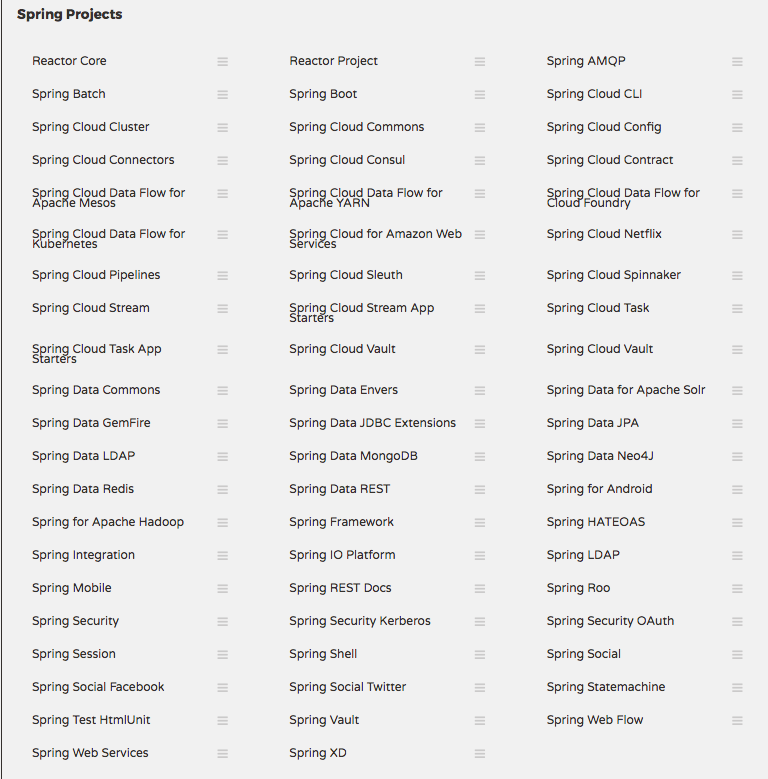
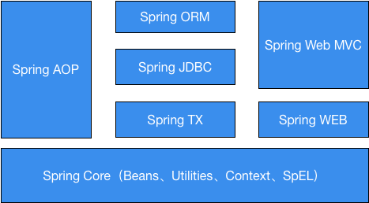

#  第四章 Spring

在上一章的IOC以及MVC两节中已经提到了Spring的一部分功能。Spring可以说是Java中用的最为普遍的一个解决企业应用的一站式框架，基本上覆盖了Java开发中各种需要的基础组件。可以说掌握了Spring框架的使用就掌握了Java开发一半甚至更多的技能。

如图所示是截自Spring官方的一张图，可见Spring目前覆盖了很多方面的技术。本来是为了取代重量级的EJB，结果现在也变得越来越庞大，同时也带来了复杂性的显著提高。使用的时候，应该做到全面了解，从而选择其中需要使用的，而不是大而全地都拿来用。而Spring对于这种插拔式的需求支持的也比较好。

Spring中的常用组件，可见下图：

- Spring必须的组件,包括Bean容器、Context上下文支持、Spring EL以及相关支持工具类库。这些是Spring的基础组件，是其他所有组件依赖的基础。
- AOP是做日志统一管理、事务管理时需要用到的组件。
- Spring ORM中提供了对hibernate等orm框架的整合组件。
- Spring JDBC的JdbcTemplate是在做数据库操作时候经常用到的组件。
- Spring TX提供了数据库事务管理相关的组件。
- Spring Web提供了Web开发时用到的诸如Web工具、视图解析器等组件。通常是与Web MVC一起使用。

以上是Spring框架的核心组成，在官方被称为**Spring Framework**。除此之外，还有几个Spring项目也比较常用。

- Spring Data：包括Spring Data Redis、Spring Data MongoDB、Spring Data Solr等，是对很多数据存储软件的操作封装。
- Spring Boot: 是对Spring所有组件的一个集合，旨在简化Spring应用的配置和降低Spring使用的复杂度。
- Spring Security：提供了权限管理、OAuth开发等基础组件。

需要注意的是本章讲述的Spring版本是4.3.x系列, 是Spring4.x系列的最终功能版本。而Spring最新的5.x版本带了来很多重大的更新，包括对JDK 9、Servlet 4、HTTP 2、JUnit 5以及完整的端到端响应式编程的支持。引入了Router Functions、Spring WebFlux、HTTP/Reactive Streams等组件来简化对非阻塞、事件驱动的网络应用程序的开发。

