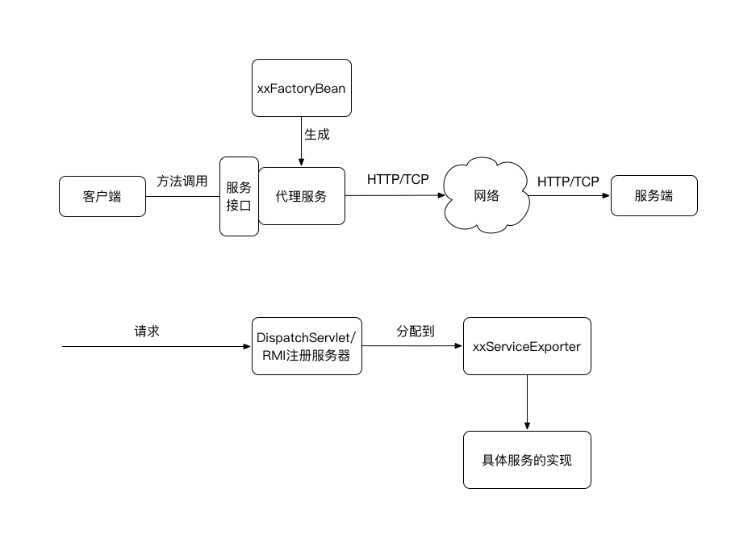

# 4.4 常用组件 

除了上两节讲述的Spring核心组件和数据操作组件外，Spring还有一些常用的组件。

## 4.4.1 Spring Expression Language

Spring3引入了Spring Expression Language（SpEL），这是一种在运行时给Bean的属性或者构造函数参数注入值的方法。其具有以下优点：

* 可以通过Bean的ID引用Bean；
* 可以调用某个对象的方法或者访问它的属性；
* 支持数学、关系和逻辑操作；
* 正则表达式匹配；
* 支持集合操作

SpEL表达式被#{}包围，跟placeholders中的\#{}非常像，最简单的SpEL表达式可以写作#{1}。以下是几个例子。

- \#{T(System).currentTimeMillis()} ： 这个表达式负责获得当前的系统时间，T()操作符负责将java.lang.System解析成类，以便可以调用currentTimeMillis()方法或者访问其静态变量。
- \#{systemProperties['spring.profile']}： 引用系统属性spring.profile
- \#{adminUser.userName}: 引用id为adminUser的属性userName
- \#{adminUser.getUserName()?.toUpperCase()}: 调用adminUser的getUserName方法,这里的?的作用是防止getUserName的返回值为null。
- \#{adminUser.noteList.![title]}: 把adminUser的noteList中每一个note的title都提取出来构成一个新的字符串集合。

引用Spring EL的这些值可以通过@Value注解。

```
public UserService(            

    @Value("#{adminUser.userName}")
    private String adminUserName;
    
    ...
}
```

此外，也可以使用代码做EL解析和执行。

```
ClassPathXmlApplicationContext ctx = new ClassPathXmlApplicationContext();  
ctx.refresh();  
ExpressionParser parser = new SpelExpressionParser();  
StandardEvaluationContext context = new StandardEvaluationContext();  
context.setBeanResolver(new BeanFactoryResolver(ctx));  
//context.registerFunction(HASH, hash); //注册方法
//context.setVariable(ARGS, arguments); //注册变量
Properties result = parser.parseExpression("@systemProperties").getValue(context, Properties.class);  
Assert.assertEquals(System.getProperties(), result);  
```

## 4.4.2 Spring Remoting

Spring Web提供了几种远程服务的封装，基本都是一个ServiceExporter用来发布服务，一个ProxyFactoryBean来引用服务。

- RMI：对Java自带RMI机制的封装，包括RmiServiceExporter和RmiProxyFactoryBean。
- Spring HTTP invoker：Spring自己实现的一种基于HTTP协议使用Java的序列化机制的RPC方式。包括HttpInvokerProxyFactoryBean和HttpInvokerServiceExporter
- Hessian：Hessian协议的封装使用，包括HessianProxyFactoryBean和HessianServiceExporter。
- Burlap: Burlap是一种基于XML的RPC协议，包括BurlapProxyFactoryBean和BurlapServiceExporter.

对于这些远程服务封装的使用，基本是类似的：



## 4.4.3 Spring与JMX的集成

Java管理扩展（Java Management Extension，JMX）从Java5.0开始引入，提供连接、监控和管理远程JVM的方式。如果一个 Java对象可以由一个遵循 JMX 规范的管理器应用管理，那么这个Java对象就可以称为一个可由JMX管理的资源。使用Spring与JMX集成，实现方式灵活而且简单：

- 可以自动探测实现MBean接口的MBean对象，而且可以将一个普通的Spring Bean注册为MBean；
- 定制管理MBean的接口，根据需要暴露特定管理MBean的操作；
- 使用注解定义MBean管理接口；
- 可以实现对本地和远程MBean的代理。

声明MBean。

```
public interface AdminMBean {
    public void invoke(String className, String methodName, Object[] args);
}

public class Admin implements AdminMBean {
    public void invoke(String className, String methodName, Object[] args) {
      ...
    }
}  
``` 
 
配置并暴露服务。 
 
```
<bean id="adminBean" class="me.rowkey.pje.jmx.impl.Admin" />

<bean id="exporter" class="org.springframework.jmx.export.MBeanExporter"
     lazy-init="false">
   <property name="beans">
       <map>
           <entry key="me.rowkey.pje.jmx.impl:name=AdminBean"
                  value-ref="adminBean" />
       </map>
   </property>
</bean>

<bean id="registry" class="org.springframework.remoting.rmi.RmiRegistryFactoryBean">
   <property name="port" value="9999" />
</bean>

<bean id="serverConnector"
     class="org.springframework.jmx.support.ConnectorServerFactoryBean">
   <property name="objectName" value="connector:name=webapprmi" />
   <property name="serviceUrl"
             value="service:jmx:rmi:///jndi/rmi://localhost:9999}/kmconnector" />
</bean>
```

以上便在9999端口开放了JMX协议并发布了一个MBean，其底层通讯是基于RMI的。这样通过serviceUrl："service:jmx:rmi:///jndi/rmi://127.0.0.1:9099/kmconnector"以及mbeanName："suishen.libs.admin.jmx.impl:name=AdminBean"即可调用服务。

## 4.4.4 Spring Quartz

Spring Quartz是Spring自己实现的一套定时调度框架，支持Cron表达式。需要注意的是相比起真正的Quartz框架，Spring Quartz是轻量级的，缺乏分布式等高级特性。

典型的使用Spring Quartz的XML配置如下：

```
<task:scheduler id="quartzScheduler" pool-size="10"/>

<task:scheduled-tasks scheduler="quartzScheduler">

      <task:scheduled ref="userDisableService" method="enableService" cron="* */5 * * * ?"/>

</task:scheduled-tasks>
```

其中task:scheduler配置了Quartz使用的scheduler的线程池大小为10。配置的任务则是每5分钟执行userDisableService这个Bean的enableService方法。

当然，Spring Quartz也支持注解配置，开关如下：

```
<task:annotation-driven scheduler="qbScheduler" mode="proxy"/>
```

当然，也可以使用@注解EnableScheduling来开启Spring Quartz的注解支持。

这样就可以在bean中使用@Scheduled注解来配置定时任务。

```
@Service
public class UserDisableService{
    
    @Scheduled(cron = "* */5 * * * ?")
    public viod enableService(){
        ...
    }
}
```
 
## 4.4.5 Spring CORS

CORS（Cross-Origin Resource Sharing）是为了解决浏览器中跨域请求的问题。简单的Get请求可以使用JSONP解决，而对于其他稍微复杂的请求则需要后端应用支持CORS。Spring4.2之后提供了@CrossOrigin注解实现对CORS的支持。

- 在Controller方法上配置 

    ```
    @CrossOrigin(origins = {"http://localhost:8088"})
    @RequestMapping(value = "/corsTest", method =  RequestMethod.GET)
    public String greetings() {    
        return "cors test";
    }
    ```
    
- 在Controller上配置，那么此Controller中所有的method都支持CORS

    ```
    @CrossOrigin(origins = "http://localhost:8088", maxAge = 3600)
    @Controller
    @RequestMapping("/api/")
    public class TestController {    
        @RequestMapping(value = "/corsTest", method =  RequestMethod.GET)
        public String greetings() {    
            return "cors test";
        } 
    }
    ```
    
- Java Config全局配置

    ```
    @Configuration
    @EnableWebMvc
    public class SpringWebConfig extends WebMvcConfigurerAdapter {    
        @Override    
        public void addCorsMappings(CorsRegistry registry) {       
            //对所有URL配置
            //registry.addMapping("/**");
            
            //针对某些URL配置
            registry.addMapping("/api/**").allowedOrigins("http://localhost:8888")            
                                            .allowedMethods("PUT", "DELETE")            
                                            .allowedHeaders("header1", "header2", "header3")           
                                            .exposedHeaders("header1", "header2")           
                                            .allowCredentials(false).maxAge(3600);    
        }
    }
    ```
    
- XML全局配置

    ```
    <mvc:cors>    
        <!--<mvc:mapping path="/**" />-->
        
        <mvc:mapping path="/api/**" allowed-origins="http://localhost:8888, http://localhost:8088" allowed-methods="GET,POST,HEAD,OPTIONS,PUT,DELETE"
                 allowed-headers="Content-Type,X-Requested-With,accept,Origin,Access-Control-Request-Method,Access-Control-Request-Headers" 
                 exposed-headers="Access-Control-Allow-Origin,Access-Control-Allow-Credentials"
                 allow-credentials="true" max-age="123"/>
    </mvc:cors>
    ```
    
- Spring Boot中的Filter全局配置

    ```
    @Bean
    public FilterRegistrationBean corsFilter() {
        UrlBasedCorsConfigurationSource configSource = new UrlBasedCorsConfigurationSource();
        CorsConfiguration corsConfig = new CorsConfiguration();
        config.setAllowCredentials(true);    
        config.addAllowedOrigin("http://localhost:8888");
        config.addAllowedOrigin("http://localhost:8088");
        config.addAllowedHeader("header1");
        config.addAllowedMethod("GET");
        configSource.registerCorsConfiguration("/**", corsConfig); // CORS 配置对所有接口都有效
        
        FilterRegistrationBean filterBean = new FilterRegistrationBean(new CorsFilter(configSource));
        filterBean.setOrder(0);
        
        return filterBean;
    }
    ```
    
这里需要注意的是，使用此种方式配置cors，实质上是Spring在handler中加入了一个CorsInterceptor，而这个拦截器其执行是在自定义的拦截器后面的。因此如果跨域请求被前面的拦截器拦住了，那么不会走到CorsInterceptor，会报跨域错误。

