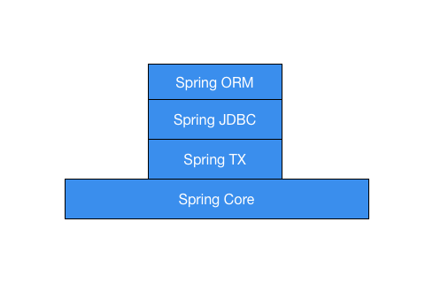

# 4.2 数据操作

Spring提供了对常用数据软件/服务操作的封装组件，包括关系型数据库、NoSQL数据库、Redis、Elasticsearch、 Cassandra等。本章主要讲述其中最为常用的JDBC、Redis以及MongoDB。

## 4.2.1 Spring JDBC

3.2节讲了ORM框架，其实Spring也提供了对ORM的支持，包括对Hibernate、JDO以及JPO的支持。相关组件的层次结构如下图所示：



比较常用的是Spring ORM下面一层的Spring JDBC以及Spring TX。

1. Spring JDBC提供了对JDBC操作的封装，也是Java开发中经常用到的数据库操作工具, 经常用在需要灵活组装SQL的场景下使用，其核心类是JdbcTemplate，提供了很多数据CRUD操作。
    
    注入一个数据库连接池即可构造JdbcTemplate。
    
    ```
    <bean id="dataSource" class="org.apache.commons.dbcp2.BasicDataSource">
        <property name="url" value="${mysql.url}"/>
        <property name="username" value="${mysql.user}"/>
        <property name="password" value="${mysql.pwd}"/>
        <property name="maxTotal" value="64"/>
        <property name="maxWaitMillis" value="3000"/>
        <property name="maxIdle" value="32"/>
        <property name="minIdle" value="10"/>
    </bean>

    <bean id="jdbcTemplate"
          class="org.springframework.jdbc.core.JdbcTemplate">
        <property name="dataSource" ref="dataSource"/>
    </bean>
    ```
    
    注入JdbcTemplate到DAO中，可以进行数据库操作。
    
    ```
    @Repository
    public class UserDao {
        @Resource
        private JdbcTemplate jdbcTemplate;
    
        public User getById(long id) {
            return jdbcTemplate.queryForObject("select * from test_user where id = ?", new Object[]{id}, User.class);
        }
    
        public List<User> getByName(String name) {
            return jdbcTemplate.queryForList("select * from test_user where name= ?", new Object[]{name}, User.class);
        }
    }
    ```
    
1. Spring TX提供了对事务的支持

    使用tx:annotation-driven开启Spring的注解事务，并配置transaction-manager。
    
    ```
    <tx:annotation-driven transaction-manager="txManager"/>
         
    <bean id="txManager" class="org.springframework.jdbc.datasource.DataSourceTransactionManager">
        <property name="dataSource" ref="dataSource"/>
    </bean>
    ```
         
    使用@Transactional注解一个方法使其开启事务。
     
    ````
    @Service
    class UserServiceImpl implements IUserService {
         
        //处理删除用户业务逻辑，使用@Transactional注解实现该方法的事务管理
        @Transactional
        public void delUser(long id) {
          ...
        }
    }
    ```
     
    需要注意的是，开启了事务的方法在数据库错误时应该抛出异常，否则是无法做到事务回滚的。

## 4.2.2 Spring Data Redis

基于jedis之上对Redis操作的封装。 

1. 配置jedis连接池

    ```
    <bean id="jedisPoolConfig" class="redis.clients.jedis.JedisPoolConfig">
        <property name="maxTotal" value="${redis.pool.maxActive}"/>
        <property name="maxIdle" value="${redis.pool.maxIdle}"/>
        <property name="minIdle" value="4"/>
        <property name="maxWaitMillis" value="${redis.pool.maxWait}"/>
        <property name="testOnBorrow" value="${redis.pool.testOnBorrow}"/>
    </bean> 
    ```
1. 配置连接工厂 
  
    ```
    <bean id="jedisConnectionFactory" class="org.springframework.data.redis.connection.jedis.JedisConnectionFactory">
        <constructor-arg index="0" ref="jedisPoolConfig"/>
        <property name="hostName" value="${redis.host}"/>
        <property name="port" value="${redis.port}"/>
        <property name="usePool" value="true"/>
    </bean> 
    ``` 
1. 构造RedisTemplate即可使用它来做各种操作
 
    ```
    <bean id="redisTemplate" class="org.springframework.data.redis.core.StringRedisTemplate">  
       <property name="connectionFactory" ref="jedisConnectionFactory" />  
    </bean> 
    
    redisTemplate.opsForValue().set("test_key", "test_value"); //set操作
    redisTemplate.opsForValue().getOperations().delete("test_key"); //del操作
    redisTemplate.opsForHash().put("testKey", "testField", "testValue");  //hset操作 
    ```
    
    需要注意的一点：如果直接使用RedisTemplate，那么redis的key使用的是String的JDK序列化字节数组，并非是String.getBytes()得到的字节数组。可以通过RedisTmplate的defaultSerializer、keySerializer、valueSerializer、hashKeySerializer以及hashValueSerializer几个属性设置想要使用的序列化机制。其支持的几种序列化机制如下：
    
    - StringRedisSerializer: 简单的字符串序列化，使用的是String.getBytes()方法。StringRedisTemplate就是使用它作为key、value、hashKey以及hashValue的序列化实现。
    - GenericToStringSerializer: 可以将任何对象泛化为字符串并序列化，对于每一种对象类型都有不同的实现。
    - JacksonJsonRedisSerializer: JSON的序列化方式，使用Jakson Mapper将object序列化为JSON字符串。
    - Jackson2JsonRedisSerializer: 跟JacksonJsonRedisSerializer同样是JSON序列化方式，使用的是jackson databind。
    - JdkSerializationRedisSerializer: 使用JDK自带的序列化机制，也是直接使用RedisTemplate时用的序列化机制。
    
## 4.2.3 Spring Data MongoDB

基于Mongo Java Driver对MongoDB的操作封装。使用流程如下：

1. 定义定义Mongo对象并构造数据库工厂，对应的是MongoDB官方jar包中的Mongo，replica-set设置集群副本的ip地址和端口。

    ```
    <!-- -->
    <mongo:mongo id="mongo" replica-set="${mongo.hostport}">
       <!-- 一些连接属性的设置 -->
       <mongo:options
               connections-per-host="${mongo.connectionsPerHost}"
               threads-allowed-to-block-for-connection-multiplier="${mongo.threadsAllowedToBlockForConnectionMultiplier}"
               connect-timeout="${mongo.connectTimeout}"
               max-wait-time="${mongo.maxWaitTime}"
               auto-connect-retry="${mongo.autoConnectRetry}"
               socket-keep-alive="${mongo.socketKeepAlive}"
               socket-timeout="${mongo.socketTimeout}"
               slave-ok="${mongo.slaveOk}"
               write-number="1"
               write-timeout="0"
               write-fsync="true"/>
    </mongo:mongo>

    <mongo:db-factory dbname="${mongo.dbname}" mongo-ref="mongo" username="${mongo.username}"
                 password="${mongo.password}">
    ```

1. 配置映射相关信息，包括映射上下文、类型映射、映射转换等。

    ```
    <bean id="mappingContext" class="org.springframework.data.mongodb.core.mapping.MongoMappingContext"/>
    
    <!-- 默认Mongodb类型映射 -->
    <bean id="defaultMongoTypeMapper" class="org.springframework.data.mongodb.core.convert.DefaultMongoTypeMapper">
       <constructor-arg name="typeKey">
           <null/>
       </constructor-arg>
    </bean>
    
    <!-- 配置mongodb映射类型 -->
    <bean id="mappingMongoConverter" class="org.springframework.data.mongodb.core.convert.MappingMongoConverter">
       <constructor-arg name="mongoDbFactory" ref="mongoDbFactory"/>
       <constructor-arg name="mappingContext" ref="mappingContext"/>
       <property name="typeMapper" ref="defaultMongoTypeMapper"/>
    </bean>
    ```
1. 构造MongoTemplate，即可使用mongoTemplate进行数据库操作。

    ```
    <bean id="mongoTemplate" class="org.springframework.data.mongodb.core.MongoTemplate">
       <constructor-arg name="mongoDbFactory" ref="mongoDbFactory"/>
       <constructor-arg name="mongoConverter" ref="mappingMongoConverter"/>
       <property name="writeResultChecking" value="EXCEPTION"/>
       <property name="writeConcern" value="ACKNOWLEDGED"/>
    </bean>
    ```
    
    这里需要注意上面配置的writeResultChecking和writeConcern是为了安全写入。
    
    使用MongoTemplate需要给数据库实体类加@Document，并指定集合的名字, 如果不加此注解或者没指定collection, 那么默认使用类的简单名称首字母小写做为集合的名字。
    
    ```
    @Document(collection = "test_user")
    public class User{
        private String id;
    
        private String userName;

        private String nickName;
        
        ...
    }
    
    User user  = new User();
    user.setName("test");
    user.setNickName("测试用户");
    
    mongoTemplate.insert(user); //插入数据
    
    user.setName("test2")
    mongoTemplate.save(user); //保存数据

    Criteria criteria = Criteria.where("name").is("test2"); //根据name查询数据
    mongoTemplate.findOne(Query.query(criteria), User.class);    
    ```
    
这里需要注意几点：
    
- mongo的配置slave-ok为true时，如果readPreference为primary，会自动转换readPreference为secondaryPreferred。建议不要设置slave-ok此选项，直接用readPreference来控制读。
- Spring Data MongoDB会默认在每个collection中添加_class字段，来标识原始来源类型，可以在defaultMongoTypeMapper将typeKey设置为null去掉此字段。
- Spring Data MongoDB会把实体类中的id属性转换为_id（MongoDB默认使用的主键field），因此当你使用MongoTemplate做了数据操作后，再使用Mongo Java Driver查询的时候要使用_id而不是id。
- 实体类中的id如果为空，MongoDB会自动生成ObjectId作为id，读取数据时id被赋值为ObjectId的字符串值。
- 要注意对MongoDB安全写的配置，根据业务场景对MongoTemplate的writeResultCheckin和writeConcern配置合适的值。

