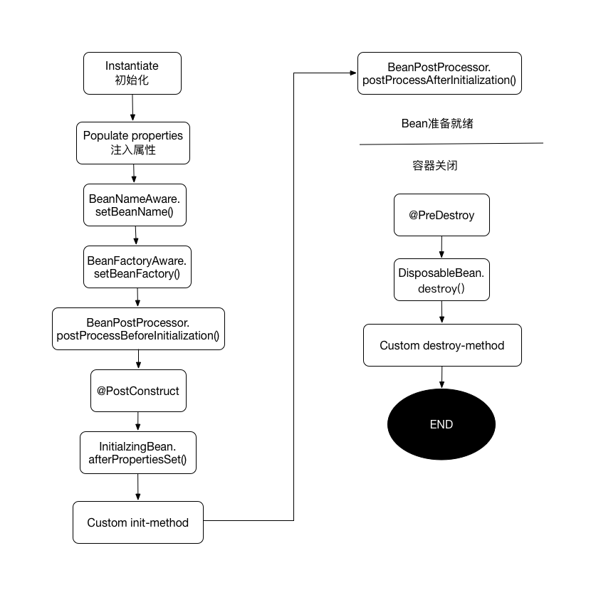

# 4.1 Spring核心组件

Spring框架的核心包括IOC、AOP以及辅助工具SpringEL等。

首先要明确一个概念，Spring的IOC容器是ApplicationContext。常用的ApplicationContext如下：

- ClassPathXmlApplicationContext: 从ClassPath路径下加载XML配置的上下文。
- FileSystemXmlApplicationContext：从文件系统中加载XML配置的上下文。
- XmlWebApplicationContext：Web开发中从XML中记载Web上下文，区别于上面之处在于此上下文是基于ServletContext的。
- AnnotationConfigWebApplicationContext：从注解类中加载Web上下文。

对于这些上下文中的实例在Spring中被叫做Bean。一个Bean的生命周期管理如下图所示：



图中所示为Spring中的几个关键类、接口以及对应的方法，箭头的方向表示执行的顺序，描述了一个Bean从开始初始化到销毁会经历的一些方法调用。

## 4.1.1 双亲上下文

Spring中的ApplicaitonContext是父子层次结构的，存在多个上下文的时候，会有一个根上下文做为其他上下文的父亲。

```
<listener>  
    <listener-class>org.springframework.web.context.ContextLoaderListener</listener-class>  
    ...
</listener>  
```

如上，如果在web.xml中使用Listener监听器来加载Spring的配置，Spring会创建一个全局的WebApplicationContext上下文，称为根上下文，保存在 ServletContext中，key是`WebApplicationContext.ROOT_WEB_APPLICATION_CONTEXT_ATTRIBUTE`属性的值。可以使用工具类取出上下文：`WebApplicationContextUtils.getWebApplicationContext(ServletContext)`或者`WebApplicationContextUtils.getRequiredWebApplicationContext(ServletContext)`。

而很多情况下，我们还会配置一个或者多个DispatcherServlet，每个DispatcherServlet有一个自己的WebApplicationContext上下文。这个上下文是私有的，继承了根上下文中所有东西。保存在ServletContext中，key是 `"org.springframework.web.servlet.FrameworkServlet.CONTEXT" + Servlet名称`。当一个Request对象产生时，会把这个WebApplicationContext上下文保存在Request对象中，key是`DispatcherServlet.class.getName() + ".CONTEXT"`。可以使用工具类取出上下文：`RequestContextUtils.getWebApplicationContext(request)`或者`WebApplicationContextUtils.getWebApplicationContext(servletContext,attrname)`。

为了避免双亲上下文，可以不使用Listener监听器来加载Spring的配置，直接改用DispatcherServlet来加载Spring的配置。

## 4.1.2 事件机制

Spring中提供了事件机制，用于监听容器事件的发生，在事件发生时做一些处理工作。

1. 容器事件监听器：实现ApplicationListener接口的类, 可以监听容器的事件，包括：

    - ContextStartedEvent: 上下文启动事件
    - ContextRefreshedEvent：上下文刷新完毕事件
    - ContextStoppedEvent：上下文停止事件
    - ContextClosedEvent：上下文关闭事件

    ```
    @Service
    public class TestListener implements ApplicationListener<ContextStartedEvent> {
        @Override
        public void onApplicationEvent(ContextStartedEvent event) {
            ...
        }
    }
    
    <bean class="me.rowkey.pje.spring.TestListener" scope="prototype" />  
    ```

1. 具有意识的Bean：形如xxAware的接口，实现了此种接口的Bean即为有意识，能够注入/获取到xx代表的事物。如，实现ApplicationContextAware接口的类，会自动注入当前的ApplicationContext。

    ```
    public class ApplicationContextHolder implements ApplicationContextAware {
        private static ApplicationContext applicationContext;
    
        public static ApplicationContext getContext() {
            return ApplicationContextHolder.applicationContext;
        }
    
        public void setApplicationContext(ApplicationContext applicationContext) throws BeansException {
            ApplicationContextHolder.applicationContext = applicationContext;
        }
    }
    
    <bean class="me.rowkey.pje.spring.ApplicationContextHolder"/>
    ```
    
    此外，在Bean生命周期图中的BeanNameAware和BeanFactoryAware也是两个具有意识的Bean。
    
    - 实现了BeanNameAware的Bean能够感知到自己在BeanFactory中注册的名称。
    - 实现了BeanFactoryAware的bean能够感知到自己所属于的BeanFactory。

## 4.1.3 初始化和销毁

如果想要在应用初始化的时候做一些初始化方法，可以使用以下几种初始化方式：

1. 直接在Bean的构造方法里做初始化工作。
1. 使用@PostConstruct注解，指明在Bean构造器方法执行后执行的方法。
1. Bean实现InitializingBean接口，在afterPropertiesSet做初始化工作。
1. 在XML中使用init-method指定Bean构造完成后调用的方法。

需要注意的是方法1和2并不保证在执行时依赖的其他Bean已经注入进来。因此如果想在某些Bean初始化完毕并注入进来之后再进行初始化工作，可以配合使用@DependsOn注解。

```
@Service
@DependsOn("configService")
public class AccountService implements Constants {

   @Resource
   private ConfigService configService;

   @PostConstruct
   public void init() throws IOException {
       ...
   }

}
```

也可以使用BeanFactoryPostProcessor和BeanPostProcessor来做一些更为前置的初始化工作, 典型的应用场景就是实现自己的注解。

- 实现BeanFactoryPostProcesso接口可以在在Spring容器加载了Bean的定义之后，在Bean实例化之前执行，能够修改Bean的定义属性。如可以把Bean的scope从singleton改为prototype，也可以把property的值给修改掉。可以通过接口的参数获取到相关Bean的定义信息。
- 实现BeanPostProcesso接口可以在Spring容器实例化Bean之后，在执行Bean的初始化方法前后，添加一些自己的处理逻辑。Spring内置了几个BeanPostProcessor实现：

    - CommonAnnotationBeanPostProcessor：支持@Resource注解的注入
    - RequiredAnnotationBeanPostProcessor：支持@Required注解的注入
    - AutowiredAnnotationBeanPostProcessor：支持@Autowired注解的注入
    - ApplicationContextAwareProcessor：用来为bean注入ApplicationContext等容器对象

根据Bean的生命周期。以上提到的初始化方法的优先级为: BeanFactoryPostProcessor > Constructor > BeanPostProcessor.postProcessBeforeInitialization > @PostConstruct > InitializingBean > init-method。

此外，如果是想要在所有Bean都初始化完毕后做一次初始化工作，那么可以使用上一节所说的ApplicationListener,监听ContextRefreshedEvent。

```
@Service
public class BootstrapService implements ApplicationListener<ContextRefreshedEvent> {
    @Override
    public void onApplicationEvent(ContextRefreshedEvent event) {
        ...//初始化代码
    }
}
```

而要在销毁Bean之前做一些收尾工作，有以下三种方式：

- 使用@PreDestroy注解，指明在容器关闭后执行的方法。
- 实现DisposableBean接口，在destroy方法做销毁工作。
- 在XML中使用destroy-method指定bean销毁时调用的方法。

根据Bean生命周期，可知优先级为：@PreDestroy > DisposableBean > destroy-method。    

## 4.1.4 动态构造Bean

当要创建的Bean不能直接通过构造方法、setter方法、字段注入完成，还需要做一些初始化工作的时候，普通创建Bean的方式就力不从心了。 Spring提供了三种方式解决这个问题：

1. 定义Bean时，指明factory-bean和factory-method

    ```
    public class TestFactory{
        public User getUser(){
            return new User();
        }
    }
    
    <bean id="testFactory" class="me.rowkey.pje.spring.TestFactory"/>
    <bean id="user" class="me.rowkey.pje.common.meta.User"
          factory-bean="testFactory" factory-method="getUser">
    </bean>
    ```
    
2. 定义Bean直接使用类的静态方法

     ```
    public class TestFactory{
        public static User getStaticUser(){
            return new User();
        }
    }
    
    <bean id="user" class="me.rowkey.pje.spring.TestFactory" factory-method="getStaticUser"/>
    ```
    
3. 实现FactoryBean接口

    ```
    public interface FactoryBean<T> {
        T getObject() throws Exception;
        
        Class<?> getObjectType();
        
        boolean isSingleton();
    }
    
    public class TestFactory implements FactoryBean<User> {
        @Override
        public User getObject() throws Exception {
            return new User("test");
        }
    
        @Override
        public Class<?> getObjectType() {
            return User.class;
        }
    
        @Override
        public boolean isSingleton() {
            return true;
        }
    }
    
    <bean id="user" class="me.rowkey.pje.spring.TestFactory"/>
    ```

针对第3种方式的FactoryBean，Spring自带了几个实现。:

- PropertyPathFactoryBean: 用来获取目标Bean的属性值（实际是其getter方法的返回值)。PropertyPathFactoryBean返回值（基本数值类型或者对象）在最外层，则把返回值注册为容器中一个Bean，Bean名字为id 。

    ```
    <bean id="propertyBean" class="org.springframework.beans.factory.config.PropertyPathFactoryBean">  
          <property name="targetBeanName" value="adminUser"></property>  
          <property name="propertyPath" value="user.username"></property>  
    </bean>  
    
    <!--下面是简化形式-->
    <bean id="adminUser.user.username" class="org.springframework.beans.factory.config.PropertyPathFactoryBean" />  
    ```
    
-  FieldRetrievingFactoryBean：用来获取类的静态属性值或者对象的实例属性值。

    ```
    <bean id="java.sql.Connection.TRANSACTION_SERIALIZABLE" class="org.springframework.beans.factory.config.FieldRetrievingFactoryBean"/>  
    ```
    上面即获取类java.sql.Connection的静态属性值TRANSACTION_SERIALIZABLE。
    
- MethodInvokingFactoryBean：用来调用类的静态方法或者调用Bean对象的实例方法。若有返回值则可注册为容器中的Bean或者作为依赖注入其它Bean中。

    ```
    <bean id="testUser" class="org.springframework.beans.factory.config.MethodInvokingFactoryBean">  
        <property name ="targetObject" ref="testFactory"></property>  
        <property name="targetMethod" value="getUser"></property>  
        <property name="arguments">  
            <list>  
            .....  
            </list>  
        </property>  
    </bean> 
    ```

同样的，可以用inner Bean的方式将上面的FactoryBean构造的实例注入到其他bean中：

```
<bean id="testUser" class="me.rowkey.pje.common.meta.User">  
   <property name="username">  
       <bean id="adminUser.user.username" class="org.springframework.beans.factory.config.PropertyPathFactoryBean"/>  
   </property>  
  <property name="password">  
      <bean id="adminUser.user.password" class="org.springframework.beans.factory.config.PropertyPathFactoryBean"/>  
  </property>  
</bean> 
``` 
    
当然，现在Spring提供了@Bean注解，完全可以在代码中做这种动态生成Bean的工作。
    
```
@Configuration
public class SpringCoreConfig{

   @Bean("testUser")
   public User TestUser(AdminUser adminUser) { //参数可以直接引用bean
    
       User user = new User();
       user.setUsername(adminUser.getUser().getUsername());
       
       ...
       
       return user;
   }
}
```

## 4.1.5 注入集合、枚举、类的静态字段
   
1. 对于在XML中已经存在的Bean注入List、Map等集合这种需求，可以这样配置：

    ```
    <!-- Bean的属性是集合 -->  
    <bean id="collectionBean" class="me.rowkey.pje.spring.CollectionBean">  
      <property name="list">  
          <list>  
              <value>list1</value>  
              <value>list2</value>  
              <value>list3</value>  
          </list>  
      </property>  
       <property name="map">  
           <map>  
               <entry key="key1" value="value1"></entry>  
               <entry key="key2" value="value2"></entry>  
               <entry key="key3" value="value3"></entry>  
           </map>  
       </property>   
    </bean>  
    ```
    
2. 注入枚举、静态值

    对于枚举和静态值的注入，使用FieldRetrievingFactoryBean是一种办法。但其实当注入的字段值属于此字段对应类的静态字段时，只需要注明静态字段名即可。如：
        
   ```
   public enum Status{
       ENABLE,DISABLE
   }
   
   public class ParentUser{  
     public static final ParentUser INSTANCE = new ParentUser();  
   }  
   
   public class User{
       private Status status;
       
       privata ParentUser parentUser;
       
       private void setStatus(Status status){
           this.status = status;
       }
       
       private Status getStatus(){
           return this.status;
       }
       
       private void setParentUser(ParentUser parentUser){
           this.parentUser = parentUser;
       }
       
       private ParentUser getParentUser(){
           return this.parentUser;
       }
   }
   
   <bean id="testUser" class="me.rowkey.pje.common.meta.User">
       <property name="status" value="ENABLE"/>
       <property name="parentUser" value="INSTANCE"/>
   </bean>
   ```
        
## 4.1.6 AOP

AOP（Aspect Oriented Programming）是为了解决某些场景下代码重复问题的一种编程技术，允许程序模块化横向切割关注点或横向切割典型的责任划分。能够封装多个类中不同单元的相同功能，把应用业务逻辑和系统服务分开，经常用在日志和事务管理上。

说到AOP不得不提的就是Aspectj这个AOP框架，它是一种编译期AOP框架（即在编译的时候对被代理的类进行增强）。它自己有一套AOP各个组件的概念定义。其中的几个关键的概念如下：

- 方面：Aspect,横切多个类的某个功能描述。比如，一个日志模块可以被称作日志的AOP切面。
- 连接点：JointPoint, 程序执行过程中的某个函数调用。代表一个应用程序的某个位置，在这个位置我们可以插入一个AOP切面，它实际上是个应用程序执行Spring AOP的位置。
- 通知: Advice, 是个在方法执行前或执行后要做的动作，实际上是程序执行时要通过SpringAOP框架触发的代码段。Spring切面可以应用五种类型的通知：

    - before：前置通知，在一个方法执行前被调用。
    - after: 在方法执行之后调用的通知，无论方法执行是否成功。
    - after-returning: 仅当方法成功完成后执行的通知。
    - after-throwing: 在方法抛出异常退出时执行的通知。
    - around: 在方法执行之前和之后调用的通知。

- 切入点: PointCut, 是映射到一个或一组连接点的指示符，通知将在这些位置执行。可以通过表达式或匹配的方式指明切入点。Spring AOP支持的AspectJ切入点指示符如下：
             
    - execution：用于匹配方法执行的连接点；
    - within：用于匹配指定类型内的方法执行；
    - this：用于匹配当前AOP代理对象类型的执行方法；注意是AOP代理对象的类型匹配，这样就可能包括引入接口也类型匹配；
    - target：用于匹配当前目标对象类型的执行方法；注意是目标对象的类型匹配，这样就不包括引入接口也类型匹配；
    - args：用于匹配当前执行的方法传入的参数为指定类型的执行方法；
    - @within：用于匹配所以持有指定注解类型内的方法；   
    - @target：用于匹配当前目标对象类型的执行方法，其中目标对象持有指定的注解；
    - @args：用于匹配当前执行的方法传入的参数持有指定注解的执行；
    - @annotation：用于匹配当前执行方法持有指定注解的方法；
    - bean：Spring AOP扩展的，AspectJ没有此指示符，用于匹配特定名称的Bean对象的执行方法；
    - reference pointcut：表示引用其他命名切入点，只有@ApectJ风格支持，Schema风格不支持。

    其中类型匹配的语法如下所示：
        
        - *：匹配任何数量字符；
        
        - ..：匹配任何数量字符的重复，如在类型模式中匹配任何数量子包；而在方法参数模式中匹配任何数量参数。
        
        - +：匹配指定类型的子类型；仅能作为后缀放在类型模式后边。

    匹配类型表达式：`注解？ 类的全限定名字`；匹配方法执行表达式：`注解？ 修饰符? 返回值类型 类型声明?方法名(参数列表) 异常列表？`
       
    此外，多个切入点表达式是可以组合的，AspectJ使用 且（&&）、或（||）、非（！）来组合切入点表达式，为了方便xml配置，Spring AOP 提供了and、or、not来代替&&、||、！。

需要注意的是Spring AOP是一种运行期的AOP框架，对Aspectj的支持只是使用了其定义的各个组件定义和注解，底层实现和它并没有多少关系。
        
使用Spring AOP有三种方式：

1. Spring AOP接口

    此种方式基于Spring提供的aop接口：
    
    - 前置通知：MethodBeforeAdvice
    - 后置通知：AfterReturningAdvice
    - 环绕通知：MethodInterceptor
    - 异常通知：ThrowsAdvice

    针对这些接口，进行实现并配置即可。此种方式需要对每一个被代理的bean创建一个ProxyFactoryBean并手动指定目标对象与通知，比较繁琐，笔者也不推荐使用，因此不再详细叙述。
    
1.  依赖于Aspectj的XML配置

    Spring从2.0开始开始支持Aspectj的XML配置方式，在<aop:config>标签下使用<aop:pointcut>、<aop:advisor>、<aop:aspect>配置，自动完成动态代理工作，大大简化了aop的开发工作。如下：

    ```
    public class TestServiceAop{
        public void doAround(ProceedingJoinPoint pjp) throws Throwable {
            System.out.println("===========进入around环绕方法！=========== \n");
    
            // 调用目标方法之前执行的动作
            System.out.println("调用方法之前: 执行！\n");
    
            // 调用方法的参数
            Object[] args = pjp.getArgs();
            // 调用的方法名
            String method = pjp.getSignature().getName();
            // 获取目标对象
            Object target = pjp.getTarget();
            // 执行完方法的返回值：调用proceed()方法，就会触发切入点方法执行
            Object result = pjp.proceed();
    
            System.out.println("输出：" + args[0] + ";" + method + ";" + target + ";" + result + "\n");
            System.out.println("调用方法结束：之后执行！\n");
        }
    }
    
    <bean id="testServiceAop" class="me.rowkey.pje.spring.aop.TestServiceAop" />
    
    <aop:config>
        <aop:aspect ref="testServiceAop">
        
            <aop:pointcut id="point_cut" expression="execution(*  me.rowkey.pje.spring.aop.test.service.impl..*.*(..)))" />
            
            <aop:before .../>
            
            <aop:afterReturning .../>

            <aop:afterThrowing .../>
            
            <aop:after .../>
        
            <aop:around method="around" pointcut-ref="point_cut"/>
            
            <!--<aop:around method="around" pointcut="execution(* me.rowkey.pje.spring.service.impl..*.*(..)))"/>-->
        </aop:aspect>
    </aop:config>
    ```
    
1. 依赖于Aspectj注解的AOP配置

    Spring现在也支持使用Aspectj的注解来做AOP，比起XML配置的方式，更加简单。

    ```
    @Component
    @Aspect
    public class UserRestOperationLogAop {
    
        @Pointcut("execution(public * me.rowkey.pje.spring.service..*.add*(..)) " +
            "|| execution(public * me.rowkey.pje.spring.service..*.delete*(..)) " +
            "|| execution(public * me.rowkey.pje.spring.service..*.update*(..))" +
            "|| execution(public * me.rowkey.pje.spring.service..*.create*(..))" +
            "|| execution(public * me.rowkey.pje.spring.service..*.modify*(..))")
        public void pointCut() {
        }

        @Around(value = "pointCut()")
        public Object around(ProceedingJoinPoint joinPoint) throws Throwable {
            System.out.println("===========进入around环绕方法！=========== \n");

            // 调用目标方法之前执行的动作
            System.out.println("调用方法之前: 执行！\n");
    
            // 调用方法的参数
            Object[] args = pjp.getArgs();
            // 调用的方法名
            String method = pjp.getSignature().getName();
            // 获取目标对象
            Object target = pjp.getTarget();
            // 执行完方法的返回值：调用proceed()方法，就会触发切入点方法执行
            Object result = pjp.proceed();
    
            System.out.println("输出：" + args[0] + ";" + method + ";" + target + ";" + result + "\n");
            System.out.println("调用方法结束：之后执行！\n");
        }
    }
    
    <context:component-scan base-package="me.rowkey.pje.spring" />
    <!-- 打开aop 注解 -->
    <aop:aspectj-autoproxy />
    ```
    
Spring中AOP的实现原理包括两种方式：JDK动态代理和CGLIB。

- 如果目标对象实现了接口，默认情况下会采用JDK的动态代理实现AOP。
- 如果目标对象实现了接口，可以强制使用CGLIB实现AOP。
- 如果目标对象没有实现了接口，必须采用CGLIB库，Spring会自动在JDK动态代理和CGLIB之间转换。

也可以强制AOP使用CGLIB，如下

```
//XML配置
<aop:aspectj-autoproxy proxy-target-class="true"/>

//注解配置
@EnableAspectJAutoProxy(proxyTargetClass = true)
```

## 4.1.7 XML配置进阶

XML是Spring一开始就支持的配置方式，也是最主流的配置方式。从Spring 2.0开始，基于文件的配置就从DTD转换到了XSD，目的就是让大家能够更好地利用XSD做到配置的灵活性和便利性。这里首先要注意的是在加载XML文件时，通常会有前缀classpath:和者classpath*：这俩的区别在于当classpath中存在同样路径的多个文件时，前者只会去加载第一个找到的资源，而后者则会去加载所有找到资源。路径的对照表如下：

前缀 | 例子 | 说明
----|-----|------
classpath: | classpath:applicationContext.xml | 从classpath中加载
file: | file:/data/applicationContext.xml | 作为 URL 从文件系统中加载。
http: | http://host/applicationContext.xml | 作为 URL 加载。
（none）| /data/applicationContext.xml | 根据上下文的不同而不同: FileSystemXmlApplicationContext对应文件系统；GenericWebApplicationContext对应ServletContext中的资源;ClassPathXmlApplicationContext对应Classpath下的资源。

之前IOC和MVC两章都有一些基本的Spring xml配置示例，这里主要讲解一些可能不是所有人都知道的知识点。首先看下面的一个配置示例：

```
<?xml version="1.0" encoding="UTF-8"?>
<beans xmlns="http://www.springframework.org/schema/beans"
      xmlns:xsi="http://www.w3.org/2001/XMLSchema-instance"
      xmlns:p="http://www.springframework.org/schema/p"
      xmlns:c="http://www.springframework.org/schema/c"
      xsi:schemaLocation="http://www.springframework.org/schema/beans
http://www.springframework.org/schema/beans/spring-beans.xsd">
       <bean class="me.rowkey.test.TestBean" p:name="uname" p:refBean-ref="refBean">
           <property name="type" value="1"/>
       </bean>
       <beans profile="dev">
           <bean id="bean2" class="me.rowkey.pje.spring.TestBean" c:name="testName">
               <property name="refBean">
                   <null/>
               </property>
           </bean>
       </beans>
</beans>
```
对上述示例配置的说明如下：
    
- xsi:schemaLocation：是为了指出XSD文件可以在本地jar包中找到，无须去网络位置获取。
- p:xx：对属性赋值的简化，作用于属性注入。
- c:xx：构造注入的简化。
- 使用`<null/>`引用null值。
- 从Spring3开始，beans多了一个profile属性可以根据不同的profile使用不同的bean，可以用在本地、测试、生产环境使用不同的日志、数据库配置这种场景下。上面的bean2即表示在profile为dev时，才会初始化这个bean。其中，profile通过spring.profiles.active和spring.profiles.default这俩Java运行属性或者SPRING_PROFILES_DEFAULT和SPRING_PROFILES_ACTIVE环境变量来指定。此外，对于ContextLoaderListener,在web.xml可以配置其默认profile：

    ```
    <context-param>
        <param-name>spring.profiles.default</param-name>
        <param-value>local</param-value>
    </context-param>
    ```
    
    对于DispatchServlet，在web.xml中配置：
    
    ```
    <servlet>
        <init-param>
          <param-name>spring.profiles.default</param-name>
          <param-value>local</param-value>
        </init-param>
    </servlet>
    ```

除了beans之外，spring还提供了很多额外的namespace以简化配置。

- context： 此namespace下的配置主要是对上下文的配置简化。

   - annotation-config：开启注解装配。隐式地向Spring容器注册AutowiredAnnotationBeanPostProcessor、RequiredAnnotationBeanPostProcessor、CommonAnnotationBeanPostProcessor以及PersistenceAnnotationBeanPostProcessor这4个BeanPostProcessor。
   - component-scan: 指定注解扫描的包路径。此配置包含了annotation-config的功能，因此如果配置了component-scan，那么annotation-config是可以省略的。
   - property-holder：根据指定的location扫描properties文件以及系统属性和环境变量，存储里面的键值对, 在XML配置里可以使用占位符${}引用。在代码中，可以使用注解@Value + 占位符引用。

- util：此namepace下主要是提供了一些构建Bean的工具。

   - constant：根据表达式创建指定静态字段作为bean，可替代FieldRetrievingFactoryBean的使用。
   - property-path: 获取指定path的属性作为bean，可替代PropertyPathFactoryBean的使用。
   - properties: 从指定位置加载properties文件，创建一个java.util.Properties实例bean。后面就可以引用此bean的属性。可替代PropertiesFactoryBean的使用。
   - list：创建一个列表bean。可替代ListFactoryBean的使用。
   - map：创建一个map bean。可替代MapFactoryBean的使用。
   - set：创建一个set bean。可替代SetFactoryBean的使用。

- mvc

   - annotation-driven: 开启MVC的注解支持，创建了和MVC、注解相关的一系列Bean，如RequestMappingHandlerMapping、RequestMappingHandlerAdapter等。
       
       - message-convertors: annotation-driven的子元素，用来配置HttpMessageConvertor。
       - argument-resolvers: annotation-driven的子元素,用来配置项目用到的自定义HandlerMethodArgumentResolver。
   
   - interceptors：配置项目用到的拦截器        
   - content-negotiation: view-resolvers的子元素，配置内容协商视图。
    
       ```
       <mvc:view-resolvers>
           <mvc:content-negotiation>
               <mvc:default-views>
                   <bean class="org.springframework.web.servlet.view.json.MappingJackson2JsonView"/>
               </mvc:default-views>
           </mvc:content-negotiation>
           <mvc:jsp/>
       </mvc:view-resolvers>
       ```
    
## 4.1.8 注解+代码配置

现在利用注解+代码配置变得越来越流行。基本上对应着每一个XML配置都有相应的注解配置与之对应。常用的注解配置如下：

- @Configuration: 表示此类的用途是用来定义Bean的。
- @Bean：注解到方法上，创建、初始化一个Bean。对应于<beans/>配置。
- @Profile：对应于<beans profile='xxxx'>, 指定某个profile激活的Bean等。
- @ComponentScan：对应于<context:component-scan>配置，扫描对应的包。
- @EnableWebMVC: 对应于<mvc:annotation-driven>配置，开启MVC注解支持。配合@Configuration使用。被注解的对象实现WebMvcConfigurer接口（一般继承WebMvcConfigurerAdapter即可）可以自定义配置拦截器、视图协商器、MessageConverters等等。
- @Import： @Import允许将其它JavaConfig形式的配置类引入到当前的@Configuration标注的配置类当中，对应于原来XML中的<import/> ，也可以通过@ImportResource将XML形式定义的配置引入当前JavaConfig形式的配置类当中。
- @PropertySource：配合@Configuration使用，用来加载.properties内容到Environment，比如： @PropertySource("classpath:config.properties")，需要容器中配置一个PropertySourcesPlaceholderConfigurer。

一个配置示例如下：

```
@Configuration
@ImportResource({
    "classpath:applicationContext-core.xml"
})

@Import(SpringExtraConfig.class)
@ComponentScan(basePackages = {
        "me.rowkey.pje.spring.mvc"
}, excludeFilters = {
        @ComponentScan.Filter(type = FilterType.REGEX, pattern = "test\\.mvc\\.web\\..*"),
        @ComponentScan.Filter(type = FilterType.REGEX, pattern = "test\\.mvc\\.spring\\..*")
})
@@PropertySource("classpath:config.properties")//内容：sms.url=http://xxx/api/ams
@EnableWebMVC
public class SpringCoreConfig extends WebMvcConfigurerAdapter{

    //配置拦截器
    @Override
    public void addInterceptors(InterceptorRegistry registry) {

        registry.addInterceptor(new MyCustomInterceptor()).addPathPatterns("/**").excludePathPatterns("/admin/**");
    }

   //Bean注解里面的name如果为空，那么bean的id为方法的名字
    @Bean
    public static PropertySourcesPlaceholderConfigurer placeholderConfigurer() {
        return new PropertySourcesPlaceholderConfigurer();
    }
    
    @Bean("httpClientUtil")
    public HttpClientUtil httpClientUtil() {

       return new HttpClientUtil(100, 2000, 1000);
    }

    @Profile("local")
    @Bean("smsService")
    public ISmsService devSmsService(@Value("${sms.url}") String smsUrl,HttpClientUtil httpClientUtil) {
        //return new SmsLocalService(httpClientUtil()); //通过内部方法引用
    
        return new SmsLocalService(httpClientUtil);
    }
    
    @Profile("prod")
    @Bean("smsService")
    public ISmsService prodSmsService(@Value("${sms.url}") String smsUrl,HttpClientUtil httpClientUtil) {
    
        return new SmsProdService(httpClientUtil);
    }
}
```


