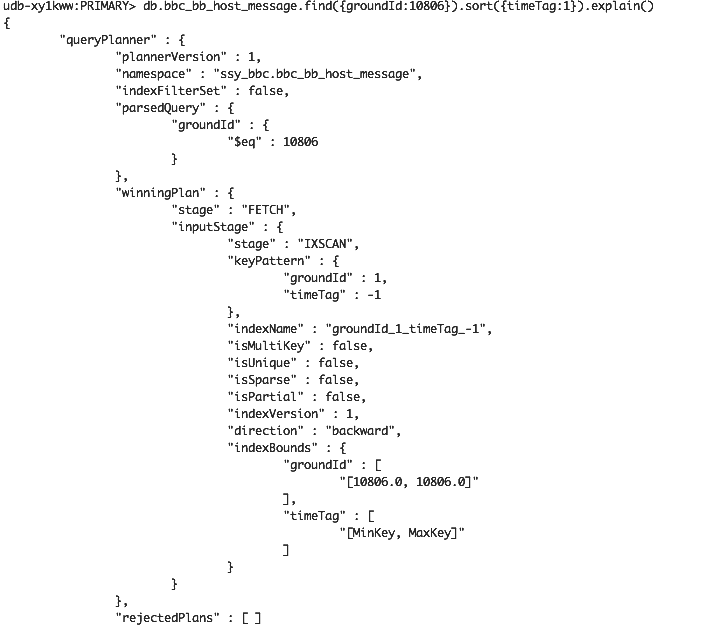
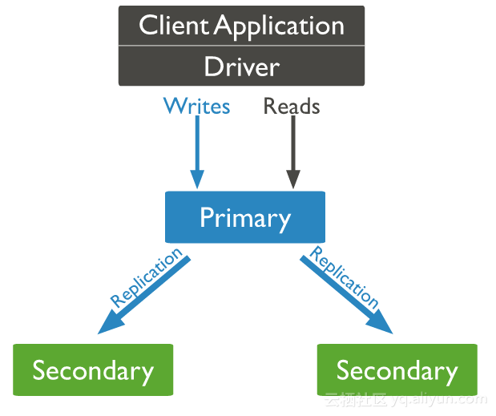
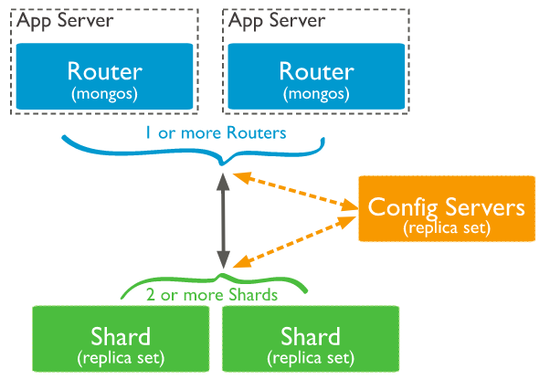
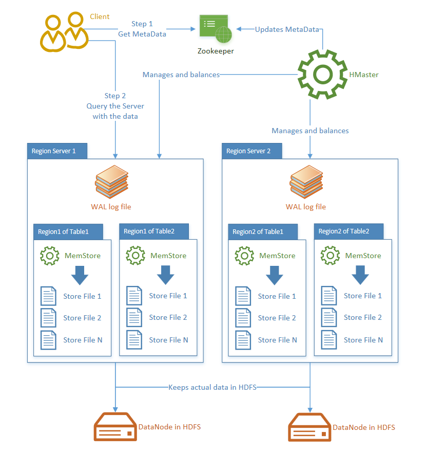

# 5.2 非关系型数据库

上一节讲了关系型数据库，事实上很多业务中的数据表并不要求ACID和事务，可以考虑使用NoSQL数据库，这样能够彻底解决水平扩展问题。

非关系型数据库是相对关系型数据库来讲的，又称为NoSQL数据库，也可以叫做Not Only SQL数据库。相比起传统的SQL关系型数据库，其最大的特点就是适合存储非结构化或半结构化的数据，适合存储大规模数据。以键值对存储，且结构不固定，每一个元组可以有不一样的字段，每个元组可以根据需要增加一些自己的键值对，这样就不会局限于固定的结构，可以减少一些时间和空间的开销。但是，其没有关系型数据库那种严格的数据模式，并不适合复杂的查询以及需要强事务管理(如交易)的业务,主要用来做数据分析、ETL、报表、数据挖掘、推荐、日志处理等非交易场景。

常用的NoSQL数据库主要有以下几种：

- KV数据库：主要以(key,value)键值对存储数据的数据库。以Redis、SSDB为代表。
- 文档数据库：总体形式上也是键值对的形式，但是值里面又可以有各种数据结构：数组、键值对、字符串等等。以MongoDB、CouchDB为代表。
- 稀疏大数据库（列数据库）：也叫作稀疏大数据库，一般是用来存储海量数据的。相对于行数据库，这种数据库是以列为单位存储数据在介质上的。以HBase、Cassendra为代表。

还有诸如图数据库、对象数据库、XML数据库都属于NoSQL数据库。

此外，这里需要提到CAP这个理论，它的核心在于一个分布式系统不可能同时满足以下三点，最多能够较好地同时满足两个：

- Consistency：一致性。所有节点在同一时间（不是严格的同一时间）具有相同的数据。对指定的客户端来说，读操作保证能够返回最新的写操作结果。
- Available：可用性。每次请求都能在期望时间内获取到正确的响应，但不保证获取的数据为最新数据，可以允许数据不一致。
- Partition tolerance：分区容错性。系统中网络分区现象（丢包、拥塞、连接中断）的发生不会影响系统的继续正常运作。

上述阐述是我在参考了Brewer于2000年以及Lynch于2002年对CAP的定义和声明后自己的一个理解。简单来说其实就是在发生分区的情况下，C和A只能满足一个。而NoSQL这种分布式数据库，肯定是有分区的，因此主要看是满足C，还是满足A。

根据CAP理论，可以将数据库分为三类：

- CA：传统关系型数据库的单点模式，满足数据的一致性和高可用性，但没有可扩展性。
- CP: MongoDB、HBase，满足数据的一致性和分区性，通常性能不是特别高，发生网络分区时，通常会禁止写或仅允许写部分节点。
- AP: Cassendra，具有较好的性能和可扩展性，但各节点的之间数据同步比较慢，能保证数据的最终一致性。

此外，基于CAP理论，为了获得可扩展性和高可用性，BASE原则（AP方案的延伸）提出了对NoSQL数据库的可用性及一致性的弱要求：

1. Basically Availble： 基本可用，允许系统暂时不一致。
2. Soft state： 软状态/柔性事务,可以理解为"无连接"的，暂时允许一些不准确的地方和数据的变换。
3. Eventual Consistency： 最终一致性，当所有服务逻辑执行完成后，系统最后将回到一个一致的状态。

可以看出,和ACID关注数据完整性和一致性相比，BASE的首要目标是可用性，保证在短时间内，即使有不同步的风险，也要允许新数据能够被存储。

## 5.2.1 KV数据库

KV数据库是主要以(key,value)键值对存储数据的数据库，可以通过key快速查询到其value，包括Redis和SSDB。

1. Redis

    Redis开始是作为缓存使用的，但是由于其具有持久化的特性，因此很多时候被用作数据库。由于其主要的特性是缓存，因此本节不做讲述。

1. SSDB

    对于SSDB，需要先提到LevelDB。LevelDB是来自Google的一个快速、轻量级的KV存储类库，能够实现持久化的存储。它是一个嵌入式的数据库，没有分布式支持、没有schemal也不支持事务，仅仅是一些有序的key到value的映射，在使用SSD硬盘做为存储介质的情况下能发挥最大优势。其使用了LSM（Log Structure Merge Tree）作为底层数据存储结构,每次更新会记录提交Log，并提交到In-Memory Table中。之后Memory的数据落地是延迟的，并采用的一定的策略定期将磁盘中的数据进行compact。是针对写进行优化的一种存储设计。
    
    SSDB是LevelDB的Redis兼容协议封装（使用LevelDB作为存储引擎），并且实现了主从同步和持久化的队列服务，支持Redis客户端。目前支持key-string、key-set以及key-hashmap三种数据结构，可以作为Redis之外的另一种选择。由于其是基于文件存储系统的，因此其支持的容量可以很大，但也受限于文件存储，性能上相比Redis还是有一定的差距，且由于要进行compact，CPU的使用率有时候会很高。如果用SSD硬盘作为存储设备的话性能则会更加接近Redis。
    
   此外，还需要提到的是RocksDB，这个数据库存储引擎来自于Facebook，是基于LevelDB存储引擎构建的一个可嵌入式的支持持久化的key-value存储系统，也可作为 C/S 模式下的存储数据库，但主要目的还是嵌入式。其主要针对闪存做了低延迟优化，并提供了随CPU数目进行线性扩展的能力。360开源的类似SSDB的Pika即为在RocksDB上的Redis兼容协议封装数据库。

## 5.2.2 文档数据库

文档数据库总体形式上也是键值对的形式，但是值里面又可以有各种数据结构：数组、键值对、字符串等等，可以认为是JSON格式的数据存储，因此能够对任意字段建立索引，实现关系数据库的某些功能。目前Java中最常用的文档数据库是MongoDB，因此这里主要针对MongoDB讲述, MongoDB版本为3.2.7。

MongoDB是一个分布式文件存储的数据库，是非关系型数据库中最像关系型数据库的。其具有以下特点：

- 灵活模式: 数据以JSON格式存储
- 高可用性：复制集保证高可用
- 可扩展性: 通过Sharded cluster保证可扩展性

### 关键概念

1. 数据库（Database）
    
    对应于MySQL的Database。

1. 集合（Collection）

    对应于MySQL的Table，存在于数据库中，没有固定的结构，可以插入不同格式和类型的数据。

1. 文档（Document）

    对应于MySQL的Row，是一组键值对（BSON）。不需要设置相同的字段，并且相同的字段不需要相同的数据类型。集合由文档构成。

1. 域（Field）

    对应于MySQL的Column。

1. 主键（Primary Key）

    和MySQL相同，MongoDB会自动将_id字段设置为主键。
    
### 存储引擎

一开始MongoDB仅仅支持MMAP存储引擎，到了目前的MongoDB 3.2已经支持多存储引擎。

1. MMAPv1
    
    这是MongoDB最开始的存储引擎，也是3.2版本之前的默认存储引擎。就是比较简单的内存映射文件，支持集合级别的并发控制，不支持压缩。

1. WiredTiger 

    这是MongoDB 3.0引入的新的存储引擎，支持MongoDB的所有特性，是3.2版本的默认存储引擎。提供文档级别（Document-Level）的并发控制、检查点（CheckPoint）、数据压缩和本地数据加密（ Native Encryption）等功能。
    
1. In-Memory

    In-Memory存储引擎用于将数据只存储在内存中，只将少量的元数据和诊断日志（Diagnostic）存储到硬盘文件中，由于不需要Disk的IO操作就能获取所需的数据，In-Memory存储引擎大幅度降低了数据查询的延迟（Latency）；其支持文档级别的并发控制。此存储引擎是MongoDB企业版本的特性，且只能用在MongoDB 64位版本上。
    
综上，如果你使用的版本支持WiredTiger，那就使用WiredTiger。
    
可以通过mongod参数指定存储引擎。

```
mongod --storageEngine  wiredTiger | inMemory
```

### 索引

MongoDB的索引数据结构也是B树，和之前讲过的MySQL索引基本一致。不过这里需要注意的是由于其底层采用的是内存映射文件，因此其是一种非聚集索引，虽然MongoDB本身并没有这种定义。

MongoDB也提供了explain工具来查看查询的执行计划。



其中的winnningPlan就是将要使用的执行计划。这里和索引相关的字段如下：

- indexName: 出现此字段则表明命中了索引。
- indexBounds: 描述了使用索引的情况，给出了索引的遍历范围。

MongoDB从2.4版本开始支持全文索引：

```
db.user_note.createIndex({title:"text"})

db.user_note.find({$title:{$search:"basketball"}})
```

此外，对比关系型数据库，MongoDB还可以对数组元素和子文档字段做索引。

```
{
  uid:xx,
  name:'xx',
  tags:['xx','xx','xx'],
  address:[
    {
        "province": "xx",
        "city":"xx"
    },
    {
        "province": "xx",
        "city":"xx"
    }
  ]
}
```

以上面的集合ssy_user为例。

- db.ssy_user.ensureIndex({"tags":1})即可对数组tags做索引,称为多键索引。执行db.ssy_user.find({"tags":"xx"})查询即可命中此索引。其本质上是为数组中的所有值都建立了单独的索引。需要注意的是，在数组上建立索引的代价比较大，慎用。
- db.ssy_user.ensureIndex({"address.province":1}即对子文档的address字段做了索引。此种方式支持任意深度的索引。需要注意的是这个和子文档上建立的索引效果是不同的。db.ssy_user.ensureIndex({"address":1}只会在完全匹配子文档的查询（包括字段顺序）才会起作用。而字段上的索引只有在查询相应的字段时才起作用。

还需要注意的是对于复合索引来说，最多可以包含一个数组字段。

### TTL

MongoDB 2.2版本后引入了TTL集合，即支持对集合进行失效时间设置。当超过指定时间后，集合会自动清除超时的文档，在保存一些诸如Session会话信息和存储缓存数据的时候非常有用。

```
db.user_login_log.ensureIndex({"create_time": 1},{expireAfterSeconds: 300})
```

以上即表示已create_time为标准，300秒后删除相应的文档。

### 固定集合

MongoDB中的Capped Collections是具有固定大小的集合，其吞吐性能较出色。固定集合其实就是类似于一个环，当空间用完，那么就从头开始存储。

```
db.createCollection("cappedLogCollection",{capped:true,size:10000,max:1000})
```

上面则创建了一个固定集合，其最大占用空间为10000bytes，最大存储文档数目为1000。size优先级高于max。

可以将普通集合转换为一个固定集合：

```
db.runCommand({"convertToCapped":"user_note",size:10000})
```

固定集合和普通集合的一个区别是其文档是按照插入顺序存储的，默认情况下的查询也是按照插入顺序返回的。可以通过$natural调整顺序。此外，固定集合是不予允许删除文档的，只能通过drop删除所有文档。

```
db.cappedCollection.find().sort( { $natural: -1 } )
```

上面即以插入倒序返回文档。

固定文档一般用于存储日志信息、缓存等。

### 自增ID

MongoDB没有类似MySQL一样的自增id功能。其_id默认就是ObjectId, 是自动生成的12字节唯一标识。如果想要使用自增ID, 那么需要通过编程实现。思路如下：

1. 创建一个计数器集合,如 mongo_ids。具有两列：collectionName和seqId。
2. 使用query:{ collectionName: 'user_note'},update: {$inc:{seqId:1}},进行db.mongo_ids.findAndModify获取自增Id。

    ```
    db.mongo_ids.findAndModify(
    {
       query:{collectionName: 'user_note' },
       update: {$inc:{seqId:1}},
       new:true
    });
    ```

### 聚合操作

MongoDB中的聚合使用aggregate()，用于处理数据（诸如统计平均值,求和等），并返回计算后的数据结果。类似SQL语句中的count(*)。

user_note集合如下：

```
{
    _id：xxxx，
    createUser: xxx, 
    status: xx   
    ...
}
```

下面即可计算每个用户的笔记数目：

```
db.user_note.aggregate
(
    [
        {$group : 
            {
                _id : "$createUser", 
                num_tutorial : {$sum : 1}
            }
        }
    ]
)
```

除了sum，MongoDB还支持avg、min、max等聚合表达式。

使用aggregate()进行聚合操作，查询速度较快。但MongoDB不允许单个聚合操作占用过多的系统内存（阈值为20%），如果超过限制，那么则会直接终止操作。此外，聚合操作返回的结果集必须小于16MB。

辅助aggregate()的还有管道，即将上一文档的处理输出到下一个管道。常用的管道操作符如下：

- $project：修改输入文档的结构。可以用来重命名、增加或删除域，也可以用于创建计算结果以及嵌套文档。
- $match：用于过滤数据，只输出符合条件的文档。$match使用MongoDB的标准查询操作。
- $limit：用来限制MongoDB聚合管道返回的文档数。
- $skip：在聚合管道中跳过指定数量的文档，并返回余下的文档。
- $sort：将输入文档排序后输出。
- $group：将集合中的文档分组，可用于统计结果。

除了普通的聚合之外，MongoDB还提供了MapReduce来做聚合操作。MapReduce简单的说就是将大批量的工作（数据）分解（Map）执行，然后再将结果合并成最终结果（Reduce）。能够在多台Server上并行执行，可以非常灵活地计算复杂的聚合逻辑。但是其非常慢，适用于离线大规模数据分析。

```
db.user_note.mapReduce( 
   function() { emit(this.createUser,1); }, 
    function(key, values) {return Array.sum(values)}, 
      {  
         query:{status:"normal"},  
         out:"note_total" 
      }
).find()
```

以上即可查询每个用户有多少状态为normal的记事。其中：

- Map函数必须调用 emit(key, value) 返回键值对。
- Reduce函数将key-values变成key-value，也就是把values数组变成一个单一的值value。

### 安全写入

上面提到MongoDB是CP特性，牺牲了可用性。但其实通过安全写入机制，配置合适的WriteConcern是可以得到一定的可用性的。

MongoDB中一个写入操作的流程如下：

1. 数据首先写入到MongoDB缓存中。
2. 缓存定时异步刷写到Journal日志文件中, 这里Journal是MongoDB的预写日志，相当于MySQL的redo log。
3. Journal定时异步刷写到MongoDB的数据文件中。
4. 如果是插入操作或更新操作中包含索引列，同时会维护索引结构。
5. 如果是副本集，数据还会写到oplog定容集合(Capped Collections)中，这里的oplog相当于MySQL的binlog，用于从节点同步数据。

WriteConcern这个参数描述了MongoDB在返回一个写操作成功前应该提供的保证，即在执行到何种程度的时候，MongoDB可以认为写操作成功并返回响应给客户端。越严格的安全写级别，也意味着要在执行更多步骤后才返回客户端响应，也就意味着更长的响应时间。安全写级别主要包括两个选项：w和j，其中w指返回前需要确认的次数（w=1表示只需要主节点确认，w=2表示主节点和至少一个从节点确认，w=majority表示当数据写入到replica set的大多数节点之后向客户端返回，j=1表示需要成功写到journal文件）

一般来说，使用默认的设置w=1、j=0即可，即主节点确认收到写请求即返回。这样就能牺牲一定的数据一致性来得到一定的可用性。

因此，要确保写入正确，至少使用WriterConcern.ACKNOWLEDGED；对于不重要的数据，则可以使WriteConcern.UNACKNOWLEDGED省去等待网络的时间。

此外，对于读的可用性，则主要与ReadPreference配置有关:

- primary：默认模式，一切读操作都路由到replica set的primary节点
- primaryPreferred：正常情况下都是路由到primary节点，只有当primary节点不可用（failover）的时候，才路由到secondary节点。
- secondary：一切读操作都路由到replica set的secondary节点
- secondaryPreferred：正常情况下都是路由到secondary节点，只有当secondary节点不可用的时候，才路由到primary节点。
- nearest：从延时最小的节点读取数据，不管是primary还是secondary。对于分布式应用且MongoDB是多数据中心部署，nearest能保证最好的data locality。

默认的，ReadPreference为primary，是强一致性的。设置ReadPreference为secondary那么可以保证可用性，但无法保证一致性（除非WriteConcern的w为secondary总数）。

可知，CP的划分对于MongoDB其实并非那么准确，在使用的时候根据配置的不同能够得到不同的特性。

### 高可用

MongoDB支持主从模式，在主服务器上开启mongod进程时加入参数--master，在从服务器上开启mongod进程时加入--slave和--source指定主服务器即可，这样在主数据库更新时，数据被复制到从数据库中。下面以在单台机器开启两个节点做主从为例。

```
$ cd /data && mkdir mongodata_master mongodata_slave

$ ./mongodb/bin/mongod  --port  27017 --dbpath /data/mongodata_master  --master  &

$ ./mongodb/bin/mongod  --port  27018 --dbpath /data/mongodata_slave  --slave  --source   localhost:27017  &
```

此外，MongoDB还支持主主配置,可以实现数据的双向同步，但是在大部分情况下官方不推荐使用。主主模式下，两个节点都可以写数据。

```
$cd /data && mkdir mongodata_27050 mongodata__27051

$ ./mongodb/bin/mongod --port 27050 --dbpath /data/mongodata_27050 --master --slave --source localhost:27051 > /dev/null &

$ ./mongodb/bin/mongod --port 27051 --dbpath /data/mongodata_27051 --master --slave --source localhost:27050 > /dev/null &
```

这里需要注意的是，主从模式只是简单的一种高可用部署，当主节点或者一个从节点挂掉时，仍然需要人工干预才能恢复系统的运行。与之相比，官方更加推荐使用复制集的集群模式。

复制集与主从相比，多了心跳监测，当主节点挂点，会在集群内发起主节点的选举机制，自动选举一位新的主服务器。使用也比较简单，只需要把--master和--slave、--source参数去掉换成--replSet参数并指定复制集名称即可。如下：

```
./mongodb/bin/mongod  --port  27017 --dbpath /data/mongodata_master  --replSet testReplset
```

此外，由于复制集的选举机制，必须保证成员数目为奇数。如果是偶数的话，主节点宕机就会导致其他节点变为只读。也可以使用一个仲裁节点（Arbiter），也是一个复制集的成员，但并不存储用户数据。

### 复制集（Replica Set）

MongoDB复制集由一组mongod实例（进程）组成，包含一个Primary节点、多个Secondary节点以及可选择的Arbiter节点（用于仲裁）。总体结构图如下所示：


    
MongoDB Driver（客户端）的所有数据都写入Primary，Secondary从Primary同步写入的数据，以保持复制集内所有成员存储相同的数据集，提供数据的高可用。这类似于MySQL中的一主多从配置。其中，一个复制集节点一般会经历STARTUP（加入复制集）、STARTUP2（初始同步中）、PRIMARY/SECONDARY/ARBITER（主节点/从节点/仲裁节点）。其他的UNKNOWN表示节点从未与复制集有过通信，DOWN表示节点与复制集失去了连接，REMOVED表示曾经是复制集的一员。
    
需要注意的是，MongoDB默认是开启链式复制的，即在ping过程中是有可能选择就近的从节点作为同步源的。能够作为同步源的节点必须为正常状态、数据比当前节点新且数据和主节点差距不大（通过oplog时间戳判断）。
    
复制集保证了MongoDB的高可用性。官方推荐在读密集应用中，如果无法承载大量的并发请求，可以通过增加复制集的规模，分发读请求到secondary成员上提高应用性能。但需要注意的是，复制集规模再大也无法让读变得更快，只能使得总体的QPS变高。如果想要提升读的性能，则需要分片。
    
需要注意的是当使用复制集时，如果有新的从节点加入、从节点同步数据失败、从节点无法追上主节点oplog或者主动触发(resync命令)时，那么需要进行初始同步（查询所有源数据库的所有集合的数据将其插入到自己的集合副本中并建立_id索引），其耗时取决于数据库的数据量和两个节点之间的网络状况，同步过程会影响其他节点，也会增加主节点的网络IO负载。官方建议的方式是通过从其他节点物理复制数据(数据文件必须能够追上主节点oplog)再加入集群来减少影响。

此外，这里需要注意oplog集合的大小应根据DB规模及应用写入需求合理配置。配置得太大，会造成存储空间的浪费；配置得太小，可能造成Secondary的init sync一直无法成功（oplog为固定集合，在Primary写入太快的情况下有可能不足以存储所有从节点还未同步的oplog）。

### 分片集（Sharded cluster）

即MongoDB的分布式特性，通过分片来构成分布式集群。由三个组件构成：
    
- shard: 数据结点，每一个数据结点存储一部分分片数据，每个shard都可以做复制集。
- mongos：路由结点，做为客户端和分片集群间的查询路由。
- config servers：配置结点，存储了集群的元数据和配置信息。

来自官网的总体结构图如下所示：


    
主要支持2种数据分布策略：
    
- 范围分片（Range based sharding）: 能很好的满足范围查询的需求,但如果shardkey有明显递增（或者递减）趋势，则新插入的文档多会分布到同一个chunk，无法扩展写的能力。
- Hash分片（Hash based sharding）：根据用户的shard key计算hash值（64bit整型），根据hash值按照范围分片的策略将文档分布到不同的chunk。与范围分片互补，能将文档随机的分散到各个chunk，充分的扩展写能力，弥补了范围分片的不足，但不能高效地服务范围查询，所有的范围查询要分发到后端所有的Shard才能找出满足条件的文档。 
    
Sharded cluster保证了MongoDB的可扩展性。官方推荐，在写密集型应用中，如果无法承载大量的并发请求，可通过部署Sharded cluster，增加shard数目来提高应用性能。当然，由于分片集很复杂，一开始可以先使用复制集，等业务增长到单个复制集无法支撑其数据存储量或者吞吐负载时再考虑部署分片集。

### GridFS

GridFS是MongoDB中的一个内置功能，用于存储和获取超过16M（BSON文件限制）的文件，将其存储在集合中，是文件存储的一种。

GridFS会将文件分割为小的文件片段（默认为255kb,最后一个片段除外）, 每一个片段存储为一个单独的文档。

GridFS使用两个集合存储一个文件：fs.file用来存储文件元信息（filename,content_type,还有用户自定义的属性）；fs.chunks用来存储文件存储片段。GridFS同时也会给这两个集合创建索引以提高读写性能。

```
./mongofiles -d gridfs put test.dat

//fs.files
{
   "filename": "test.dat",
   "chunkSize": NumberInt(211120),
   "uploadDate": ISODate("2017-05-01T11:32:33.557Z"),
   "md5": "7b762939321e146569b07f72c62cca4f",
   "length": NumberInt(646)
}

//fs.chunks
{
   "files_id": ObjectId("334a7asdad19f54bfec8a2fe44b"),
   "n": NumberInt(0),
   "data": "Mongo Binary Data"
}
```

此外，在某些场景下，把文件存储在GridFS中要比直接存储在系统的文件系统里性能要更好，如下：

- GridFS对目录下的文件数目没有限制，可以避开一些文件系统的限制，存放大量小文件。
- GirdFS可以仅仅读取文件的部分信息，这样当读取大文件时就不需要把这个文件都加载到内存中。
- GirdFS可以自动对文件做分布式管理。

### 使用提示

对MongoDB本身的使用需要注意：

- 建议开启Journaling功能，特别是对于可用性要求较高的用户。
- MongoDB只支持单一文档的原子性。
- MongoDB默认情况下是没有认证功能的，可以采取防火墙的方式进行保护，也可以进行相关的安全认证配置。
- 生产环境开启profiling功能，以监测慢请求。
- MongoDB对内存的要求比较高，生产环境中MongoDB所在的主机应该配置尽量大的内存。
- 通常MongoDB单点支持的最大并发连接数上限为20000（可修改）。因此有一种说法是，千万以下选择MySQL，千万以上选择MongoDB，亿级以上选择Hadoop。

使用MongoDB进行数据操作需要注意：

- MongoDB默认情况下是区分大小写的。
- 确保输入正确的数据类型，输入错误数据类型不会出现提示。
- MongoDB的更新在默认情况下会使用类似于传统数据库的LIMIT语句，即LIMIT 1。如果想要一次更新许多文档，需要把multi设为true。
- MongoDB的翻页效率比较低。使用find().skip().limit()的方式，务必要使用索引，否则导致全表扫描几百万数据几乎不可用。
- 不要使用负向查询$nin, $not,不会命中索引。
- 查询条件不要使用算数运算符，如$mod,不会使用索引
- MongoDB中存储的文档必须有一个"_id"键，不指定值时，默认是个ObjectId对象。
- 和MySQL一样，要减少不必要的或重复的索引，以避免更新或插入时对索引的维护开销。
- 使用写入文档数组或者Bulk Write进行批量写，减少网络请求次数。
- 作为主键的_id值应该避免使用随机值（md5、uuid等），而应该使用自增值（比如默认的ObjectId）。
- 使用内嵌数组时需要注意数组不能过大，否则对其查询、修改都会带来CPU的大量消耗。如果有过大的可能（即使是只有几个文档），合理的设计是使用传统关系型数据库的设计，将数组拆分成多个文档。

MongoDB的常用命令可见附录D。

此外，Java中可以使用Spring Data MongoDB对MongoDB进行数据操作，在4.2.3中已经做过讲述。

## 5.2.3 列数据库

与传统的行数据库相比，列数据库的特点就在其是以列为存储单位的，以此方便存储结构化和半结构化数据和做数据压缩，对针对某一列或者某几列的查询有非常大的IO优势。HBase是最常用的列数据库之一。

HBase是一个分布式的、面向列的开源数据库，该技术来源于Google论文“Bigtable：一个结构化数据的分布式存储系统”。BigTable是基于GFS的，HBase是基于HDFS的，是Hadoop生态的核心组件之一。它存储数据行在一个表里，一个数据行拥有一个可选择的键和任意数量的列。表是疏松的存储的，因此用户可以给行定义各种不同的列。主要用于需要随机访问，实时读写大数据。

这里需要注意的是，HBase是面向OLAP的一种数据库，受限于底层的数据结构，如果不做二次优化，一般是不推荐用于面向用户的业务应用的。

概括来看，HBase适用于以下存储场景：

1. 半结构化或非结构化数据
    
    对于数据结构字段不够确定或杂乱无章很难按一个概念去进行抽取的数据适合用HBase。当业务发展需要增加存储比如一个用户的email、address信息时，RDBMS需要停机维护，而HBase支持动态增加.
    
1. 记录非常稀疏

    RDBMS的行有多少列是固定的，为null的列浪费了存储空间。HBase为null的Column不会被存储，这样既节省了空间又提高了读性能。
    
1. 多版本数据

    根据Row key和Column key定位到的Value可以有任意数量的版本值，因此对于需要存储变动历史记录的数据，用HBase就非常方便。
    
1. 超大数据量

    当数据量越来越大，RDBMS数据库无法支撑，就出现读写分离和各种分库分表策略，会带来业务复杂度的增加、无法join等问题。采用HBase只需要加机器即可，HBase会自动水平切分扩展，跟Hadoop的无缝集成保障了其数据可靠性（HDFS）和海量数据分析的高性能（MapReduce）。
    
### 关键概念

1. Row key

    行主键， HBase不支持条件查询和Order by等查询，读取记录只能按Row key（及其range）或全表扫描，因此Row key需要根据业务来设计以利用其存储排序特性（Table按Row key字典序排序如1,10,100,11,2）提高性能。 
    
2. Column Family

    列族，在表创建时声明，每个Column Family为一个存储单元。
    
3. Column

    列，HBase的每个列都属于一个列族，以列族名为前缀，如列user:name和user:city属于user列族，note:title和note:type属于note列族。

    Column可以动态新增，同一Column Family的Columns会聚簇在一个存储单元上，并依Column key排序，因此设计时应将具有相同I/O特性的Column设计在一个Column Family上以提高性能。 

4. Timestamp

    HBase通过row和column确定一份数据，这份数据的值可能有多个版本，不同版本的值按照时间倒序排序，即最新的数据排在最前面，查询时默认返回最新版本。Timestamp默认为系统当前时间（精确到毫秒），也可以在写入数据时指定该值。
    
5. Value

    每个值通过4个键唯一索引：tableName + RowKey + ColumnKey + Timestamp => value。
    
6. 存储类型

    - TableName是字符串
    - RowKey和ColumnName是二进制值（Java 类型 byte[]）
    - Timestamp是一个64位整数（Java 类型 long）
    - value是一个字节数组（Java类型 byte[]）。

HBase一个HTable的存储结构如下所示：

```
SortedMap{
    RowKey, List()
        SortedMap(
            Column, List(
                Value, Timestamp
            )
        )
    )
}
```

即HTable按Row key自动排序，每个Row包含任意数量个Columns，Columns之间按Column key自动排序，每个Column包含任意数量个Value。

### 关键实现

HBase有几个本身架构设计的组件需要了解：

- Zookeeper群：HBase集群中不可缺少的重要部分，主要用于存储Master地址、协调Master和RegionServer等上下线、存储临时数据等等。
- Master群：Master主要是做一些管理操作，如：region的分配，手动管理操作下发等等，一般数据的读写操作并不需要经过Master集群，所以Master一般不需要很高的配置即可。
- RegionServer群：RegionServer群是真正数据存储的地方，每个RegionServer由若干个region组成，而一个region维护了一定区间rowkey值的数据。简称RS。
- HLog: 是HBase实现WAL方式产生的日志信息，其内部是一个简单的顺序日志，每个RS上的region都共享一个HLog，所有对于该RS上的region数据写入都被记录到该HLog中。以备在RS出现意外崩溃的时候，可以尽量多的恢复数据。
- MemStore: 可以看做是HBase的内部缓存，每次数据写入完成HLog后，都会写入对应regison的MemStore。**数据结构使用的是基于数组实现的跳跃表。**
- HFile: HBase的数据底层存储。每次数据从MemStore中flush，最终都会形成一个HFile。**数据结构使用的是针对磁盘顺序读写优化过的类B+树。**

基于以上几个集群，先看一下如何定位RegionServer，这里牵扯到两个特殊的表：Meta和Root, 用于存储数据库的元信息。

- Meta表中记录了Rowkey是在哪个Region的范围以及各个Region是在哪个RegionServer上等待信息，是查询HBase时首先要访问的表。其rowkey设计为：region所在的表名 + region的StartKey + 时间戳，三者的MD5值是HBase在HDFS上存储的region的名字。此外，当Region被拆分、合并或者重新分配的时候，都需要来修改这张表的内容。
- Root表: 记录了Meta表的Region信息, Root表只有一个region，其位置信息记录在Zookeeper中

一个Region的定位过程如下所示：

1. 读取ZooKeeper中Root表的位置信息。
1. 通过Root表获取META表的位置。
1. 读取.META表中用户表的位置。
1. 读取数据。

如果已经读取过一次，则Root表和Meta都会缓存到本地，直接去用户表的位置读取数据。

定位到RS之后，就可以进行数据写入和读取。

数据的写入首先要写HLog以实现WAL，写完HLog之后，按照rowkey的值排序写入MemStore，即成功返回。存储的数据是LSM的数据结构，需要不定期的进行compact以减少文件碎片数，提高性能。这里需要注意的是，Hlog在数据flush到磁盘成为HFile后，会被移动到.oldlogs这个目录下，会有一个HLog监控线程监控该目录下的HLog，根据设置删除过期的HLog，以防Hlog浪费存储空间。此外，HBase基于的文件系统HDFS是append only的，因此数据的删除和过期一开始只是被标记为删除，在compact时才真正的删除。总体过程如下图所示：



另外一点需要注意的是，在数据flush的时候，对应region上的访问都是被拒绝的，因此控制flush的时机是非常重要的。主要有以下几种方式会触发flush:

- 通过全局内存控制，触发MemStore刷盘操作。通过参数hbase.regionserver.global.memstore.upperLimit进行设置，内存下降到hbase.regionserver.global.memstore.lowerLimit配置的值后，即停止MemStore的刷盘操作。
- HBase提供API接口，运行通过外部调用进行MemStore的刷盘
- 前面提到MemStore的大小通过hbase.hregion.memstore.flush.size进行设置，当region中MemStore的数据量达到该值时，会自动触发MemStore的刷盘操作。
- WAL达到阈值，会引起MemStore的flush。WAL的最大值由hbase.regionserver.maxlogs * hbase.regionserver.hlog.blocksize（2GB by default）决定.

还需要注意的是，一个列族达到阈值触发flush的时候，也会导致其他的列族flush，因此列族的数量越少越好。

相比起数据的写入，数据的读取相对来说比较简单：HBase首先检查请求的数据是否在MemStore，不在的话就到HFile中查找（先利用布隆过滤器过滤掉一部分无效查询），最终返回merged的一个结果给用户。

### 使用提示

- HBase一个表中同一列族的数据存储在一起，因此其本质是面向列族的存储。如果只有一个列族，那么就成了和MySQL一样的行式存储。
- RowKey的设计越短越好，尽量不要超过16个字节。
- 避免使用时序或者单调（递增/递减）行键，否则会导致连续到来的数据会被分配到同一region中，可以采取在rowKey前面添加md5散列值的方式。
- 列族的数量越少越好，否则会造成在数据查询的时候读取更多的文件，消耗更多的I/O。
- 同一个表中不同列族所存储的记录数量的差别（列族的势）会造成记录数量少的列族的数据分散在多个region上，影响查询效率。
- 尽量最小化行键和列族的大小，避免HBase的索引过大，加重系统存储的负担。
- HColumnDescriptor设置版本的数量，避免设置过大，版本保留过多。
- 列族可以通过设置ttl,来实现过期失效。
- 为避免热点数据产生和后续文件split影响业务使用，一般采用hash + partition的方式预分配region，首先使用md5 hash，然后再按照首字母partition为32份，就可以预分配32个region。
- region的数量选择可以参考此公式：一个RS的内存消耗 = memstore大小 * region数量 * 列簇数量。
- HBase支持多种形式的数据压缩：GZip、LZO、Snappy等。其中Snappy的压缩率最低，但是编解码速率最高，对CPU的消耗也最小，一般使用Snappy即可。
- 对于有随机读的业务，建议开启Row类型的过滤器，使用空间换时间，提高随机读性能。
- 避免全表扫描HBase数据。
- 在存储列表时，HBase有两种典型的用法，一种是高表模式，与传统的Mysql模式非常类似，列表中的每一项存一行，每一行有固定的属性列；另一种是宽表模式，一个列表存一行，列表中的每一项存成一个单独的列，各种属性都打包到列内部的value中。


