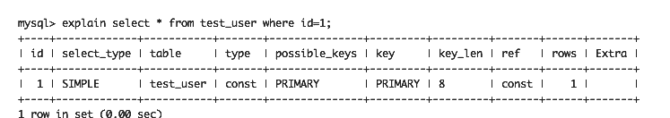
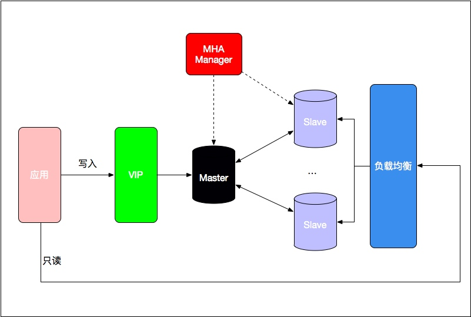

# 5.1 关系型数据库

关系型数据库是采用关系模型来组织数据的数据库。所谓关系模型指的就是二维表格模型，而一个关系型数据库就是由二维表及其之间的联系所组成的一个数据组。目前，用的最为普遍的有MySQL、Oracle、PostgreSQL等。这里针对Java开发中最常用的MySQL进行阐述。MySQL版本为5.5.19。

## 5.1.1 存储引擎

MySQL主要有两种存储引擎：MyISAM和InnoDB。

1. MyISAM

    MySQL 5.5之前的默认引擎，特点是：
    
    - 不支持行锁，读取时对需要读到的所有表加锁，写入时则对表加排它锁。
    - 不支持事务
    - 不支持外键
    - 不支持崩溃后的安全恢复
    - 在表有读取查询的同时，支持往表中插入新纪录
    - 支持BLOB和TEXT的前500个字符索引，支持全文索引
    - 持延迟更新索引，极大提升写入性能
    - 对于不会进行修改的表，支持压缩表，极大减少磁盘空间占用

1. InnoDB 

    MySQL 5.5后的默认引擎，特点是：

    - 支持行锁，采用MVCC来支持高并发，有可能死锁
    - 支持事务
    - 支持外键
    - 支持崩溃后的安全恢复
    - 不支持全文索引

由于MyISAM缓存有表meta-data（行数等）在做COUNT(\*)时对于一个结构很好的查询是不需要消耗多少资源的。而对于InnoDB来说，就没有这种缓存。而当你需要行锁定、事务时，使用InnoDB则是更好的选择, 也具有更高级的安全性。此外，MyISAM和InnoDB使用的索引也是有区别的，前者为非聚簇索引，后者为聚簇索引。

总体来说，MyISAM适合读密集型的表，而InnoDB适合写密集型的表。经常在数据库做主从分离的情况下，选择MyISAM引擎做为从库的存储引擎。不过，MySQL发展到现在，MyISAM引擎基本已经停滞维护了，因此使用MySQL的时候，InnoDB是存储引擎的第一选择。

## 5.1.2 字符集和校对规则

在创建数据库、数据表的时候会指定character和collate。如下：

```
CRREATE DATABASE db_name DEFAULT CHARSET SET utf8 COLLATE utf8_general_ci;

CREATE TABLE `note` (
  `id` bigint(11) unsigned NOT NULL AUTO_INCREMENT,
  `content` varchar(128) CHARSET utf8 COLLATE utf8_bin NOT NULL COMMENT '内容', //对某一个字段设置字符集和校对规则
  PRIMARY KEY (`id`)
) ENGINE=InnoDB AUTO_INCREMENT=9 DEFAULT CHARSET=utf8 COLLATE=utf8_general_ci;
```

字符集指的是一种从二进制编码到某类字符符号的映射。校对规则则是指某种字符集下的排序规则。MySQL中每一种字符集都会对应一系列的校对规则。

MySQL采用类似继承的方式来设定字符集默认值，每个数据库以及每张数据表都有自己的默认值，它们逐层继承，最终最靠底层的默认设置将影响你创建的对象。比如，创建数据库时，将根据服务器上的character_set_server来设置数据库的默认字符集，同样的道理，根据database的字符集来指定库中所有表的字符集。不管是对数据库，还是表和列，只有当它们没有显式指定字符集时，默认字符集才会起作用。

MySQL提供了很多字符集供使用，应该根据存储的内容选择能满足需求的最小的字符集。如果存储的内容是英文字符等拉丁语系字符的话，那么使用默认的latin1编码即可；如果需要存储汉字、俄文、阿拉伯语等非拉丁语系字符，则建议使用UTF8字符集。而校对规则一般来说只需要考虑是否以大小写敏感的方式比较字符串或者是否用字符串编码的二进制来比较大小，其对应的校对规则的后缀分别是_cs、_ci和_bin。大小写敏感和二进制校对规则的不同之处在于，二进制校对规则直接使用字符的字节进行比较，而大小写敏感的校对规则在多字节字符集时，如德语，有更复杂的比较规则。一般我们选择大小写不敏感的校对规则即可。

utf8是我们常用的字符集，其对应的常用校对规则如下：

- utf8_general_ci：utf8的默认校对规则。是一个遗留的校对规则，不支持扩展，仅能够在字符之间进行逐个比较,因此进行的比较速度很快。
- utf8_unicode_ci：根据Unicode校对规则算法（UCA）执行,最主要的特色是支持扩展，即可以把一个字母看作与其它字母组合相等。例如，在德语和一些其它语言中‘ß’等于‘ss’。但其仅部分支持Unicode校对规则算法,一些字符还是不能支持。并且不能完全支持组合的记号。正确性要比utf8_general_ci好。
- utf8_bin: 将字符串每个字符串用二进制数据编译存储，区分大小写，而且可以存二进制的内容。

通常情况下, utf8_general_ci的准确性足够我们使用。

此外，如果数据库需要支持emoji字符，那么字符集应该用utf8m4，校对规则使用utf8m4_bin（如果使用utf8m4_general_ci的话，会出现某些emoji表情无法区分的问题）。utf8m4是MySQL在5.5.3之后增加的编码，mb4就是most bytes 4的意思，专门用来兼容四字节的unicode。它是utf8的超集，除了将编码改为utf8mb4外不需要做其他转换。笔者建议，为了兼容性，建议使用utf8mb4编码。

## 5.1.3 索引

数据库索引是数据库使用非常关键的技术，合理正确的使用索引能够大大提高数据库的查询性能。

### 数据结构

MySQL索引使用的数据结构主要有：BTree索引和哈希索引。对于哈希索引来说，底层数据结构就是哈希表，因此在绝大多数需求为单条记录查询的时候，可以选择使用哈希索引，查询性能最快；其余大部分索引场景，则建议选择BTree。

MySQL的BTree索引使用的是B树中的B+Tree，但对于主要的两种存储引擎其实现方式是不同的。

- MyISAM：B+Tree叶节点的data域存放的是数据记录的地址。索引检索时，首先按照B+Tree搜索算法搜索索引，如果指定的Key存在，则取出其data域的值，然后以data域的值为地址，读取相应数据记录。这称为非聚簇索引。
- InnoDB: 其数据文件本身就是索引文件。相比起MyISAM索引文件和数据文件是分离的，其表数据文件本身就是按B+Tree组织的一个索引结构，树的叶节点data域保存了完整的数据记录。这个索引的key是数据表的主键，因此InnoDB表数据文件本身就是主索引。这被成为聚簇索引（也叫聚集索引）。而其余的索引都为辅助索引，辅助索引data域存储相应记录主键的值而不是地址也是和MyISAM不同的地方。根据主索引搜索时，直接找到key所在结点即可取出数据；根据辅助索引查找时，则需要先取出主键的值，再走一遍主索引。因此，在设计表的时候，不建议使用过长的字段作为主键，也不建议用非单调的字段作为主键，会造成主索引频繁分裂。

### 索引使用

先介绍一个常用的MySQL命令: explain，此命令能够打印出SQL语句的执行计划，从而能够判断要执行的SQL语句是否能够命中索引，而做进一步调整。在优化SQL查询时，最好的方式就是使用此命令来判断执行计划是否合理。如：

```
explain select * from test_user where id=1;
```

结果如下：



这里需要注意的是type、key以及extra这三列：

- type: 显示了连接使用了哪种类别,有无使用索引。如果为ALL, 那么说明要进行全表扫描。
- key：key列显示MySQL实际决定使用的键（索引）。如果没有选择索引，键是NULL。要想强制MySQL使用或忽视possible_keys列中的索引，在查询中使用FORCE INDEX、USE INDEX或者IGNORE INDEX。如果这里为Null就说明没有命中索引。
- Extra: 此列如果出现Using filesort（需要进行额外的步骤来发现如何对返回的行排序）或者Using temporary（需要创建一个临时表来存储结果），说明查询需要优化。

这里需要说明的是，MySQL自身是有查询优化器的，优化器的作用就是在一个查询所有可能的执行方式中找到这其中最好的执行计划。因此explain获取到的执行计划并非是固定的，它会随着数据分布情况的变动，执行计划也有可能改变。而且当数据库计算出使用索引所耗费的时间长于全表扫描或其它操作时（比如当表中索引字段数据重复率太高），将不会使用索引。

1. 最左前缀原则

    MySQL中的索引可以以一定顺序引用多个列，这种索引叫做联合索引。如User表的name和city加联合索引就是(`name`,`city`)。而最左前缀原则指的是，如果查询的时候查询条件精确匹配索引的左边连续一个或几个列时，此列就可以被用到。如下：
    
    ```
    select * from user where name=xx and city=xx; //可以命中索引
    
    select * from user where name=xx; //可以命中索引
    
    select * from user where city=xx；//无法命中索引
    ```
    
    这里需要注意的是，查询的时候如果两个条件都用上了，但是顺序不同，如city = xx and name = xx, 现在的查询引擎会自动优化为匹配联合索引的顺序，是能够命中索引的。
    
    由于最左前缀原则的原因，在创建联合索引时，索引字段的顺序需要考虑字段值去重之后的个数，较多的放前面。ORDER BY子句也遵循此规则。

1. 避免where子句中对字段施加函数，如to_date(create_time) > xxxxx，会造成无法命中索引。

1. 使用InnoDB时使用与业务无关的自增主键作为主键，即使用逻辑主键，而不要使用业务主键。

1. 合理利用索引覆盖
    
    覆盖索引（covering index）指一个查询语句的执行只需要从辅助索引中就可以得到查询记录，而不需要查询聚集索引中的记录，也可以称之为实现了索引覆盖。简单来说就是查询条件命中了索引，而查询字段也属于索引中的字段，那么就实现了索引覆盖。当实现覆盖索引的时候，explain命令的Extra会显示using Index。

1. 避免冗余索引
    
    冗余索引指的是索引的功能相同，能够命中A就肯定能命中B,那么A就是冗余索引。如(`name`,`city`)和(`name`)这俩索引就是冗余索引，能够命中后者的查询肯定是能够命中前者的。大多数情况下都应该尽量扩展已有的索引而不是创建新索引。
    
    MySQL5.7版本后，可以通过查询sys库的schemal_redundant_indexes表来查看冗余索引。
    
1. 对打算加索引的列设置为NOT NULL，否则将导致引擎放弃使用索引而进行全表扫描

1. 删除长期未使用的索引，不用的索引的存在会造成不必要的性能损耗。MySQL 5.7后可以通过查询sys库的schema_unused_indexes视图来查询哪些索引从未被使用。
    
1. 联表查询必须存在的情况下，可以使用索引提高性能

    联表的索引使用要注意：
    
    - 确保ON和USING字句中的列上有索引。在创建索引的时候就要考虑到关联的顺序。当表A和表B用列c关联的时候，如果优化器关联的顺序是A、B，只需要在B的c字段建立索引即可。这里的关联顺序指的是执行SQL语句时需要先查询的表，如：select * from A join B on A.c = B.c where A.d=xx此语句会先查询A表，因此关联顺序为A、B。
    - 确保任何的GROUP BY和ORDER BY中的表达式只涉及到一个表中的列，这样MySQL才有可能使用索引来优化。

1. 使用limit offset查询缓慢时，可以借助索引来提高性能。
    ```
    SELECT * FROM test_user a JOIN (select id from test_user limit ?, ?) b
                ON a.id = b.id
    ```
    
    如此，id为表test_user的主键，可以使用到主键索引首先扫描出分页的id列表，再根据id关联查询到对应的记录，能够提高查询性能。
    
1. 查询条件的字段使用正确的数据类型，否则MySQL会自动做类型转换，导致无法命中索引。例如test_user表中mobile列为字符串类型，查询的时候如果没有加''，那么就是强制类型转换。

1. 使用InnoDB时，需要根据场景合理设计主键，以避免使用辅助索引时的回表查询。如：查询某个用户某一段时间的笔记，相比起使用user_id,create_time做联合索引，可以直接使用[user_id][time_compress][seq]作为note_id主键（类似于HBase中RowKey的设计，与使用联合主键相比能够节省创建联合主键需要的磁盘block数）。其中，user_id可以固定为一定的位数，time_compress可以选择笔记创建时间（精确到秒）的保序压缩方式（对数值类型的数据进行某种编码以缩小字符串长度且保证顺序不变）如36进制，seq选择两位存储表示同一秒内笔记的创建序号。这样，查询语句select * from user_note where note_id like '[uid][timePrefix]%'或者select * from user_note where note_id between [note_id1] and [note_id2]可以命中主键索引，避免了回表查询和随机读。当然，这种方案会使得主键占用空间变大。

索引可以加快查询速度，但索引也是有代价的：索引文件本身要消耗存储空间，并且在被索引的表上INSERT和DELETE会变慢，另外，MySQL在运行时也要消耗资源维护索引，因此索引并不是越多越好。两种情况下不建议建索引：

- 表记录比较少，例如一两千条甚至只有几百条记录的表，没必要建索引。
- 索引的选择性较低。所谓索引的选择性（Selectivity），是指不重复的索引值（也叫基数，Cardinality）与表记录数（#T）的比值：

    ````
    Index Selectivity = Cardinality / #T
    ````

    显然选择性的取值范围为(0, 1]，选择性越高的索引价值越大，这是由B+Tree的性质决定的。在MySQL 5.6后，MySQL库下的innodb_index_stats表的stat_value字段记录了某张表在某个索引的不同取值的记录个数，innodb_table_stats的n_rows字段记录了某张表总的记录数目，两者相除即为索引的区分度。

此外，需要提到的是MySQL也支持全文索引（5.6.24之前MyISAM引擎支持，之后InnoDB也开始支持）。

```
CREATE TABLE user_note ( 
   id INT AUTO_INCREMENT NOT NULL PRIMARY KEY, 
   title VARCHAR(200), 
   FULLTEXT(title) 
) TYPE=MYISAM; 

SELECT * FROM `user_note` WHERE MATCH(`title`) AGAINST('篮球')
```
        
## 5.1.4 查询缓存

my.cnf加入以下配置，重启MySQL开启查询缓存：

```
query_cache_type = 1
query_cache_size = 600000
```

MySQL命令行执行以下命令，也可开启查询缓存：

```
set global query_cache_type = 1;  
set global query_cache_size = 600000;
```

如上，开启查询缓存后在同样的查询条件以及数据情况下，会直接在缓存中返回结果。这里的查询条件包括查询本身、当前要查询的数据库、客户端协议版本号等一些可能影响结果的信息。因此任何两个查询在任何字符上的不同都会导致缓存不会命中。此外，如果查询中包含任何用户自定义函数、存储函数、用户变量、临时表、MySQL库中的系统表，其查询结果也不会被缓存。

缓存建立之后，MySQL的查询缓存系统会跟踪查询中涉及的每个表，如果这些表（数据或结构）发生变化，那么和这张表相关的所有缓存数据都将失效。

缓存虽然能够提升数据库的查询性能，但是缓存也同时带来了额外的开销，每次查询后都要做一次缓存操作，失效后还要销毁。因此，开启缓存查询慎重，尤其是对于写密集的应用。如果开启，要注意合理控制缓存空间大小，一般来说其大小设置为几十兆比较合适。此外，还可以通过SQL_CACHE和SQL_NO_CACHE来控制某个查询语句是否需要进行缓存。

```
select sql_no_cache count(*) from test_user;
```   

## 5.1.5 binlog

MySQL的binlog是用来做POINT-IN-TIME的恢复和主从复制的，由数据库上层生成，是SQL执行的逻辑日志，在事务提交完成后进行一次写入。

binlog有三种格式：

1. Statement

    MySQL的默认binlog格式。每一条会修改数据的SQL都会记录到bin-log中，Slave在复制的时候SQL进程会解析成和原来Master端执行过的相同的SQL再次执行。
    
    此格式产生的日志量比较少，能够节省IO和存储资源，日志具有较高的可阅读性。但其需要在记录语句信息的同时也要记录语句执行时的上下文信息，以保证在Slave端重放时能够得到和Master端同样的结果。此外，并非所有的UPDATE语句都能够被复制，尤其是在包含不确定操作的时候，并且Slave的数据表必须和Master保持一致。
        
1. Row

    日志中会记录成每一行数据被修改的形式，然后在Slave端再对相同的数据进行修改。其不需要记录语句执行的上下文信息，但是需要记录每一条记录的改动，因此在受影响的记录很多时，日志量会非常大；由于加密，日志的可阅读性较低。

1. Mixed

    Statement和Row的结合。会根据执行的每一条具体的SQL语句来区分对待记录的日志形式，也就是在Statement和Row之间选择一种。

## 5.1.6 事务

关系型数据库是需要遵循ACID规则的。

- A (Atomici）原子性：即事务要么全部做完，要么全部都不做。只要其中一个操作失败，就认为事务失败，需要回滚。
- C (Consistency) 一致性: 数据库要一直处于一致的状态
- I (Isolation) 独立性：并发的事务之间不会互相影响
- D (Durability) 持久性：一旦事务提交后，它所做的修改将会永久的保存在数据库上

为了达到以上事务特性，数据库定义了几种事务隔离级别：

1. 未授权读取（Read Uncommitted）：会产生脏读，可以读取未提交的记录，实际情况下不会使用。
1. 授权读取（Read Committed）：会存在不可重复读以及幻读的现象。不可重复读重点在修改，即读取过的数据，两次读的值不一样；幻读则侧重于记录数目变化，多次执行同一个查询，返回的记录不完全相同。
1. 可重复读取（Repeatable Read）：解决了不可重复读的问题，会存在幻读现象。InnoDB使用mvcc+gap lock（innoDB行锁的一种）避免了幻读问题。
1. 串行（Serializable）：也称可串行读，此级别下读操作会隐式获取共享锁，保证不同事务间的互斥。消除了脏读、幻读，但事务并发度急剧下降。

这里需要注意的是MySQL的默认事务级别为Repeatable Read，而JDBC的默认事务级别是Read Committed，因此使用的时候要特别注意。此外，由于Read Committed有不可重复读的问题，因此不能在Statement格式的binlog下使用，必须设置为Mixed或者Row。

事务隔离的实现基于锁机制和并发调度。其中并发调度使用的是MVCC（多版本并发控制），通过保存修改行的旧版本的信息，来支持并发一致性读和回滚等特性。

### 锁机制

MySQL为了解决并发、数据安全的问题，使用了锁机制。

可以按照锁的粒度把数据库锁分为行级锁和表级锁。

1. 表级锁：是MySQL中锁定粒度最大的一种锁，对当前操作的整张表加锁，实现简单，资源消耗较少，加锁快，不会出现死锁。但锁定粒度大，触发锁冲突的概率最高，并发度最低。MyISAM和InnoDB引擎都支持表级锁。
1. 行级锁：行级锁是MySQL中锁定粒度最细的一种锁，只针对当前操作的行进行加锁。行级锁能大大减少数据库操作的冲突。其加锁粒度最小，并发度高；但加锁的开销也最大，加锁慢，会出现死锁。InnonDB支持行级锁，包括：

    - Record Lock: 对索引项加锁，锁定符合条件的行。其他事务不能修改和删除加锁项。
    - Gap Lock: 对索引项之间的'间隙'加锁，锁定记录的范围（对第一条记录前的间隙或最后一条记录后的间隙加锁），不包含索引项本身。其他事务不能在锁范围内插入数据, 这样就防止了别的事务新增幻影行。
    - Next-key Lock：锁定索引项本身和索引范围。即Record Lock和Gap Lock的结合,可解决幻读问题。

虽然使用行锁具有粒度小、并发读高等有点，但是表级锁有时候也是有必要的：

- 事务更新大表中的大部分数据直接使用表级锁效率会更高。
- 事务比较复杂，使用行锁很可能引起死锁导致回滚。
    
表级锁和行级锁可进一步划分为：排他锁和共享锁。如下：

- 共享锁（S）：又称为读锁，是读取操作创建的锁。其他用户可以读取数据，可以再加共享锁，读取到的数据也是同一版本的；但任何事务都不能获取数据上的排他锁，不能对数据进行修改。获取共享锁的事务只能读取数据不能修改数据。可以使用`SELECT ... LOCK IN SHARE MODE;`来强制获取共享锁，否则绝大部分查询操作是不会获取锁的(串行事务级别除外)。
- 排他锁（X）：又称写锁，一个事务对数据加上排他锁后，其他事务不能再对此数据加任何其他类型的锁。获取排他锁的事务既能读取数据也能修改数据。InnoDB对CUD（insert、update、delete）操作涉及的数据会默认加排他锁。对于查询语句可以使用`SELECT ... FOR UPDATE`加排他锁。

InnoDB中还有两个表锁：

- 意向共享锁（IS）：表示事务准备给数据行加入共享锁，一个数据行加共享锁前必须先取得该表的IS锁
- 意向排他锁（IX）：表示事务准备给数据行加入排他锁，事务在一个数据行加排他锁前必须先取得该表的IX锁。

这里的意向锁是表级锁，表示的是一种意向，仅仅表示事务正在读或写某一行记录，在真正进行加行锁时才会判断是否冲突。意向锁是InnoDB自动加的，不需要用户干预。

InnoDB的锁机制兼容表如下：

 请求锁模式/当前锁模式   | X | IX | S | IS
----|-----|------|---- | ----
X | 冲突 | 冲突 | 冲突 | 冲突
IX | 冲突 | 兼容 | 冲突 | 兼容
S | 冲突 | 冲突 | 兼容 | 兼容
IS | 冲突 | 兼容 | 兼容 | 兼容

当一个事务请求的锁模式与当前的锁兼容，InnoDB就将请求的锁授予该事务；反之如果请求不兼容，则该事务就等待锁释放。

需要注意的是InnoDB的行级锁是基于索引实现的，如果查询语句未命中任何索引，那么InnoDB则会使用表级锁。此外，InnoDB行级锁是针对索引加的锁，不是针对数据记录，因此即使是访问不同行的记录，如果使用到了相同的索引键仍然会出现锁冲突。还需要注意的是，如果使用`SELECT ... LOCK IN SHARE MODE;`或者`SELECT ... FOR UPDATE`来使用锁的时候，如果表没有定义任何索引，那么InnoDB会创建一个隐藏的聚簇索引并使用这个索引来加记录锁。

此外，不同于MyISAM总是一次性获得所需的全部锁，InnoDB的锁是逐步获得的，当两个事务都需要获得对方持有的锁，导致双方都在等待，就产生了死锁。发生死锁后，InnoDB一般都可以检测到，并使一个事务释放锁回退，另一个则可以获取锁完成事务。我们可以采取以下的方式避免死锁：

1. 通过表级锁来减少死锁产生的概率。
1. 多个程序尽量约定以相同的顺序访问表（也是解决并发理论哲学家就餐问题的一种思路）。
1. 同一个事务尽可能做到一次锁定所需要的所有资源。

### 事务隔离案例

从某一账户转账n元给另一个账户，数据库执行流程如下：

- 先从数据库读取自己的账户金额

    ```
    select amount from user_account where id = 1;
    ```
    
- 判断余额是否大于n,如果小于n,则结束事务。大于n,那么更新余额记录。

    ```
    update user_account set amount=amount - n where id = 1;
    ```   
     
- 向对方账户增加n

    ```
    update user_account set amount = amount + n where id = xx;
    ```

注意第一步，如果是上面这种使用方式，那么除了Serializable隔离级别，同时并发的两个事务，都可能会读取到相同的余额，而后面不管怎么做都会使得整体的逻辑是错误的。可以使用Serializable来解决，但是Serializable隔离级别一开始会给查询加共享锁，并发事务也会同时用有相同记录的共享锁，从而造成两个事务形成死锁，都不能进行后续的update操作。

比较好的方式就是在第一步使用：

```
select amount from user_account where id = 1 for update;
```
    
此语句会直接给目标记录加排他锁，这样就防止出现并发事务读取到同样的余额数据造成业务错误。

当然，在业务应用层面做并发控制是另一种思路。

## 5.1.7 大表优化  

当MySQL单表记录数过大时，数据库的CRUD性能都会下降,需要一些优化措施：

1. 限定数据的范围

    对于大数据量的数据表，全表扫描肯定是不可接受的。务必禁止不带任何限制数据范围条件的查询语句存在。比如：用户查询订单历史数据时，可以控制在最近一个月的数据中进行筛选。

1. 读写分离

    经典的数据库拆分方案主库负责写，从库负责读。
    
1. 缓存

    - 使用MySQL的查询缓存
    - 对重量级、更新少的数据考虑使用应用级别的缓存。

1. 垂直分区

    根据数据库里面的数据表的相关性进行拆分。例如：用户表中既有用户的登录信息又有其基本信息，那么可以拆为两个单独的表做分表，甚至放到单独的库做分库。垂直分区的优点在于可以使得行数据变小，在查询时减少读取的Block的数，减少IO次数。此外，可以简化表的结构，易于维护。
    
    垂直分区的缺点在于主键会出现冗余，需要管理冗余列，并会引起join操作，可以通过在应用层进行join来解决。此外，垂直分区会让事务管理变得复杂。
    
1. 水平分区

    水平分区指的是保持数据表结构不变，通过某种策略将数据分片存储。这样每片数据分散到不同的表或者库中，达到分布式的目的。可以支撑非常大的数据量。    
    
    如果某个表的数据是时间序列的，比如订单、交易记录等，通常比较合适用时间范围分片，因为具有时效性的数据，我们往往关注其近期的数据，查询条件中往往带有时间字段进行过滤。可以使用跨度短的时间范围分片活跃数据，跨度长的范围分片历史数据。此外，订单表包含正在处理和已完成的订单，而正在处理的订单是频繁被访问查询的，已完成订单则相对来说很少被访问，那么订单状态也可以作为分片的因子，可使得频繁访问的处理中订单能够保证一个相对小的规模，从而提高处理速度。这里分离频繁和不频繁使用的数据也是大表优化的一个原则。

    需要注意的是，分表仅仅解决了单一表数据过大的问题，但由于表的数据还是在同一机器上，其实对于提升MySQL并发能力没有什么意义。所以水平分区最好就分库。
    
    水平分区能够支持非常大的数据量存储，应用端的改造也较少；但分片事务难以解决，跨节点join性能差，逻辑复杂。
    
    MySQL 5.1之后提供的分区表也是水平分区，用户需要在建表的时候加上分区参数，对应用是透明的, 无需修改代码。
    
    ```
    CREATE TABLE `user_note` (    
        id BIGINT(20) NOT NULL,
        uid BIGINT(20) NOT NULL, 
        content varchar(1024) NOT NULL,      
        create_time DATE NOT NULL
    )
    PARTITION BY RANGE( YEAR(create_time) ) (    
        PARTITION p0 VALUES LESS THAN (2013),    
        PARTITION p1 VALUES LESS THAN (2016),       
        PARTITION p4 VALUES LESS THAN MAXVALUE
    );
    ```
    
    除此之外，数据库分片主要包括两种分片方案：客户端代理和中间件代理。
    
    - 客户端代理

        分片逻辑在应用端，封装在jar包中, 通过修改或者封装JDBC层来实现。当当网的sharding-jdbc(最新版已经更名为sharding-sphere，sharding-jdbc是其中的一个组件)、阿里的TDDL是目前比较为人所知的实现。
        
    - 中间件代理

        在应用和数据中间加了一个代理层。分片的逻辑统一维护在中间件服务中。阿里的Cobar、360的Atlas、网易的DDB、开源的MyCat和Kingshard都是这种架构的实现。当当网最新的sharding-sphere也提供了sharding-proxy实现这一层的功能。
        
    笔者推荐如非特别必要，不要对数据进行分片，拆分会带来逻辑、部署、运维的各种复杂度，一般的数据表在优化得当的情况下支撑千万以下的数据量是没有太大问题的。如果实在要分片，尽量选择客户端分片架构，毕竟减少了一次和中间件的网络IO。而对于具有框架自研和运维能力的中大型公司，采用中间件代理则是更好的选择。
    
## 5.1.8 高可用

MySQL默认支持主从配置，可以一主一从，也可以一主多从。但是这个主从仅仅是实现了读写分离，并不能解决高可用的问题。常用的高可用方案如下：

1. MHA

    MHA，Master High Availability，是目前MySQL中一个相对成熟的高可用解决方案，在互联网公司中被经常使用。此种方案可以保障一主多从的高可用，管理结点会定时探测集群中的Master节点，当Master出现故障时，自动将最新数据的Slave提升为新的Master，然后将所有其他的Slave重新指向新的Master。整个故障转移过程对应用程序完全透明。架构如下图所示：
    
    
  
1. MMM

    MMM，Multi-Master Replication Manager, 是双主的架构方案，同时只有一个主允许写，另一个主允许读, 一个主挂掉，其下面的Slave同样挂掉。此方案无法严格保证数据一致性，适用于对数据一致性要求不高的业务场景。架构如下图所示：
    
    
    
上面水平分区中讲的中间件代理基本也都是采用这两种方案或者类似方案做的高可用保证。

除了上述两种方案，还有双主配SAN存储、双主配DRBD、NDB CLUSTER、镜像等高可用方案由于成本、复杂性等原因并未被广泛应用。此外，orchestrator（https://github.com/github/orchestrator）则是目前更为先进的一种MySQL高可用工具，其基于Raft协议实现选主，如果是刚开始用可以直接选择此方案。

此外，在主从模式下，经常遇到的一个问题是Slave数据滞后于Master，写入Master后从Slave读取不到最新的数据。可以使用MySQL 5.5后引入的半同步复制机制，使得MySQL客户端请求时阻塞一直到数据至少已经同步到一个Slave(只是接收到binlog,并没有完成提交)或者超时，如此可以在一定程度上解决数据一致性的问题。

## 5.1.9 使用提示

### MySQL使用

MySQL本身的使用和配置有以下注意点：

- MySQL默认的连接数是100，调整MySQL的最大连接数能够一定程度上提高并发能力。
- 使用慢查询日志监测导致数据库响应缓慢的SQL语句。
- MySQL有一个常见的连接缓慢原因，就是会根据域名做反向DNS查询。可在mysqld中加入skip-name-resolve选项解决（同时需要在MySQL用户权限中把root@127.0.0.1的都配置上），还可以通过在hosts中加入本机域名的映射来解决。
- 在MySQL命令行中命令以\G结束，改变结果显示方式为列。
- 通过提升CPU和内存、使用SSD，能显著提升MySQL性能。
- 可以使用PT工具箱（Percona Toolkit）对MySQL进行管理，包括检查主从复制的数据一致性、检查重复索引、在线DDL、定位IO占用高的表文件等。
- MySQL 5.6在内核层支持了Online DDL，使得在线加列、加索引都已不会阻塞业务，但其仍然会使主从复制有延迟。能够进一步解决在线加列问题的方案有：
    - 冗余字段，即开始设计表的时候就预留出字段。
    - 加列时先在从机添加，然后再切换主从。
    - 修改数据字典表，新列并不真正在物理上添加，只在更新时做填充数据操作。腾讯互娱数据库团队的TMySQL基于此原理做了实现。
    - 使用MySQL5.7新增的JSON类型，添加相应的key即能够达到加列的效果。
- MySQL的性能并没有很多人想象的那么弱，在优化得当的情况下，一般单数据库是能支撑住一万以内的QPS的。

### DDL

在设计数据库的时候有以下注意点和技巧：

- 禁用存储过程、函数、触发器、外键约束，尽量依赖于业务层面做，能够具有良好的可扩展性。
- 允许为null的列，在非查询时会无法匹配，如where status != 'FINISH',那么status为null的行也无法匹配。
- 使用枚举或整数类型代替字符串类型。
- ID使用BIGINT即可，对应于Java中的long类型，足够使用。
- 对整数类型指定宽度，比如INT(11)、BIGINT(20)，并不影响存储大小，int依然使用32位（4个字节）存储空间，bigint依然使用64位（8个字节）存储空间，宽度仅表示显示的长度。
- 避免使用DECIMAL和浮点数数据类型，可以使用BIGINT代替（浮点数乘以一个倍数）。
- 数据库中的表最好带有创建和更新时间戳，及所创建/修改行的用户标示，以审计跟踪数据的变动。
- 不要对数据真的进行删除，可以给它打上一个被删除的标记或者做版本化修改。
- 单表不要有太多字段，建议在15以内。
- 用整形而不是字符串存储IP。

### DML

在数据查询的时候有以下注意点和技巧：

- 在查询语句中不要使用全属性选择器*。
- 尽量避免使用负向查询（!和<>）和or查询，使用in代替。in的查询效率是log(n)。
- 对于连续条件的查询，使用between而不是in。
- 模糊匹配查询时，当为后缀模糊查询时能够使用索引，如like 'a%',而前缀则不行。
- 查询记录数目时，使用count(1)和count(*)是等价的，在有索引的时候都会去选择合适的索引，没有索引的时候则全表扫描。而count(column)则是统计columne不为null的记录数目。
- 避免多于两表join，尽量使用冗余策略解决联表问题。
- 避免列运算，如select * where age + 1 > 100;
- 批量插入代替循环单条插入，能够减少网络IO带来的开销。
- 一个很耗时的SQL会堵死整个库，可以拆开多个小的语句进行，以减少锁的时间。
- 使用UNION时，除非确实需要服务器去重，否则就一定要使用UNION ALL。否则MySQL会给临时表加上DISTINCT选项导致整个临时表的数据做唯一性检查，影响查询性能。
- 插入一条记录后，如果这张表的主键是自增的，推荐使用SELECT LAST_INSERT_ID()来获取这个自增值，LAST_INSERT_ID是基于Connection的，只要Connection对象不变，获取到到自增id就是正确的，也不需要加锁。此外，在JDBC中，构建statement时，参数autoGeneratedKeys传入Statement.RETURN_GENERATED_KEYS，执行语句后，可以通过statement.getGeneratedKeys()来获取自增id。
- 在某一数据列为bit类型。那么在用MySQL命令行查询的时候是无法看到其值的。需要如下查询：
    
    ```
    select bin(bit_column + 0) from test_user; //显示二进制
        
    select bit_column + 0 from test_user;//显示十进制
    ```

更多的MySQL常用命令可以见附录C。

此外，Java中对MySQL的数据操作可以使用3.2种讲述的ORM框架，也可以使用4.2.1中讲述的Spring JDBC。

### 数据库连接池

在Java应用中使用关系型数据库时，会使用数据库连接池以避免频繁创建、销毁连接带来的性能开销。市面上有很多数据库连接池，主流的有下面几个：

- HikariCP: 是BoneCP的作者推出的BoneCP的替代品，号称有了质的变化，革命性的变更。
- Druid： 阿里巴巴开源的数据库连接池，还提供了一些配套监控工具、统计功能和Web界面，性能也较好。
- DBCP：老牌的数据库连接池，现在到了DBCP2，是基于commons-pool之上的封装。
- C3P0：是与Hibernate一起发布的开源数据库连接池。

表格综合对比如下：

. | 是否支持PSCache  | 监控 | 扩展性 | sql拦截及解析 | 代码 |特点
----|-----|------|---- | ----| ---| ---
HikariCP | 否| JMX | 弱 | 无 | 简单 | 功能简单，性能好，起源于BoneCP
Druid  |  是 | JMX/Log/HTTP | 好 | 支持 | 中等 | 功能全面，方便对JDBC接口进行监控跟踪
DBCP | 是 | JMX | 弱 | 无 | 简单 | 依赖于commons-pool 
C3P0 | 是 | JMX/Log | 弱 | 无 | 复杂 | 历史久远，代码逻辑复杂，且不易维护

上表中的PSCache指的prepareStatement缓存，是connection私有的，key为prepare执行的SQL和Catalog等，value对应的为prepareStatement，支持此特性可以减少解析SQL的开销，对性能会有大概20%的提升。

综上，如果对监控、SQL统计有需求，推荐使用Druid；如果特别关注性能，那么推荐使用HikariCP。

