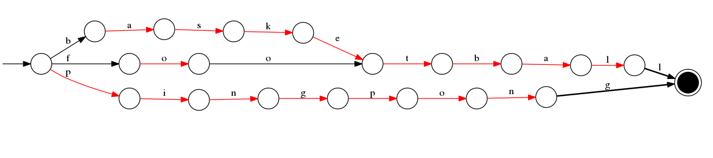
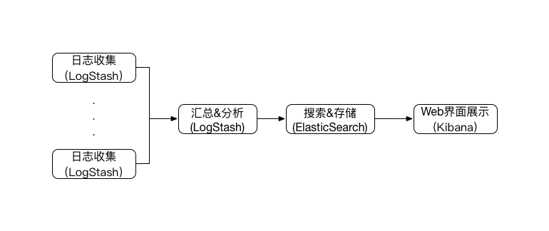

# 5.4 搜索引擎

前几节讲过的MySQL和MongoDB都有全文检索的功能，但如果真的需要全文检索的需求，搜索引擎才是最好的方案。目前Java开发中最常用的搜索引擎是Solr和Elasticsearch。

其中，Solr是Apache旗下的开源搜索引擎，基于Lucene开发。支持层面搜索、命中醒目显示和多种输出格式，包括 XML/XSLT和 JSON 格式，是之前用的比较广泛的搜索引擎。但近几年Elasticsearch已经开始逐步取代Solr，正逐渐成为主流的搜索引擎选型。因此，本节主要针对Elasticsearch讲述。

Elasticsearch是一个分布式、RESTful的搜索以及分析服务器，其和Solr一样也是基于Lucence的。其主要优点如下：

1. 轻量级，下载后一条命令即可启动。
2. 可以存储任意结构的JSON对象，是无模式的。
3. 可以使用不同的index参数创建不同的索引文件，实现多索引文件支持。
4. 天然具有分布式特性，可以自动发现ES结点。
5. 不仅仅是搜索引擎，还有数据分析、聚合、可视化等特性。
6. 可以把ES直接当做NoSQL数据库使用，存储JSON文档。
7. 为各种操作都提供了RESTFul接口。
8. 有强大的聚合查询功能。

Elasticsearch目前已经到了5.x版本，但由于其改动较大，目前用的还不太广泛。本节使用的版本为2.3.3。

## 5.4.1 Apache Lucene

Apache Lucene是一个Java开源全文检索库，是很多搜索引擎的检索实现机制。其中的几个关键概念如下：

- 文档：document, 索引与搜索的主要数据载体
- 字段：field, 文档的一个片段
- 词项：term, 搜索时的一个单位，一般为一个词
- 词条：token,词项在字段中的一次出现

Lucene将索引信息组织为词典（term dictionary）。每一个条目由词项和此词出现过的文档集合组成，这样就能够通过词反向查询文档信息。如下：

词项 | 文档 
----|-----
篮球 | [1,2]  
足球 | [1,4,5]
乒乓球 | [7]

为了加快在词典中查找词项的速度，Lucene对词典做前缀索引，版本4.0后使用FST（finite state transducers）这个数据结构保存在内存中，会在每次打开索引时全量装载到内存中。



上图即一个FST（通过http://examples.mikemccandless.com/fst.py此网址生成），是一个有向无环图，依次插入的单词为baskeball、football、pingpong，之后可以很方便的查询这些单词。其用途和Hashmap、Tries树基本相同，但是FST非常省内存。

Lucene中的索引由多个段segment组成，每个段只被创建一次但被查询多次。索引期间，段不可被修改。因此，文档的删除也仅仅是把信息保存在一个单独的文件中，段本身并没有改变。Lucene会对多个段进行合并，称为segments merge。目的是为了减少segment的数目，把小的segment合并为大的segment，减少搜索的segment数。此外，merge也会把被删除的信息清理掉。合并可以强制执行，也可以由Lucene的内在机制自动执行。但这个合并的过程非常消耗IO，不建议强制执行。

倒排索引中的key是文档中的词，这些词都是通过分析器来对文档进行分析从而得到的。分析器包括：分词器、过滤器和字符映射器。

- 分词器：将文本切割成词条，输出词条流
- 过滤器：用来处理词条流中的词条，移除、修改词条
- 字符映射器：做文本预处理工作，比如去除文本的HTML标签。

Lucene提供了一套查询语言用于对文档在字段中进行查询，支持通配符查询和模糊查询。

基于Lucene提供的这些强大的全文索引功能，Solr、Elasticsearch在其上封装出了独立的服务，增加了分布式、容错、分词器实现、数据持久化等等特性和组件，就形成了搜索引擎。

## 5.4.2 关键概念

1. 节点、集群

    每一个运行的ES服务实例叫做节点（Node）。多个ES实例以集群（Cluster）方式运行，以一个整体对外提供服务，能够容错并提供巨大的数据量支持。ES天然支持集群，配置非常简单。
    
1. 索引

    索引（idnex）是ES存储数据的地方，类比于关系数据库的database，是被索引文档的集合。可以向索引写入/读取文档。此外，ES提供了索引的别名（Alias）机制，一个索引可以有多个别名，一个别名可以对应多个索引。
    
1. 文档

    文档（document）是ES中的主要实体，没有固定的模式，可以看作为JSON对象，类比于关系型数据库的Row。所有的搜索最终都是对文档的搜索，文档由字段构成，每个字段有一个名字和一个或者多个字段值。
    
1. 分片

    Shard，是ES提供分布式搜索的基础。ES将一个完整的Index分成若干部分存储在相同或者不同的节点上，组成Index的部分即Shards，每一个Shard都是一个Lucence实例。每个Shard都有一个编号，Doc落入哪个Shard默认与文档的ID有关，也可以通过配置路由（route）来自定义。
    
1. 副本

    ES会为索引的每一个Shard创建冗余副本（Replica）,用来提高系统的容错性，并可以自动对搜索请求进行负载均衡，提高ES的查询效率。ES支持在任意时间点添加或移除副本，可随时调整副本数量。
    
1. Recovery

    ES在有节点加入或退出时会根据机器的负载对索引分片进行重新分配，挂掉的节点重新启动时也会进行数据恢复。

1. 网关

    ES默认先把索引存放到内存中，当内存满了时再持久化到本地硬盘。Gateway对索引快照进行存储，当这个ES集群关闭再重新启动时就会从Gateway中读取索引备份数据, 此外还存储了集群状态、索引设置的各种信息。

1. Zen Discovery

    ES的自动发现节点机制,也可以叫做共识系统。ES是一个基于p2p的系统，它先通过广播寻找存在的节点，再通过多播协议来进行节点之间的通信，同时也支持点对点的交互，并进行Master的选举。
    
与MySQL的相关概念类比如下：
    
MySQL | Elasticsearch
----|-----
Database | Index
Table | Type
Row | Document
Column | Field
Schema | Mapping（Type的字段处理规则：是否分词，如何分词，是否压缩等）
Index | Everything is indexed
SQL | Query DSL
INSERT into | POST http://
DELETE from | DELETE http:// 
UPDATE table SET ... | PUT http:// 
SELECT * from  | GET http://
group by、avg、sum | Aggregations
distinct | cardinality
数据迁移 | reindex操作

## 5.4.3 查询优化

ES中的结点都是对等的（从用户角度来看，Master节点和其他节点并没有什么不同，所有结点都有同样的Cluster State信息），因此索引请求可以随便发到哪个结点上，但之后此结点成为coordinating node经过信息查询后，都把请求分发到包含对应编号主Shard的Node上执行操作，操作成功后再在备Shard上执行操作, 最后coordinating node结点等所有结果返回，合并结果返回给请求客户端。

ES的更新和查询的底层过程如下：

- 当索引增加、更新时，请求的结果都先存入indexing buffer(不能被搜索到)。当buffer满了或者到了时间周期，就会将buffer中的内容写入到磁盘上的segment（对Lucene index reader调用了reopen，并没有fsync保证持久化），开始可以被搜索到。
- 当有删除请求到来时，被删除的文档ID会记录到一个单独的文件中。
- 每次查询的时候，会扫描内存（缓存doc）、硬盘中的Doc，然后过滤掉deleted文件中的Doc。

依照上述过程indexing buffer生成segment默认的周期是1秒，使得被索引的文档可以被近实时地搜索到，达到准实时读取。但如果有意外，有可能会造成数据丢失。ES提供了translog来保证一定程度的数据完整性，每一个Shard都会有自己的translog。任一索引和删除操作在被Lucenece处理后都会写入translog。而为了防止translog过大，会有一个flush过程，此过程会触发Lucence的commit将内存中的文档存入磁盘并开始新的translog, 非常耗费时间和资源，因此控制flush发生的时机是影响索引的关键点之一。相关配置参数如下：

- index.translog.flush_threshold_size：translog一旦达到此值就会进行一次flush，可以调大此值甚至关闭，手动进行translog flush。
- index.translog.flush_threshold_ops：translog数据达到多少时进行一次flush，可以调大此值甚至关闭，手动进行translog flush。
- index.translog.flush_threshold_period: 距离上一次flush的时间间隔阈值。

在打开的索引中，只要以上满足任意一条tranlog不为空即可触发flush。此外，还有两个参数也关系着ES的性能：

- index.translog.interval: translog的提交周期，默认为5s
- index.refresh_interval: 指的多久进行一次数据刷新使得索引可以被使用。可以设置为-1关闭，手动进行refresh。

还有以下因素也会影响索引质量，从而影响检索速度：

1. 分片数目

    分片数目过多会导致检索时打开的文件较多、多台服务器之间通讯，过少则单个分片索引过大，检索速度慢。分片数根据数据总量/单片的数据数目来计算，单片的数据数目需要通过单节点单索引来进行测试，一般不超过10G即可。
    
    ```
    PUT /my_index
    {
        "settings": {
            "number_of_shards" : 1
        }
    }
    ```
    
1. 副本数

    如果有副本存在，那么索引过程会同时同步到副本中。在对索引的安全性没有那么高的要求的情况下，可以在索引过程中将副本数设置为0，待索引完成后再改回去，可以在一定程度上提高索引效率。

    ```
    PUT /my_index
    {
        "settings": {
            "number_of_replicas" : 0
        }
    }
    ```

1. 分词

    分词选择的词库要适量，并非越多越好，词库越多，词表越大那么分的词就会变多，从而索引也会变大。根据业务场景选择和特征相关的词库，能够使得词表变下，索引大小也会减少许多。
    
1. 索引段

    每次搜索请求，会搜素所有的段，因此segment的数目过多会导致搜索时读取的文件数过多，影响搜索效率。虽然有对segment自动做合并的机制，但可能的情况下把segment的数目设置为1可以更好地提高检索速度。
    
    ```
    curl -X POST 'http://localhost:9200/my_index/_forcemerge?max_num_segments=1'
    ```
    
    上述命令即可将索引的段合并为1个。

## 5.4.4 内存优化

ES是一个Java应用，因此内存和GC是影响ES性能的关键因素。

ES的倒排索引是先在内存中生成，然后定期以segment file的形式刷到磁盘中的。这样每个segment都会有一些索引数据存储在heap里，如：词项索引。segment越多，占用的heap也越多且无法gc，因此ES的数据存储并非仅仅消耗磁盘空间，当segment memory占用过多时就需要考虑删除、归档数据或者扩容。

官方建议设置的heap size不要超过系统可用内存的一半，heap以外的内存操作系统会用来cache数据。JVM的xms和xmx也要设置为和heap一样大，避免动态扩展。

为了减少segment memory的占用，有以下方法：

1. 删除不用的索引。
2. 定期对不再更新的索引做force merge，即对segment file强制做合并可以节省大量内存占用。

此外，为了防止内存频繁swap影响ES性能，有以下两种方式：

- 关闭系统的swap功能`sudo swapoff -a`，但由于会关闭Linux系统的swap功能，所以最好结合机器的情况来选定是否执行此配置。
- 配置bootstrap.mlockall: trure,让JVM锁住内存，同时需要运行Elasticsearch的Linux用户有锁定内存区域的权限。

    ES的启动用户esUser,修改/etc/security/limits.conf文件
    
    ```
    esUser soft memlock unlimited
    esUser hard memlock unlimited
    ```
    
## 5.4.5 集群

5.4.2中讲述了集群的概念，具体的一个ES集群中的节点分为以下几种：
    
- Master：负责轻量级的管理集群的状态的工作，当群集的拓扑结构改变时把索引分片分派到相应的节点上。节点配置node.master:true, 作为Master候选节点。为了防止在网络分区时发生脑裂现象，提供了minimum_master_nodes参数限制能够成为Master的最小跟随Master候选节点数。一般建议设置为N/2+1，N为候选Master节点总数。
- Data：是数据的承载者，对索引的数据存储、查询、聚合等操作提供支持。节点配置node.data:true,成为Data节点。
- Client: 节点配置node.master:false node.data:false，如此节点仅仅作为“路由结点”，负责转发请求给Master或者Data。
- Tribe: 通过tribe.*配置，是一个特殊的Client结点，用来跨集群的请求路由和协调。

ES的节点默认兼具Master候选和Data功能。官方建议，小集群下如此使用比较方便，当集群越来越大，应该分离这些节点的用途，做不同的针对配置。

- 单独的Master节点CPU、内存消耗都很低，配置一般即可。
- 单独的数据节点是主要工作所在，需要较高的CPU、内存和IO配置。
- 单独的Client节点只需要做路由和结果聚合，对CPU和内存要求较高。此外需要注意，虽然Client节点数目越多越能分担Master和Data节点作为协调节点的功能，但过多会使得Master在同步state时等待变长。 

除了节点，集群还有一个重要的概念就是Shard以及其副本，此部分在5.4.2中已经讲述。

以上最终形成ES的集群。集群的健康状况可以通过_cat/health API来查询，有以下几种状态：

- green：集群一切都可用。
- yellow：所有主要分片可用，但不是所有复制分片都可用。此时能够正常对外服务。
- red：部分数据不可用。此时，集群是能够提供部分服务的，会在现有存活分片中执行请求。需要尽快修复故障分片，防止数据的丢失。
    
## 5.4.6 ELK

ELK, 即Elasticsearch + Logstash + Kibana, 是一套开源的日志管理方案，可以构建日志集中分析平台。其一个一般的架构如下图所示：



- Logstash：多个独立的agent负责收集不同来源的数据，一个中心agent负责汇总和分析数据。
- Elasticsearch：用于存储最终的数据，并提供搜索功能。
- Kibana：提供一个简单、丰富的web界面，数据来自于Elasticsearch，支持各种查询、统计和展示。

还可以在远程Logstash和中心Logstash之间加入Redis、Kafka等中间代理层作为缓冲和中间存储，提高系统性能和可靠性。

## 使用提示

1. ES性能体现在分布式上，一个生产系统建议至少三个节点以上。
1. ES不是一个实时的存储服务（索引文件不变，任意时刻的数据是快照数据），不要用在实时业务场景中。如果真的需要实时，则需要使用get操作，并且指定realtime为true。
1. ES字段是否索引只能在创建索引时配置，不能在字段创建后再给字段“加索引”。
1. 索引字段有“索引（indexed）”和“存储（stored）”两个属性，只有被“索引”的字段才能在查询/排序条件中使用，只有被“存储”的字段才能在请求的时候返回字段内容。其中必须保证索引字段都存储（stored）才能使用update操作，update原理是先从索引中get到原文档内容，然后与传入的欲更新字段合并，作为一个新的文档index回去，如果有字段不是stored，那么update之后该字段就丢失了。
1. 倒排词典的索引是常驻内存的，需要监控数据节点上segment memory的使用情况。
1. 线上业务最好根据自身应用场景开启索引的慢查询日志。
1. 要定期删除不再使用的索引并做好冷数据的迁移。
1. 如果不使用_all字段，那么关闭掉这个属性，否则在创建索引和增大索引大小的时候会使用额外更多的CPU。
1. 可以不索引的字段就不索引（indexed: no），可以减小倒排索引文件，提高读写性能。
1. 搜索用不到的字段不要写入ES。如果需要这些字段的信息，可以使用Redis、HBase这种key->value查询非常高效的数据中间件存储这些信息。查询时先根据条件从ES检索，再根据ID去另外的数据中间件里获取完整的信息。如此，能够减少对磁盘缓存的占用，从而提升ES查询效率。
1. 善用bool query,类似于之前版本的filtered query，可以在进行复杂的倒排算法之前先减少计算空间。 
1. 使用批量查询和批量读取减少网络IO。
1. 可以使用多个别名命名同一个index，然后针对不同的别名做不同的操作权限控制。
1. ES官方推荐内存配置不要超过系统可用内存的一半，并且不要超过32GB。这里的32GB限制是为了能够开启JVM的压缩指针。
1. ES的Java客户端有两种类型：NodeClient是集群中的一个结点，会同步路由等信息，影响启动速度；TransportClient，仅仅做为一个客户端，启动速度比较快，但是其不知道集群的任何信息，因此查询时需要先发送请求到某个节点，然后再由ES转发到文档所在的节点做处理，查询需要消耗更多资源。
1. 避免返回大量结果集的搜索和聚合。可以采用scan和scroll api来补充缺失数据。 
1. 使用ES默认的from+size方式做分页查询时分页数量越多性能显著下降，可以使用离线读取索引快照（一次查询请求后维护一个快照的搜索上下文，无法满足实时查询场景）的scroll方式或者5.x之后的searchAfter方法（无法随机跳转）来提升分页查询的性能。
1. 根据字段的取值来设置字段类型，减少索引文件的overhead，如小于7个枚举值可以用byte。
1. 避免在ES中存储大字段，大字段会在段文件中保存，会影响读写性能。
1. ES设置的mapping对存储内容无效，只是在建索引时用于类型检查/转换。存储内容，存的是json，返回的数据格式是json反序列化时自动推测的，不会按照预置的mapping字段类型返回。
1. 将mapping中的dynamic设置为strict，在出现未配置的字段时抛出异常，避免因为字段自动映射错误而导致重建索引（mapping默认关闭了自动映射功能,避免第一次推断的类型错误）。
2. 避免使用match操作，match操作不走缓存，每次都会计算，非常耗CPU。


