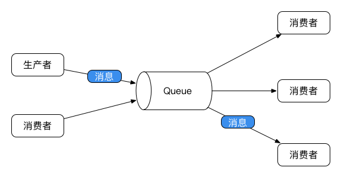
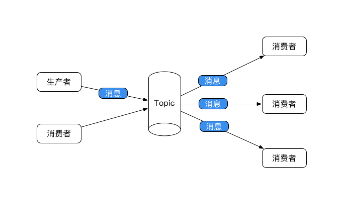
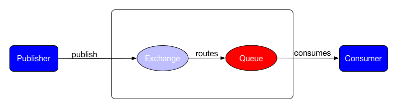
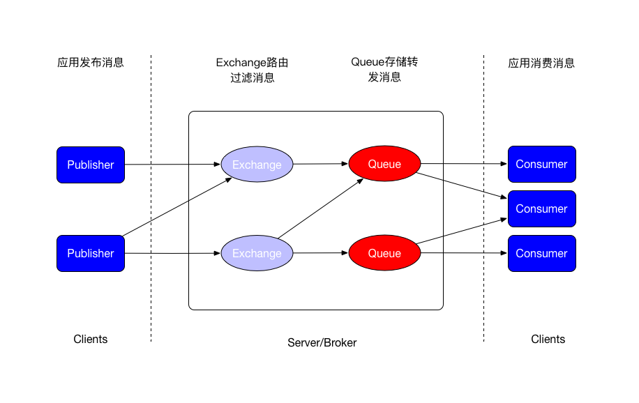
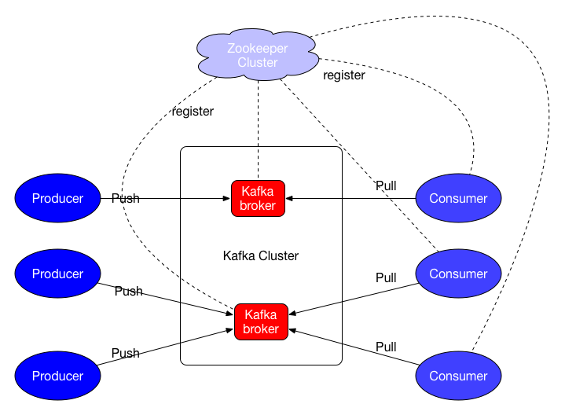
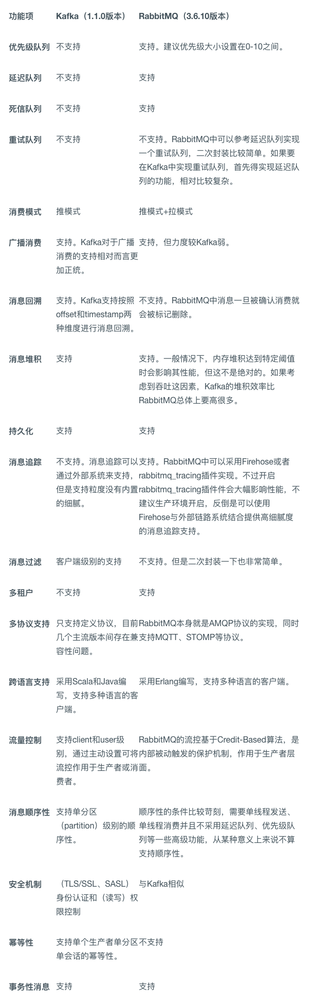
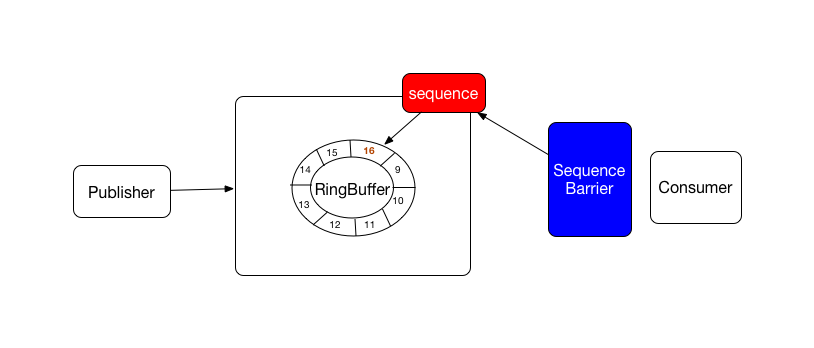

# 6.3 消息中间件

消息中间件，也可以叫做中央消息队列（区别于本地消息队列），是一种独立的队列系统。经常用来解决内部服务之间的异步调用问题。调用方把请求放到队列中即可返回，然后等待服务提供方去队列中去获取请求进行处理，然后通过回调等机制把结果返回给调用方即可。

异步调用就是消息中间件一个非常常见的应用场景。此外，常用的消息队列的应用场景还有以下几个：

* 解耦: 一个业务的非核心流程需要依赖其他系统，但结果并不重要，有通知即可。
* 最终一致性: 指的是两个系统的状态保持一致，可以有一定的延迟，只要最终达到一致性即可。经常用在解决分布式事务上。
* 广播: 这是消息队列最基本的功能。生产者只需要发布消息，订阅者都会受到消息。
* 错峰与流控: 当上下游系统处理能力不同的时候就需要类似消息队列的方式做为缓冲区来隔开两个系统。

其实，这里消息队列的概念和操作系统中进程间通信方式的消息队列本质是相同的。消息队列有生产者和消费者两种角色，前者生产消息，后者消费消息。

对于生产者生产消息、消费者消费消息，大体有两种消息模型：队列和发布订阅。

- 队列模型中:一个由消费者组成的池从服务器读取消息，每一个消息都可以达到其中的某一个消费者。

    

- 发布-订阅模型中，消息被广播到所有消费者中，所有订阅了某个topic（主题）的消费者都能够拿到消息。
    
    

目前主流的消息中间件，有以下几个：

* ActiveMQ
* RabbitMQ
* Kafka

此外，ZeroMQ也经常会被提到的消息队列，不过其本质是一个网络编程的Pattern库，将常见的网络请求形式（分组管理，链接管理，发布订阅等）模式化、组件化，位于socket之上、MQ之下。对于MQ来说，网络传输只是它的一部分，更多需要处理的是消息存储、路由、Broker服务发现和查找、事务、消费模式（ack、重投等）、集群服务等。

还需要提到的是消息中间件对于生产和消费的传输保障一般有三种语义支持：

- At most once，至多一次，消息可能丢失，但绝不会重复传输；
- At least once，至少一次，消息绝不会丢，但是可能会重复；
- Exactly once，精确一次，每条消息肯定会被传输一次且仅一次。

对于大多数消息中间件而言，一般只提供At most once和At least once两种传输保障。如果想达到第三种则需要下游的业务进行配合，由业务做去重处理或者业务消息本身就具有幂等性，例如：以唯一ID作为标识设置一个去重表。 

## 6.3.1 简单消息中间件-ActiveMQ

对于ActiveMQ，需要先讲述JMS规范。

JMS（Java Message Service）是一个简单的消息中间件规范，专用于JavaEE。它主要做了接口上的规范（定义了API接口）以及消息传输模型和消息类型的规范。但其并没有对这些给予实现，也完全没有给出服务器端的架构，甚至可以不使用服务器直接在客户端之间传输消息；也没有规定消息的顺序、安全、重发等特性。

JMS可以看做是一种与厂商无关的API，使得Java程序能够与不同厂商的消息组件很好地进行通信。其定义的一个规范流程如下:

- 获得JMS connection factory，通过我们提供特定环境的连接信息来构造factory。
- 使用factory构造JMS connection。
- 启动connection。
- 通过connection创建JMS session。
- 指定JMS destination。
- 创建JMS producer或者创建JMS message并提供destination。
- 创建JMS consumer或注册JMS message listener。
- 发送和接收JMS message。
- 关闭所有JMS相关资源，包括connection、session、producer、consumer等。

ActiveMQ是对JMS的一个实现,提供了标准的、面向消息的、能够跨越多语言和多系统的应用集成的消息中间件功能。除了JMS标准规定的特性之外，ActiceMQ还提供了诸如消息持久化、主从集群、消息组通信、有序消息管理、消息延迟接收、消息优先级等附加特性。

在AvtiveMQ中消费者使用长连接的方式消费队列消息。

Spring JMS提供了对符合JMS规范的消息队列的使用封装：

消息生产者示例如下：

```
<bean id="amqConnectionFactory" class="org.apache.activemq.ActiveMQConnectionFactory">
   <constructor-arg index="0" value="tcp://localhost:61616"/>
</bean>
 
<!-- 定义连接工厂 -->
<bean id="connectionFactory" class="org.springframework.jms.connection.CachingConnectionFactory">
   <constructor-arg ref="amqConnectionFactory" />
</bean> 

<!-- 配置目的队列 -->
<bean id="defaultDestination" class="org.apache.activemq.command.ActiveMQQueue">
	<constructor-arg index="0" value="test_jms_ueue" />
</bean>

<bean id="jmsTemplate" class="org.springframework.jms.core.JmsTemplate">
	<property name="connectionFactory" ref="connectionFactory" />
	<property name="defaultDestination" ref="defaultDestination" />
</bean>
```
在相关Bean中引入jmsTemplate即可调用相关方法实现消息发送。
```
jmsTemplate.convertAndSend("test_jms_queue",message);
```

消息消费者示例：

```
<bean class="org.springframework.jms.listener.SimpleMessageListenerContainer">
    <property name="connectionFactory" ref="connectionFactory" />
    <property name="destinationName" value="test_jms_queue" />
    <property name="messageListener" ref="activeMQListener" />
</bean>

@Component("activeMQListener")
public class ActiveMQMessageListener implements javax.jms.MessageListener.MessageListener {
    @Override
    public void onMessage(Message message) {
        ...//消息处理逻辑
    }
}
```
实现javax.jms.MessageListener.MessageListener即可处理收到的消息。

由于ActiveMQ性能较差，在大规模的互联网应用中并不推荐使用。

## 6.3.2 完备消息中间件-RabbitMQ

RabbitMQ基于AMQP协议，是一个完备的消息中间件。

### AMQP

AMQP, The Advanced Message Queuing Protocol, 是一个比较复杂的消息中间件协议。它是一个和语言无关的，在金融行业使用的新兴消息中间件，是一个异步消息传递所使用的应用层协议规范。其现在的目标是为通用消息队列架构提供通用构建工具。

与JMS相比，AMQP并不是API, AMQP客户端能够无视消息的来源任意发送和接受信息。AMQP提供了一个模型，旨在统一消息模式，包括队列、发布/订阅、事务等，还包括路由、扩展性等额外特性，能够让客户端和消息中间件之间进行消息通信及消息确认。如下：



如上图所示，AMQP工作模式可以描述为：消息首先被发布到信箱（Exchange），然后信箱将会把消息拷贝分发到应用了规则（即绑定Bindings）的队列。AMQP 消息中间件既可以将消息分发到订阅了某些队列的消费者，也可以让消费者自己根据需要从队列中拉取消息。其中:

- 信箱Exchanges、队列Queues和绑定Bindings被统称为 AMQP 实体。
    - 信箱：用于消息发送的实体, 可以将一条消息路由到零个或多个队列。具有名称、持久性、自动删除等属性，这里的自动删除指的是信箱会在所有队列都不再使用它的时候被删除。
    - 队列：和其它消息务队列软件很类似，会存储供应用程序消费的消息。队列会和信箱共享一些属性，但也有一些额外的属性，包括名称、持久性、连接的专一性、自动删除、消息的TTL等。这里的连接专一性指的队列只被一个连接使用，并在连接断开时删除；自动删除指的是当最后一个消费者取消订阅后，队列会被删除。
    - 绑定：是信箱用于路由消息到队列的一些规则。可以认为绑定就是连接信箱和队列的路径。

- 在发布消息时，发布者可以定义各种消息属性。其中的一些属性可能会被消息中间件使用，余下的则由接收消息的应用程序使用。
- 当消息传递到消费者时，消费者会给消息中间件发送确认通知，可以自动回复或者选择在需要的时候回复。当使用消息确认机制时，只有在消息中间件接收到来自消费者的确认时才会将消息从队列中移除。
- 消息的负载均衡是在消费者之间进行的，即当多个消费者监听同一个Queue时，使用Round Robin策略将消息只传输给一个消费者。
- AMQP对于消费者的实现包括push和pull两种方式。

此外，需要注意AMQP是一个抽象协议，不负责处理具体的数据。它的实体和路由策略都可以根据需要定义并可以在不需要的时候删除这些AMQP实体。

### RabbitMQ介绍

RabbitMQ版本：3.6.6。

RabbitMQ是实现了AMQP的开源消息队列，服务器端用Erlang语言编写，支持多种客户端。从生产者接收消息并传递给消费者，在这个过程中，根据规则进行路由、缓存以及持久化。消费者通过push方式获取消息，即队列里有消息就会推送给消费者。其架构基于AMQP模型:



比起AMQP模型，RabbitMQ增加以下几个概念：

- Broker: 消息队列服务器实体, 一个RabbitMQ实例就是一个broker。
- VHost：虚拟主机，一个Broker里可以开设多个VHost，用作不同用户的权限分离。
- Channel：消息通道，在客户端的每个连接里，可建立多个Channel，每个Channel代表一个会话任务。

RabbitMQ的使用过程如下：

- 客户端连接到消息队列服务器，打开一个Channel。
- 客户端声明一个Exchange，并设置相关属性。
- 客户端声明一个Queue，并设置相关属性。
- 客户端使用routingKey，在Exchange和Queue之间建立好绑定关系。
- 客户端投递消息到Exchange。
- Exchange接收到消息后，就根据消息的key和已经设置的Binding，进行消息路由，将消息投递到一个或多个队列里。

RabbitMQ具有较高的可用性、稳定性以及可靠性，具备了一个成熟的MQ应该具有的特性。适用于可靠性要求极高、对消息有事务要求的业务场景。但其性能和分布式能力稍弱，一般RabbitMQ的单机QPS在万级别之内，中小规模场景可选。

需要注意的是，RabbitMQ也仅仅只能保证At Least Once（消息至少被消费一次）的消费，无法从自身去进行消息去重。

### RabbitMQ交换机

消息由Client发送，RabbitMQ接收到消息之后通过交换机转发到对应的队列上面。消费者会从队列中获取未被读取的数据处理。

RabbitMQ的Exchange包含以下几种：

- Direct Exchange：直连交换机。当消息的routigKey和Binding的routingKey直接匹配, 那么转发消息到routingKey指定的队列。
- Fanout Exchange：扇形交换机。采取广播模式，转发消息到所有与该交换机绑定的队列，速度最快。
- Topic Exchange：主题交换机。使用匹配模式按规则转发消息，即判断消息的routingKey和binding的routingKey是否符合通配符匹配。是最灵活的交换机。
- Headers Exchange：头部交换机 ，如果消息的头部信息和Binding的参数表中匹配的话，消息将会路由到该队列。

### 消息持久化

RabbitMQ支持消息的持久化，包括三个方面：

- Exchange持久化，在声明时指定durable => 1。
- Queue持久化，在声明时指定durable => 1。
- 消息持久化，在投递时指定delivery_mode => 2。

这里如果Exchange和Queue都是持久化的，那么它们之间的Binding也是持久化的。如果Exchange和Queue两者之间有一个持久化，一个非持久化，就不允许建立绑定。

### 负载均衡和高可用

RabbitMQ本身并不具有负载均衡机制，用户连接到RabbitMQ集群的任意节点都可以访问集群中的任意消息队列，但一个消息队列只存储在一个物理节点上，其它节点只存储该队列的元数据，这使得当队列里只有一个队列时，系统性能受限于单个节点的网络带宽和主机性能。可以采取以下方案实现RabbitMQ的简单负载均衡：

1. 建立多个消息队列，每个物理节点上消息队列数相同。
1. Exchange的类型设置为Direct，建立多个Binding，每个队列对应一个Key。
1. 每个生产者建立到每个物理节点的连接。
1. 每个消费者订阅所有消息队列,。
1. 发送消息时随机选择一个Key,并使用该Key对应的队列所有在节点的连接发送该消息。
1. 当某个节点挂掉后，发送者将消息随机发送到其余节点，并一直监控该挂掉的节点是否重起，重启后，即可向该节点发消息。

此外，RabbitMQ提供了镜像Mirror来实现队列的高可用。当某个RabbitMQ节点故障时，只要其它节点里存在该故障节点的队列镜像，该队列就能继续正常工作不会丢失数据。但使用该功能也会有些副作用，它这种通过冗余数据保障可靠性的方式会降低系统的性能，因为往一个队列发数据也就会往这个队列的所有镜像队列发数据，这必然产生大量RabbitMQ节点间数据的交互，降低吞吐率。可以采取以下方式做优化：

1. 每个队列只有一个镜像，镜像的位置为“下一个节点”。
1. 消费者端监控所有链接，当发现某个节点挂掉时，自动连接到镜像节点，而当故障节点恢复时自动连接回来。

如此，虽然可靠性有所降低，但是性能会有很大的提高，也能保证一定程度的可靠性。


### 使用

Spring Rabbit和Spring AMQP对RabbitMQ的使用做了封装。

生产者配置：

```
<!--配置connection-factory，指定连接Rabbit Server参数 -->
<rabbit:connection-factory id="rabbitConnectionFactory"
                          username="xx"
                          password="xx"
                          host="localhost"
                          port="5672" />
                          
<!--定义queue -->
<rabbit:queue name="testQueue" durable="true" auto-delete="false" exclusive="false" />

<!-- 定义direct exchange，绑定queue -->
<rabbit:direct-exchange name="testExchange" durable="true" auto-delete="false">
   <rabbit:bindings>
       <rabbit:binding
               queue="testQueue"
               key="testQueueKey">
       </rabbit:binding>
   </rabbit:bindings>
</rabbit:direct-exchange>
                          
<!--定义Rabbit template用于数据的接收和发送 -->
<rabbit:template id="amqpTemplate"  connection-factory="rabbitConnectionFactory"
                exchange="testExchange" />
                
<!--通过指定下面的admin信息，当前producer中的exchange和queue会在rabbitmq服务器上自动生成 -->
<rabbit:admin connection-factory="rabbitConnectionFactory" />
```
这样引入amqpTemplate即可调用相关方法发送消息。

```
amqpTemplate.convertAndSend("testQueueKey",message);
```

消费者配置：

```
<!--定义queue -->
<rabbit:queue name="testQueue" durable="true" auto-delete="false" exclusive="false" />

<!-- 定义direct exchange，绑定queue -->
<rabbit:direct-exchange name="testChange" durable="true" auto-delete="false">
   <rabbit:bindings>
       <rabbit:binding
               queue="testQueue"
               key="testQueueKey">
       </rabbit:binding>
   </rabbit:bindings>
</rabbit:direct-exchange>

<rabbit:listener-container
       connection-factory="rabbitConnectionFactory">
   <rabbit:listener queues="testQueue"
                    ref="amqpListener"/>
</rabbit:listener-container>

@Component("amqpListener")
public class AmqpMessageListener implements org.springframework.amqp.core.MessageListener {
    @Override
    public void onMessage(Message message) {
        
    }
}
```
如上，实现org.springframework.amqp.core.MessageListener即可接受消息进行处理。

需要注意的是，如果启用生产者与MQ间的确认机制、消费者与MQ间的确认机制、QoS是会影响整体吞吐量的，慎重开启。

此外，经过测试可知增加VHost的数量是可以提高RabbitMQ的性能的。

## 6.3.3 日志消息中间件-Kafka

Kafka是由LinkedIn公司开发的一个分布式的消息系统，后来成为Apache的开源项目，其使用Scala编写，以可水平扩展和高吞吐率而被广泛使用。目前越来越多的开源分布式处理系统如Apache Storm、Spark等都支持与Kafka集成。

Kafka基于文件append，以顺序读写的方式来写入读取文件，性能（吞吐量、TPS）是非常高的，也支持多订阅者，当失败时能自动平衡消费者。但由于Kafka设计的初衷就是处理日志的，因此是允许消息丢失的，对事务的支持也不好，也并不能保证消息的顺序性。此外，Kafka中消费者是通过pull的方式去获取消息的，因此在实时性上是不如RabbitMQ的，但是其使用Zero-Copy的技术，保证了一定的pull性能。

综上，Kafka适用于海量消息场景，允许极端情况下少量丢失，如日志。单机QPS可以维持在十万级别，甚至可以达到百万级。不过，Kafka迭代到现在，对可靠性要求较高的场景也有了支持，需要对Kafka根据具体场景对其监控和治理能力进行适当定制完善。对比RabbitMQ的核心是Routing，Kafka的核心则在于Streaming。

Kafka版本0.9.0。

### 关键概念和架构

几个概念如下：

- Topic：Kafka将消息以category的方式保存在一起，称为Topic。
- Producer: 向topic产生消息的进程称为Producer。
- Consumer: 处理topic上的消息的进程称为Consumer。
- ConsumerGroup: 每个Consumer属于一个特定的Consumer Group，一条消息可以发送到多个不同的Consumer Group，但是一个Consumer Group中只能有一个Consumer能够消费该消息。
- Broker: Kafka集群由一个或者多个Server组成，称为Broker。
- Partition: 分区，是一个物理上的概念，一个Topic可以分为多个Partition，每个Partition内部是消息有序的。

Kafka的架构如下如所示：



消息的发送和接受流程如下：

- 通过Zookeeper管理集群配置、选举Leader; 在Consumer Group变化时进行rebalance。
- 生产者以push方式向所选择的Topic发布消息并负责选择哪一个消息被指定到Topic的哪一个Partition中。这个可以通过round-robin简单地做负载均衡或者按照一些语义分区机制（例如基于消息中的一些key）来做。
- 消费者使用pull方式订阅消息。基于Consumer group可以实现两种消费模式：
    
    - 所有的消费者实例都在同一个消费者Group中，那么就类似于传统的队列，同一Group中的Consumer对同一消息仅仅能获取到一次。
    - 每一个消费者实例都在不同的消费者Group中，那么就类似于发布-订阅模型，所有消息被广播到所有消费者。

需要提到的一点：Kafka的所有消息都是顺序append到日志文件中的，每条消息在文件中的位置称为offset（偏移量），offset为一个long型的数字，它唯一标记一条消息。因此，Consumer对offset的管理是读取消息的关键点之一。

### 分布式

对于每一个Topic，Kafka集群都保存了一个分区Log,每一个分区都是一个提交日志，一系列有序的、不可变顺序的消息连续地追加到日志的尾部。如此，使用分区使得Kafka可以在单个服务器上扩展，能够承载大量的数据。

这些分区分布在Kafka集群的服务器上，其中的每一个服务器都控制一组分区上的数据和请求, 可以并行的接受请求（同一分区不允许并发访问）。每一个分区通过一定数量的服务器冗余提高容错率。

每一个分区都有一个服务器作为“Leader”，零个或者多个服务器作为“Followers”。Leader控制所有的读写请求，Followers被动地去冗余Leader。如果Leader发生了故障，那么Followers中的一个会自动地成为新的Leader。每一个服务器对于其中的一部分分区是做为Leader,对于其他的分区则是做为Follower，这样就能很好的在集群内部做好负载均衡。

对于Leader和Follower之间的数据同步，还牵扯到HW（high watermark）和LEO（log end offset）的概念。

- HW: 指的消费者能够看到的此Partition的位置，offset小于此值的消息被认为是commit的，可以供消费者消费。
- LEO: 每一个replica的log中最后一条消息的offset。

Follower拉取Leader数据，当数据完全同步时则阻塞。当有新的数据到来，Leader会解锁阻塞的Follower通知他们新的消息，Follower开始同步消息并更新自己的LEO。Leader选取所有ISR（in-sync replicas，指的alive和追赶Leader的replica）中最小的LEO作为自己的HW，消费者最多只能消费到HW所在的位置。由此可见，Kafka的数据复制机制既不是完全的同步复制，也不是单纯的异步复制，其使用ISR的这种方式能够很好地均衡吞吐率和数据的安全性。

由于分区的原因Kafka无法保障全局消息有序，但通过指定分区到一个消费者Group中的消费者，这样每一个分区只被这个Group中的一个Consumer消费，能够保证一个分区中的消息顺序。当然，使用一个只有一个分区的Topic能够保证消息全局有序。

### 使用

生产者示例：

```
Properties props = new Properties();
props.put("bootstrap.servers", "localhost:9092");
props.put("acks", "all");
props.put("request.timeout.ms", "10000");
props.put("retries", 10);
props.put("batch.size", 16384);
props.put("linger.ms", 1);
props.put("buffer.memory", 33554432);
props.put("key.serializer", "org.apache.kafka.common.serialization.StringSerializer");
props.put("value.serializer", "org.apache.kafka.common.serialization.StringSerializer");
props.put("compression.codec", "none");
props.put("partitioner.class", "org.apache.kafka.clients.producer.internals.DefaultPartitioner");

Producer<String, String> producer = new KafkaProducer<>(props);
producer.send(new ProducerRecord<String, String>("test_topic", "message_key", "message_value"));
...
producer.close();
```

其中的几个关键配置：

- acks：用来控制一个Produce请求怎样才能算完成。0表示Producer直接返回，不会等待一个来自Broker的ack；1表示在Leader replica已经接收到数据后，Producer会得到一个ack；all表示在所有的ISR（in-sync replicas，指的alive和追赶Leader的replica）都接收到数据后，Producer才得到一个ack。
- batch.size: 批量发送消息（同一个分区）时的一个batch的大小，单位bytes。过小的值会使得发送频繁，降低吞吐量；过大的值则会浪费内存；设置为0则不进行批量发送。
- linger.ms: 消息记录缓冲的时间，即延时发送消息记录等待其他消息记录一起做为一个batch。当满足batch.size时，会忽略此值直接发送，否则延时此时间再发送。
- buffer.memory：用于缓冲消息记录的内存大小，单位bytes。
- key.serializer：消息的key的序列化类。
- value.serailizer: 消息的value的序列化类。
- compression.codec：Producer的数据的压缩方式，包括none、gzip、snappy和lz4四种。
- partitioner.class：用来把消息分到各个Partition中的实现类，默认对key进行hash。

这里需要注意的是，此处使用的是kafka-clients库中的KafkaProducer，是纯Java的实现。它是在Kafka0.8.2版本之后被引入的，与之前Scala版本的kafka库中的Producer配置参数有不少区别。

消费者的API分为两种:

1. Hight Level

    此种级别的API, 封装了很多底层细节，使用Zookeeper保存offset信息。

    ```
    Properties props = new Properties();
    props.put("zookeeper.connect", "zk1.dmp.com:2181,zk2.dmp.com:2181,zk3.dmp.com:2181");
    props.put("zookeeper.session.timeout.ms", "3000");
    props.put("zookeeper.sync.time.ms", "200");
    props.put("group.id", "test_group");
    props.put("auto.commit.interval.ms", "600");
    
    String topic = "test_topic";
    ConsumerConnector connector = Consumer.createJavaConsumerConnector(new ConsumerConfig(props));
    Map<String, Integer> topics = new HashMap<String, Integer>();
    int partitionNum = 3;//分区数目
    topics.put(topic, partitionNum);
    Map<String, List<KafkaStream<byte[], byte[]>>> streams = connector.createMessageStreams(topics);
    List<KafkaStream<byte[], byte[]>> partitions = streams.get(topic);
    Executor threadPool = Executors.newFixedThreadPool(partitionNum);
    for (final KafkaStream<byte[], byte[]> partition : partitions) {
      threadPool.execute(
              new Runnable() {
                  @Override
                  public void run() {
                      ConsumerIterator<byte[], byte[]> it = partition.iterator();
                      while (it.hasNext()) {
                          MessageAndMetadata<byte[], byte[]> item = it.next();
                          byte[] messageBody = item.message();
                      }
                  }
              });
    }
    ```
    
2. Low Level

    Kafka的low-level接口主要是对SimpleConsumer的使用，使用场景如下：

    - 读取一个消息多次。
    - 在一个进程中仅仅消费某一个Topic中几个Partition的数据.
    - 管理事务以确保一个消息处理且仅仅被处理一次。

    使用这个接口需要注意以下几点：

    - 在应用中必须跟踪记录offset以确保能够确定上次消费到的位置。
    - 必须设置哪一个Broker是要操作的Topic和Partition的Leader。
    - 必须自己控制Broker的Leader的改变。

    使用步骤：

    - 找出一个active状态的Broker并且找出哪一个Broker是哪些Topic和Partition的Leader，必须知道读哪个Topic的哪个Partition。
    - 找到负责该Partition的Broker Leader，从而找到存有该Partition副本的那个Broker。
    - 自己去写request并fetch数据。
    - 获取数据。
    - 需要识别和处理Broker Leader的改变。

Kafka 0.9.0之后的kafka-clients提供了新的KafkaConsumer实现, 不再区分Hight Level和Low Level。

```
Properties props = new Properties();
props.put("bootstrap.servers", "localhost:9092");
props.put("group.id", "test_group");
props.put("enable.auto.commit", "true");
props.put("auto.commit.interval.ms", "1000");
props.put("session.timeout.ms", "30000");
props.put("key.deserializer", "org.apache.kafka.common.serialization.StringDeserializer");
props.put("value.deserializer", "org.apache.kafka.common.serialization.StringDeserializer");
KafkaConsumer<String, String> consumer = new KafkaConsumer<>(props);
consumer.subscribe(Arrays.asList("test_topic"));
while (true) {
    ConsumerRecords<String, String> records = consumer.poll(100);
    for (ConsumerRecord<String, String> record : records){
        ...
    }
}
```

如果需要自己手动控制offset的保存，可以将`enable.auto.commit`设置为false，在相应的地方`consumer.commitSync()`进行提交。

如果只需要消费某几个Partition的数据：

```
String topic = "test_topic";
TopicPartition partition0 = new TopicPartition(topic, 0);
TopicPartition partition1 = new TopicPartition(topic, 1);
consumer.assign(Arrays.asList(partition0, partition1));
...
```

如果需要自定义offset存储实现和对offset的控制:

- 将`enable.auto.commit`设置为false。
- 获取ConsumerRecord的offset并保存。
- 使用Consumer的seek(TopicPartition, long)设置offset。

此外，在开发Consumer程序时还有以下几个注意点：

1. 同一Consumer Group消费过的数据无法再次消费。如果想要再次消费数据，要么换另一个groupId，要么使用镜像或者使用Low Level API或者新的Consumer API去设置partion和offset。此外，Kafka本身也提供了工具来粗略地重新设置offset：

    ```
    ./kafka-run-class.sh kafka.tools.UpdateOffsetsInZK earliest config/consumer.properties page_visits
    ```
    参数解释如下：
    
    - [earliest | latest]，表示将offset置到哪里 
    - consumer.properties ，这里是配置文件的路径 
    - Topic名，这里是page_visits

1. Kafka 0.8.2版本引入了native offset storage，将offset管理从Zookeeper移出，并且可以做到水平扩展，相比起之前用Zookeepr存储offset, 避免了对Zookeeper的频繁写入（低效操作）。
 
1. 上面Consumer的High Level API中，Consumer中的Stream指的是来自一个或多个服务器上的一个或者多个Partition的消息。每一个Stream都对应一个单线程处理。因此，Client能够设置满足自己需求的Stream数目。总之，一个Stream也许代表了多个服务器Partition的消息的聚合，但是每一个Partition都只能到一个Stream。

1. Consumer和Partition的数目需要配合设置。

    - 如果Consumer比分区多，是浪费，因为Kafka的设计是在一个分区上是不允许并发的，所以Consumer数不要大于分区数。
    - 如果Consumer比分区少，一个Consumer会对应于多个分区，需要合理分配Consumer数和Partition数，否则会导致Partition里面的数据被取的不均匀。
    - 如果Consumer从多个Partition读到数据，不保证消息的有序。
    - 增减Consumer、Broker、分区会导致rebalance，所以rebalance后Consumer对应的分区会发生变化。

    综上，负载低的情况下可以每个线程消费多个Partition。但负载高的情况下，Consumer线程数最好和Partition数量保持一致。如果还是消费不过来，可以在增加Partition数的同时增加Consumer数或者通过某些手段提升消息处理能力。需要注意的是，由于Kafka主要是磁盘读写，Partition的增多如果是单个磁盘那么在并发性能上会有瓶颈,可以通过增加磁盘来扩展并发能力。
        
1. 注意session.timeout.ms、max.poll.interval.ms、heartbeat.interval.ms三个参数的配置。session.timeout.ms指的是心跳最大的时间间隔，heartbeat.interval.ms则是心跳频率，这两个值越小则能够让客户端越快地检测到rebalance；max.poll.interval.ms则表示两次poll数据之间的最大间隔，如果对一批数据的处理时间过长使得两次poll的时间间隔超过这个值就会认为consumer出现了问题进而触发rebalance，可以通过增大此值或者减少每一次获取的记录数目(max.poll.records)来避免不必要的rebalance，也可以在处理消息时将消息放到内存队列中异步处理来减少poll时间间隔。需要注意的是，在kafka-client 0.10版本之前，心跳是随着poll进行的，并不是单独的后台进程，需要同时考虑如何避免心跳超时的同时不影响心跳的频率，网上可见的一种方式就是Spring kafka的手动提交offset和心跳。

由于Kafka是对磁盘进行读/写，可以考虑优化系统的Page Cache来提升其读写性能。

还需要提到一点，由于Kafka是使用Scala编写的，因此阿里巴巴基于其原理（后来有了自己的设计）使用Java语言实现了MetaQ并开源，现在已经变成RocketMQ，可以作为Kafka的替代品。

此外，在Kafka监控管理上，可以选择Yahoo开源的kafka-manager、Linkedin开源的kafka-monitor和burrow（监控Consumer的lag）。

### Kafka vs RabbitMQ




## 6.3.4 本地消息队列

区别于消息中间件，本地消息队列指的是JVM内的队列实现，常用的包括下面几个：

1. BlockingQueue

    阻塞队列，实现了FIFO特性，是生产者消费者模式的首选，需要使用轮询pull的方式，周期性地从队列中取元素。
。一般使用LinkedBlockingQueue这个实现即可，其可以指定元素的容量，也可以不指定容量，但是需要注意无界队列使用不当（生产速度大于消费速度）很容易引起OOM, 建议使用有界队列。其有以下两种使用方式：

    - 配合使用take和put。take是取出元素，如果队列为空则阻塞直到有新的元素放入；put是放入元素，如果队列已满，则阻塞直到队列有空间。
    - 配合使用poll和offer。这里是使用它们带timeout的方法。这样，poll可以在指定的时间内来获取元素，超时没有元素则返回；offer则是在指定时间内放入元素，超时则返回。

    同样实现了BlockingQueue接口的ArrayBlockingQueue是一个有界队列，其底层存储基于数组实现。与LinkedBlockingQueue相比，其在生产和消费的时候直接将对象插入或删除，不会包装为Node<E>，生产和消费使用的是同一个锁，且可以设置为公平访问队列（阻塞的生产者线程或消费者线程当队列可用时可以按照阻塞的先后顺序访问队列）。通常来说, LinkedBlockingQueue的吞吐量是大于ArrayBlockingQueue的。
    
    此外，SynchronousQueue也是一个阻塞队列，但其并不存储元素，一个put操作必须等待一个take操作，否则不能继续添加元素，适合用于任务比较少的传递性场景。
    
1. ConcurrentLinkedQueue

    非阻塞队列，元素按FIFO原则进行排序，采用CAS操作，来保证元素的一致性。配合使用offer和poll并使用轮询pull的方式，周期性地从队列中取元素即可实现消息队列的功能。
    
    由于此类是一个无界队列，因此使用的时候需要特别注意消费者的速度要匹配得上生产者的速度，否则会产生oom。
        
1. Disruptor

    Disruptor是LMAX开源的并发框架，其设计为一个无锁的高性能线程交互的消息处理库，经常做为消息队列来使用。其使用了以下技术来达到低延迟高性能：
    
    - CAS: 避免了使用锁产生的竞争和等待。
    - 缓存行填充：避免了伪共享导致的缓存失效问题。
    - RingBuffer: 一个环形队列，用来在不同线程间传递数据的buffer。
    - 内存屏障：使用内存屏障（一个CPU指令，允许对数据什么时候对其他进程可见作出假设），避免了锁的开销。
    
    架构如下图：
    
    
    
    大体流程如下：
    
    - 生产者放入元素时需要申请下一个可写入的空闲槽的sequence。
    - 生产者拿到空闲sequence后去获取到对应的槽里的对象并做操作。
    - 消费者线程申请下一个可用元素是通过waitFor Sequence Barrier。
    - Sequence Barrier拿到可用sequence后返回给消费者。
    
    消费者使用示例如下：
    
    ```
    //事件
    class TestEvent {
        private long value;
    
        public void set(long value) {
            this.value = value;
        }
    }
    
    //事件处理器
    class TestEventHandler implements EventHandler<TestEvent> {
        public void onEvent(TestEvent event, long sequence, boolean endOfBatch) {
            System.out.println("TestEvent: " + event); //处理消息
        }
    }
    
    //事件工厂
    EventFactory factory = new TestEventFactory(){
        public TestEvent newInstance() {
            return new TestEvent();
        }
    };
    
    // 构造Discruptor
    Disruptor<TestEvent> disruptor = new Disruptor<>(factory, 1023, Executors.defaultThreadFactory());
    
    // 设置事件处理handler
    disruptor.handleEventsWith(new TestEventHandler());
    
    // 启动所有相关线程
    disruptor.start();
    ```
    
    生产者如下：
    
    ```
    //事件生产者封装，并实现事件的转换
    class TestEventProducerWithTranslator {
        private final RingBuffer<TestEvent> ringBuffer;
    
        public TestEventProducerWithTranslator(RingBuffer<TestEvent> ringBuffer) {
            this.ringBuffer = ringBuffer;
        }
    
        private static final EventTranslatorOneArg<TestEvent, ByteBuffer> TRANSLATOR =
                new EventTranslatorOneArg<TestEvent, ByteBuffer>() {
                    public void translateTo(TestEvent event, long sequence, ByteBuffer bb) {
                        event.set(bb.getLong(0));
                    }
                };
    
        public void onData(ByteBuffer bb) {
            ringBuffer.publishEvent(TRANSLATOR, bb); //发布消息
        }
    }
    
    TestEventProducerWithTranslator producer = new TestEventProducerWithTranslator(disruptor.getRingBuffer());
    
    ByteBuffer bb = ByteBuffer.allocate(8);
    bb.putLong(0, l);
    producer.onData(bb); //发布消息
    ```
    
    使用Disruptor需要注意的一点就是，new Disruptor有另外一个构造方法：
    
    ```
    Disruptor(
                final EventFactory<T> eventFactory,
                final int ringBufferSize,
                final ThreadFactory threadFactory,
                final ProducerType producerType,
                final WaitStrategy waitStrategy)
    ```
    
    其中的producerType指的是生产者模式，包括单生产者和多消费者两种生产者模式两种。虽然根据单一写原则单生产者模式具有更高的并发性能，但是即使你这里使用了单生产者模式，Disruptor也是不会给你构造单生产者运行环境的。
    
    此外，waitStrategy则指的是消费者等待ringbuffer中的sequence可用时使用的等待策略，常用的有以下几种：
    
    - BlockingWaitStrategy：默认的等待策略，使用了锁和竞态条件，是最慢的一种等待策略。适用于关注CPU资源大于关注吞吐和低延迟的应用场景。
    - SleepingWaitStrategy：先使用一个循环和Thread.yield()做等待，最后使用LockSupport.parkNanos(1L)，兼顾了性能和CPU使用。比较适用于对低延迟没有特别关注的场景，如异步日志。
    - YieldingWaitStrategy: 先做几次循环，再使用Thread.yield()做等待。可以用于低延迟应用且所在机器的CPU使用了超线程技术。
    - BusySpinWaitStrategy：是一个不停循环等待的策略，也是性能最高的策略。适用于所在机器CPU没有使用超线程技术的系统。

