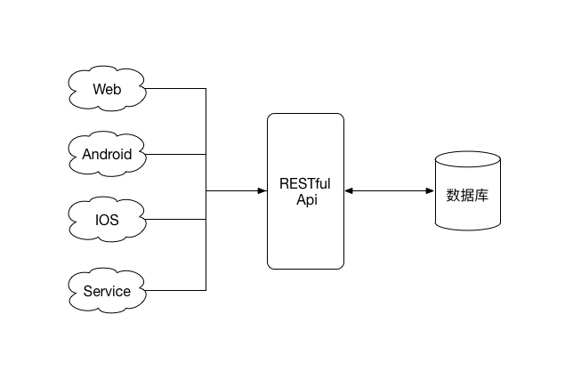
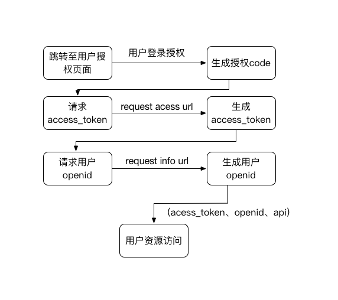

# 6.1 RESTful

REST，全称表现层状态转移（Representational State Transfer）, 指的是资源在网络中以某种表现形式进行状态转移，是一种架构风格。其描述的是在网络中Client和Server的一种交互形式。简单来说就是用HTTP URL来定位资源，用HTTP的各种method来描述操作。其关键的三个概念如下：

- Resource: 资源，主要指的是数据。
- Representational：数据的表现形式，如JSON、XML、HTML等。
- State Transfer：状态变化, 通过HTTP method来描述。

REST经常被用来规范API的设计以及数据传输的格式，可以统一给各种客户端提供接口,包括Web、iOS、Android和其他的服务。REST不需要显式的前端页面，只需要按照格式返回数据即可。符合REST风格的API称为RESTful API，符合RESTFul规范的架构称为RESTful架构。如下图所示：



## 6.1.1 操作

RESTful是基于HTTP协议的，其主要依赖于HTTP协议的几种method来表示CRUD（create、read、update和delete,即数据的增删查改）操作：

- GET: 从服务器上获取资源
- POST: 创建新的资源
- PUT： 更新服务器资源
- DELETE： 删除服务器资源

这里需要注意两点：

- GET、PUT和DELETE应该是幂等的，即相同的数据和参数下，执行一次或多次产生的效果是一样的。
- 对于POST和PUT操作，应该返回最新的资源，删除操作则一般不必要。
- 所有的操作都是无状态的，即所有的资源，都可以通过URL定位，这个定位与其他资源无关，也不会因为其他资源的变化而改变。

除了上述方法之外，还有一个PATCH方法也用于更新资源的部分属性，但并用的并不多，用POST即可。

此外，HTTP 1.1的几个头部也是应该注意的：

- Accept: 客户端要求服务器返回什么样表现形式的数据。RESTFul API需要根据此头部返回合适的数据。
- If-Match: 在对资源做更新和删除操作时，客户端提供If-Match头，值为服务端上次对此资源返回的Etag, 服务端对比Etag如果一致才做更新和删除，否则返回412。
- If-None-Match: 和If-Match相反，如果不匹配上次的Etag才返回数据，匹配的话则返回304，多用于Get请求。
- If-Modified-Since：值为时间，如果请求的部分在指定时间之后被修改则请求成功，未被修改则返回304，多用于Get请求。

## 6.1.2 返回码

HTTP本身已经提供了很多StatusCode来表示各种状态。RESTFul接口需要遵循这些定义，返回合适的状态码和数据。当然，如果是内部使用，统一返回200，在返回数据里自定义一套status code也是可以的。

HTTP的状态码大体分为几个区间：

- 2XX：请求正常处理并返回。
- 3XX：重定向，请求的资源位置发生变化。
- 4XX：客户端发送的请求有错误。
- 5XX：服务器端错误。

在自己设计返回码的时候最好也遵循此范围设计，以下是其中几个常用的状态码：

- 200：表示请求成功。
- 301：资源已经永久移动到新的地址，新的URL会在响应头中返回。
- 302：资源临时被移动到新的地址，新的URL会在响应头中返回。
- 304：表明资源未改变。主要配合请求头中的If-None-Match和If-Modified-Since使用。
- 400：错误请求，表示请求中有语法错误。
- 401：请求的资源需要认证，请求没有提供认证信息或者认证错误。
- 403：资源被禁止访问。
- 404：资源不存在。
- 502：错误的网关，通常是作为代理的服务器无法收到远程服务器的正确响应。
- 503：服务不可用。

## 6.1.3 资源

资源是RESTful API的核心，其以URI（统一资源标识符）标识，而URL则不仅能够标识一个资源，还能够定位资源。RESTful中使用HTTP URL标识并定位一个资源。原则上只使用名词来指定资源，而且推荐使用复数。以对记事的CRUD API的设计为例：

- 获取所有记事列表：GET /api/notes?page=1&per_page=20
- 获取某人的所有记事列表：GET /api/users/{uid}/notes
- 获取标记为星的记事：GET /api/users/{uid}/notes?star=1
- 创建记事：POST /api/notes
- 删除某一个记事：DELET /api/notes/{note_id}
- 更新某一个记事：PUT /api/notes/{note_id}

可知：

- 资源分为单个资源和资源集合，尽量使用复数来表示资源，单个资源通过添加ID等标识符来表示。
- 资源使用嵌套结构，类似于目录路径的方式，可以体现出之间的关系。
- 一个资源可以有不同的URL，如上可以获取所有的记事列表，也可以获取某人的所有记事列表。
- 对于GET方法，一定不能设计为可以改变资源的操作。如get /api/deleteNote?id=xx。
- URL是对大小写敏感的，尽量使用小写字母，单词间用下划线连接。
- 使用Query参数来控制返回结果，如上面返回星标记事的接口。此外，像排序方向、排序使用的字段都是可以放在query参数中的。
- 分页参数使用Query参数（page、per_page）控制，在返回数据中返回当前页、下一页、上一页、总页数等分页相关信息。

如果需要区分版本号，可以放在路径中，如/api/v2/**，也可以放在header的Accept字段或者Query参数中:

```
Accept: version=2.0;...
```

对于一些很难设计为CRUD操作的URL, 如登录、送礼物等，有以下处理方式：

- 使用POST，如POST /api/login。
- 把动作转换成资源: 登录就是创建了一个Session或者Token，那么就可以设计为 POST /api/sessions。

此外，对于数据的提交格式和返回格式，目前以JSON格式为主，其可读性、紧凑性、多语言支持都较好；数据提交的方式也应该使用application/JSON的内容格式并在body里放置JSON数据。

```
...
Content-type: application/json
Accept: application/json
...

{
    'title':'xxx',
    'content':'xxx'
    ...
}
```

## 6.1.4 安全性

HTTP本身是对数据不做任何安全处理的，因此建议首先从根本上使用HTTPS加强数据的安全性。此外，这里的安全性还要保证数据的完整性；保证接口的授权访问，保证接口只提供给授权过的应用访问以及过滤掉不必要的请求；保证数据的授权访问，只允许资源拥有者删除、更新自己的资源。

### 数据的完整性

数据完整性主要是指在对数据进行修改时，要保证要修改的数据和服务器数据是一致的。可以通过Etag这个HTTP中的头部字段来解决。

Etag表示的是资源的唯一版本号, 请求资源时，RESTful api应该把资源数据以及资源的Etag一起返回。api请求方修改资源时应该提交If-Match头，这样服务器通过对比Etag可以防止数据被错误修改，类似于并发中CAS的原理。但是要绝对保证数据的完整性，还得需要配合严格的并发控制才能做到。

### 接口访问控制

接口访问控制可以保证接口的授权访问，拒绝不合法的请求。可以通过以下几种方式：

- 在Request headers中添加特殊的标识符，如果不含有此header的请求直接拒绝。这可以做简单的接口访问控制。
- 过滤Requst query和body, 做白名单验证，即只允许出现哪些参数，如果有非法参数，可以抛弃或者直接拒绝请求。

上面只是比较简单的接口访问控制策略，无法彻底拒绝未授权的请求。我们可以通过为每一个授权应用分配app_secret（私有的，不公开），访问时对请求进行签名验证的方式实现更为严格的接口访问控制，这种方法也叫做HMAC。请求签名生成的一个例子如下：

```
app_sign = MD5(METHOD & PATH & timestamp & app_secret)
```
其中，METHOD指的是此次请求的方法，PATH指的URL中的path部分，timestamp是请求时间戳，app_secret是分配请求方的私钥，此外还有一个分配给请求方的app_id。这样，app_id、timestamp、app_sign随着请求一起发送（可以作为query参数也可以作为header），服务器接收到请求后使用同样的算法计算出app_sign进行对比，如果相同则正常请求，否则返回401 Unauthorized。由此既可以保证接口的授权访问，还能够基于时间戳防止重放攻击。当然，app_sign的生成算法可以加入更多的因子，如request_body、query等。但需要注意的是这个算法越复杂，对接口的性能影响就越大，需要做权衡。

### 数据的授权访问-OAuth

数据的授权访问其实也是接口访问控制的一部分。主要关注点在于对资源的操作权限做控制。基于HTTP做授权访问的核心就是验证一个请求是否是合法用户发起的，主要的有HTTP Basic Auth、OAuth。其中Basic Auth会把用户的用户名和密码直接暴露在网络中并不安全，因此RESTful api主要使用OAuth做数据的授权访问控制。

OAuth2.0的验证流程如下图所示：



- 得到授权码code。
- 使用授权码换取access_token和refesh_token，通常refresh_token比access_token有效期长。
- 使用access_token获取用户openid。
- 使用access_token和用户openid调用用户授权接口。
- 使用refresh_token获取新的access_token。

当然，如果是提供给内部应用的API，可以做适当简化，比如用户登录直接返回access_token，凭借此access_token调用授权接口即可。

##  6.1.5 限流

RESTful api应该有限流机制，否则会造成API被滥用甚至被DDOS攻击。可以根据不同的授权访问做不同的限流，以减少服务器压力。
 
限流的情况可以通过下面几个头部字段返回给请求方：

- X-RateLimit-Limit: 用户每个小时允许发送请求的最大值。
- X-RateLimit-Remaining：当前时间窗口剩下的可用请求数目。
- X-RateLimit-Rest: 时间窗口重置的时候，到这个时间点可用的请求数量就会变成 X-RateLimit-Limit 的值。

对于未登录的用户根据IP或者设备ID来限流，对于登录用户根据用户标识。对于超过流量的请求，返回403 forbiden或者429 Too many requests都可以。

## 6.1.6 超文本API

RESTful还有一个非常关键的特性就是超文本API（Hypermedia API），指的是服务器需要在每一个API接口的返回结果中都要提供与下一步操作相关的资源链接, 客户端借助这些实现表现层状态转移。这种设计也被称为 HATEOAS（Hypermedia as the Engine of Application State）。

除此之外，这样做还能够让客户端和服务端解耦，客户端只需要依次遍历返回结果中的超链接就能完成一系列业务逻辑；当服务端做了业务逻辑改动后，也只需要修改服务器返回的资源链接即可。

## 6.1.7 编写文档

RESTful API一般是对接第三方的，因此，文档说明是非常必要的。因此对每一个接口都详细的说明参数含义、数据返回格式和字段意义并举出实际的例子都是非常关键的。

Java Web开发中，我们可以使用Swagger UI + Spring Fox来基于注释生成RESTful API文档。

## 6.1.8 RESTful API实现

Spring MVC、Jersey、Play Framework等主流的Web开发框架都支持RESTful的接口编写。这里我们以Spring MVC为例。

```
@RequestMapping(value = "/api/notes/{noteId}", method = RequestMethod.GET, headers = "Accept=application/json")
@ResponseBody
public UserNote getUserNoteInfo(@PathVariable long noteId) {

   return ...;
}
```

此外，OAuth的实现可以使用Spring Security OAuth, 其基于Spring Secutiry实现了OAuth服务。不过，Spring Security OAuth使用稍显复杂，完全可按照OAuth2.0的流程使用Spring MVC + Redis进行实现。

