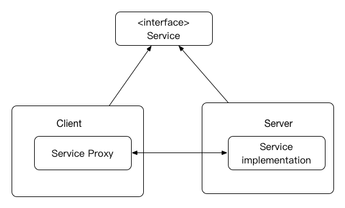
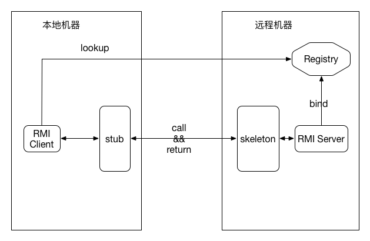
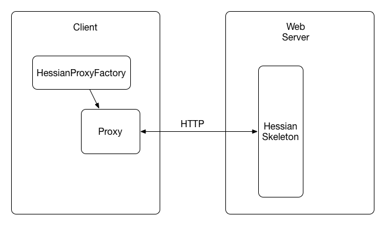
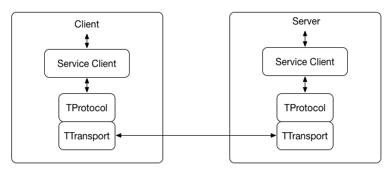
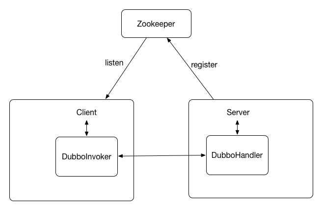

# 6.2 RPC

RPC, Remote Procedure Call,故名思议就是远程过程调用，一般都有跨语言支持。大规模分布式应用中普遍使用RPC来做内部服务、模块之间的数据通信，还有助于解耦服务、系统的垂直拆分，使得系统可扩展性更强，并能够让Java程序员用与开发本地程序一样的语法与方式去开发分布式应用程序。

RPC分为客户端（服务调用方）和服务端（服务提供方），都运行在自己的JVM中。客户端只需要引入要使用的接口，接口的实现和运行都在服务端。RPC主要依赖的技术包括序列化、反序列化和数据传输协议。是一种定义与实现相分离的设计：



目前Java使用比较多的RPC方案主要有RMI、Hessian、Dubbo以及Thrift。

这里需要提出的一点就是，这里的RPC主要指的内部服务之间的调用，因此虽然上一节的RESTful也可以用于内部服务间的调用（跨语言、跨网段、跨防火墙），但其主要用途还是为外部系统提供服务，因此本节没有将其包含在内。

## 6.2.1 RMI

RMI，remote method invoke, 远程方法调用。是JAVA自带的远程方法调用工具，其基于TCP连接，可以使用任意端口，不易跨网段调用，不能穿越防火墙。但它是JAVA语言最开始时的设计，后来很多框架的原理都基于RMI。其调用逻辑如下图所示：



1. 服务注册：服务端注册服务绑定到注册中心registry。
2. 服务查找：客户端根据服务名从注册中心查询要使用的接口获取引用。
3. 服务调用：Stub序列化调用参数并将其发送给Skeleton，后者调用服务方法，并将结果序列化返回给Stub。

其序列化和反序列化使用的都是JDK自带的序列化机制。

这里服务注册管理中心是在服务端的。其实这个可以完全独立出来作为一个单独的服务，其他的RPC框架很多都是选择zookeepr充当此角色。

可以使用Spring那一节讲的RmiServiceExporter和RmiProxyFactoryBean来使用RMI。

## 6.2.2 Hessian

Hessian是一个基于HTTP协议的RPC方案，其序列化机制是自己实现的，负载均衡和容错需要依赖于Web容器/服务。其体系结构和RMI类似，不过并没有注册中心Registry这一角色，而是通过使用地址来显式调用。其中需要使用HessianProxyFactory根据配置的地址create一个代理对象。使用此代理对象去调用服务。



和RMI一样，可以使用Spring那一节讲的HessianServiceExporter和HessianProxyFactoryBean来使用。

## 6.2.3 Thrift

Thrift是Facebook开源的RPC框架，现已进入Apache开源项目。其采用接口描述语言（IDL）定义 RPC 接口和数据类型，通过编译器生成不同语言的代码（支持 C++，Java，Python，Ruby等），数据传输采用二进制格式，是自己实现的序列化机制。没有注册中心的概念。



Thrift的使用需要先编写接口的IDL，然后使用它自带的工具生成代码。

```
namespace java me.rowkey.pje.datatrans.rpc.thrift

typedef i32 int
service TestService
{
    int add(1:int n1, 2:int n2),
}

//代码生成
thrift --gen java TestService.thrift
```

以上即可在gen-java目录下生成TestService的Java代码TestService.java, 其中的核心是接口TestService.Iface，实现此类即可提供服务。需要注意的是Thrift有一个问题就是在接口比较多的时候，生成的Java代码文件太大。

服务提供方：
```
TProcessor tprocessor = 
	new TestService.Processor<TestService.Iface>(new TestServiceImpl());

TServerSocket serverTransport = new TServerSocket(8088);
TServer.Args tArgs = new TServer.Args(serverTransport);
tArgs.processor(tprocessor);
tArgs.protocolFactory(new TBinaryProtocol.Factory());

// 简单的单线程服务模型
TServer server = new TSimpleServer(tArgs);
server.serve();
```

服务消费方：

```
TTransport transport = new TSocket("localhost", 8088, TIMEOUT);
TestService.Client testService = 
	new TestService.Client(new TBinaryProtocol(transport));
transport.open();

int result = testService.add(1,2);
...
```

这里需要说明的一点就是，Thrift提供了多种服务器模型、数据传输协议以及传输层供选择：

- 服务提供者的服务模型除了上面用的TSimpleServer简单单线程服务模型，还有几个常用的模型：

    - TThreadPoolServer：线程池服务模型，使用标准的阻塞式IO，预先创建一组线程处理请求。
    - TNonblockingServe：非阻塞式IO。
    - THsHaServer: 半同步半异步的服务端模型。

- 数据传输协议除了上面例子使用的BinaryProtocol二进制格式，还有下面几种：

    - TCompactProtocol : 压缩格式。
    - TJSONProtocol : JSON格式。
    - TSimpleJSONProtocol : 提供JSON只写协议, 生成的文件很容易通过脚本语言解析。

- 传输层除了上面例子的TServerSocket和TSocket，还有
    
    - TFramedTransport：以frame为单位进行传输，非阻塞式服务中使用。
    - TFileTransport：以文件形式进行传输。
    - THttpClient: 以HTTP协议的形式进行传输。
    
## 6.2.4 Dubbo

Dubbo是阿里开源的服务治理框架。与前面讲的几个RPC协议相比，Dubbo不仅仅是一个RPC框架，还包含了服务治理方面的很多功能：

- 服务注册
- 服务自动发现
- 负载均衡
- 集群容错

这里仅仅针对Dubbo的RPC协议来讲，其传输是基于TCP协议的，使用了高性能的NIO框架Netty，序列化可以有多种选择，默认使用Hessian的序列化实现。Dubbo默认使用Zookeeper作为服务注册、管理中心。



一个基于Spring XML配置的使用例子如下：

- 服务提供者XML配置

	```
	<!-- 消费方应用名，用于计算依赖关系，不是匹配条件，不要与提供方一样 -->
	<dubbo:application name="test_server"/>
	   
	<!-- 使用zk注册中心暴露服务地址 -->
	<dubbo:registry address="zookeeper://zk1.dmp.com:2181?backup=zk2.dmp.com:2181,zk3.dmp.com:2181" file="${catalina.base}/logs/eservice/dubbo.cache"/>
	    
	<dubbo:service path="emailService" interface="me.rowkey.pje.rpc.test.service.IEmailService" ref="emailApiService" />
	```
	
- 服务消费者XML配置

    ```
    <!-- 提供方应用信息，用于计算依赖关系 -->
    <dubbo:application name="test_consumer"/>
    
    <!-- 使用zk注册中心 -->
    <dubbo:registry address="zookeeper://zk1.dmp.com:2181?backup=zk2.dmp.com:2181,zk3.dmp.com:2181" />
    
    <dubbo:reference id="emailService" interface="me.rowkey.pje.rpc.test.service.IEmailService"/>
    ```
    
    在相关bean中注入emailService即可使用。
    
## 6.2.5 序列化

序列化是RPC的一个很关键的地方，序列化、反序列的速度、尺寸大小都关系着RPC的性能。包括上面提到的几个序列化协议，现在使用较为普遍的Java序列化协议有以下几种：

1. Java Serialiazer

    JDK自带的序列化机制, 使用起来比较方便。但是其是对象结构到内容的完全描述，包含所有的信息，因此速度较慢，占用空间也比较大，且只支持Java语言。一般不推荐使用。
    
    需要注意的是字段serialVersionUID的作用是为了在序列化时保持版本的兼容性，即在版本升级时反序列化仍保持对象的唯一性。否则如果你在序列化后更改/删除了类的字段，那么再反序列化时就会抛出异常;而如果设置了此字段的值，那么会将不一样的field以type的预设值填充。
    
    ```
    //序列化
    ByteArrayOutputStream bout = new ByteArrayOutputStream();
    ObjectOutputStream out = new ObjectOutputStream(bout);
    out.writeObject(obj);
    byte[] bytes = bout.toByteArray();
    
    //反序列化
    ObjectInputStream bin = new ObjectInputStream(new ByteArrayInputStream(bytes));
    bin.readObject();
    ```
    
1. Hessian

    底层是基于List和Hashmap实现的，着重于数据，附带简单的类型信息的方法，支持多种语言，兼容性比较好, 与JDK序列化相比高效且空间较小；但其在序列化的类有父类的时候，如果有字段相同，父类的值会覆盖子类的值，因此使用Hessian时一定要注意子类和父类不能有同名字段。
    
    需要注意的一点，Hessian的实现里有v1和v2两种版本的协议支持，并不兼容，推荐使用Hessian2相关的类。
    
    与后来出现的其他二进制序列化工具相比，其速度和空间都不是优势。
    
    ```
    //序列化
    ByteArrayOutputStream os = new ByteArrayOutputStream();
    Hessian2Output out = new Hessian2Output(os);
    out.startMessage();
    TestUser user = new TestUser();
    out.writeObject(user);
    out.completeMessage();
    out.flush();
    byte[] bytes = os.toByteArray();
    out.close();
    os.close();
    
    //反序列化
    ByteArrayInputStream ins = new ByteArrayInputStream(bytes);
    Hessian2Input input = new Hessian2Input(ins);
    input.startMessage();
    TestUser newUser = (TestUser)input.readObject();
    input.completeMessage();
    input.close();
    ins.close();
    ```
    
1. MsgPack

    MsgPack是一个非常高效的对象序列化库，支持多种语言，有点像JSON，但是非常快，且占用空间也较小，号称比Protobuf还要快4倍。
    
    使用MsgPack需要在序列化的类上加@Message注解；为了保证序列化向后兼容，新增加的属性需要加在类的最后面，且要加@Optional注解，否则反序列化会报错。
    
    此外，MsgPack提供了动态类型的功能，通过接口Value来实现动态类型，首先将字节数组序列化为Value类型的对象，然后用converter转化为本身的类型。
    
    MsgPack不足的一点就是其序列化和反序列都非常消耗资源。
    
    ```
    //TestUser.java
    @Message
    public class TestUser{
        private String name;
        private String mobile;
        ...
    }
    
    TestUser user = new TestUser();
    MessagePack messagePack = new MessagePack();
    
    //序列化
    byte[] bs = messagePack.write(user);
    
    //反序列化
    user = messagePack.read(bs, TestUser.class);
    ```
    
1. Kryo

    Kryo是一个快速高效的Java对象图形序列化框架，使用简单、速度快、序列化后体积小。实现代码非常简单，远远小于MsgPack。但其文档较少，跨语言支持也较差，适用于Java语言。目前Kryo的版本到了4.x, 对于之前2.X之前版本的很多问题都做了修复。
        
    ```
    Kryo kryo = new Kryo();
    
    // 序列化
    ByteArrayOutputStream os = new ByteArrayOutputStream();
    Output output = new Output(os);
    TestUser user = new TestUser();
    kryo.writeObject(output, user);
    output.close();
    byte[] bytes = os.toByteArray();
    
    // 反序列化
    Input input = new Input(new ByteArrayInputStream(bytes));
    TestUser newUser = kryo.readObject(input, TestUser.class);
    input.close();
    ```

1. Thrift

    上面讲的Thrift RPC框架其内部的序列化机制可以单独使用，主要是对TBinaryProtocol的使用。和接口的生成方式类似，需要先定义IDL，再使用Thrift生成。其序列化性能比较高，空间占用也比较少。但其设计目标并非是单独做为序列化框架使用的，一般都是整体作为RPC框架使用的。
    
    定义IDL:
    
    ```
    //TestUser.thrift
    namespace java me.rowkey.pje.datatrans.rpc.thrift

    struct TestUser {
    	1: required string name
    	2: required string mobile
    }
    
    thrift --gen java TestUser.thrift
    ```
    
    使用生成的TestUser类做序列化和反序列化：
    
    ```
    TestUser user = new TestUser(); //由thrift代码生成引擎生成
    
    //序列化
    ByteArrayOutputStream bos = new ByteArrayOutputStream();
    user.write(new TBinaryProtocol(new TIOStreamTransport(bos)));
    byte[] result = bos.toByteArray();
    bos.close();
    
    //反序列化
    ByteArrayInputStream bis = new ByteArrayInputStream(result);
    TestUser user = new TestUser();
    user.read(new TBinaryProtocol(new TIOStreamTransport(bis)));
    bis.close();
    ```
    
    需要注意的是由于Thrift序列化时,丢弃了部分信息，使用ID+Type来做标识，因此对新增的字段属性, 采用ID递增的方式标识并以Optional修饰来添加才能做到向后兼容。

1. Protobuf

   Protobuf是Google开源的序列化框架，是Google公司内部的混合语言数据标准，用于RPC系统和持续数据存储系统，非常轻便高效，具有很好的可扩展性、也具有良好的向后兼容和向前兼容性。与上述的几种序列化框架对比，序列化数据紧凑、速度快、空间占用少、资源消耗较低、使用简单，但其缺点在于需要静态编译生成代码、可读性差、缺乏自描述、向后兼容有一定的约束限制。
   
   这里需要注意目前ProtoBuf的版本到了3.x，比2.x支持更多语言但更简洁。去掉了一些复杂的语法和特性，更强调约定而弱化语法。因此，如果是首次使用就直接使用3.x版本。这里也针对Protobuf 3来讲。
   
   首先需要编写.proto文件,并使用Protobuf代码生成引擎生成Java代码。
   
    ```
    //TestUser.proto
    syntax = "proto3";
    option java_package = "me.rowkey.pje.datatrans.rpc.proto";
    option java_outer_classname = "TestUserProto";
    message TestUser
    {
        string name=1;
        string mobile=2;
    }
    
    protoc --java_out=./ TestUser.proto
    ```
   
   即生成TestUserProto.java，使用此类，即可完成序列化和反序列化：
       
    ```
    //序列化
    TestUserProto.TestUser testUser = 
              TestUserProto.TestUser.newBuilder()
              .setMobile("xxx")
              .setName("xxx")
              .build();
      
    byte[] bytes = testUser.toByteArray();
      
    //反序列化
    testUser = TestUserProto.TestUser.parseFrom(bytes);
    ```

综上，对以上几个序列化框架做对比如下：

 | 优点 | 缺点
----|-----|------
Java | JDK自带实现，包含对象的所有信息| 速度较慢，占用空间也比较大，只支持Java语言
Hessian | 支持语言比较多，兼容性较好 | 较慢 
MsgPack | 使用简单，速度快，体积小| 兼容性较差，耗资源
Kryo | 速度快，序列化后体积小 | 跨语言支持较差，文档较少
Thrift | 高效 | 需要静态编译；是Thrift内部序列化机制，很难和其他传输层协议共同使用
Protobuf | 速度快 | 需要静态编译

在兼顾使用简单、速度快、体积小且主要使用在Java开发的场景下，Kryo是比较好的方案；如果特别要求占用空间、性能，那么Protobuf则是更好的选择。此外，JSON其实也是一种序列化方式，如果比较关注阅读性的话，那么JSON是更好的选择。

## 6.2.6 提示

面对这些RPC框架，选择的时候应该从以下几方面进行考虑：

- 是否允许代码侵入：即是否需要依赖相应的代码生成器生成代码，比如Thrift需要，而Dubbo、Hessian就不需要。
- 是否需要长连接、二进制序列化获取高性能：如果需要性能比较高，那么果断选取基于TCP的Thrift、Dubbo。
- 是否需要跨网段、跨防火墙：这种情况一般就需要选择基于Http协议的，Hessian和Thrift的HTTP Transport。
- 是否需要跨语言调用：Thrift、Hessian对于语言的支持是比较丰富的，而Dubbo目前只支持Java语言。

此外，除了上述框架之外，Google推出的基于HTTP 2.0的gRPC框架也开始得到了应用，其序列化协议基于Protobuf, 网络框架使用了Netty4。但其需要生成代码，可扩展性也比较差。


