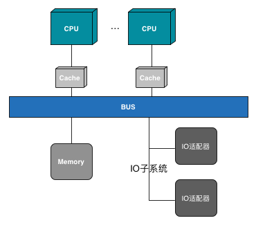
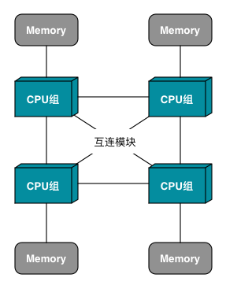
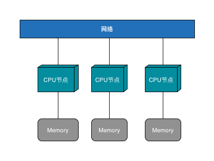
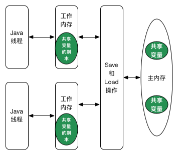
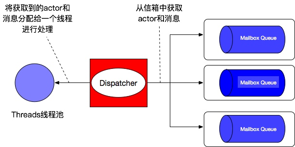

# 7.3 Java并发编程

随着计算机技术的发展，CPU正从以前通过提升频率转变为通过增加核数来提升整体性能，而并发就是利用多核特性的关键技术。本节主要讲述Java语言下的并发编程。

## 7.3.1 并发原理

要了解并发编程，需要先了解并发问题产生的原因，从原理层面理解并发。

### 并发与并行

并发和并行是看起来差不多实则大不一样的两个概念。并发指的是同时应对多件事件的能力，而并行则指同时做多件事情的能力。比如你能够一边吃饭一边看电视这叫做并发，但是你同时是不可能做多件事情的，所以不是并行。而一个班级的学生一起来打扫教室的卫生，同时在扫地、擦黑板以及拖地这就是并行的。

对于程序员来说通常说的并行大多指的是任务级别的并行，而除此之外，计算机在其他层面也有其他的并行实现：

- 位级并行: 32位的计算机能够同时处理32位数的运算，而8位的计算机却要进行多次计算。
- 指令级并行：虽然从表面上看CPU都是在串行执行的，但是内部使用了流水线、乱序执行和猜测执行。
- 数据级并行：可以并行的在大量数据上施加同一类操作，图像处理就是一种非常适合数据级并行的场景。

对于我们常说的任务级并行，其依赖的基础是计算机的多处理器架构，主要有以下三种：

1. SMP: Symmetric Multi-Processor,对称多核架构，也可以叫做统一内存访问架构（UMA，是相对于后面的NUMA来讲的）, 其主要特性就在于所有CPU平等地（无主次或者从属关系）共享所有资源，包括内存、IO、总线等。如下图所示：

    

   
    此种架构，所有CPU都公用一个总线访问内存，并且每个CPU都有自己的缓存。由于缓存相互独立，有一个关键的问题即缓存一致性问题，即如何保证内存中相同地址的数据在各个缓存中保持一致。解决这个问题有很多协议，常见的MESI协议定义了一些缓存读写需要遵循的规范：
   
    - Modified：本CPU写，则直接写到Cache，不产生总线事务；其它CPU写，则不涉及本CPU的Cache，其它CPU读，则本CPU需要把Cache line中的数据提供给它，而不是让它去读内存。 
    - Exclusive：只有本CPU有该内存的Cache，而且和内存一致。本CPU的写操作会导致转到Modified状态。 
    - Shared：多个CPU都对该内存有Cache，而且内容一致。任何一个CPU写自己的这个Cache都必须通知其它的CPU。 
    - Invalid：一旦Cache line进入这个状态，CPU读数据就必须发出总线事务，从内存读。 
   
   通过扩展CPU数目可以提升此种架构的性能，但是相关实验证明，SMP服务器CPU利用率最好的情况是2至4个CPU。

2. NUMA(Non-Uniform Memory Access)

    非一致性内存访问相对于SMP来讲，是其由多个CPU组构成的，每一个CPU组由多个CPU组成，都有自己独立的内存、总线、IO等。不同的CPU组之间可以通过互连模块互相通信和交互，使得每一个CPU都可以访问整个服务器的所有内存，但是访问本地内存的效率远远高于远程内存。
    

3. MPP(Massive Parallel Processing)

    大规模并行处理架构也可以叫做分布式内存架构，即CPU单元是地理上隔离的，其交互使用网络来进行（受控的数据交换），其设计初衷就是消除共享资源。每个节点是一个独立的SMP服务器，只能访问自己的本地资源，是一种完全无共享的结构，因而扩展能力最好，经常用做海量数据分析架构，如大数据领域的Impala、Presto都是MPP架构。从总体结构上看，有点类似于Hadoop大数据集群（本质上是不同的两个概念）。
    
    

本文的并发是宏观上的一个概念，到了微观层面由于CPU数目的限制仍然是串行或者部分串行的。

### Java内存模型

提到Java中的并发问题，其关键的一点就在于其内存模型，如下图所示：

如上图所示，有点类似于SMP，但Java内存模型是屏蔽了底层硬件环境的差异给Java程序提供了统一的内存访问模式，可以认为是一种虚拟内存环境。在Java程序中，所有线程都共享主内存，但是对于每一个线程都有自己的工作内存（一个虚拟的概念，包括寄存器、栈、写缓冲区、缓存以及其他硬件、编译器优化等），工作内存与主内存通过一些规定的操作来交互同步数据。而线程只能访问自己的工作内存。因此在多线程环境下，很容易造成工作内存数据不一致而引起并发问题。

基于Java内存模型，Java的运行时内存可以做以下类比：主内存就是堆，用来保存对象信息；工作内存就是栈用来保存线程私有的对象地址、基本类型、局部变量、PC指针等信息。当然，这个类比并不具有实际意义，因为这两者就不相关。

以上经常造成的一个现象就是：当多个线程同时访问同一内存时，在每个线程的工作内存中的缓存不一致。比如主内寸地址A处的数据，在线程1中缓存为a1，在线程2中缓存为a2,开始时a1=a2，但当某一个线程修改了自己工作内存中的值，却又没有采取相应的内存同步措施时就会造成A地址的值在线程1、2中不一样。

### 重排序

在执行程序时，为了提高性能，编译器和处理器常常会对指令做重排序，可以分为三种：

- 编译器优化的重排序：在不改变单线程程序语义的前提下，可以重新安排语句执行顺序。
- 指令级并行的重排序：对应于上面所说的指令级并行技术。如果不存在数据依赖性，处理器可以改变语句对应机器指令的执行顺序。
- 内存重排序：由于处理器使用缓存、读/写缓冲区，使得加载和存储操作看上去可能是在乱序执行。

指令和内存重排序都属于处理器重排序。

这些基础层面的重排序会遵循以下规范以保证程序的正确性：

- 数据依赖性：即如果两个操作访问同一个变量，且这两个操作中有一个为写操作，那么这两个操作之间就存在数据依赖性。此时，编译器和处理器不会改变存在数据依赖关系的两个操作的执行顺序。这里需要注意的是不同处理器之间和不同线程之间的数据依赖性不被编译器和处理器考虑。
- as-if-serial语义：不管怎么重排序，单线程程序的执行结果不能被改变。编译器，runtime和处理器都必须遵守此语义。

编译器和处理器的重排序由于未考虑到多线程、多处理器的情况，因此在并发环境下会造成不可预知的问题。

### 并发问题

如上文所述，并发首先带来的问题就是并发的正确性问题，也就是线程安全的问题。这里的线程安全指的是“当多个线程访问一个对象时，如果不用考虑这些线程在运行时环境下的调度和交替执行，也不需要进行额外的同步，或者在调用方进行任何其他的协调操作，调用这个对象的行为都可以获得正确的结果，那么这个对象是线程安全的。”

此外，多线程之间还存在一个线程同步的问题，即线程之间如何通信协作。

以上两种问题都是Java编程中需要解决的东西。

## 7.3.2 并发思路

除了重排序和Java内存模型，可变数据是引起线程不安全的最根本原因。如果一个数据不可变，那么无论多少线程同时访问都是不会产生问题的，就好比每个线程都拿到了一个copy，但这copy都是不可变的，也就不可能存在并发问题。针对这些，已经有一些技术方案能够解决线程安全的问题。概括来看，都是围绕着在并发过程中如何处理原子性、可见性以及有序性来进行的。

### happens-before

为了在一定程度上解决上文提到的编译器、处理器的重排序问题，从Java5开始提出了happens-before（先行发生原则）的概念，通过此概念阐述操作之间的内存可见性：如果一个操作执行的结果需要对另一个操作可见，那么这两个操作之间必须存在happens-before关系。这两个操作既可以在一个线程内也可以在不同线程之间。通过此原则，可以判断数据是否存在竞争、线程是否安全。

- 程序次序法则：在一个线程内如果编码中A操作写在B操作之前，那么happens before。

- 监视器锁法则: 对一个监视器的解锁一定发生在后续对同一监视器加锁之前。锁必须是同一锁。

- volatile变量法则：写volatile变量一定发生在后续对它的读之前。

- 线程启动法则： Thread.start一定发生在线程中的动作之前。

- 线程终结法则： 线程中的任何动作一定发生在括号中的动作之前（其他线程检测到这个线程已经终止，从Thread.join调用成功返回，Thread.isAlive()返回false）。

- 线程中断法则：一个线程调用另一个线程的interrupt一定发生在另一线程发现中断之前，通过Thread.interrupted()方法检测到是否有中断发生。

- 对象终结法则：一个对象的构造函数结束一定发生在对象的finalize()方法之前。

- 传递性：A发生在B之前，B发生在C之前，A一定发生在C之前。

此原则在一定程度上解决了可见性和有序性的问题，是Java内存模型中的“天然的”先行发生关系，无须任何同步器协助就已经存在。如果两个操作不在上述的规则中，也无法通过以上规则推导出来，那么虚拟机就可以随意对它们进行重排序。需要注意的是，这里的先行发生原则和时间先后顺序之间基本没有关系。

### 原子性

原子性指的是对于此对象的操作要么成功要么失败，不会存在中间状态。使用具有原子性对象的方法是线程安全的。

Java中类型的原子性如下：

- 对象类型
    - 对象地址原子读写，线程安全。
    - 并发读不可变状态，线程安全。
    - 并发读写可变状态，非线程安全。

- 基本类型
    - int、char数值读写，线程安全。
    - long、double读/写分为高低位两部分，非线程安全。
    - i++等组合操作，非线程安全。

以上，对于具有原子性的操作是可以保证线程安全的；对不具有原子性的操作，可以使用synchronized或者volatile关键字使其具有原子性。但需要注意的是：当变量的值由自身的上一个决定时，如n=n+1、n++ 等，volatile关键字将失效。而对于基本数据类型则可以使用其对应的原子包装类如AtomicLong、AtomicInteger来获得读写、自增等操作的原子性。

### 可见性

可见性指的是当一个对象在多个线程工作内存中存有副本时，如果一个内存修改了共享变量，其他线程也能够看到被修改后的值。

- final：初始化final字段确保可见性，这里需要注意final修饰基本数据类型，可以保证此字段的可见性，但是如果修饰的是对象，那么需要保证此对象是状态不可变的才能保证可见性，即保证对象的每个字段也是final的。
- volatile: 此关键字的语义保证了新值能够立即同步到主内存，并且每次使用前都立即从主内存刷新。volatile保证了多线程操作时变量的可见性。
- synchronized: 通过锁定和解锁某个监视器同步所有变量的值，确保了同步块内读写字段的可见性。
- 如上文所述，happens-before解决了大多数可见性问题。

### 有序性

- happens-before解决了Java中“天然的”有序问题：在一个线程中所有操作都是有序的；其他符合happens-before原则的或者可以推导出的操作都是有序的。
- volatile可以创建内存屏障（指令重排序时不能把后面的指令重排序到内存屏障之前的位置）禁止指令重排序。
- synchronized“一个变量在同一时刻只允许一条线程对其进行lock操作”，使得持有同一锁的两个同步块只能串行地进入。

### 提示

以上，可见使用volatile可以在一定程度上解决并发问题，并且由于其开销较少，在其语义能够解决问题的情况下，优先选择volatile，不过其相对于非volatile的变量来说也是有开销的，这也是Effective Java中的DCL（Double Check Locking）的实现多使用了一个本地变量能够提高25%效率的原因。此外，可以发现synchronized貌似是万能的，但是万能的东西通常会伴随着性能问题。

## 7.3.3 并发工具

JDK自身以及一些第三方类库提供了一些工具类帮助我们来解决并发问题，进行并发编程。

### 锁

锁是通过互斥同步来解决线程安全问题的。万能的synchronized关键字是锁的一种。除此之外，ReentrantLock是另一种锁方案。字面上即为可重入锁。这里的可重入指的是：同一线程，外层函数获得锁之后内层递归函数如果仍然有获取该锁的代码，不受影响。synchronized也是可重入的。

ReentrantLock与synchronized相比，更加灵活，且具有等待可中断、可实现公平锁、可以绑定多个条件等特性：
        
- 等待可中断： 当持有锁的线程长期不释放锁的时候，正在等待的线程可以选择放弃等待，改为处理其他事情。
- 公平锁：多个线程在等待同一个锁时，必须按照申请锁的时间顺序来依次获得锁；非公平锁则不保证这一点，在锁被释放时，任何一个等待锁的线程都有机会获得锁。synchronized中的锁是非公平的，ReentrantLock默认也是非公平的，但听过配置可以使用公平锁。
- 绑定多个条件：synchronized中，锁对象的wait、notify或者notifyAll可以实现一个隐含的条件，如果要和多于一个条件进行关联，那么不得不额外的添加一个锁。而ReentrantLock可以通过newCondition方法绑定多个条件。
    
此外，ReentrantLock通过使用condition的await和signal可以做到线程间通信的目的。

### 无锁

除了使用锁解决并发问题，还有一些无锁技术可以解决并发问题。

- CAS: compare and swap，这是一种类似于乐观锁的机制，需要操作系统的支持。每次更新值得时候都使用旧值与变量的当前值做比较，如果相同则进行更新，否则重试直到成功。上面提到的AtomicInteger、AtomicLong等原子包装类型就使用了CAS。
- ThreadLocal：本地存储变量，这样每一个线程都有一份数据的拷贝，也就不会存在并发问题了。
- 不可变对象：不可变对象自然不会有并发问题。

这里还需要提到AQS（全称AbstractQueuedSynchronizer，基于CAS来保证线程安全），是Java并发包中的一个类，提供了一些模板方法供子类实现，从而实现了不同的同步器：Sync、FairSync、NonfairSync等。ReentrantLock、ReentrantReadWriteLock以及ThreadPoolExecutor都使用了AQS。

### 并发集合

并发集合指的就是Java自身提供的java.util.concurrent下的集合类，以下是常用的几个：

- ConcurrentHashMap：是HashMap的线程安全版本，与使用Collecitons.synchronizedXX方法包装不安全的HashMap相比，ConcurrentHashMap是依据bucket做的锁，锁的粒度减小使得性能得到了提高。
- CopyOnWriteArrayList：此类是ArrayList的线程安全版本，用了持久化数据结构，即当写入list的时候会使用原list的一个副本来进行操作。
- LinkedBlockingQueue：阻塞队列实现。通过阻塞来解决线程安全问题。

### 同步器

同步器的类也位于java.util.concurrent包下。主要有以下几个：

- CountDownLatch：使用它可以实现类似计数器同步的功能。比如某一个任务需要等待其他n个任务执行完毕之后才能执行，就可以利用CountDownLatch来实现。
- CyclicBarrier：可以实现让一组线程等待至某个状态之后再全部同时执行。Cyclic指的是当所有等待线程都被释放以后，CyclicBarrier可以被循环使用。调用await()方法之后，线程就处于Barrier状态。
- Semaphore：基于计数的信号量，可以控制同时访问的线程个数。通过acquire()获取一个许可，如果获取不到就等待。后续通过release()释放一个许可。当计数值为1时，成为一种类互斥锁。

### 并发框架

- Executor：这个是Java自带的一个并发框架，封装了并发常用的一些操作。通过调用Executors的newXXX方法可以创建各种ExecutorService（可以看做线程池），包括单线程、固定数目线程池、可扩展线程池、定时调度线程池等，之后使用ExecutorService的execute和submit方法运行任务，使用scheduleWithFixedDelay和scheduleAtFixedRate周期性运行任务。这里需要注意的一点是，submit和周期性调度方法都对任务的异常做了捕获（本质是FutureTask对异常做了捕获），当任务代码抛出异常时，无法拿到错误，并且当使用的是周期调度时任务抛出异常后即会停止，不会再周期进行下去。所以需要对任务（Runnable或者Callable）捕获异常并处理。Spring实现的ThreadPoolTaskExecutor同样是这种行为，但ThreadPoolTaskScheduler则使用ErrorHandler对异常做了处理。

- Fork/Join：此框架是Java7带来的一个并发框架。原理类似于MapReduce，是基于分治法的一种方案，任务可以递归地分解为子集。这些子集可以并行处理，然后每个子集的结果被归并到一个结果中。和ThreadPoolExecutor类一样，它也实现了Executor和ExecutorService接口。但与我们平常使用ThreadPoolExecutor相比，其Work Stealing(工作窃取)可以使得各个线程的负载能够均衡，不会存在任务分配不均的情况。

- Actor: 一种并发模式，在JVM上的实现是Akka框架。它的“任其崩溃”哲学在很多场景下都很有意义：每个Actor之间都是互相独立的，互不影响，只要考虑最自然的业务逻辑即可，无须做“防御式编程”。除此之外，Actor也能够做分布式通信工具，作为RPC的一种方案。这里需要注意的是，标准的Actor（如Erlang中的）是和线程没有关系的，其是一个独立于操作系统的一种实体，可以认为是和线程并列的概念。但是Akka的实现中，Actor并不具有线程的特性，无法被系统调度，也无法主动让出CPU。因此，在JVM上，Actor的使用需要慎重。况且，如下图所示，Actor最终的处理还是依靠的线程池。
    
    
    
此外，在消息中间件一节讲过的Disruptor也是一种高性能并发框架。

## 7.3.4 并发编程建议

1. 给线程命名，这样可以帮助调试。

1. 为了充分利用又不过分利用CPU,线程数的计算公式为CPU数目*(W+C)/C,其中W为线程平均等待时间，C为线程平均运行/计算时间。此外，还需要考虑内存的限制（线程栈的大小）以及系统对线程数目的限制。

1. 使用不可变类，所有属性和类都是final不可变的，可以保证线程安全。

1. 总是按照一个全局的固定的顺序获取多把锁，可以避免死锁的产生。实例可以参考经典的哲学家就餐问题。

1. 最小化同步的范围，而不是将整个方法同步，只对关键部分做同步。 

1. 分段锁：ConcurrentHashMap就是采用的此种方式。

1. 如果可以，更偏向于使用 volatile 而不是 synchronized。 

1. 使用更高层次的并发工具，而不是使用wait()和notify()来实现线程间通信，如BlockingQueue、CountDownLatch 及 Semaphore。

1. 优先使用并发集合，而不是对集合进行同步，并发集合能够提供更好的可扩展性。    

