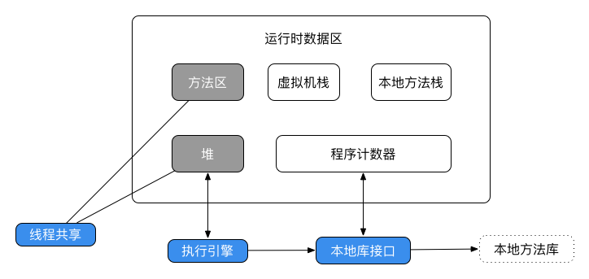
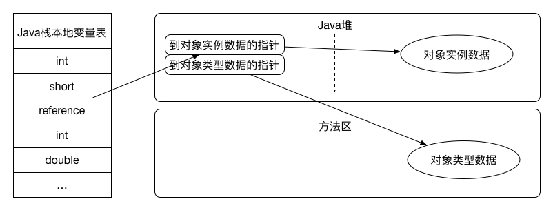
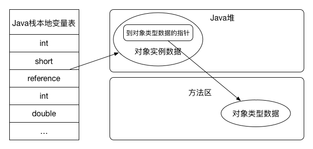
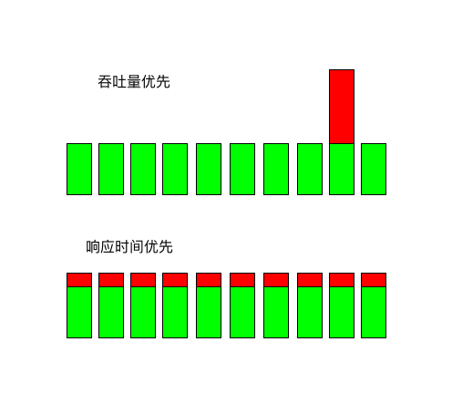
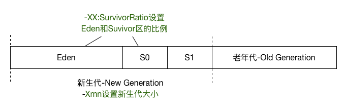
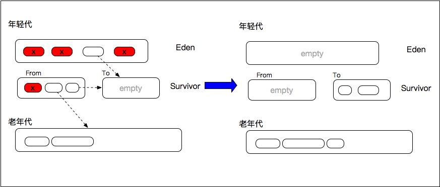
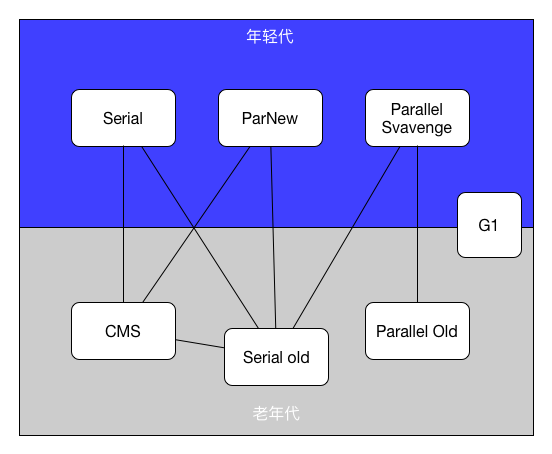
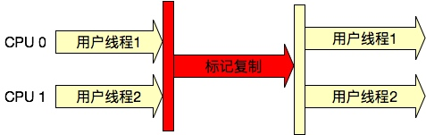
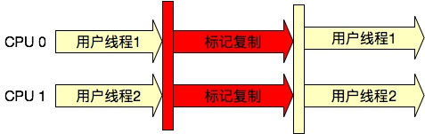

# 7.1 Java内存管理

对于一个Java程序员来说，大多数情况下的确是无需对内存的分配、释放做太多考虑，对JVM也无需有多么深的理解的。但是在写程序的过程中却也往往因为这样而造成了一些不容易察觉到的内存问题，并且在内存问题出现的时候，也不能很快的定位并解决。因此，了解并掌握Java的内存管理是一个合格的Java程序员必需的技能，也只有这样才能写出更好的程序，更好地优化程序的性能，避免出现内存问题。

对于Java来说，最终是要依靠字节码运行在JVM上的。常见的JVM有以下几种：

- Oracle HotSpot
- Oracle JRockit（原来的Bean JRockit）
- IBM J9
- Dalvik（Android）
- ART（Android4.4后引入）

其中以HotSpot应用最广泛，开源的OpenJDK也是使用的此JVM。目前Oracle JDK的最新GA版本已经到了9，但鉴于现在JDK8、9并未完全普及，因此本文仅仅针对HotSpot虚拟机的JDK7版本来讲。

## 7.1.1 JVM虚拟机内存

Java内存管理指的就是对JVM虚拟机的内存管理，需要从内存组成、内存分配过程、对象访问等几个方面来进行讲述。

### Java运行时内存区

Java的运行时内存组成如下图所示：



这些组成部分有一些是线程私有的，其他则是线程共享的。

1. 线程私有

    - 程序计数器: 当前线程所执行的字节码的行号指示器。
    - Java虚拟机栈: Java方法执行的内存模型，每个方法被执行时都会创建一个栈帧，存储局部变量表、操作栈、动态链接、方法出口等信息。每个线程都有自己独立的栈空间；线程栈只存基本类型和对象地址；方法中局部变量存放在线程空间中。
    - 本地方法栈: Native方法服务。在HotSpot虚拟机中和Java虚拟机栈合二为一。

2. 线程共享

    - Java堆：存放对象实例，几乎所有的对象实例及其属性都在这里分配内存。此外，JVM在内存新生代Eden Space中开辟了一小块线程私有的区域，称作TLAB（Thread-local allocation buffer），也是每个线程的缓冲区。默认设定为占用Eden Space的1%。在编译器做逃逸分析的时候，根据分析的结果，决定是否在栈上还是堆上分配内存，如果是堆上则再分析是否在TLAB上分配内存。在TLAB上分配由于是线程私有，没有锁的开销，效率比较高。
    - 方法区：存储已经被虚拟机加载的类信息、常量、静态变量、JIT编译后的代码等数据，也被称作永久代。这里需要注意的是Java7已经把字符串常量池移动到了堆中，调用String的intern方法时，如果堆中的存在相同的字符串对象，则会直接保存对象的引用，不会重新创建对象。
    - 直接内存：NIO、Native函数直接分配的堆外内存。DirectBuffer引用也会使用此部分内存。
    
### 内存分配过程

1. 编译器通过逃逸分析，确定对象是在栈上分配还是在堆上分配。如果是在栈上分配，则将对象打散（每一个字段做为一个局部变量）分配在栈上。
1. 如果tlab_top + size <= tlab_end，则在在TLAB上直接分配对象并增加tlab_top 的值，如果现有的TLAB不足以存放当前对象则3。
1. 重新申请一个TLAB，并再次尝试存放当前对象。如果放不下，则4。
1. 在Eden区加锁（这个区是多线程共享的），如果eden_top + size <= eden_end则将对象存放在Eden区，增加eden_top 的值，如果Eden区不足以存放，则5。
1. 执行一次Young GC（Minor GC）。
1. 经过Young GC之后，如果Eden区任然不足以存放当前对象，则直接分配到老年代。
    
### 对象访问

Java是面向对象的一种编程语言，那么如何通过引用来访问对象呢？一般有两种方式：

1. 通过句柄访问

    
    
    此方式，引用保存的是句柄的地址，需要先定位句柄，再定位对象的实例和类型地址。

2. 直接指针

    

    此种方式引用直接保存的是对象实例的地址，对象实例中保存了类型数据的指针。是HotSpot虚拟机采用的方式。 
    
### Java对象大小

一个Java对象的内存占用包括对象头和对象成员变量两部分。其中对象头主要包括mark word(对象的锁信息、GC信息、hash值等)、类信息引用（对象所属的类）、数组长度（数组类型特有）以及padding（填充以按照8字节对齐）。而成员变量包括对其他对象的引用以及基本数据类型。由此可知，一个Java空对象（new Object()）的内存占用就是其对象头的占用内存。那么在32位JVM上，mark word是4字节，类信息引用也为4字节，总共占用8字节。64位JVM上，mark word为8字节，类信息引用在开启压缩指针下占用4字节，总共占用12字节，然而由于Java对象是按照8字节对齐分配的，因此实际占用16字节，和未开启压缩指针是一样的。此外，数组也是对象，其有一个记录数组长度的int类型，之后是数组的每一个元素：基本数据类型或者引用。

还需要说明一下提到的压缩指针技术（可以通过-XX:+UseCompressedOops开启）。此技术主要用来在64位JVM中节省对象引用/指针的内存占用（相比32位，64位对象指针内存占用会翻倍）。由于Java对象是8字节对齐, 起始地址最低三位都是0, 开启了压缩指针的64位JVM上会把基地址的偏移量右移三位后保存到32位地址, 访问的时候再把32位地址左移三位，于是就可以使用32位地址访问最大32GB（4GB * 8）的内存（堆+永久代/元空间）。
        
### 内存溢出

在JVM申请内存的过程中，会遇到无法申请到足够内存，从而导致内存溢出的情况。一般有以下几种情况：

- 虚拟机栈和本地方法栈溢出
    - StackOverflowError: 线程请求的栈深度大于虚拟机所允许的最大深度。循环递归会触发此种OOM。
    - OutOfMemoryError: 虚拟机在扩展栈时无法申请到足够的内存空间，一般可以通过不停地创建线程触发此种OOM。
- Java堆溢出: 当创建大量对象并且对象生命周期都很长的情况下，会引发OutOfMemoryError。
- 方法区溢出：方法区存放Class等元数据信息，如果产生大量的类（使用CGLIB），那么就会引发此内存溢出，OutOfMemoryError:PermGen space，在使用Hibernate等动态生成类的框架时会容易引起此种情况。

## 7.1.2 垃圾收集理论

在通常情况下，我们掌握Java的内存管理就是为了应对网站/服务访问慢，慢的原因一般有以下几点：

- 内存：垃圾收集占用CPU；放入了太多数据，造成内存泄露。
- 线程死锁。
- IO速度太慢。
- 依赖的其他服务响应太慢。
- 复杂的业务逻辑或者算法造成响应的缓慢。

其中，垃圾收集对性能的影响一般有以下几个：

- 内存泄露
- 程序暂停
- 程序吞吐量显著下降
- 响应时间变慢

### 垃圾收集的一些基本概念

- Concurrent Collector: 收集的同时可运行其他的工作进程。
- Parallel Collector: 使用多CPU进行垃圾收集。
- Stop-the-word(STW): 收集时必须暂停其他所有的工作进程。
- Sticky-reference-count：对于使用“引用计数”（reference count）算法的GC，如果对象的计数器溢出，则起不到标记某个对象是垃圾的作用了，这种错误称为sticky-reference-count problem，通常可以增加计数器的bit数来减少出现这个问题的几率，但是那样会占用更多空间。一般如果GC算法能迅速清理完对象，也不容易出现这个问题。
- Mutator：mutate的中文是变异，在GC中即是指一种JVM程序，专门更新对象的状态的，也就是让对象“变异”成为另一种类型，比如变为垃圾。
- On-the-fly：On-the-fly引用计数垃圾回收，用来描述某个GC的类型。此GC不用标记而是通过引用计数来识别垃圾。
- Generational GC：这是一种相对于传统的“标记-清理”技术来说，比较先进的GC。特点是把对象分成不同的generation，即分成几代人，有年轻的，有年老的。这类GC主要是利用计算机程序的一个特点，即“越年轻的对象越容易死亡”，也就是存活的越久的对象越有机会存活下去。
- Safepoint：指一些特定的位置，当线程运行到这些位置时，线程的一些状态可以被确定，信息能够被很好地描述，可以让JVM安全地进行一些操作，包括GC、取消偏向锁、类重定义、线程/堆dump、代码反优化等。这些操作触发进入Safepoint即意味着JVM进程的阻塞停顿（JNI调用不受影响）。Safepoint的位置主要有:
    - 一个方法返回前。
    - 调用方法的call指令之后。
    - 抛出异常的位置。
    - 循环的末尾，可以防止大循环的时候一直不进入Safepoint，而其他线程在等待。

    需要特别说明的是最后一点，如果是被JIT编译后的二进制码，则只有在无界循环的末尾才会进入Safepoint，而循环计数使用long类型，即使有次数限制，也被认为是无界循环。有界循环如果没有方法调用或者方法调用被内联则需要一直到循环结束才会进入Safepoint。
- Safe region: 触发进入Safepoint的操作时，正在运行的线程能够进入到Safepoint，阻塞或者Sleep的线程则无法主动进入。这种线程会被标记为进入了Safe region，其中的引用不会被修改，可以看做一个扩大的Safepoint。等线程被唤醒离开Safe region时则需要判断触发进入Safepoint的操作（GC、类重定义等）是否完成，如果未完成，则挂起。

### 吞吐量与响应时间

牵扯到垃圾收集，还需要搞清楚吞吐量与响应时间的含义：

- 吞吐量是对单位时间内完成的工作量的量度。如：每分钟的Web服务器请求数量。
- 响应时间是提交请求和返回该请求的响应之间使用的时间。如：访问Web页面花费的时间。

吞吐量与访问时间的关系很复杂，有时可能以响应时间为代价而得到较高的吞吐量，而有时候又要以吞吐量为代价得到较好的响应时间。而在其他情况下，一个单独的更改可能对两者都有提高。

通常，平均响应时间越短，系统吞吐量越大；平均响应时间越长，系统吞吐量越小；但是，系统吞吐量越大，未必平均响应时间越短；因为在某些情况（例如不增加任何硬件配置）吞吐量的增大，有时会把平均响应时间作为牺牲，来换取一段时间处理更多的请求。

针对于Java的垃圾回收来说，不同的垃圾回收器会不同程度地影响这两个指标。例如：并行的垃圾收集器，其关注的是吞吐量，会在一定程度上牺牲响应时间；而并发的收集器，则主要关注的是请求的响应时间，会牺牲吞吐量。



如图,吞吐量优先的垃圾回收期，有可能某一次请求会特别慢；而响应时间优先的垃圾回收器则会尽量使得每一次的响应时间维持在差不多的水平。

### GC流程和算法

GC的一般流程如下：

- 找出堆中活着的对象。
- 释放死对象占用的资源。
- 定期调整活对象的位置。

在找出活着的对象以及释放死对象的有以下算法：

- Mark-Sweep：标记-清除
- Mark-Sweep-Compact：标记-整理
- Copying Collector：复制算法

1. Mark-标记

    从“GC roots”开始扫描（这里的roots包括线程栈、静态常量等），给能够沿着roots到达的对象标记为“live”,最终所有能够到达的对象都被标记为“live”,而无法到达的对象则为“dead”。效率和存活对象的数量是线性相关的。
    
2. Sweep-清除

    扫描堆，定位到所有“dead”对象，并清理掉。效率和堆的大小是线性相关的。

3. Compact-压缩

    对于对象的清除，会产生一些内存碎片，这时候就需要对这些内存进行压缩、整理。包括：relocate（将存货的对象移动到一起，从而释放出连续的可用内存）、remap（收集所有的对象引用指向新的对象地址）。效率和存活对象的数量是线性相关的。
    
4. Copy-复制

    将内存分为“from”和“to”两个区域，垃圾回收时，将from区域的存活对象整体复制到to区域中。效率和存活对象的数量是线性相关的。
    
其中，Copy对比Mark-Sweep：

1. 内存消耗：Copy需要两倍的最大live set内存；Mark-Sweep则只需要一倍。
2. 效率上：Copy与live set成线性相关，效率高；Mark-Sweep则与堆大小线性相关，效率较低。

### 分代收集

分代收集是目前比较先进的垃圾回收方案。有以下几个相关理论：

- 分代假设：大部分对象的寿命很短，“朝生夕死”，重点放在对新生代对象的收集，而且新生代通常只占整个空间的一小部分。
- 把新生代里活的很长的对象移动到老年代。
- 只有当老年代满了才去收集。
- 收集效率明显比不分代高。

HotSpot虚拟机的分代收集，分为一个Eden区、两个Survivor区以及Old Generation/Tenured区，其中Eden以及Survivor共同组成New Generatiton。结构如下：



- Eden区是分配对象的区域。
- Survivor是minor/younger gc后存储存活对象的区域。
- Old Generation区域存储长时间存活的对象, 也被称作Tenured区。

分代收集中典型的垃圾收集算法组合描述如下：

- 新生代通常使用Copy算法收集，会Stop The World。
- 老年代收集一般采用Mark-Sweep-Compact, 有可能会Stop The World，也可以是concurrent或者部分concurrent。

通常将对New Generation进行的回收称为Minor GC；对Old Generation进行的回收称为Major GC。但由于Major GC除并发GC外均需对整个堆以及Permanent Generation进行扫描和回收，因此又称为Full GC。那么何时进行Minor GC、何时进行Major GC? 一般的过程如下：



- 对象在Eden Space完成内存分配。
- 当Eden Space满了，再创建对象，会因为申请不到空间，触发Minor GC，对New Generation（Eden + S0 或 Eden + S1）进行垃圾回收。
- Minor GC时，Eden Space不能被回收的对象被放入到空的Survivor（S0或S1，Eden肯定会被清空），另一个Survivor里不能被GC回收的对象也会被放入这个Survivor，始终保证一个Survivor是空的。
- 在上一步时，如果发现Survivor区满了，则这些对象被copy到old区，或者Survivor并没有满，但是有些对象已经足够Old，也被放入Old区。
- 当Old区被放满之后，进行Full GC。

但这个具体还需要看JVM是采用的哪种GC方案。新生代New Generation的垃圾回收器均是在Eden Space分配不下时触发GC，而老年代Old Generation的GC有以下几种情况：

1. 对于Serial Old、Parallel Old而言触发机制为：

    - Old Generation空间不足。
    - Permanent Generation空间不足、
    - Minor GC时的悲观策略。
    - Minor GC后在Eden上分配内存仍然失败。
    - 执行Heap Dump时。
    - 外部调用System.gc。可通过-XX:+DisableExplicitGC来禁止触发gc，但需要注意的是禁用System.gc()会引起使用NIO时的OOM，所以此选项慎重使用。

1. 对于CMS而言触发机制为:

    - 当Old Generation空间使用到一定比率时触发。通过CMSInitiatingOccupancyFaction来设置。默认值是根据如下公式计算出来的：
        
        ```
        ((100 -MinHeapFreeRatio) +(double)(CMSTriggerRatio* MinHeapFreeRatio) / 100.0)/ 100.0，
        ```
        其中，MinHeapFreeRatio默认值为40，CMSTriggerRatio默认值为80。
    - 当Permanent Generation采用CMS收集且空间使用到一定比率触发，Permanent Generation采用CMS收集需设置：-XX:+CMSClassUnloadingEnabled。可通过CMSInitiatingPermOccupancyFraction来设置。它是根据如下公式计算出来的：
    
        ```
        ((100 -MinHeapFreeRatio) +(double)(CMSTriggerPermRatio *MinHeapFreeRatio) / 100.0)/ 100.0
        ```
        MinHeapFreeRatio默认值为40，CMSTriggerPermRatio默认值为80。
    - HotSpot根据成本计算决定是否需要执行CMS GC，可通过-XX:+UseCmsInitiatingOccupancyOnly来去掉这个动态执行的策略。
    - 外部调用System.gc，且设置了ExplicitGCIInvokesConcurrent或者ExplicitGCInvokesConcurrentAndUnloadsClasses。

## 7.1.3 HotSpot垃圾收集器



上图即为HotSpot虚拟机的垃圾收集器组成。

### Serial收集器

- -XX:+UserSerialGC参数打开此收集器、
- Client模式下新生代默认的收集器。
- 较长的Stop The World时间。
- 简单而高效。如果堆小于100MB选择此收集器即可。

此收集器的一个工作流程如下如所示：



在标记复制阶段会Stop The World。

### ParNew收集器

- -XX:+UserParNewGC开启此收集器。
- +UseConcuMarkSweepGC时默认开启。
- Serial收集器的多线程版本。
- 默认线程数与CPU数目相同，可以通过-XX:ParrallelGCThreads指定线程数目。



不同于Serial收集器，GC阶段是多线程并发进行的。

### Parallel Scavenge收集器

- 是Server模式的默认新生代收集器。
- 是新生代并行收集器。
- 采用Copy算法。
- 主要关注的是吞吐量，吞吐量优先。
- 使用-XX:MaxGCPauseMillis和-XX:GCTimeRatio两个参数精确控制吞吐量。
- -XX:UseAdaptiveSizePolicy打开GC自适应调节策略，虚拟机会根据当前系统的运行情况收集性能监控信息，动态调整Survivor区大小、新生代晋升到老年代的年龄等参数以提供最合适的停顿时间或最大的吞吐量。
- Parallel是本章讲述的收集器中唯一不进行保留内存（Reserved Memory）释放的收集器，因此当想要达到内存的垂直伸缩时，不能使用此收集器。

其收集流程和ParNew类似, 不同之处在于其各种参数是自适应调节的。

### Serial Old收集器

- Serial的老年代版本。
- Client模式的默认老年代收集器。
- CMS收集器的后备预案，Concurrent Mode Failure时使用、
- -XX:+UseSerialGC开启此收集器。

流程和Serial类似，GC采用标记整理算法。

### Parallel Old收集器

- -XX:+UseParallelGC和-XX:+UseParallelOldGC启用此收集器。
- Server模式的默认老年代收集器。
- Parallel Scavenge的老年代版本，使用多线程和“标记-整理”算法。
- 关注吞吐量，适合CPU资源敏感的场景。
- 使用Parallel Scavenge + Parallel Old可以达到最大吞吐量保证。

流程和Parallel Scavenge类似，GC采用标记整理算法。

### CMS收集器

- 是并发低停顿收集器，关注的是业务响应时间。
- -XX:UseConcMarkSweepGC 开启CMS收集器，默认使用ParNew作为新生代收集器，SerialOld作为收集失败的垃圾收集器。
- 以获取最短回收停顿时间为目标的收集器，重视响应速度，希望系统停顿时间最短，适合互联网应用。

其垃圾回收有四步，如下图所示：


- 初始标记：Stop The World。只标记GC roots能直接关联到的对象，速度很快。
- 并发标记：进行GC roots tracing，与用户线程并发进行。
- 重新标记：Stop The World，修正并发标记期间因程序继续运行导致变动的标记记录。
- 并发清除。

CMS有以下的缺点：

- CMS是唯一不进行compact的垃圾收集器，当CMS释放了垃圾对象占用的内存后，它不会把活动对象移动到老年代的一端。
- 对CPU资源非常敏感。不会导致线程停顿，但会导致程序变慢，总吞吐量降低。CPU核越多越不明显。适用于业务应用CPU使用率不高的场景。
- 无法处理浮动垃圾。可能出现“Concurrent Mode Failure”失败， 导致另一次Full GC ,可以通过调整-XX:CMSInitiatingOccupancyFraction来控制内存占用达到多少时触发GC。
- 大量空间碎片。这个可以通过设置-XX:UseCMSCompacAtFullCollection（是否在Full GC时开启compact）以及-XX:CMSFullGCsBeforeCompaction（在进行compact前Full GC的次数）来一定程度解决此问题。

### G1收集器

G1算法在Java6中还是试验性质的，在Java7中已经正式引入，在Java8中开始有了性能上的巨大提升。这里做一下简单介绍：

- -XX:+UseG1GC可以打开此垃圾回收器。
- 是并发收集器，关注的是业务响应时间。
- 使用标记-清理算法进行GC。
- 不会产生碎片。
- 可预测的停顿时间。
- 化整为零：将整个Java堆划分为多个大小相等的独立区域。
- -XX:MaxGCPauseMillis=200可以设置最大GC停顿时间，当然JVM并不保证一定能够达到，只是尽力。
- 与CMS相比，其适合用于大内存的JVM垃圾回收（一般情况下以4G堆大小为界）。

### GC日志简介

为了便于排查问题，我们通过将JVM 启动参数配置为 -XX:+PrintGCDetails -XX:+PrintGCTimeStamps -Xloggc:[log_ path]，以记录 GC 日志。输出日志如下：

1403682.561: [GC [PSYoungGen: 1375104K->11376K(1386176K)] 4145665K->2782002K(4182400K), 0.0174410 secs] [Times: user=0.27 sys=0.00, real=0.02 secs]

- 1403682.561：发生的时间点，JVM运行的时间长度，以度为单位，也可以格式化成固定的时间格式(使用-XX:+PrintGCDateStamps)。
- PSYoungGen：发生了何种类型的GC，此处代表发生了新生代的GC。
- 1375104K：回收前的大小。
- 11376K：回收后的大小。
- 1386176K：YOUNG代的大小。
- 4145665 K：回收前总的占用大小。
- 2782002K：回收后的占用大小。
- 4182400K：总占用大小。
- 0.0174410：垃圾收集停顿时间。
- 0.27和0.00：代表在用户态（user）和系统状（sys）的CPU运行时间。
- 0.02 secs：代表实际的GC的运行时间。

这里需要注意：上面实际GC的运行时间小于用户态和系统态的时间总和，是由于前者仅指CPU的运行时间，包括等待或IO阻塞的时间，而现在的GC是采用多线程收集的，同时机器也是多个CPU，因此，大部分是二者之和要比前面的值大。如果是采用串形化收集器的话，二者时间几乎相差不多。


