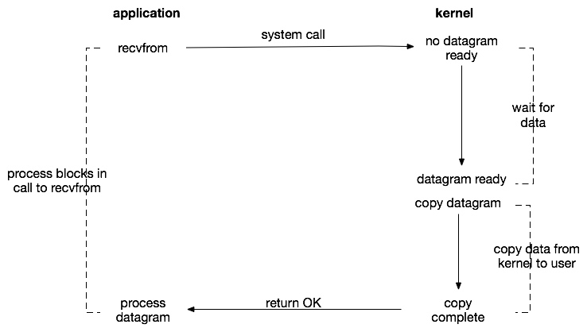
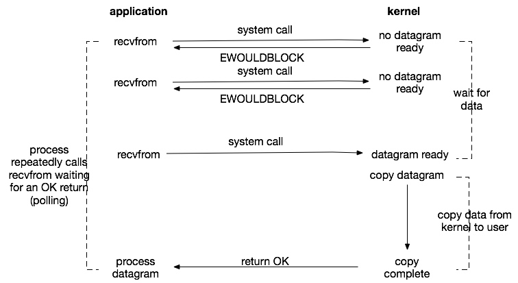
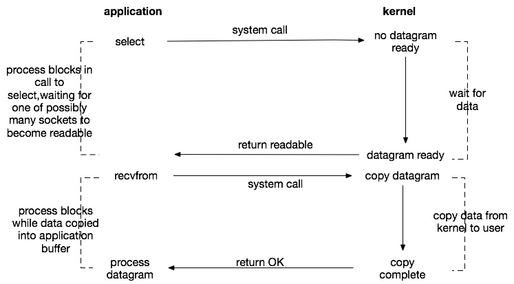
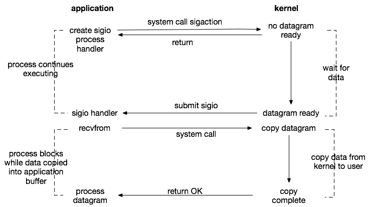
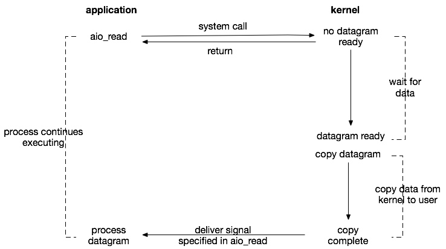

# 7.2 Java网络编程

Java的网络编程主要指的是网络IO的编程。网络IO会牵扯到同步、异步、阻塞、非阻塞这几个词。这几个概念很容易被混淆和误用。因此需要先做几点说明：

- IO有内存IO、网络IO和磁盘IO三种，通常我们说的IO指的是后两者。
- 阻塞和非阻塞，是函数/方法的实现方式，即在数据就绪之前是立刻返回还是等待，即发起IO请求是否会被阻塞。
- 一个网络IO读过程是数据从网卡→内核缓冲区→用户内存的过程。同步与异步的区别主要在于数据从内核缓冲区→用户内存这个过程需不需要用户进程等待，即实际的IO读写是否阻塞请求进程。

最适合IO模型的例子应该是咱们平常生活中的去餐馆吃饭这个场景，下文就结合这个来讲解一下经典的几个IO模型。

## 7.2.1 IO模型

UNIX环境下的经典I/O模型包括同步阻塞、同步非阻塞、I/O复用、信号驱动以及异步非阻塞五种。

### 同步阻塞

去餐馆吃饭，点一个自己最爱吃的盖浇饭，然后在原地等着一直到盖浇饭做好，自己端到餐桌就餐。这就是典型的同步阻塞。当厨师给你做饭的时候，你需要一直在那里等着。

网络编程中，读取客户端的数据需要调用recvfrom。在默认情况下，这个调用会一直阻塞直到数据接收完毕，就是一个同步阻塞的IO方式。这也是最简单的IO模型，在通常fd（文件描述符）较少、就绪很快的情况下使用是没有问题的。

### 同步非阻塞

接着上面的例子，你每次点完饭就在那里等着，突然有一天你发现自己真傻。于是，你点完之后，就回桌子那里坐着，然后估计差不多了，就问老板饭好了没，如果好了就去端，没好的话就等一会再去问，依次循环直到饭做好。这就是同步非阻塞。

这种方式在编程中对socket设置O_NONBLOCK即可。这里需要提一点：此方式仅仅针对网络IO有效，对磁盘IO并没有作用。因为本地文件IO就没有被认为是阻塞，我们所说的网络IO的阻塞是因为网路IO有无限阻塞的可能，而本地文件除非是被锁住，否则是不可能无限阻塞的，因此只有锁这种情况下，O_NONBLOCK才会有作用。而且，磁盘IO时要么数据在内核缓冲区中直接可以返回，要么需要调用物理设备去读取，这时候进程的其他工作都需要等待。因此，后续的IO复用和信号驱动IO对文件IO也是没有意义的。

此外，需要说明的一点是Nginx和NodeJS中对于本地文件的IO是用线程的方式模拟非阻塞的效果的，而对于静态文件的IO，使用Zero-Copy（例如sendfile）的效率是非常高的。

### IO复用

接着上面的列子，你点一份饭然后循环的去问好没好显然有点得不偿失，还不如就等在那里直到准备好，但是当你点了好几样饭菜的时候，你每次都去问一下所有饭菜的状态（未做好/已做好）肯定比你每次阻塞在那里等着好多了。当然，你问的时候是需要阻塞的，一直到有准备好的饭菜或者你等的不耐烦（超时）。这就引出了IO复用，也叫多路IO就绪通知。这是一种进程预先告知内核的能力，让内核发现进程指定的一个或多个IO条件就绪了，就通知进程。使得一个进程能在一连串的事件上等待。

IO复用的实现方式目前主要有select、poll和epoll。

select和poll的原理基本相同：

- 注册待侦听的fd，这里的fd创建时最好使用非阻塞。
- 每次调用都去检查这些fd的状态，当有一个或者多个fd就绪的时候返回、
- 返回结果中包括已就绪和未就绪的fd。

相比select，poll解决了单个进程能够打开的文件描述符数量有限制这个问题：select受限于FD_SIZE的限制，如果修改则需要修改这个宏重新编译内核；而poll通过一个pollfd数组向内核传递需要关注的事件，避开了文件描述符数量限制。

此外，select和poll共同具有的一个很大的缺点就是包含大量fd的数组被整体复制于用户态和内核态地址空间之间，开销会随着fd数量增多而线性增大。

select和poll就类似于上面说的就餐方式。但当你每次都去询问时，老板会把所有你点的饭菜都轮询一遍再告诉你情况，当大量饭菜很长时间都不能准备好的情况下是很低效的。于是，老板有些不耐烦了，就让厨师每做好一个菜就通知他。这样每次你再去问的时候，他会直接把已经准备好的菜告诉你，你再去端。这就是事件驱动IO就绪通知的方式-epoll。

epoll的出现，解决了select、poll的缺点：

- 基于事件驱动的方式，避免了每次都要把所有fd都扫描一遍。
- epoll_wait只返回就绪的fd。
- epoll使用mmap内存映射技术避免了内存复制的开销。
- epoll的fd数量上限是操作系统的最大文件句柄数目,这个数目一般和内存有关，通常远大于1024。

目前，epoll是Linux2.6下最高效的IO复用方式，也是Nginx、NodeJS的IO实现方式。而在freeBSD下，kqueue是另一种类似于epoll的IO复用方式。

此外，对于IO复用还有一个水平触发和边缘触发的概念：

- 水平触发：当就绪的fd未被用户进程处理后，下一次查询依旧会返回，这是select和poll的触发方式。
- 边缘触发：无论就绪的fd是否被处理，下一次不再返回。理论上性能更高，但是实现相当复杂，并且任何意外的丢失事件都会造成请求处理错误。epoll默认使用水平触发，通过相应选项可以使用边缘触发。

### 信号驱动

上文的就餐方式还是需要你每次都去问一下饭菜状况。于是，你再次不耐烦了，就跟老板说，哪个饭菜好了就通知我一声吧。然后就自己坐在桌子那里干自己的事情。更甚者，你可以把手机号留给老板，自己出门，等饭菜好了直接发条短信给你。这就类似信号驱动的IO模型。

流程如下：

- 开启套接字信号驱动IO功能。
- 系统调用sigaction执行信号处理函数（非阻塞，立刻返回）。
- 数据就绪，生成sigio信号，通过信号回调通知应用来读取数据。

此种io方式存在的一个很大的问题：Linux中信号队列是有限制的，如果超过这个数字问题就无法读取数据。

### 异步非阻塞

之前的就餐方式，到最后总是需要你自己去把饭菜端到餐桌。这下你也不耐烦了，于是就告诉老板，能不能饭好了直接端到你的面前或者送到你的家里（外卖）。这就是异步非阻塞IO了。

对比信号驱动IO，异步IO的主要区别在于：信号驱动由内核告诉我们何时可以开始一个IO操作（数据在内核缓冲区中），而异步IO则由内核通知IO操作何时已经完成（数据已经在用户空间中）。

异步IO又叫做事件驱动IO，在Unix中，POSIX1003.1标准为异步方式访问文件定义了一套库函数，定义了AIO的一系列接口。使用aio_read或者aio_write发起异步IO操作，使用aio_error检查正在运行的IO操作的状态。但是其实现没有通过内核而是使用了多线程阻塞。此外，还有Linux自己实现的Native AIO，依赖两个函数：io_submit和io_getevents，虽然IO是非阻塞的，但仍需要主动去获取读写的状态。

需要特别注意的是：AIO是IO处理模式，是一种接口标准，各家操作系统可以实现也可以不实现。目前Linux中AIO的内核实现只对文件IO有效，如果要实现真正的AIO，需要用户自己来实现。

## 7.2.2 Java网络编程模型

上文讲述了UNIX环境的五种IO模型。基于这五种模型，在Java中，随着NIO和NIO2.0（AIO）的引入，一般具有以下几种网络编程模型：

- BIO
- NIO
- AIO

### BIO

BIO是一个典型的网络编程模型，是通常我们实现一个服务端程序的过程，步骤如下：

- 主线程accept请求阻塞。
- 请求到达，创建新的线程来处理这个套接字，完成对客户端的响应。
- 主线程继续accept下一个请求。

这种模型有一个很大的问题是：当客户端连接增多时，服务端创建的线程也会暴涨，系统性能会急剧下降。因此，在此模型的基础上，类似于
tomcat的bio connector，采用的是线程池来避免对于每一个客户端都创建一个线程。有些地方把这种方式叫做伪异步IO（把请求抛到线程池中异步等待处理）。

### NIO

JDK1.4开始引入了NIO类库，这里的NIO指的是Non-blcok IO，主要是使用Selector多路复用器来实现。Selector在Linux等主流操作系统上是通过epoll实现的。

NIO的实现流程，类似于select：

- 创建ServerSocketChannel监听客户端连接并绑定监听端口，设置为非阻塞模式。
- 创建Reactor线程，创建多路复用器（Selector）并启动线程。
- 将ServerSocketChannel注册到Reactor线程的Selector上。监听accept事件。
- Selector在线程run方法中无限循环轮询准备就绪的Key。
- Selector监听到新的客户端接入，处理新的请求，完成tcp三次握手，建立物理连接。
- 将新的客户端连接注册到Selector上，监听读操作。读取客户端发送的网络消息。
- 客户端发送的数据就绪则读取客户端请求，进行处理。

相比BIO，NIO的编程非常复杂。

### AIO

JDK1.7引入NIO2.0，提供了异步文件通道和异步套接字通道的实现。其底层在Windows上是通过IOCP，在Linux上是通过epoll来实现的（LinuxAsynchronousChannelProvider.java、UnixAsynchronousServerSocketChannelImpl.java）。

- 创建AsynchronousServerSocketChannel，绑定监听端口。
- 调用AsynchronousServerSocketChannel的accpet方法，传入自己实现的CompletionHandler。包括上一步都是非阻塞的。
- 连接传入，回调CompletionHandler的completed方法，在里面，调用AsynchronousSocketChannel的read方法，传入负责处理数据的CompletionHandler。
- 数据就绪，触发负责处理数据的CompletionHandler的completed方法。继续做下一步处理即可。
- 写入操作类似，也需要传入CompletionHandler。

其编程模型相比NIO有了不少的简化。

### 7.2.3 使用Netty进行网络编程

使用原生的JDK进行网络编程尤其是异步编程是非常繁琐的，而且要面对TCP传输中的诸如
粘包的问题。Netty即是一个封装了底层网络编程细节的非常好的网络编程框架。现在很多
与网络IO相关的编程都是基于此框架进行编写的，如在第三章提到过的Vert.x其底层也是Netty。