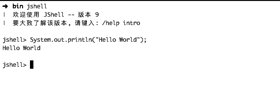

# 7.5 Java新版本特性

JDK7、JDK8是目前用的最为广泛的JDK版本，但根据笔者的面试经历和亲身体验来看，发现有不少人在高版本的JVM上还用着旧版本的编程方式。因此，这里所说的新版本主要指的是Java6以后的版本，包括Java7、Java8、Java9以及Java10。其中，Java9和Java10截止发稿前并未得到广泛应用，本章只会做一些简述。此外，还会介绍一下JVM上的又一个新贵-Kotlin语言,也是谷歌选择的安卓官方开发语言。

## 7.5.1 Java 7

不像JDK 5和8，JDK7只是一个小的版本，没有做太大的改动，只是引入了一些小的改变和特性。其中fork/join框架和内存的一些改动在前面的章节中已经讲过。其他的主要如下：

1. 改进的通用实例创建类型推断
    
    ```
    Map<String, List<String>> map = new HashMap<>();
    ```
    
    如上钻石运算符<>的引入使得后面的创建实例不必指定类型，可以从引用的声明中推断类型。
    
1. 自动资源管理

    Java中的InputStream、SQL connection等资源都是需要手动关闭的，以前我们必须通过try final来实现。Java7提供了try-with-resource这个新的语言特性。允许try语句本身申请更多的资源，这些资源作用于try代码块，并自动关闭。只要资源实现了AutoClosable接口即可。
    
    ```
    try (BufferedReader br = new BufferedReader(new FileReader("/data/data.txt"))) {
        br.read();
        ...
    }
    ```    
    
1. switch语句支持字符串

    ```
    String type = "text";
    switch (type){
      case "text":
          System.out.println("text type");
          break;
      case "image":
          System.out.println("image type");
          break;    
    }
    ```
    
    需要注意的是最终switch还是编译成对字符串hashcode的switch，然后再做字符串比较。

1. 允许在同一个catch块中捕获多个异常
    
    ```
    try {
        ...
    } catch (FileNotFoundException | AccessException e) {
        e.printStackTrace();
    }
    ```
    
1. Path && Files

    Java7中文件IO发生了很大的变化，专门引入了很多新的类来简化对文件的操作。其中最为核心的包括Path、Paths以及Files。这些类的出现是为了取代原来的基于java.io.File的文件IO操作方式。
    
    Path用来取代File来表示文件路径和文件； Paths是其辅助工具类。

    ```
    Path path = Paths.get("/data/test.dat"); 
    Path path1 = FileSystems.getDefault().getPath("/data", "test.dat");
    ```
    
    Files利用Path做文件创建、读取、写入等各种操作, 几乎包含了所有可能的文件操作，使用起来非常方便。
    
    - 创建、读写文件
        
        ```
        if(!Files.exists(path)){
            Files.createFile(path);
        }
        
        BufferedReader reader = Files.newBufferedReader(path1, StandardCharsets.UTF_8); //获取文件的BufferedReader来读取文件内容
        
        BufferedWriter writer = Files.newBufferedWriter(Paths.get("/data/test.txt"), StandardCharsets.UTF_8);////获取文件的BufferedWriter来写文件
        ```
    - 遍历文件夹：
    
        ```
        Path dir = Paths.get("/data");
        DirectoryStream<Path> stream = Files.newDirectoryStream(dir)
        for(Path e : stream){
            System.out.println(e.getFileName());
        }
        
        Stream<Path> stream = Files.list(dir);
        Iterator<Path> it = stream.iterator();
        while(it.hasNext()){
            Path curPath = it.next();
            System.out.println(curPath.getFileName());
        }
        ```
    - 复制文件：

        ```
        Files.copy(Path source, Path target, CopyOption options);
        Files.copy(InputStream in, Path target, CopyOption options);
        Files.copy(Path source, OutputStream out);
        ```
        
    此外，JDK7还提供了WatchService用来监控文件目录的变动。
    
    ```
    WatchService watchService = FileSystems.getDefault().newWatchService();
    //监控目录下的文件变动
    Paths.get("[dirPath]").register(watchService, ENTRY_MODIFY, ENTRY_CREATE, ENTRY_DELETE);

    Executors.newSingleThreadExecutor().execute(() -> {
       while (true) {
           // 等待直到获得事件信号
           WatchKey signal;
           try {
               signal = watchService.take();
           } catch (InterruptedException x) {
               return;
           }

           for (WatchEvent<?> event : signal.pollEvents()) {
               WatchEvent.Kind<?> kind = event.kind();

               if (kind == OVERFLOW) {
                   continue;
               }

               WatchEvent<Path> ev = (WatchEvent<Path>) (event);
               if (kind == ENTRY_MODIFY) {
                   System.out.println(ev.context().getFileName() + "content changed");
               }
           }
           //    为监控下一个通知做准备
           signal.reset();
       }
    });
    ```
1. 整型字面量支持用下划线分开, 并且支持二进制字面量（0b做为前缀）。

    ```
    int i = 0b111;
    int j = 1_000_000;
    ```
        
## 7.5.2 Java 8

Java8是一个创新的版本，带了很多崭新的特性，改动也比较大。

1. 接口的默认方法

    Java8允许开发者通过使用关键字default向接口中加入非抽象方法。这一新的特性被称之为扩展方法。
    
    ```
    public interface TestUserService {
         default void test(){
            ...
        }
    }
    ```
    
    此外，也允许向接口添加静态方法。
    
    ```
    public interface TestUserService {
        static String testStatic() {
            ...
        }
    }
    ```

1. Optional

    Java借鉴Guava的Optional类实现了自己的Optional，除了方法名做了一些改动，用法基本一致。和Guava中的Optional.transform一样，Java8的Optional也提供了map和flatMap可以对Optional对象做一系列转换操作, 并且还提供了filter方法来做过滤。
    
    ```
    User user = new User();
    user.setName("testUser");
    
    Optional<User> optional = Optional.of(user);
    user = optional.orElse(new User());
    user = optional.orElseThrow(RuntimeException::new);
    user = optional.orElseGet(User::new);
    
    Optional<TestUser> testUserOptional = 
            optional.filter(u -> u.getName() != null)
                .map(u -> {
                    TestUser testUser = new TestUser();
                    testUser.setName(u.getName());
                    
                    return testUser;
                });
    
    Optional<User> userOptional = testUserOptional.flatMap(tu -> {
        User curUser = new User();
        curUser.setName(tu.getName());

        return Optional.of(curUser);
    });
    ```
    
    map和flatMap的区别在于前者传入的mapper Function返回值可以是任何值而后者则必须是Optional。
    
1. Effective final

    Java8引入了一个叫做Effective final的特性，即隐形推导某个变量是否是final。比如，在使用Runnable匿名类新建线程的时候，如果run方法里使用到了外边的变量，那么之前的版本必须声明为final，而在Java8中，不需要声明，但必须得确保此变量的确是初始化后没有再被变过的。
    
    ```
    List<String> list = ..;
    
    new Thread(new Runnable() {
      @Override
      public void run() {
         list.add("test");
      }
    });
    ```

1. Lambda表达式

    Lambda表达式是Java8最主要的特性，使得Java可以使用函数式编程，大大简化代码行数。如下：
    
    ```
    List<Long> list = Lists.newArrayList();
    list.sort((n1, n2) -> Long.compare(n2, n1));
    ```
    其中sort部分的参数就是一个Lambda表达式，相比起之前的匿名内部类，代码变得简短和便于阅读。一个Lambda表达式由参数列表、箭头和函数体组成。函数体可以是一个表达式，也可以是一个代码块。
    
    这里需要提到一个概念叫做函数接口(FunctionalInterface), 是指的仅仅包含一个抽象方法的接口，可以认为任何一个Lambda表达式都可以等价转换为对应的函数式接口。可以将任意只包含一个抽象方法的接口用作Lambda表示式，但是使用@FunctionalInterface有助于编译器检查函数接口的合法性。Ruunable就是一个函数接口。
    
    ```
    @FunctionalInterface
    public interface Runnable {
        void run();
    }
    
    Runnable run = () -> System.out.println(); //打印一个换行符
    ```
    除了Runnable之外，Java8自带的几个常用函数接口如下：
    
    - Predicate：接收一个参数并返回Boolean。
    - Consumer： 接收一个参数，不返回值。
    - Function： 接受一个参数并产生一个结果。
    - Supplier： 不接收参数，对于给定的泛型类型产生一个实例。
    
    使用方法引用的话，上面的代码能够进一步简化：
    
    ```
    Runnable run = System.out::println; 
    ```
    
    这里的方法引用是用关键字::来传递方法和构造函数的引用，形式为类名::方法名，主要分为四种：
    
    - 静态方法引用： Integer::valueOf
    - 实例方法应用： System.out::println
    - 构造方法引用： User::new
    - 某个类型的任意对象的实例方法引用：User::getName
    
1. Stream

    Stream也是Java8引入的一个非常重要的特性。代表着一系列可以在其上进行多种操作的元素。这些操作可以是连续的也可以是中断的，中断操作返回操作结果；而连续操作返回流本身，这样就可以形成链式风格的流式操作。
    
    流是创建在数据源上的，java.util.Collection、list集合和set集合都是数据源的一种，产生的流可以是串行的也可以是并行的。通过集合类的Stream方法可以产生串行流；parallelStream方法产生并行流。

    一个Stream操作如下：
    
    ```
    List<String> stringList = Lists.newArrayList("1", "0", "5",null);
    List<Integer> intList = stringList.stream() //创建Stream
          .filter(Objects::nonNull) //过滤null
          .map(Integer::valueOf) //转换Stream
          .filter(e -> e > 0) //过滤
          //.reduce((e1, e2) -> e1 + e2) //消减
          .collect(Collectors.toList());//聚合
          
    ```
    
    Stream支持的主要连续操作如下
    
    - filter： 接受一个predicate来过滤流中的所有元素。
    - sorted： 返回流的已排序版本。
    - map: 通过指定的Function将流中的每个元素转变为另外的对象。
    - flatMap： 每个元素转换得到的是Stream对象，会把子Stream中的元素压缩到父集合。
    - peek: 生成一个包含原Stream的所有元素的新Stream 。
    - limit: 对一个Stream进行截断操作。
    - skip: 返回一个丢弃原Stream的前N个元素后剩下元素组成的新Stream。

    Stream支持的主要中断操作如下：
    
    - reduce：使用指定的function对流中元素实施消减，返回一个包括所有被消减元素的Optional。
    - collect：把流中的元素聚合到其它数据结构中。
    - match：anyMatch、allMatch等各种匹配操作可以用来检测是否某种predicate和流中元素相匹配。
    - count：返回流中的元素数量。
    - findFirst: 返回Stream中的第一个元素。
    - max和min：使用给定的比较器（Operator），返回Stream中的最大/最小值。
    
    使用Stream有几点需要注意：
    
    - 流并不存储值，它只是某数据源的一个视图, 对流的操作会产生一个结果，但流的数据源不会被修改。
    - 使用Stream时，要遵循先做filter再map的原则。
    - 多数Stream操作（包括过滤filter、映射map、排序sorted以及去重distinct）都以惰性方式实现（延迟计算），没有中断操作流计算不会进行，性能好于迭代。
    - 不同与其他Stream操作，flatMap不是惰性计算的。
    - Stream只能被“消费”一次，一旦遍历过就会失效。
    - 慎重使用并行Stream，其底层是使用的ForkJoinPool的commonPool，不做任何配置的情况下，所有并行流都公用的同一个线程池（默认线程数为机器CPU数目,可通过系统属性`java.util.concurrent.ForkJoinPool.common.parallelism`设置），而且此线程池还会被其他机制依赖，可能会发生不可预料的现象。
    
1. Map

    Java8对Map也做了一些改动，包括方法的增加以及底层实现的改动。
    
    ```
    Map<String, String> map = new HashMap<>();
    map.putIfAbsent("1", "a");
    map.forEach((k, v) -> {
      System.out.println(k + v);
    });
    map.computeIfAbsent("2", e -> e + "1");
    map.computeIfPresent("1", (k, v) -> k + v);
    
    map.remove("1","a")
    
    map.getOrDefault("2","b");
    
    map.merge("1", "a", (k, v) -> k + v);

    ```
    
    - putIfAbsent: 当key没有对应的value时才放入新的值,可以防止旧值被覆盖。
    - forEach: 方便了对map做遍历。
    - computeIfAbsent: key没有value时进行计算生成新的值。
    - computeIfPresent: 当key有对应的value时，使用key和value生成新value。
    - remove(k,v):仅当k对应的value等于v时，才会删除k。
    - getOrDefault: 获取不到值时使用传入的默认值。
    - merge: 如果key对应的值存在，那么将对应的value和传入的value使用后面的function合并后作为新值,否则设置为传入的value。

    Java8对HashMap的实现做了优化，主要的一点是在解决冲突时，当链表大于8时会使用红黑树存储，这样极大加快了冲突时的查询速度。此外，计算key的hash整数值时也改为高16位异或低16位：(h = k.hashCode()) ^ (h >>> 16)，提升了速度。同时，HashMap扩容机制也有了改动：HashMap底层数组的大小是2的n次方（元素的位置索引=hash mod [数组容量]=hash & [数组容量-1]），按照2次幂进行扩展（扩容后数组的大小变为原来大小的两倍），于是扩容后元素的位置要么是在原位置（hash & [旧数组容量]=0），要么是在原位置+旧数组大小的位置（hash & [旧数组容量]=1）。这样，由于0或1的取值是随机均等的，可以避免Java7中需要rehash重新计算哈希值的情况。同时，Java8也保证在旧数组索引相同的元素如果在新数组的索引相同，其相对位置不会倒置（之前的Java版本实现会倒置）。
    
    ConcurrentHashMap则除了这个改动，还去掉了segments字段，将锁的粒度进一步细化，从而降低了并发冲突的概率，size方法也使用新增的counterCells做了优化。

    使用Map还有一点需要注意的是，ConcurrentHashMap的keySet方法被修改了, 如果用到这个方法且声明的时候使用的ConcurrentHashMap，那么从旧版本JDK升级到JDK8时会报错，可以使用ConcurrentMap声明或者不要使用此方法。
    
1. Date API

    鉴于原有Java时间API的各种问题，Java8在java.time包下提供了新的date和time的API, 是由Joda Time的作者写的。
    
    使用LocalDateTime表示日期时间，和时区无关, 可以灵活的创建、进行时间计算、输出/解析格式字符串。

    ```
    LocalDateTime.now() //当前时间
    LocalDateTime dateTime = LocalDateTime.of(2017, Month.JUNE,21,12,0,0); //2017-6-21 12:00:00
       
    dateTime.plus(1, ChronoUnit.DAYS); //后面的一天
    dateTime.plusHours(1); //后面的一小时
    dateTime.minus(1, ChronoUnit.HOURS)； //前面的1小时
    dateTime.truncatedTo(ChronoUnit.HOURS)；//截断时间到小时
    
    dateTime.format(DateTimeFormatter.ofPattern("yyyy-MM-dd")); //输出格式化字符串
    dateTime = LocalDateTime.parse("2016-06-21 12:00:00",DateTimeFormatter.ofPattern("yyyy-MM-dd HH:mm:ss")); //解析格式化字符串
    ```
    还有两个类LocalTime和LocalDate，前者表示时间后者表示日期，都是不可变的，工作原理类似于LocalDateTime。
    
    和之前的java.text.DateFormat相比，DateTimeFormatter都是不可变且线程安全的，可以放心在多线程环境下使用。
    
    此外，还有Instant类用于表示时间轴上的时间点，ZoneId类用于表示时区。它们联合使用可以用来创建java.util.Date对象或者将instant和本地时间转换。
    
    ```
    long currentMills = LocalDateTime.now().atZone(ZoneId.systemDefault()).toInstant().toEpochMilli();
    
    Date udate = Date.from(LocalDateTime.now().atZone(ZoneId.systemDefault()).toInstant());
    
    Instant instant = Instant.now(); //当前时间
    //intant = Instant.of(currentMills); //从时间戳转换
    LocalDateTime localDateTime = instant.atZone(ZoneId.systemDefault()).toLocalDateTime();
    ```

1. 注解

    Java8中的Annotations是可重复，即可以将相同的注解在同一类型上使用多次。
    
    在注解声明时使用@Repeatable,可以使同一个注解类型同时使用多次
    
    ```
    @interface TestAnnotations {
        TestAnnotation[] value();
    }
    
    @Repeatable(TestAnnotations.class)
    @interface TestAnnotation {
        String value();
    }
    
    @TestAnnotation("1")
    @TestAnnotation("2")
    class User{

    }
    ```
    
    使用@Repeatable标注注解，Java编译器会隐式的在该注解使用中加入@TestAnnotations。
    
    这样就可以通过反射获取类的注解信息, 但这个是不能直接通过TestAnnotation去拿的，需要使用TestAnnotations或者用Java8新增加的getAnnotationsByType方法。
    
    ```
    User.class.getAnnotation(TestAnnotations.class);
    User.class.getAnnotationsByType(TestAnnotation.class);  
    ```
    此外，Java8中注解的@Target使用范围扩展到两种新的类型：
    
    - TYPE_PARAMETER： 注解能写在类型变量的声明语句中。
    - TYPE_USE：注解能写在使用类型的任何语句中。

    定义一个注解，将其target设置为ElementType.TYPE_PARAMETER或ElementType.TYPE_USE，或者两个都包含时，那么此注解就成为类型注解，可以写在使用类型的任何地方, 主要供开发工具、编译器在编译期做一些检查、转换等工作。
    ```
    @Target({ElementType.TYPE_PARAMETER, ElementType.TYPE_USE})
    public @interface TypeAnnotationsTest { 
    }
    
    @TypeAnnotationsTest LocalDateTime dateTime = LocalDateTime.now();
    ```
 
1. CompletableFuture 

    类似于Guava提供的ListenableFuture, Java8提供了CompletableFuture简化异步编程的复杂性，提供了函数式编程的能力，支持流式调用。
    
    ```
    static int cal(int loop){
        ..//计算
        return ...;
    }
    
    CompletableFuture.supplyAsync(() ->
                cal(10))
                .thenCompose((i) -> CompletableFuture.supplyAsync(() -> cal(i)))
                .thenApply((i) -> Integer.toString(i))
                .thenApply((str) -> "result : " + str)
                .thenAccept(System.out::println)
                .get();
    ```
    
    - supplyAsync： 提交一个异步任务。
    - thenCompose: 组合两个CompletableFuture为一个。
    - thenApply: 异步任务完成后的回调。
    - thenAccept: 异步任务完成后的回调，不同于thenApply，其参数中的函数式接口是一个Consumer，没有输出。
    - get: 等待整个异步任务完成。
    
    这里需要注意的是，如果不指定具体的线程池（以Async结尾并且没有指定Executor的一些方法），那么CompletableFuture和并行Stream一样，都是使用的ForkJoin的commonPool。
    
    此外，CompletableFuture相比之前的Future多了一个complete方法，可以指定完成的时间点，主动触发任务的完成。

Java8在JVM内存方面也有一些改动：

- 取消掉了方法区（永久代），使用“元空间”替代，元空间只与系统内存相关，也可以通过MaxMeatSize设置，防止无限耗尽系统内存。
- Java 8 update 20引入G1回收器中的字符串去重（String deduplication）。使得G1回收器能识别出堆中那些重复出现的字符串并将它们指向同一个内部的char[]数组，以避免同一个字符串的多份拷贝，那样堆的使用效率会变得很低。可以使用-XX:+UseStringDeduplication这个JVM参数开启这个特性。

## 7.5.3 Java 9

Java9是Java中一个大的版本，已于2017.09.21发布生产可用版本。其带来的新特性主要如下：

1. JShell

    Java9带来了许多编程语言都具有的REPL，JShell。极大地方便了Java语言的学习、调试等。
    
    
    
1. 模块化

    Java9带来的最大变化。Jigsaw在Java 7的时候被移除，在Java 9中又回来了。主要的目的是为更小的设备提供可伸缩性，改进 JDK 和 Java SE 的安全性，提升大型应用的性能，并使得其更易于构建。
        
    需要注意的是，此特性只是模块化JDK源代码，不会改变JRE和JDK的真实结构。允许开发者根据项目的需要自定义组件，使用jlink工具创建一个只包含所需模块的最小运行时环境，从而减少rt.jar的大小，使得Java更加容易地应用到小型计算设备中。   
    
1. 轻量级的JSON API

    目前有很多第三方的JSON API，如Google的Gson、阿里的FastJson。Java 9将JSON API集成到了JDK的实现中。
    
1. 简化了的进程API

    Java9会新增一些进程相关的api来增强管理本地系统进程的能力，使得不依赖调用外部程序等变通方案就能够方便灵活地获取本地进程信息、操作进程，提升与操作系统的交互能力。
    
1. 提升访问对象时的线程竞争处理

    线程竞争的锁机制限制了许多Java应用的性能。Java9改善了锁的争用机制。
     
1. 代码分段缓存

    Java 9的JIT以分段的形式缓存代码。这样能够有更短的扫描时间和更少的碎片，从而提供更好的性能；GC扫描垃圾时可以直接跳过永驻代码,从而提升效率。

1. 用于更大项目构建的智能Java编译工具

    Java9提供了Smart Java Compiler，也叫sjavac, 在多核处理器情况下提升JDK的编译速度，可用于更大项目的构建。最终目的是取代javac成为Java环境默认的编译器。
    
1. HTTP/2 客户端

    Java9将重新实现一个HTTP客户端, 支持HTTP 2.0和WebSocket，旨在取代现在的HttpURLConnection, 以解决其自身的不少问题。不过此特性在Java9中标注为Incubator版本（并不是最终的api，后面可能会大的改动或者删除）。

1. 接口私有方法

    Java8给接口引入了默认方法和静态方法，Java9进一步引入了接口的私有方法，进一步提高可重用性。
    
    ```
    public interface ITest{
        private void test(){
           ...
        }
    }
    ```
    
1. 响应式编程

    Java9引入了新的API: java.util.concurrent.Flow, 支持响应式的发布订阅框架。FLow类包括以下几个接口：
   
    - Flow.Publisher：消息、事件的生产者。
    - Flow.Subscriber：消息、事件的订阅者/接受者。
    - Flow.Subscription：连接生产者和订阅者的消息控制链路。
    - Flow.Processor：可以兼任生产者和订阅者的组件。

1. 集合工厂方法

    和Guava中的Lists、Sets等类似，提供了一系列集合方法。
   
    ```
    Set.of(1,2,3);
    List.of("a","b");
    ```
    
1. Stream API

    Stream接口新增了几个方法：
   
    - dropWhile: 丢弃元素直到第一个不匹配的元素，即返回去掉匹配断言的最长前缀元素集合后的Stream。
    - takeWhile: 接受元素直到第一个不匹配的元素,即返回匹配断言的最长前缀元素集合构成的Stream。
    - ofNullable：返回包含一个元素的Stream。
    - iterate：根据seed（种子）、next（产生下一个元素的方法）、hasNext（是否继续产生元素）参数迭代生成有序Stream。

    Optional也加入了stream方法，使得其可以做为Stream进行处理。
    
    ```
    Optional.of(1).stream()
    ```
   
由于Java9刚刚发布，使用并不够广泛，不对其使用进行详述。

### 7.5.4 Java10

### 7.5.5 Kotlin

得益于谷歌和甲骨文公司目前的形式，Kotlin的形势非常不错的，至少在安卓开发领域未来是可期的。

1. 无缝与Java互操作

	可以直接使用Java库能够大大降低切换语言的成本。因此，如果想选择Kotlin，可以先试着用Kotlin写单元测试，之后等熟悉了此语言，可以进行混写。最后则完全切换到Kotlin。
	
1. 天然对协程的支持

1. 能够编译成原生二进制程序

1. 天然支持函数式编程和面向对象编程

1. 主流三方框架的天然支持