# 8.2 性能分析

在系统层面能够影响应用性能的一般包括三个因素：CPU、内存和IO，可以从这三方面进行程序的性能瓶颈分析。不过如果经过分析发现这三个因素都有异常，且请求流量突然飙升，则有可能是流量攻击（通过access log定位被攻击接口）或者业务流量提升造成的响应缓慢，那么则可以通过限流、降级或者增加服务结点来解决。

需要说明的是，当发生性能问题时，在排查上述三个因素之前最好先去排查一下业务日志。很多时候业务日志抛出的异常或者有经验的开发者埋好的日志能够直接定位到性能降低的原因，如Redis或者MySQL被慢查询拖垮的时候，业务日志会抛出获取不到连接或者连接数已满的异常。在Tomcat做为容器时，有一点需要注意：日志文件catalina.out和localhost.{yyyy-MM-dd}.log都会输出业务异常信息，前者是标准输出和标准出错（如果应用的日志配置不包括控制台Console，那么catalina.out里不会有业务日志），所有输出到这两个位置的都会进入catalina.out，包含tomcat运行自己输出的日志以及应用里向console输出的日志，而后者主要是应用初始化时（Listener、Filter、Servlet）未处理的异常最后被Tomcat捕获而输出的日志，这些异常会导致应用无法启动。除了这些，业务日志方面的分析并没有太多的技巧，故不在此详述。

## 8.2.1 CPU分析

当程序响应变慢的时候，首先使用top、vmstat、ps等命令查看系统的CPU使用率是否有异常，从而可以判断出是否是CPU繁忙造成的性能问题。其中，主要通过us（用户进程所占的%）这个数据来看异常的进程信息。当us接近100%甚至更高时，可以确定是CPU繁忙造成的响应缓慢。一般说来，CPU繁忙的原因有以下几个：

- 线程中有无限空循环、无阻塞、正则匹配或者单纯的计算。
- 发生了频繁的GC。
- 多线程的上下文切换。

这里需要注意的是一个进程的CPU使用率是其所有线程之和，Linux下所有线程最终是以轻量级进程的形式存在系统中的，CPU使用率高需要配合mpstat具体分析，是单线程应用程序引起的还是某些线程都处于繁忙状态。

确定CPU使用率最高的进程之后就可以使用jstack来打印出异常进程的堆栈信息：

**jstack [pid]**

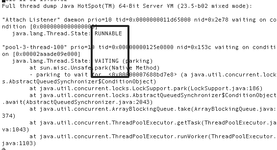

接下来需要注意的一点是，使用jstack只能打印出进程的信息，这些信息里面包含了此进程下面所有线程的堆栈信息。因此，进一步需要确定是哪一个线程耗费了大量CPU，此时可以使用`top -p [processId] -H`来查看，也可以直接通过`ps -p [pid] -Leo pid,lwp,pcpu --sort -pcpu`（ps这里是CPU平均使用率）来显示所有进程,包括LWP的资源耗费信息。最后，通过在jstack的输出文件中查找对应的LWP的十六进制id（`printf %0x [processId]`）即可以定位到相应的堆栈信息（tid指Java Thread id，nid指native线程的id）。其中需要注意的是线程的状态：RUNNABLE、WAITING等。对于Runnable的进程需要注意是否有耗费CPU的计算；对于Waiting的线程一般是锁的等待操作。

此外，使用jstack查看线程栈时需要注意：JVM只能在SafePoint转储出一个线程的栈；由于jstack dump实现机制每次只能转储出一个线程的栈信息，因此输出信息中可能会看到一些冲突的信息，如一个线程正在等待的锁并没有被其他线程持有，多个线程持有同一个锁等。

也可以使用jstat来查看对应进程的GC信息，以判断是否是GC造成了CPU繁忙。

**jstat -gcutil [pid]**

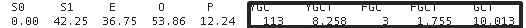

还可以使用vmstat，通过观察内核状态的上下文切换（cs）次数，来判断是否是上下文切换造成的CPU繁忙。

**vmstat 1 5**

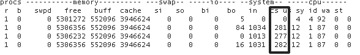

此外，有时候可能会由JIT引起一些CPU飚高的情形，如大量方法编译等。这里可以使用-XX:+PrintCompilation这个参数输出JIT编译情况，以排查JIT编译引起的CPU问题。

## 8.2.2 内存分析

对Java应用来说，内存主要是由堆外内存和堆内内存组成。

1. 堆外内存

    堆外内存主要是JNI、Deflater/Inflater、DirectByteBuffer（NIO中会用到）使用的。对于这种堆外内存的分析，还是需要先通过vmstat、sar、top、pidstat等查看swap和物理内存的消耗状况再做判断。对于JNI、Deflater这种调用可以通过Google-preftools来追踪资源使用状况。
    
2. 堆内内存

    此部分内存为Java应用主要的内存区域。通常与这部分内存性能相关的有：
    
    - 创建的对象：这个是存储在堆中的，需要控制好对象的数量和大小，尤其是大的对象很容易进入老年代。
    - 全局集合：全局集合通常是生命周期比较长的，因此需要特别注意全局集合的使用。
    - 缓存：缓存选用的数据结构不同，会很大程序影响内存的大小和GC。
    - ClassLoader：主要是动态加载类容易造成永久代内存不足。
    - 多线程：线程分配会占用本地内存，过多的线程也会造成内存不足。

    以上使用不当很容易造成：
    
    - 频繁GC -> Stop the world，使你的应用响应变慢。
    - OOM，直接造成内存溢出错误使得程序退出。OOM又可以分为以下几种：
    	- Heap space：堆内存不足。
    	- PermGen space：永久代内存不足。
    	- Native thread：本地线程没有足够内存可分配。

    排查堆内存问题的常用工具是jmap，是JDK自带的。一些常用用法如下：
    
    - 查看JVM内存使用状况：`jmap -heap <pid>`。
    - 查看JVM内存存活的对象：`jmap -histo:live <pid>`。
    - 把heap里所有对象都dump下来，无论对象是死是活：`jmap -dump:format=b,file=xxx.hprof <pid>`
    - 先做一次Full GC，再dump，只包含仍然存活的对象信息：`jmap -dump:format=b,live,file=xxx.hprof <pid>`
        
    此外，不管是使用jmap命令产生的还是在OOM时产生的dump文件，都可以使用Eclipse的MAT(MEMORY ANALYZER TOOL)来分析，可以看到具体的堆栈和内存中对象的信息。当然JDK自带的jhat也能够查看dump文件，并启动Web端口供浏览器浏览。界面如下：
    
    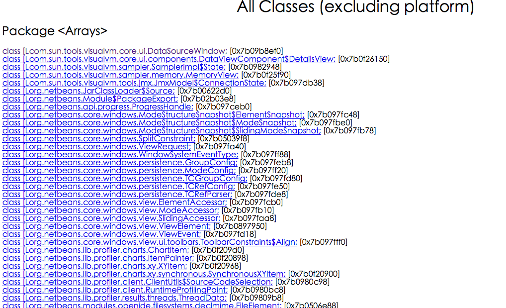
    
    此外，唯品会开源的VJTools中提供了vjmap工具是一个加强版jmap，能够分代打印出堆内存的对象实例占用信息。
    
## 8.2.3 IO分析

通常与应用性能相关的包括：文件IO和网络IO。

1. 文件IO

    可以使用系统工具pidstat、iostat、vmstat来查看IO的状况。这里可以看一张使用vmstat的结果图。
    
    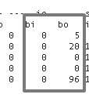
    
    这里主要注意bi和bo这两个值，分别表示块设备每秒接收的块数量和块设备每秒发送的块数量，由此可以判定IO繁忙状况。进一步的可以通过使用strace工具定位对文件IO的系统调用。通常，造成文件IO性能差的原因不外乎：
    
    - 大量的随机读写
    - 设备慢
    - 文件太大

2. 网络IO

    查看网络IO状况，一般使用的是netstat工具。可以查看所有连接的状况、数目、端口信息等。例如：当TIME_WAIT或者CLOSE_WAIT连接过多时，会影响应用的响应速度。前者需要优化内核参数，后者一般是代码Bug，没有释放网络连接。
        
        netstat -anpt
        
    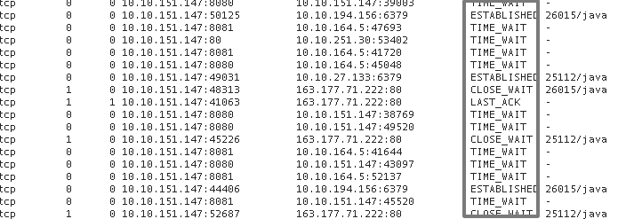
    
    此外，还可以使用tcpdump来具体分析网络IO的数据。当然，tcpdump出的文件直接打开是一堆二进制的数据，可以使用Wireshark查看具体的连接以及其中数据的内容。
    
        tcpdump -i eth0 -w tmp.cap -tnn dst port 8080 #监听8080端口的网络请求并打印日志到tmp.cap中
        
    还可以通过查看/proc/interrupts来获取当前系统使用的中断的情况。
    
    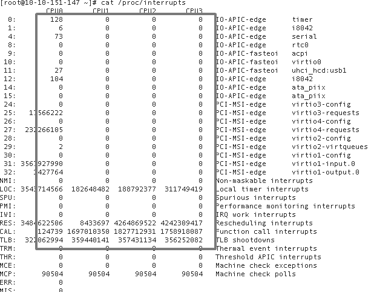
    
    各个列依次是：
        
        irq的序号， 在各自CPU上发生中断的次数，可编程中断控制器，设备名称（request_irq的dev_name字段）
        
    通过查看网卡设备的中断情况可以判断网络IO的状况。
    
    此外，使用sar -n DEV能够进一步看到网卡设备的收发数据包数目和字节数，由此判断是否超过网卡限制，从而进一步分析IO状况。
        
## 8.2.4 其他分析工具

上面分别针对CPU、内存以及IO讲了一些系统/JDK自带的分析工具。除此之外，还有一些综合分析工具或者框架可以更加方便我们对Java应用性能的排查、分析、定位等。

- VisualVM
    
    这个工具应该是Java开发者们非常熟悉的一款Java应用监测工具，原理是通过JMX接口来连接JVM进程，从而能够看到JVM上的线程、内存、类等信息。
    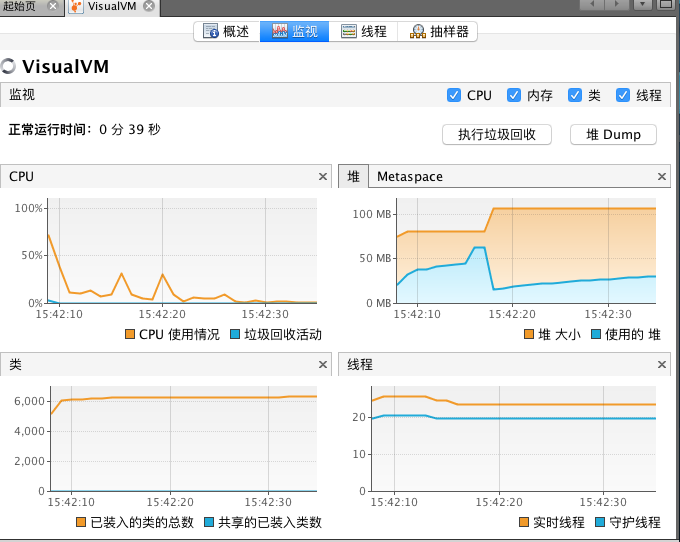 
    如果想进一步查看GC情况，可以安装Visual GC插件。此外，VisualVM也有Btrace的插件，可以可视化直观的编写Btrace代码并查看输出日志。
    与VisualVm类似的，jconsole也是通过JMX查看远程JVM信息的一款工具，更进一步的，通过它还可以显示具体的线程堆栈信息以及内存中各个年代的占用情况，也支持直接远程执行MBEAN。当然，VisualVM通过安装jconsole插件也可以拥有这些功能。
    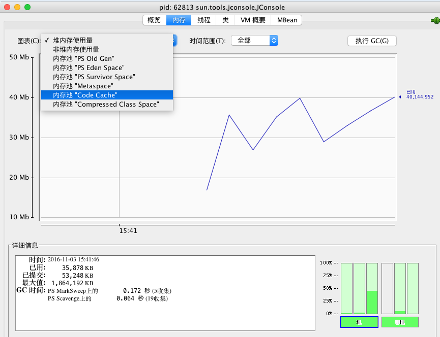
    
    但由于这俩工具都是需要UI界面的，因此一般都是通过本地远程连接服务器JVM进程。服务器环境下，一般并不用此种方式。

- Java Mission Control（JMC）

    此工具是JDK7 u40开始自带的，原来是JRockit上的工具，是一款采样型的集诊断、分析和监控与一体的非常强大的工具。但此工具基于JFR（jcmd JFR.start name=xx duration=60s settings=template.jfc filename=xx.jfr），而开启JFR需要商业证书(jcmd VM.unlock_commercial_features)。
    
    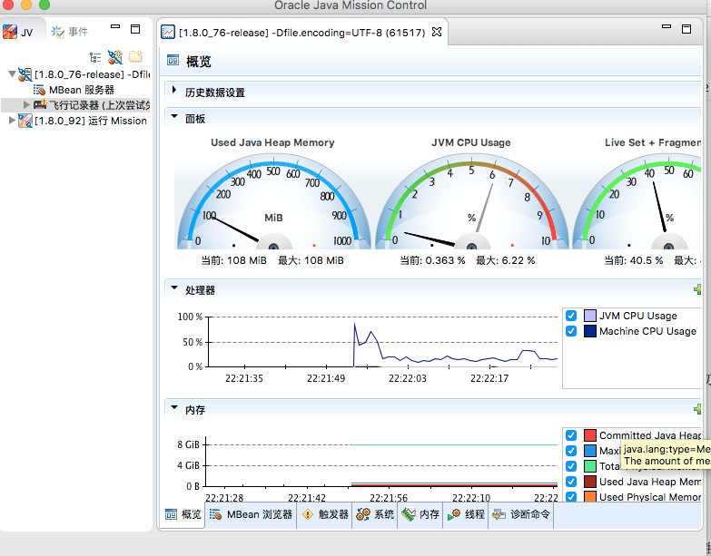

- Btrace && Greys

    这里不得不提的是Btrace这个神器，它使用java attach api + java agent + instrument api实现了JVM的动态追踪。在不重启应用的情况下可以加入拦截类的方法以打印日志等。但是此工具使用起来需要自己编写脚本，比较麻烦。推荐使用原理和Btrace类似的Greys：<https://github.com/oldmanpushcart/greys-anatomy>。Greys的使用示例如下：
    
    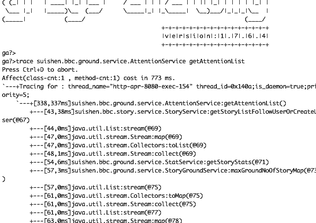 
    
- arthas

    阿里开源的Java诊断工具箱，基于greys-atonomy而来。包括在线诊断、反编译字节码、查看最耗费资源的Java线程等。
    
- Jwebap

    Jwebap是一款JavaEE性能检测框架，基于ASM增强字节码实现。支持：HTTP请求、JDBC连接、method的调用轨迹跟踪以及次数、耗时的统计。由此可以定位最耗时的请求、方法，并可以查看JDBC连接的次数、是否关闭等。但此项目是2006年的一个项目，已经将近10年没有更新。根据笔者使用，已经不支持JDK7编译的应用。如果要使用，建议基于原项目二次开发，同时也可以加入对Redis连接的轨迹跟踪。当然，基于字节码增强的原理，也可以实现自己的JavaEE性能监测框架。
    
    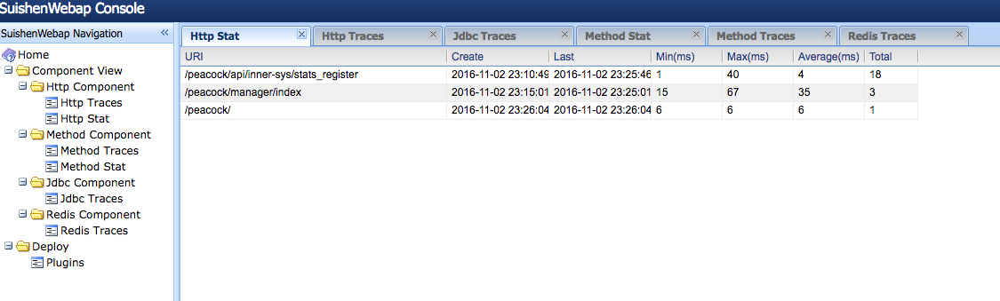
    
    上图来自笔者公司二次开发过的Jwebap，已经支持JDK8和Redis的连接追踪。
    
- awesome-scripts
	
	这里有一个笔者参与的开源的项目：<https://github.com/superhj1987/awesome-scripts>，封装了很多常用的性能分析命令，比如上文讲的打印繁忙Java线程堆栈信息、Greys命令等。
	
- charles

    HTTP协议抓包工具，主要用于查看移动端通过HTTP协议（支持HTTPs）访问服务端接口的具体数据。其通过将自己设置成系统（移动端）的网络访问代理服务器，从而实现了网络数据包的截取和分析。

- tPacketcapture

    TCP协议抓包工具。主要用于Android端捕获TCP数据包。生成的文件可以通过Wireshark分析。

