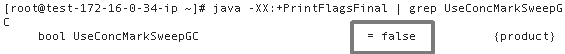
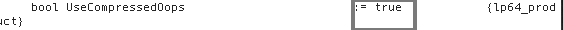

# 8.3 性能调优

与性能分析相对应，性能调优同样分为三部分。

## 8.3.1 CPU调优

CPU调优主要是合理安排运算过程，达到充分但不过度使用CPU的目的。

- 不要存在一直运行的线程（无限循环），可以使用sleep休眠一段时间。这种情况普遍存在于一些pull方式消费数据的场景下，当一次pull没有拿到数据的时候建议sleep一下，再做下一次pull。
- 轮询的时候可以使用wait/notify机制代替循环请求。
- 避免正则表达式匹配、过多的计算。例如，避免使用String的format、split、replace方法；避免使用正则去判断邮箱格式（有时候会造成死循环）；避免序列/反序列化。
- 结合JVM和代码，避免产生频繁的GC，尤其是Full GC。

此外，使用多线程的时候，还需要注意以下几点：

- 使用线程池，减少线程数以及线程的切换。
- 多线程对于锁的竞争可以考虑减小锁的粒度（使用ReetrantLock）、拆分锁（类似ConcurrentHashMap分bucket上锁）, 或者使用CAS、ThreadLocal、不可变对象等无锁技术。此外，多线程代码的编写最好使用JDK提供的并发包、Executors框架以及ForkJoin等，此外Disruptor和Actor在合适的场景也可以使用。

## 8.3.2 内存调优

内存的调优主要就是对JVM的调优。

### JVM内存配置

- 合理设置各个代的大小。避免新生代设置过小（不够用，经常minor GC并进入老年代）以及过大（会产生碎片），同样也要避免Survivor设置过大和过小。
- 选择合适的GC策略。需要根据不同的场景选择合适的GC策略。这里需要说的是，CMS并非全能的。除非特别需要再设置，毕竟CMS的新生代回收策略ParNew并非最快的，且会产生碎片。此外，G1直到JDK8的出现也并没有得到广泛应用，并不建议使用。
- 老年代优先使用Parallel GC（-XX:+UseParallel[Old]GC），可以保证最大的吞吐量。由于CMS会产生碎片，确实有必要才改成CMS或G1。
- 垃圾回收的最佳状态是只有Young GC，也就是避免生命周期很长的对象的存在。
- 注意内存墙（严重阻碍处理器性能发挥的内存瓶颈），一般讲单点应用堆内存设置为4G到5G即可，依靠可扩展性提高并发能力。
- 设置JVM的内存大小有一个经验法则：完成Full GC后，应该释放出70%的内存。
- 配置堆内存和永久代/元空间内存之和小于32GB，从而可以使用压缩指针节省对象指针的占用。
- 打开GC日志并读懂GC日志，以便于排查问题。GC日志文件可以使用GC Histogram（gchisto）生成图表和表格。

    ```
    -XX:PrintHeapAtGC -XX:+PrintGCDetails -XX:+PrintGCDateStamps -Xloggc:$CATALINA_BASE/logs/gc.log
    ```

其中，对于第一点，具体的还有一些建议：

- 年轻代大小选择

    - 响应时间优先的应用，尽可能设大，直到接近系统的最低响应时间限制（根据实际情况选择）。在此种情况下，年轻代收集发生GC的频率是最小的。同时，也能够减少到达年老代的对象。
    - 吞吐量优先的应用，也尽可能的设置大，因为对响应时间没有要求，垃圾收集可以并行进行，适合8CPU以上服务器部署的应用使用。

- 年老代大小选择

    - 响应时间优先的应用，年老代一般都是使用并发收集器，所以其大小需要小心设置，一般要考虑并发会话率和会话持续时间等一些参数。如果堆设置小了，会造成内存碎片、高回收频率以及应用暂停而使用传统的标记整理方式。如果堆大了，则需要较长的GC时间。最优化的方案，一般需要参考并发垃圾收集信息、持久代并发收集次数、传统GC信息以及花在年轻代和年老代回收上的时间比例等数据获得。
    - 吞吐量优先的应用应该有一个很大的年轻代和一个较小的年老代。这样可以尽可能回收掉大部分短期对象，减少中期的对象，而年老代存放长期存活对象。

这里还需要着重说一下使用并发收集器时较小堆引起的碎片问题。因为年老代的并发收集器使用标记清除算法，所以不会对堆进行压缩。尤其当堆空间较小时，运行一段时间以后，就会出现“碎片”，如果并发收集器找不到足够的空间，那么并发收集器将会停止，然后使用传统的标记整理方式进行回收。如果出现“碎片”，需要进行如下配置：-XX:+UseCMSCompactAtFullCollection，开启对年老代的压缩（合并相邻空间）。同时使用-XX:CMSFullGCsBeforeCompaction=xx设置多少次Full GC后，对年老代进行压缩。

### 开发建议

- 使用基本数据类型而不是其包装类型能够节省内存。
- 小对象allocate的代价很小，通常10个CPU指令；收集掉新对象也非常廉价；不用担心活的很短的小对象。
- 大对象分配的代价以及初始化的代价很大；不同大小的大对象可能导致Java堆碎片，尤其是CMS, ParallelGC 或 G1还好；尽量避免分配大对象。
- 避免改变数据结构大小，如避免改变数组或array backed collections / containers的大小;对象构建（初始化）时最好显式批量定数组大小;改变大小导致不必要的对象分配，可能导致Java堆碎片。
- 避免保存重复的String对象，同时也需要小心String.subString()与String.intern()的使用, 中间过程会生成不少字符串。
- 尽量不要使用finalizer。
- 释放不必要的引用：ThreadLocal使用完记得释放以防止内存泄漏，各种stream使用完也记得close。
- 使用对象池避免无节制创建对象，造成频繁GC。但不要随便使用对象池，除非像连接池、线程池这种初始化/创建资源消耗较大的场景。对象池可能潜在的问题：
    - 增加了活对象的数量，可能增加GC时间。
    - 访问（多线程）对象池需要锁，可能带来可扩展性的问题。
    - 小心过于频繁的对象池访问。
- 缓存失效算法，可以考虑使用SoftReference、WeakReference保存缓存对象。
- 谨慎热部署/加载的使用，尤其是动态加载类等。
- 打印日志时不要输出文件名、行号，因为日志框架一般都是通过打印线程堆栈实现，生成大量String。此外，打印日志时，先判断对应级别的日志是否打开，再做操作，否则也会生成大量String。
	
    ```		
	if (logger.isInfoEnabled()) {
       logger.info(msg);
  	}
  	```

### JavaEE容器内存

在部署JavaEE容器时经常会有一种争论：使用大内存容器好还是多个小的容器集群好？这个是需要根据业务场景区别对待的。通常，大内存容器有以下问题：

- 一旦发生Full GC，会非常耗时。
- 一旦GC，dump出的堆快照太大，无法分析。

因此，如果可以保证程序的对象大部分都是朝生夕死的，老年代不会发生GC,那么使用大内存容器是可以的。但是在伸缩性和高可用却比不上使用小内存（相对来说）容器集群。使用小内存容器集群则有以下优势：

- 可以根据系统的负载调整容器的数量，以达到资源的最大利用率，
- 可以防止单点故障。

### GC的庞氏骗局

虽然GC在大多数情况下还是正常的，但有时候JVM也会发生欺骗你的场景，JVM不停的在垃圾回收，可是每次回收完后堆却还是满的，很明显程序内存被使用完了，已经无法正常工作了，但JVM就是不抛出OutOfMemoryError（OOM）这个异常来告诉程序员内部发生了什么，只是不停地尝试帮我们做垃圾回收，直至把服务器的资源耗光。

出现这种现象的一种典型情况就是GC的GCTimeLimit和GCHeapFreeLimit参数设置不合适。GCTimeLimit的默认值是98%，也就是说如果大于等于98%的时间都用花在GC上，则会抛出OutOfMemoryError。GCHeapFreeLimit是回收后可用堆的大小，默认值是2%，也就是说只要有多余2%的内存可用就认为此次gc是成功的。如果GCTimeLimit设置过大或者GCHeapFreeLimit设置过小那么就会造成GC的庞式骗局，不停地进行垃圾回收。

## 8.3.3 IO调优

文件IO上需要注意：

- 考虑使用异步写入代替同步写入，可以借鉴Redis的AOF机制。
- 利用缓存，减少随机读。
- 尽量批量写入，减少IO次数和寻址。
- 使用数据库代替文件存储。

网络IO上需要注意：

- 和文件IO类似，使用异步IO、多路复用IO/事件驱动IO代替同步阻塞IO。
- 批量进行网络IO，减少IO次数。
- 使用缓存，减少对网络数据的读取。
- 使用协程: Quasar。

## 8.3.4 其他优化建议

- 算法、逻辑上是程序性能的首要，遇到性能问题，应该首先优化程序的逻辑处理。
- 优先考虑使用返回值而不是异常表示错误。虽然现代JVM已经做了大量优化工作，但毕竟异常是有代价的，需要在合适的地方使用。如果使用异常并且比较关注性能，可以通过覆盖掉异常类的fillInStackTrace()方法为空方法，使其不拷贝栈信息。
- 查看自己的代码是否对内联是友好的。这里所说的内联友好指的方法的大小不超过35字节(默认的内联阈值，不建议修改）、不是虚方法（虚方法指的是在运行期才能确定执行对象的方法，最新的JVM对非虚方法会通过CHA类层次分析来判断是否可以内联）。

此外，网上有一些过时的建议：

- 变量用完设置为null，加快内存回收。这种用法大部分情况下并没有意义。一种情况除外：如果有个Java方法没有被JIT编译但里面仍然有代码会执行比较长时间，那么在那段会执行长时间的代码前显式将不需要的引用类型局部变量置null是可取的。
- 方法参数设置为final，这种用法也没有太大的意义，尤其在JDK8中引入了effective final，会自动识别final变量。   
    
## 8.3.5 JVM参数配置

JVM的参数设置在很大程度上影响Java应用的性能。而JVM参数众多，很容易混淆和设置错误。这里针对Oracle/Sun JDK 7讲述一些需要注意的JVM参数设置。

1. 启动参数默认值

    Java有很多的启动参数，而且很多版本都并不一样。但是现在网上充斥着各种资料，如果不加辨别的全部使用，很多是没有效果或者本来就是默认值的。一般的，我们可以通过使用java -XX:+PrintFlagsInitial来查看所有可以设置的参数以及其默认值。也可以在程序启动的时候加入-XX:+PrintCommandLineFlags来查看与默认值不相同的启动参数。如果想查看所有启动参数（包括和默认值相同的），可以使用-XX:+PrintFlagsFinal。
    
    
    
    输出里“=”表示使用的是初始默认值，而“:=”表示使用的不是初始默认值，可能是命令行传进来的参数、配置文件里的参数或者是Ergonomics（自动优化机制）自动选择了别的值。最后一列中product表示所有平台的默认值都一样，pd_product则表示默认值因平台不同而不同。
    
    此外，还可以使用jinfo命令显示启动的参数。
    
    ```
    jinfo -flags [pid] #查看目前启动使用的有效参数
    
    jinfo -flag [flagName] [pid] #查看对应参数的值
    ```

    这里需要指出的是，当你配置JVM参数时，最好是先通过以上命令查看对应参数的默认值再确定是否需要设置。也最好不要配置你搞不清用途的参数，毕竟默认值的设置是有它的合理之处的。

2. 动态设置参数

    当Java应用启动后，定位到了是GC造成的性能问题，但是你启动的时候并没有加入打印GC的参数，很多时候的做法就是重新加参数然后重启应用。但这样会造成一定时间的服务不可用。最佳的做法是能够在不重启应用的情况下，动态设置参数。使用jinfo可以做到这一点（本质上还是基于JMX的）。
    
    ```
    jinfo -flag [+/-][flagName] [pid] #启用/禁止某个参数
    jinfo -flag [flagName=value] [pid] #设置某个参数
    ```
    对于上述的GC的情况，就可以使用以下命令打开HeapDump并设置Dump路径。
    
    ```
    jinfo -flag +HeapDumpBeforeFullGC [pid] 
    jinfo -flag +HeapDumpAfterFullGC [pid]
    jinfo -flag HeapDumpPath=/home/dump/dir [pid]
    ```          
    同样的也可以动态关闭。
    
    ```
    jinfo -flag -HeapDumpBeforeFullGC [pid] 
    jinfo -flag -HeapDumpAfterFullGC [pid]
    ```
    其他的参数设置类似。
    
    这里需要注意的是，并非所有的参数通过此种方式设置都能生效。1中PrintFlagsFinal的信息的最后一列的值除了product和pd_product，还会出现manageable（运行时可以动态更改标识的值）。只有最后一列是此值的选项通过jinfo设置JVM才会响应更改，否则即使设置成功，也并不生效。大部分影响GC算法行为的标识都是在启动时生效，无法通过jinfo动态改变。
    
3. -verbose:gc 与 -XX:+PrintGCDetails

    很多GC推荐设置都同时设置了这两个参数，其实，只要打开了-XX:+PrintGCDetails，前面的选项也会同时打开，无须重复设置。
    
4. -XX:+DisableExplicitGC

    这个参数的作用就是使得System.gc()变为空调用，很多推荐设置里面都是建议开启的。但是，如果你用到了NIO或者其他使用到堆外内存的情况，使用此选项会造成OOM。可以用XX:+ExplicitGCInvokesConcurrent或XX:+ExplicitGCInvokesConcurrentAndUnloadsClasses（配合CMS使用，使得System.gc()触发一次并发GC）代替。
    
    此外，还有一个比较有意思的地方。如果你不设置此选项的话，当你使用了RMI的时候，会周期性地来一次Full GC。这个现象是由于分布式GC造成的。
        
5. MaxDirectMemorySize

    此参数是设置的堆外内存的上限值。当不设置的时候为-1，此值为-Xmx减去一个survivor space的预留大小。 
    
6. 由于遗留原因，作用相同的参数

    - -Xss 与 -XX:ThreadStackSize。
    - -Xmn 与 -XX:NewSize，此外这里需要注意的是设置了-Xmn的话，NewRatio就没作用了。

7. -XX:MaxTenuringThreshold 

    使用工具查看此值默认值为15，但是选择了CMS的时候，此值会变成4。当此值设置为0时，所有Eden里的活对象在经历第一次Minor GC的时候就会直接晋升到Old Gen，Survivor Space直接就没用。
    
8. -XX:HeapDumpPath

    使用此参数可以指定-XX:+HeapDumpBeforeFullGC、-XX:+HeapDumpAfterFullGC、-XX:+HeapDumpOnOutOfMemoryError触发HeapDump时文件的存储位置。
    
还有一点需要注意的是，对于栈大小（-Xss 与 -XX:ThreadStackSize）的设置。在Linux x64上ThreadStackSize的默认值是1024KB，给Java线程创建栈会用这个参数指定的大小。如果把-Xss或者-XX:ThreadStackSize设为0，就是使用“系统默认值”。而在Linux x64上HotSpot VM给Java栈定义的“系统默认”大小也是1MB。所以普通Java线程的默认栈大小怎样都是1MB。这里有一个需要注意的地方就是Java的栈大小和之前提到过的操作系统的操作系统栈大小（ulimit -s）：这个配置只影响进程的初始线程；后续用pthread_create创建的线程都可以指定栈大小。HotSpot VM为了能精确控制Java线程的栈大小，特意不使用进程的初始线程（primordial thread）作为Java线程。
    
附录E的最后一部分给出了一个Tomcat的JVM参数配置示例。

## 8.3.6 JVM性能增强

JDK7、8在JVM的性能上做了一些增强以提高Java应用的性能。

1. 多层编译

    通过-XX:+TieredCompilation开启JDK7的多层编译（JDK8中默认开启）。多层编译结合了客户端C1编译器和服务端C2编译器的优点（客户端编译能够快速启动和及时优化，服务器端编译可以提供更多的高级优化），是一个非常高效利用资源的切面方案。
    
    在开始时先进行低层次的编译，同时收集信息，在后期再进一步进行高层次的编译进行高级优化。
    
    需要注意的一点：这个参数会消耗比较多的内存资源，因为同一个方法被编译了多次，存在多份native内存拷贝，建议把代码缓存调大一点儿（-XX:+ReservedCodeCacheSize，InitialCodeCacheSize）。否则有可能由于代码缓存不足，JIT编译的时候不停的尝试清理代码缓存，丢弃无用方法，消耗大量资源在JIT线程上。
    
1. Compressed Oops

   压缩指针在JDK7中的Server模式下已经默认开启。
        
1. Zero-Based Compressed Ordinary Object Pointers

    当使用了上述的压缩指针时，在64位JVM上，会要求操作系统保留从一个虚拟地址0开始的内存。如果操作系统支持这种请求，那么就开启了Zero-Based Compressed Oops。这样可以使得无须在Java堆的基地址添加任何地址补充即可把一个32位对象的偏移解码成64位指针（64位地址=堆的基地址+偏移量）。

1. 逃逸分析（Escape Analysis）

    Server模式的编译器会根据代码的情况，来判断相关对象的逃逸类型，从而决定是否在堆中分配空间，是否进行标量替换（在栈上分配原子类型局部变量）。此外，也可以根据调用情况来决定是否自动消除同步控制，如StringBuffer。这个特性从Java SE 6u23开始就默认开启。

1. NUMA Collector Enhancements

    这个主要针对的是The Parallel Scavenger垃圾回收器。使其能够利用NUMA架构的机器的优势来更快的进行GC。可以通过-XX:+UseNUMA开启支持。

