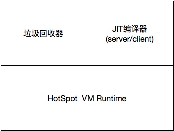
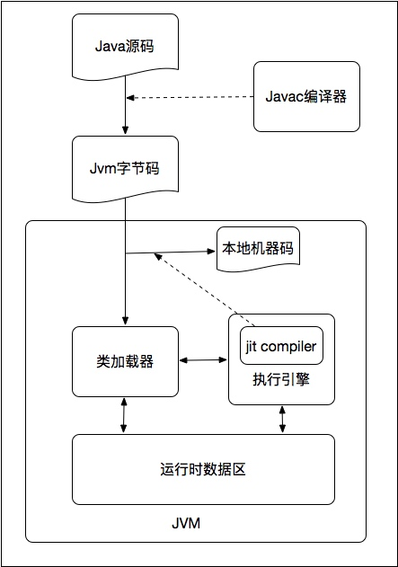
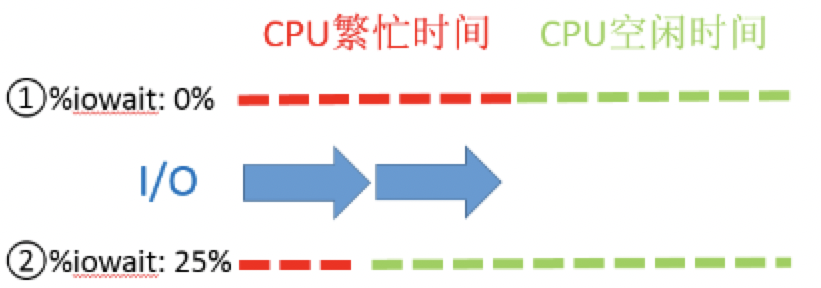
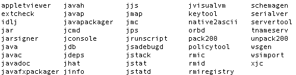

# 8.1 调优准备

调优是需要做好准备工作的，毕竟每一个应用的业务目标都不尽相同，性能瓶颈也不会总在同一个点上。在业务应用层面，我们需要：

- 需要了解系统的总体架构，明确压力方向。比如系统的哪一个接口、模块是使用率最高的，面临高并发的挑战。
- 需要构建测试环境来测试应用的性能，使用ab、loadrunner、jmeter、faban都可以。
- 对关键业务数据量进行分析，这里主要指的是对一些数据的量化分析，如数据库一天的数据量有多少、缓存的数据量有多大等。
- 了解系统的响应速度、吞吐量、TPS、QPS等指标需求，比如秒杀系统的相应速度和QPS是要求非常高的。
- 了解系统相关软件的版本、模式和参数等，有时候限于应用依赖服务的版本、模式等，性能也会受到一定的影响。

此外，还需要掌握以下知识和技能：

1. 了解Java内存管理相关知识：这一部分在7.1节已经讲述。
1. 对Java代码进行基准性能测试：可以使用JMH来进行，其是一个微基准测试框架，使用其进行性能测试，能够去除JIT热点代码编译对性能的影响。
1. 了解HotSpot虚拟机体系结构。
1. 对系统性能进行调优。
1. 掌握常用系统常用诊断工具和JDK诊断工具的使用。

## 8.1.1 HotSpot虚拟机

HotSpot虚拟机是Java开发用的最多的JVM，了解其体系结构，才能够从原理层面更好的理解性能问题，也才能更好地对Java应用进行调优。

1. HotSpot VM主要由垃圾回收器、JIT编译器以Runtime组成。

    

1. HotSpot VM的运行时架构包括类加载器、执行引擎以及运行时数据区。

    

    如图，Java源码被编译器编译为JVM字节码后进入JVM, 由类加载器进行加载，并交给执行引擎执行，期间的数据都放入运行时数据区。
    
    这里需要注意的是，JIT编译器是执行引擎中非常影响应用性能的组件，它会把热点代码直接编译为本地机器码，从而提高运行时的性能。此外，垃圾回收器执行GC的时机、效率对应用性能的影响也非常关键。

HotSpot VM内部有一些线程进行JVM的管理、监控、垃圾回收工作。主要包括：

- VM thread：这个线程是JVM里面的线程母体，是一个单例的对象（最原始的线程）会产生或触发所有其他的线程，这个单个的VM线程是会被其他线程所使用来做一些VM操作（如，清扫垃圾等）。
- Periodic task thread：该线程是JVM周期性任务调度的线程，它由WatcherThread创建，是一个单例对象。
- Garbage collection threads： 进行垃圾回收的线程。
- JIT compiler threads: 进行JIT编译的线程。
- Signal dispatcher thread: 当外部jvm命令接收成功后，会交给signal dispather线程去进行分发到各个不同的模块处理命令，并且返回处理结果。

这些线程的运行有时候会影响业务线程的运行，是影响应用性能的关键因素。
    
## 8.1.2 系统性能调优

后端应用都是需要部署在服务器上的，因此在对Java应用调优之前务必先将系统的性能调整到一个相对较好的水平。

一般来说，目前后端系统都是部署在Linux主机上的。所以抛开Win系列不谈，对于Linux系统来说一般有以下配置关系着系统的性能。

- 文件描述符数限制：Linux中所有东西都是文件，一个socket就对应着一个文件描述符，因此系统配置的最大打开文件数以及单个进程能够打开的最大文件数就决定了socket的数目上限。
- 进程/线程数限制: 对于Apache使用的prefork等多进程模式，其负载能力由进程数目所限制。对Tomcat多线程模式则由线程数所限制。
- TCP内核参数：网络应用的底层自然离不开TCP/IP，Linux内核有一些与此相关的配置也决定了系统的负载能力。

### 文件描述符数限制

- 系统最大打开文件描述符数：/proc/sys/fs/file-max中保存了这个数目,可修改此值。

        临时性
            echo 1000000 > /proc/sys/fs/file-max
        永久性：在/etc/sysctl.conf中设置
            fs.file-max = 1000000
    
- 进程最大打开文件描述符数：这个是配置单个进程能够打开的最大文件数目。可以通过ulimit -n查看和修改。如果想要永久修改，则需要修改/etc/security/limits.conf中的nofile选项。

通过读取/proc/sys/fs/file-nr可以看到当前使用的文件描述符总数。另外，对于文件描述符的配置，需要注意以下几点：

- 所有进程打开的文件描述符数不能超过/proc/sys/fs/file-max。
- 单个进程打开的文件描述符数不能超过user limit中nofile的soft limit。
- nofile的soft limit不能超过其hard limit。
- nofile的hard limit不能超过/proc/sys/fs/nr_open。

### 进程/线程数限制

- 进程数限制：ulimit -u可以查看/修改单个用户能够打开的最大进程数。/etc/security/limits.conf中的noproc则是系统的最大进程数。
- 线程数限制：
        
    - 可以通过/proc/sys/kernel/threads-max查看系统总共可以打开的最大线程数。
    - 单个进程的最大线程数和PTHREAD_THREADS_MAX有关，此限制可以在/usr/include/bits/local_lim.h中查看,但是如果想要修改的话，需要重新编译Linux系统。
    - Linux内核2.4的线程实现方式为Linux threads，是轻量级进程，会首先创建一个管理线程，线程数目的大小是受PTHREAD_THREADS_MAX影响的。Linux2.6内核的线程实现方式变为NPTL,是一个改进的LWP实现，与Linux thread最大的区别就是其线程公用进程的pid（tgid），线程数目大小只受制于资源。
    - 线程数的大小还受线程栈大小的制约：使用ulimit -s可以查看/修改线程栈的大小，即每开启一个新的线程需要分配给此线程的一部分内存。减小此值可以增加可以打开的线程数目。

### TCP内核参数

在一台服务器CPU和内存资源有限的情况下，最大的压榨服务器的性能，是最终的目的。在节省成本的情况下，可以考虑修改Linux的内核TCP/IP参数，来最大的压榨服务器的性能。如果通过修改内核参数也无法解决的负载问题，也只能考虑升级服务器。
    
    netstat -n | awk '/^tcp/ {++S[$NF]} END {for(a in S) print a, S[a]}'
    
使用上面的命令，可以得到当前系统的各个状态的网络连接的数目。如下：

    LAST_ACK 13
    SYN_RECV 468
    ESTABLISHED 90
    FIN_WAIT1 259
    FIN_WAIT2 40
    CLOSING 34
    TIME_WAIT 28322

这里，TIME_WAIT的连接数是需要注意的一点。此值过高会占用大量连接，影响系统的负载能力。需要调整参数，以尽快的释放TIME_WAIT连接。

一般TCP相关的内核参数在/etc/sysctl.conf文件中。为了能够尽快释放TIME_WAIT状态的连接，可以做以下配置：

- net.ipv4.tcp_syncookies = 1，表示开启SYN Cookies。当出现SYN等待队列溢出时，启用Cookies来处理，可防范少量SYN攻击，默认为0，表示关闭。
- net.ipv4.tcp_tw_reuse = 1，表示开启重用。允许将TIME-WAIT sockets重新用于新的TCP连接，默认为0，表示关闭。
- net.ipv4.tcp_tw_recycle = 1，表示开启TCP连接中TIME-WAIT sockets的快速回收，默认为0，表示关闭；
- net.ipv4.tcp_fin_timeout = 30，修改系統默认的 TIMEOUT 时间。
    
这里需要注意的一点就是当打开了tcp_tw_recycle，就会检查时间戳，移动环境下的发来的包的时间戳有些时候是乱跳的，会把带了“倒退”的时间戳的包当作是“recycle的tw连接的重传数据，不是新的请求”，于是丢掉不回包，造成大量丢包。另外，当前面有LVS，并且采用的是NAT机制时，开启tcp_tw_recycle也会造成一些异常。如果这种情况下仍然需要开启此选项，那么可以考虑设置net.ipv4.tcp_timestamps=0，忽略掉报文的时间戳即可。

此外，还可以通过优化tcp/ip的可使用端口的范围，进一步提升负载能力。如下：

- net.ipv4.tcp_keepalive_time = 1200，表示当keepalive启用的时候，TCP发送keepalive消息的频度。缺省是2小时，改为20分钟。
- net.ipv4.ip_local_port_range = 10000 65000，表示用于向外连接的端口范围。缺省情况下很小：32768到61000，改为10000到65000。这里需要注意不要将最低值设的太低，否则可能会占用掉正常的端口。
- net.ipv4.tcp_max_syn_backlog = 8192，表示SYN队列的长度，默认为1024，加大队列长度为8192，可以容纳更多等待连接的网络连接数。
- net.ipv4.tcp_max_tw_buckets = 5000，表示系统同时保持TIME_WAIT的最大数量，如果超过这个数字，TIME_WAIT将立刻被清除并打印警告信息。默认为180000，改为5000，可以很好地减少TIME_WAIT套接字数量。

## 8.1.3 系统常用诊断工具

当应用运行情况、响应情况异常时，会直接表现为系统的指标异常。而指标需要通过相关的系统命令来获取。Linux系统（CentOS 6.5）下常用的诊断工具如下：

1. uptime

    使用uptime可以快速查看服务器的负载情况。

    ```
    00:40:16 up 116 days,  5:28,  1 user,  load average: 0.36, 0.32, 0.32
    ```
    此命令返回的是系统的平均负荷，包括1分钟、5分钟、15分钟内可以运行的任务平均数量，包括正在运行的任务以及虽然可以运行但正在等待某个处理器空闲的任务。当然，这个值是和CPU核数有关的，双核的机器，load只要小于2也是正常的状况。CPU的情况可以通过查看/proc/cpuinfo来获得。
    
    如果1分钟平均负载很高，而15分钟平均负载很低，说明服务器正在命令高负载情况，需要进一步排查CPU资源都消耗在了哪里。反之，如果15分钟平均负载很高，1分钟平均负载较低，则有可能是CPU资源紧张时刻已经过去。

    这里需要注意的是在Linux下平均负载除了包括等待CPU和正在使用CPU的进程的数量以外，还包括阻塞在不可中断休眠状态的进程（进程状态为D，通常是在等待IO）的数量。因此当负载变高的时候，并不一定是可运行的进程数太多，也有可能是IO瓶颈导致不可中断IO的进程数过多造成的。

1. dmesg丨tail

    ```
    e1000: eth0 NIC Link is Up 1000 Mbps Full Duplex, Flow Control: None
    ADDRCONF(NETDEV_UP): eth0: link is not ready
    ADDRCONF(NETDEV_CHANGE): eth0: link becomes ready
    e1000: eth1 NIC Link is Up 1000 Mbps Full Duplex, Flow Control: None
    eth0: no IPv6 routers present
    eth1: no IPv6 routers present
    e1000: eth0 NIC Link is Up 1000 Mbps Full Duplex, Flow Control: None
    e1000: eth1 NIC Link is Up 1000 Mbps Full Duplex, Flow Control: None
    eth0: no IPv6 routers present
    eth1: no IPv6 routers present
    ```
    
    该命令会输出系统日志的最后10行。常见的OOM kill和TCP丢包在这里都会有记录。
    
1. vmstat 1

    vmstat是一个实时性能检测工具,可以展现给定时间间隔的服务器的状态值,包括服务器的CPU使用率、内存使用、虚拟内存交换情况、IO读写情况等系统核心指标。其输出结果如下：

    ```
    procs -----------memory---------- ---swap-- -----io---- --system-- -----cpu------

       r b swpd free buff cache si so bi bo in cs us sy id wa st

       0 0 0 7887984 1320604 6288252 0 0 0 2 0 1 0 0 100 0 0

    ```
    
     一般主要关注输出的CPU使用情况，其中id + us + sy = 100，id是空闲CPU使用率，us 是用户CPU使用率，sy是系统CPU使用率。如果用户时间和系统时间相加非常大，说明CPU正忙于执行指令。而如果IO等待时间很长，那么系统的瓶颈可能在磁盘IO。当然，这里输出的IO信息、上下文切换信息也很有用。
    
    在计算CPU利用率的时候，建议多获取几次，尤其是在脚本里获取时，一般只获取一次是不准确的，建议在脚本里取两次以上并排除掉第一次的数据。而如果是排查最近耗费CPU最多的进程，使用Top的数据比较合理。 
        
1. free -m

    该命令可以查看系统内存的使用情况，-m参数表示按照兆字节展示。如果可用内存非常少，系统可能会动用交换区（swap），会增加IO开销（可以在iostat命令中体现），降低系统性能。

    ```
                 total       used       free     shared    buffers     cached
    Mem:         16051      15879        171          0        672       4763
    -/+ buffers/cache:      10444       5607
    Swap:         8001          0       8000
    ```
    
    这里需要注意的是第一行的信息是针对整个系统来说的，因此Buffer和Cache都被计算在了used里面，其实这两部分内存是可以被很快拿来供应用程序使用的。因此，真正反映内存使用状况的是第二行。
    
1. netstat -tanp

    查看TCP网络连接状况。netstat属于net-tools工具集，已经很久不更新，可以使用iproute工具集中的ss、ip替代netstat。
    
    ```
    Active Internet connections (servers and established)
    Proto Recv-Q Send-Q Local Address               Foreign Address             State                   PID/Program name
    tcp        0      0 0.0.0.0:8080                0.0.0.0:*                   LISTEN          7102/java
    tcp        0      0 0.0.0.0:80                  0.0.0.0:*                   LISTEN      -
    tcp        0      0 10.9.117.63:80              10.10.251.117:46335         SYN_RECV    -
    tcp        0      0 0.0.0.0:8081                0.0.0.0:*                   LISTEN      11225/java
    tcp        0      0 10.9.117.63:8080            10.9.90.198:4238            ESTABLISHED 7102/java
    tcp        0      0 10.9.117.63:51502           10.42.27.223:3306           ESTABLISHED 11225/java
    tcp        0      0 10.9.117.63:80              10.10.251.196:11934         TIME_WAIT   -
    tcp        0      0 10.9.117.63:80              10.10.251.196:31371         TIME_WAIT   -
    ```
    
1. mpstat -P ALL 1

    属于sysstat软件套件。该命令用来显示每个CPU的使用情况。如果有一个CPU占用率特别高，说明有可能是一个单线程应用程序引起的。

    ```    
    12:54:59 AM  CPU   %user   %nice    %sys %iowait    %irq   %soft  %steal   %idle    intr/s
    12:55:00 AM  all    4.74    0.00    1.37    0.00    0.25    1.25    0.00   92.39   3593.07
    12:55:00 AM    0    2.97    0.00    0.99    0.00    0.00    0.00    0.00   96.04    992.08
    12:55:00 AM    1    0.00    0.00    0.00    0.00    0.00    0.00    0.00  100.00      0.00
    12:55:00 AM    2    1.96    0.00    0.98    0.00    0.00    0.98    0.00   96.08      0.00
    12:55:00 AM    3    2.00    0.00    1.00    0.00    0.00    0.00    0.00   97.00      0.00
    12:55:00 AM    4    2.00    0.00    0.00    0.00    0.00    0.00    0.00   98.00      0.00
    12:55:00 AM    5    2.02    0.00    1.01    0.00    0.00    0.00    0.00   96.97      0.99
    12:55:00 AM    6    4.00    0.00    0.00    0.00    0.00    0.00    0.00   96.00      0.00
    12:55:00 AM    7   23.00    0.00    7.00    0.00    3.00    9.00    0.00   58.00   2599.01
    ```
    
1. sar -n DEV 1

    属于sysstat软件套件。sar命令主要用来查看网络设备的吞吐率。可以通过网络设备的吞吐量，判断网络设备是否已经饱和。

    ```
    11:48:34 AM     IFACE   rxpck/s   txpck/s    rxkB/s    txkB/s   rxcmp/s   txcmp/s  rxmcst/s
    11:48:35 AM        lo    176.29    176.29     69.45     69.45      0.00      0.00      0.00
    11:48:35 AM      eth0  15513.40  15292.78   2677.08   2648.08      0.00      0.00      0.00
    ```
    
1. sar -n TCP,ETCP 1

    查看TCP连接状态。active/s，每秒主动发起的连接数目(connect)；passive/s，每秒被动发起的连接数目（accept）;retrans/s，每秒重传的数量，能够反映网络状况和是否发生了丢包。
    
    ```
    11:39:54 AM  active/s passive/s    iseg/s    oseg/s
    11:39:55 AM     13.40    454.64  16029.90  16083.51

    11:39:54 AM  atmptf/s  estres/s retrans/s isegerr/s   orsts/s
    11:39:55 AM      6.19      1.03      0.00      0.00      3.09
    ```

1. iostat -xz 1

    属于sysstat软件套件。查看机器磁盘IO情况。await(ms)，IO操作的平均等待时间，是应用程序在和磁盘交互时，需要消耗的时间，包括IO等待和实际操作的耗时；svctm，IO操作的服务时间，此值一般小于await；avgqu-s，向设备发出的平均请求数量；%util,设备利用率。
    
    ```
    avg-cpu:  %user   %nice %system %iowait  %steal   %idle
           9.01    0.00    3.61    0.01    0.00   87.36

    Device:         rrqm/s   wrqm/s     r/s     w/s   rsec/s   wsec/s avgrq-sz avgqu-sz   await  svctm  %util
    vda               0.02     1.56    0.12    1.12     3.62    21.45    20.21     0.00    2.20   0.80   0.10
    vdb               0.01    37.75    0.57    1.67    82.30   315.68   177.35     0.01    5.88   0.55   0.12
    ```
    
    可以从以下几个方面判断磁盘性能可能出现问题：
    
    - 当r/s, w/s, rkB/s, wkB/s等指标过大，可能会引起性能问题。
    - await过大，可能是硬件设备遇到了瓶颈或者出现故障。一次IO操作一般超过20ms就说明磁盘压力过大。
    - avgqu-sz大于1，可能是硬件设备已经饱和。但此值是按照单位时间的平均值，不能反映瞬间的IO洪水。
    - %util越大表示磁盘越繁忙，100%表示已经饱和。

    此外，这里面的%iowait在Linux下的计算方式是CPU空闲、并且有仍未完成的IO请求的时间占总时间的比例。因此，%iowait升高并不一定代表IO设备有瓶颈，有可能是CPU没有可以运行的进程造成的。需要结合await、svctm等其他指标来判断。如下如所示：
    
    

1. top

    top命令包含了系统全局的很多指标信息，包括系统负载情况、系统内存使用情况、系统CPU使用情况等等，基本涵盖了上述几条命令的功能。

    ```
    top - 01:02:04 up 116 days,  5:50,  1 user,  load average: 1.20, 0.46, 0.29
    Tasks: 152 total,   2 running, 150 sleeping,   0 stopped,   0 zombie
    Cpu(s):  2.7%us,  0.5%sy,  0.0%ni, 96.3%id,  0.0%wa,  0.1%hi,  0.4%si,  0.0%st
    Mem:  16436664k total, 16302392k used,   134272k free,   688420k buffers
    Swap:  8193140k total,      132k used,  8193008k free,  4878348k cached
    
      PID USER      PR  NI  VIRT  RES  SHR S %CPU %MEM    TIME+  COMMAND
    27852 root      20   0  180m  36m  548 R 56.5  0.2   0:00.29 python
     4259 root      18   0 2396m 815m  13m S 25.3  5.1   7988:19 java
    14128 root      18   0 4603m 1.9g  15m S  3.9 12.4 572:23.01 java
    14785 root      24   0 5554m 2.1g  25m S  1.9 13.2  36:42.81 java
    27851 root      15   0 12744 1048  748 R  1.9  0.0   0:00.02 top
        1 root      15   0 10356  684  576 S  0.0  0.0   0:06.18 init
        2 root      RT  -5     0    0    0 S  0.0  0.0   0:08.14 migration/0
        3 root      34  19     0    0    0 S  0.0  0.0   0:00.17 ksoftirqd/0
        4 root      RT  -5     0    0    0 S  0.0  0.0   0:08.73 migration/1
        5 root      34  19     0    0    0 S  0.0  0.0   0:00.17 ksoftirqd/1
    ```
    
    通过此命令，可以相对全面的查看系统负载的来源。同时，top命令支持排序，可以按照不同的列排序，方便查找出诸如内存占用最多的进程、CPU占用率最高的进程等。但top命令是一个瞬时输出的值，最好是通过定时存储到文件来进行对比诊断。需要注意的是，对于每一个进程的%CPU这一列，其默认是Irix Mode，为单CPU衡量的一个值，最大值为100% * CPU核数。可以使用I指令切换模式为Solaris Mode，此值在多处理器环境下，为占的总的CPU的使用率，最大值为100%。
    
    还需要注意的是，使用ps命令也能够拿到某个进程的CPU使用率，但是其是从进程创建开始就计算，为该进程处于Running状态的时间占进程总时间的百分比，可以看做平均CPU使用率。而Top的%CPU是不断刷新计算的（数据来源于/proc/pid/stats），可以认为是实时的。


## 8.1.4 JDK常用诊断工具

在对Java程序进行问题排查、性能调优时，如果没有合适的工具，很多时候会事倍功半，甚至无法继续进行下去。JDK自身已经提供了很多强大的工具供我们使用。

笔者的开发环境是：OS X EI Captian 10.11.6

JDK版本：

	java version "1.8.0_92"
	Java(TM) SE Runtime Environment (build 1.8.0_92b14)
	Java HotSpot(TM) 64Bit Server VM (build 25.92b14, mixed mode)
	
JAVA_HOME/bin下的工具截图如下：



和性能分析相关的工具如下表所示：

工具 | 描述
----|-----
javap| Java反编译工具，主要用于根据Java字节码文件反汇编为Java源代码文件。
jcmd| Java 命令行（Java Command），用于向正在运行的JVM发送诊断命令请求。
jconsole| 图形化用户界面的监测工具，主要用于监测并显示运行于Java平台上的应用程序的性能和资源占用等信息。
jdeps| 用于分析Java class的依赖关系。
jdb| Java调试工具（Java Debugger），主要用于对Java应用进行断点调试。
jhat| Java堆分析工具（Java Heap Analysis Tool），用于分析Java堆内存中的对象信息。
jinfo| Java配置信息工具（Java Configuration Information），用于打印指定Java进程、核心文件或远程调试服务器的配置信息。
jmap| Java内存映射工具（Java Memory Map），主要用于打印指定Java进程、核心文件或远程调试服务器的共享对象内存映射或堆内存细节。
jmc| Java任务控制工具（Java Mission Control），主要用于HotSpot JVM的生产时间监测、分析、诊断。开发者可以使用jmc命令来创建JMC工具。
jps| JVM进程状态工具（JVM Process Status Tool），用于显示目标系统上的HotSpot JVM的Java进程信息。
jrunscript| Java命令行脚本外壳工具（command line script shell），主要用于解释执行javascript、groovy、ruby等脚本语言。
jstack| Java堆栈跟踪工具，主要用于打印指定Java进程、核心文件或远程调试服务器的Java线程的堆栈跟踪信息。
jstat| JVM统计监测工具（JVM Statistics Monitoring Tool），主要用于监测并显示JVM的性能统计信息，包括gc统计信息。
jstatd| jstatd（VM jstatd Daemon）工具是一个RMI服务器应用，用于监测HotSpot JVM的创建和终止，并提供一个接口，允许远程监测工具附加到运行于本地主机的JVM上。
jvisualvm| JVM监测、故障排除、分析工具，主要以图形化界面的方式提供运行于指定虚拟机的Java应用程序的详细信息。

更多常用的Java调优命令可见附录E。


