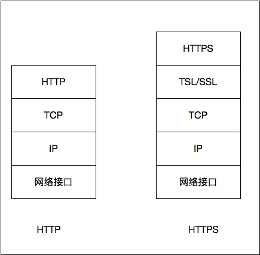
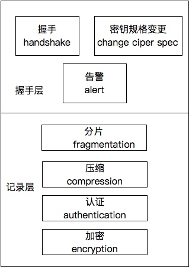
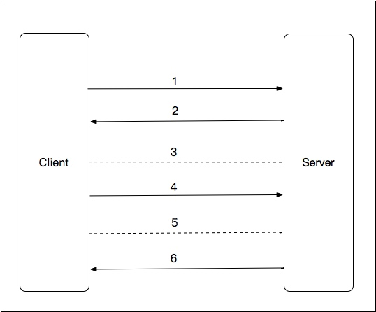

# 9.2 HTTPS

很多时候后端的应用都会直接提供HTTP接口以供浏览器、客户端、第三方来调用。但由于HTTP协议是明文传输、且没有任何的身份认证机制和数据完整性保证，因此数据很容易被中间人进行劫持、监听、篡改等。虽然能够通过对传输的业务数据加密避免这一点，但HTTPS才是最根本的解决方案。这也是现在好多互联网公司都在进行全站HTTPS迁移的原因，也是AppStore要求应用调用的api接口都要换成HTTPS的动机所在。

HTTP和HTTPS的对比如下图所示:

可以看到，HTTPS相比HTTP多了一个安全加密层，不仅对数据进行了加密,还对数据完整性提供了保护，并且也提供了身份验证的功能。

上一节最后提到，非对称加密很多情况下会与对称加密一起使用。HTTPS就是一个典型的应用场景。简单说就是：其中一方先生成一个对称加密密钥,然后通过非对称加密的方式来发送这个密钥,这样双方之后的通信就可以用对称加密这种高效率的算法进行加解密。

## 9.2.1 SSL/TLS

SSL和TLS都是用于保障端到端之间连接的安全性的，位于应用层和传输层之间。SSL现在已经改名为TSL, 主流版本为TLS1.2。其结构如下图所示：

- 握手层：端与端之间协商密码、连接状态等连接参数，并完成身份验证。
- 记录层：对数据的封装，数据交给传输层之前，会经过分片、压缩、认证、加密。

## 9.2.2 CA

CA是HTTPS依赖的关键组件，即Certificate Authority，证书中心。客户端从CA获取服务器公钥，并能够保证此公钥不会被中间人篡改。

CA对公钥完整性的保证依赖的一个机制就是颁发证书，证书包括以下内容：

- 证书的发布机构
- 证书的有效期
- 公钥
- 证书所有人
- 数字签名

使用CA的一个流程如下：

1. 首先将公钥与个人信息用一个Hash算法生成一个消息摘要，然后CA再用它的私钥对消息摘要加密,最终形成数字签名。
2. 客户端接收到证书时,用同样的Hash算法再次生成一个消息摘要,然后用CA的公钥对证书进行解密,之后再对比两个消息摘要即可保证数据未被篡改。

此外，为了保证CA的权威性以及其自身公钥的权威性，CA机构是一个树形的结构，父节点是信用高的CA，它会对子节点的CA做信用背书。

## 9.2.3 交互过程

HTTPS的交互过程如下图所示：

1. 客户端向服务器发送请求，将客户端的功能和首选项传送给服务器，包括客户端支持的SSL版本、加密组件列表等。
2. 服务器发送选择的连接参数（从客户端加密组件中筛选出的加密组件内容和压缩方法）以及证书（包含公钥等信息）给客户端。
3. 客户端读取证书中的所有人、有效期等信息并进行校验，然后通过预置的CA验证证书合法性，有问题则提示。
4. 客户端生成用于数据加密的对称密钥，然后用服务器的公钥进行加密并发送给服务端。
5. 服务器使用自己的私钥解密数据，获得用于数据加密的对称密钥。
6. 安全的通道建立完毕，后续基于对称加密传输数据。

## 9.2.4 性能优化

虽然HTTPS安全性比HTTP要高很多，但是由于建立通信通道要首先交互很多次，应用的性能会受到不少的影响，因此优化HTTPS的性能非常关键。

1. 算法选择

    HTTPS的通信过程中有不少算法参与的地方，算法的性能直接决定了HTTPS的性能：
    
    - 数字签名：选择ECDSA算法，它的签名性能远超过RSA，而且签名是在服务端做的。服务器发送给客户端的证书链包含所有中间证书。
    - 密钥交换: ECDHE具有更好的性能，并且其支持前向保密（Forward Secrecy），可以避免中间人保存下来客户端和服务端之间的所有通信数据，并且能开启TLS false start。
    - 对称加密：AES256-GCM-SHA384的性能比较好，建议选择此算法进行数据加密。

1. TLS缓冲区

    TLS缓冲区大小即一个TLS Record的大小，在Nginx中默认是16k。如果HTTP的数据是320K，那么就会被拆分为20个TLS Record，然后每个TLS Record会被TCP层拆分为多个TCP包传输发送给客户端。
    
    如果此值过小，那么TLS Record Head的负载就增加，会降低连接的吞吐量；而如果此值过大，拆分出的TCP包就比较大，传输过程中容易出现丢包，整个TLS Record到达客户端的时间就会加长。
    
    由于在TCP慢启动的过程中TCP连接的拥塞窗口cwnd较小，TCP连接吞吐量也小，因此可以把TLS Record Size设置小一点；而在TCP连接结束慢启动之后，吞吐量上来了，TLS Record Size就可以增大一些。
    
1. TLS False Start
    
    主要指的是客户端这边的TLS False Start。开启此选项，那么客户端在发送 Change Cipher Spec、Finished 之后，可以立即发送应用数据，无需等待服务端的 Change Cipher Spec、Finished。这样，应用数据的发送实际上并未等到握手全部完成，从而节省出一个RTT时间，可以提高一定的性能。
    
    但开启此选项，需要满足以下条件：
    
    - 客户端和服务端都需要支持NPN/ALPN（浏览器要求）。
    - 需要采用支持前向保密的密码套件（ECDHE）。

1. Session Cache && Session Ticket

    服务端对于一次Session是有缓存的。如果能够在它的Session Cache中找到对应Session ID的session-state（存储协商好的密码套件等信息），那么服务端就不必再经历一系列Session建立过程。因此，开启Session Cache是提升连接性能的有效措施之一。
    
    此外，服务端可以通过某种机制将session-state加密后作为ticket发给客户端。客户端凭借该ticket就可以恢复先前的会话了。这就是Session Ticket机制。开启此机制也能够减少Session的建立过程，提高性能。

以上优化措施都是运维层面的，对于Java开发来说，可以通过在应用层做预连接，在网页端或者客户端用户发起访问请求之前提前把这个握手过程完成，从而减少延迟，能一定程度提高连接的性能。  

    

