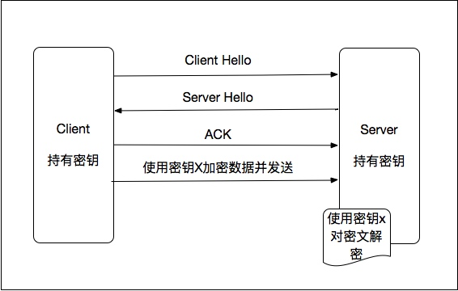
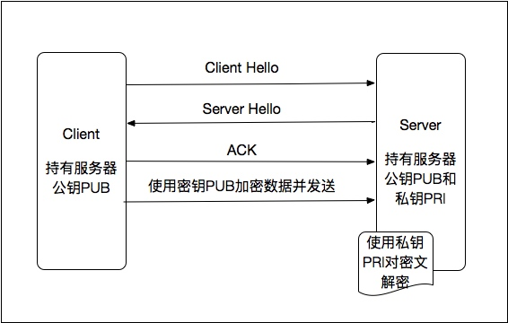

# 9.1 Java加密

当需要加密用户数据、验证请求发起者身份、散列数据的时候，都是需要加解密算法的。JDK对常用的加解密算法都已经做了支持。包括：

- 单向加密算法
- 对称加密算法
- 非对称加密算法

## 9.1.1 单向加密算法

单向加密算法指的是接收一段明文，然后以一种不可逆的方式将它转换成一段密文，简单说就是能够加密数据，但是不能够解密回原来的明文的加密方式。常用的包括:

* MD5
* SHA
* HMAC

### MD5

MD5, 全称Message Digest algorithm 5，信息摘要算法，是为计算机安全领域广泛使用的一种散列函数，用以提供消息的完整性保护以及散列数据的功能。虽然现在有彩虹表能够一定程度的使用碰撞进行解密，但在使用合适的salt的情况下，被解密的几率是微乎其微的。

MD5能够将无论多长的数据最后都编码成128位数据，且对同样的数据最后的加密结果会一直保持一致。因此常用于文件校验、密码加密、散列数据等。

JDK中的实现如下：

```
byte[] data = ...; //明文数据
MessageDigest md5 = MessageDigest.getInstance("md5");  
md5.update(data);  //加密后的数据
   
```
上面说的加salt指的是：对明文MD5后，拼接一个随机字符串（用于存储用户密码时，可以选择用户的信息做为盐），然后再进行一次MD5，如下：

```
密文 = MD5( MD5(明文) + salt)
```

### SHA

SHA, 全称Secure Hash Algorithm，安全散列算法，被广泛地应用于电子商务等信息安全领域。其用途和MD5类似，但是安全性要高于MD5, 且其最终的加密结果是160位数据。

其JDK代码实现：

```
MessageDigest sha = MessageDigest.getInstance("SHA1");  
sha.update(data);  
```

### HMAC

HMAC,Hash Message Authentication Code，散列消息鉴别码，是基于密钥的hash算法的认证协议。

HMAC的认证的原理：使用一个密钥生成一个固定大小的小数据块，即MAC，并将其加入到消息中，然后传输。接收方利用与发送方共享的密钥进行鉴别认证等。经常用于对api参数进行请求验证：分配给授权调用方一个密钥，调用方使用密钥和接口的相关信息散列计算出请求签名，然后将签名连同数据一起发给服务方；服务方根据调用方标识，使用其密钥和同样的散列算法计算出签名和传来的签名做比较，以验证请求的合法性。

1. 初始化密钥

    ```
    KeyGenerator keyGenerator = KeyGenerator.getInstance("HmacMD5");  
       
    SecretKey secretKey = keyGenerator.generateKey();  
    byte[] secret = secretKey.getEncoded();
    ```
    
1. HMAC加密

    ```
    SecretKey secretKey = new SecretKeySpec(secret, "HmacMD5");
    Mac mac = Mac.getInstance(secretKey.getAlgorithm());  
    mac.init(secretKey);  
 
    byte[] data = ...;//明文
    mac.doFinal(data); 
    ```
    
这里需要注意的是，MAC算法除了HmacMD5，还有：

- HmacSHA1
- HmacSHA256 
- HmacSHA384
- HmacSHA512

## 9.1.2 对称加密算法

对称加密又称为单密钥加密，是采用单钥密码系统的加密方法，同一个密钥既可以加密，也可以解密。一般的通信加密流程如下：


Java中常用的对称加密算法是DES、AES以及PBE。

### DES

DES，全称Data Encryption Standard,即数据加密标准，其使用64位的密钥把64位的明文输入块经过16轮一系列替换和移位后变为64位的密文输出块。此算法的入口参数有三个：

- Key：8个字节共64位,是DES算法的工作密钥，但DES实际使用其中的56比特。
- Data：8个字节64位,是要被加密或被解密的数据。
- Mode：DES的工作方式，包括加密或解密。

加密：

```
byte[] secret = ..;//密钥
DESKeySpec keySpec= new DESKeySpec(secret); 
SecretKey key = SecretKeyFactory.getInstance("DES").generateSecret(keySpec); 

Cipher cipher = Cipher.getInstance("DES");  
cipher.init(Cipher.ENCRYPT_MODE, key);
byte[] encryData = cipher.doFinal(data); //加密数据  
```

解密：

```
Cipher cipher = Cipher.getInstance("DES");  
cipher.init(Cipher.DECRYPT_MODE, key);
cipher.doFinal(encryData); //解密数据  
```
## AES

AES是DES的升级版，相比DES，其具有以下特点：

- 运算速度快。
- 对内存的需求非常低。
- 支持可变分组长度,分组长度可设定为32比特的任意倍数,最小值为128比特,最大值为256比特、
- 密钥长度可设定为32比特的任意倍数,范围为128bit到256bit。

加解密代码和DES基本一致。

```
byte[] secret = ..;//密钥
SecretKey key = new SecretKeySpec(secret, "AES"); 

Cipher cipher = Cipher.getInstance("AES");  
cipher.init(Cipher.ENCRYPT_MODE, key);
byte[] encryData = cipher.doFinal(data); //加密数据

Cipher cipher = Cipher.getInstance("AES");  
cipher.init(Cipher.DECRYPT_MODE, key);
cipher.doFinal(encryData); //解密数据
```
## PBE

PBE, 全称Password-based encryption，基于密码加密，是一种简便的加密方式。密钥由用户自己掌管，不借助任何物理媒体；采用salt杂凑多重加密等方法保证数据的安全性。

1. 生成salt

    ```
    byte[] salt = new byte[8];  
    SecureRandom random = new SecureRandom();  
    random.nextBytes(salt); 
    ```
1. 加密

    ```
    String password = ..;//用户口令
    PBEKeySpec keySpec = new PBEKeySpec(password.toCharArray());  
    SecretKeyFactory keyFactory = SecretKeyFactory.getInstance("PBEWITHMD5andDES");  
    SecretKey secretKey = keyFactory.generateSecret(keySpec);  
    
    PBEParameterSpec paramSpec = new PBEParameterSpec(salt, 200); //迭代200次 
    Cipher cipher = Cipher.getInstance("PBEWITHMD5andDES");  
    cipher.init(Cipher.ENCRYPT_MODE, secretKey, paramSpec);  
   
    byte[] encryData = cipher.doFinal(data);  
    ```
    
1. 解密

    ```
    PBEParameterSpec paramSpec = new PBEParameterSpec(salt, 200);  //迭代200次
    Cipher cipher = Cipher.getInstance("PBEWITHMD5andDES");  
    cipher.init(Cipher.DECRYPT_MODE, secretKey, paramSpec);  
    
    cipher.doFinal(encryData);  
    ```

## 9.1.3 非对称加密算法

非对称加密需要两个密钥，一个是公开的，称为公钥；另一个是私有的，称为私钥。公钥用来加密数据，只有私钥才能解密；私钥一般用来签名, 公钥用来验证签名。安全性要比对称加密高很多，但是其运算消耗资源多、效率慢，因此很多情况下都是结合对称加密一起使用。一个简单的非对称加密通信过程如下：



Java中常用的非对称加密算法是RSA和DH。

### RSA

RSA, 是以算法发明者的名字命名的, 其安全性依赖于大数分解的困难，主要用于认证和数据加解密，也可以用于密钥交换。一般流程如下：

1. A构建一对密钥，将公钥公布给B，将私钥保留。
2. A使用私钥加密数据并签名，发送给B。
3. B使用A的公钥、签名来验证收到的密文是否有效，有效则使用A的公钥对数据解密。
4. B使用A的公钥加密数据，发送给A。A使用自己的私钥进行解密。

代码示例如下：

1. 生成公钥和私钥

    ```
    KeyPairGenerator keyPairGen = KeyPairGenerator.getInstance("RSA");
    keyPairGen.initialize(1024);
    
    KeyPair keyPair = keyPairGen.generateKeyPair();
    
    // 公钥
    byte[] publicKey = keyPair.getPublic().getEncoded();

    // 私钥
    byte[] privateKey = keyPair.getPrivate().getEncoded();
    ```
    
1. 公钥加密数据

    ```
    X509EncodedKeySpec x509KeySpec = new X509EncodedKeySpec(publicKeyBytes);
    KeyFactory keyFactory = KeyFactory.getInstance("RSA");
    Key publicKey = keyFactory.generatePublic(x509KeySpec);
    
    // 对数据加密
    Cipher cipher = Cipher.getInstance(keyFactory.getAlgorithm());
    cipher.init(Cipher.ENCRYPT_MODE, publicKey);
    String plainText = "plain text.";
    byte[] encryData = cipher.doFinal(plainText.getBytes()); 
    ```
    
1. 私钥解密数据

    ```
    PKCS8EncodedKeySpec pkcs8KeySpec = new PKCS8EncodedKeySpec(privateKeyBytes);
    KeyFactory keyFactory = KeyFactory.getInstance("RSA");
    Key privateKey = keyFactory.generatePrivate(pkcs8KeySpec);
    
    // 对数据解密
    Cipher cipher = Cipher.getInstance(keyFactory.getAlgorithm());
    cipher.init(Cipher.DECRYPT_MODE, privateKey);
    cipher.doFinal(encryData);
    ```
    
如上，私钥使用加密模式，公钥使用解密模式，即可实现私钥签名、公钥验证的流程。

### DH

DH, 全称Diffie-Hellman算法，是一个密钥交换协议。主要用来做密钥交换，一般不用做认证和加解密数据。其一般的使用流程如下：

1. A构建一对密钥，将公钥公布给B，将私钥保留。
2. B通过A公钥构建密钥对儿，将公钥公布给A，将私钥保留。 
3. AB双方互通本地密钥算法。
4. AB双方公开自己的公钥，使用对方的公钥和刚才产生的私钥加密数据，同时可以使用对方的公钥和自己的私钥对数据解密。

可见相比起RSA，DH要多发送一个DH公钥，并且其最终对数据的加解密是依赖于本地对称加密算法。

Java代码如下：

1. 初始化A的公钥和私钥

    ```
    KeyPairGenerator keyPairGenerator = KeyPairGenerator.getInstance("DH");  
    keyPairGenerator.initialize(1024); //密钥字节数  
    KeyPair keyPair = keyPairGenerator.generateKeyPair(); 
    
    byte[] aPublicKey = keyPair.getPublic().getEncoded(); //A的公钥
    byte[] aPrivateKey = keyPair.getPrivate().getEncoded();  //A的私钥
    ```
    
1. 初始化B的公钥和私钥

    ```
    X509EncodedKeySpec x509KeySpec = new X509EncodedKeySpec(aPublicKey);  
    KeyFactory keyFactory = KeyFactory.getInstance("DH");  
    PublicKey aPubKey = keyFactory.generatePublic(x509KeySpec); 
    
    DHParameterSpec dhParamSpec = ((DHPublicKey) aPubKey).getParams(); //由A的公钥构建B的密钥对
    KeyPairGenerator keyPairGenerator = KeyPairGenerator.getInstance(keyFactory.getAlgorithm());  
    
    keyPairGenerator.initialize(dhParamSpec); 
    
    KeyPair keyPair = keyPairGenerator.generateKeyPair();
    
    byte[] bPublicKey = keyPair.getPublic().getEncoded(); //B的公钥
    byte[] bPrivateKey = keyPair.getPrivate().getEncoded();  //B的私钥
    ```
    
1. 用A公钥和B的私钥构建密文

    ```
    String plainText = "你好";
    
    KeyFactory keyFactory = KeyFactory.getInstance("DH");
    X509EncodedKeySpec x509KeySpec = new X509EncodedKeySpec(aPublicKey);   
    PublicKey pubKey = keyFactory.generatePublic(x509KeySpec);  
    
    PKCS8EncodedKeySpec pkcs8KeySpec = new PKCS8EncodedKeySpec(bPrivateKey);
    Key priKey = keyFactory.generatePrivate(pkcs8KeySpec); 
    
    KeyAgreement keyAgree = KeyAgreement.getInstance(keyFactory.getAlgorithm()); 
    keyAgree.init(priKey);  
    keyAgree.doPhase(pubKey, true);  
   
    SecretKey secretKey = keyAgree.generateSecret("DES");   //本地密钥
    Cipher cipher = Cipher.getInstance(secretKey.getAlgorithm());  
    cipher.init(Cipher.ENCRYPT_MODE, secretKey);
    
    byte[] encryData = cipher.doFinal(plainText.getBytes());
    ```
    
    DH需要对称加密算法对数据加密，这里使用DES。
    
1. 用B公钥，A私钥解密 

    ```
    KeyFactory keyFactory = KeyFactory.getInstance("DH");
    X509EncodedKeySpec x509KeySpec = new X509EncodedKeySpec(bPublicKey);   
    PublicKey pubKey = keyFactory.generatePublic(x509KeySpec);  
    
    PKCS8EncodedKeySpec pkcs8KeySpec = new PKCS8EncodedKeySpec(aPrivateKey);
    Key priKey = keyFactory.generatePrivate(pkcs8KeySpec); 
    
    KeyAgreement keyAgree = KeyAgreement.getInstance(keyFactory.getAlgorithm()); 
    keyAgree.init(priKey);  
    keyAgree.doPhase(pubKey, true);  
   
    SecretKey secretKey = keyAgree.generateSecret("DES");   //本地密钥
    
    Cipher cipher = Cipher.getInstance(secretKey.getAlgorithm());  
    cipher.init(Cipher.DECRYPT_MODE, secretKey);
    
    cipher.doFinal(encryData);
    ```   


