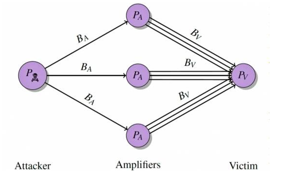

# 9.3 Web安全

Java开发很大的一个应用场景就是Web，即使不是Web, 很多时候也是采用的和Web类似的处理方式。因此了解目前常见的Web安全问题并做防范是非常关键的。

Web安全问题，从大的方面可以分为：

- 客户端安全：通过浏览器进行攻击的安全问题。
- 服务端安全：通过发送请求到服务端进行攻击的安全问题。

常见的客户端安全问题有：

- 跨站脚本攻击
- 跨站点请求伪造

常见的服务端安全问题有：

- SQL注入
- 基于约束条件的SQL攻击
- DDOS攻击
- Session fixation

本文主要针对这些问题进行讲述。

## 9.3.1 跨站脚本攻击

跨站脚本攻击，全称Cross Site Script（XSS），故名思议是跨越两个站点的攻击方式。一般指的是攻击方通过“HTML”注入的方式篡改了网页，插入了恶意的脚本，从而在用户浏览网页或者移动客户端使用WebView加载时，默默地做了一些控制操作。

XSS可以说是客户端安全的首要问题，稍有不注意就会漏出相关接口被利用。

一个XSS攻击的例子，如下：

- 一个Java应用提供了一个接口可以上传个人动态，动态内容是富文本的。
- 攻击者上传的内容如下：

	``

- 在服务端和客户端程序未做任何过滤的情况下，其他用户访问这个动态的页面时，就会执行这个脚本。

如果脚本不是一个alert，而是换成跳转到一个具有删除操作的URL或者脚本获取用户的Cookie然后发送到远程服务器上，可想而知危害有多大。

防范此种攻击的常用方式有以下几种：

- 对任何允许用户输入的地方做检查，防止其提交脚本相关特殊字符串，如script、onload、onerror等。客户端和服务端都要做检查。
- 做输入过滤，即将特殊字符都过滤掉或者换成HTML转义后的字符。Java中可以使用Apache commons-lang中的StringEscapeUtils的escape前缀的方法来做转义。
- 给Cookie属性设置上HttpOnly，可以防止脚本获取到Cookie。
- 对输出内容做过滤。这个可在客户端做，也可在服务端做。服务端主要就是转义HTML字符，客户端可以使用escape方法来过滤。

## 9.3.2 跨站点请求伪造

跨站点请求伪造，全称Cross Site Request Forgery,简称CSRF。也是一种常见的攻击方式。

此种攻击方式，主要是通过诱导用户点击某些链接，从而隐含地发起对其他站点的请求，进而进行数据操作。

一个攻击示例如下：

- 一个用户登录了一个站点，访问http://xx/delete_notes?id=xx即可删除一个笔记。
- 攻击者在它的站点中构造一个页面，HTML页面含有以下内容：

	``

- 当用户被诱导访问攻击者的站点时就发起了一个删除笔记的请求。

对于CSRF攻击的常用解决方案有以下几种：

- 对重要请求要求验证码输入,这样就能防止在用户不知情的情况下，被发送请求。
- 使用类似防盗链的机制，对header的refer进行检验以确认请求来自合法的源。
- 对重要请求都附带一个服务端生成的随机token, 提交时对此token进行验证。这也是业界一个很普遍的做法。

## 9.3.3 SQL注入

SQL注入攻击是一个很常见的攻击方式，原理是通过发送特殊的参数，拼接服务端的SQL字符串，从而达到改变SQL功能的目的。

一个攻击例子如下：

- 服务端登录验证使用下面的方式,其中userName和userPwd都是用户直接上传的参数

    ```
    String sql = "select * from user where user_name = '" + userName + "' and pwd = " + userPwd;
    ```
- 用户提交userName为admin'--,userPwd随便字符串xxx
- 拼接好之后的SQL语句变成了：`select * from user where user_name = 'admmin'--' and pwd = 'xxx'`（--为SQL语句的注释）, 这样只要存在user_name为admin的用户，此语句就能成功执行并返回admin用户的信息。

这里需要说明的是，如果服务器的请求错误信息没有做进一步封装，直接把原始的数据库错误返回，那么有经验的攻击者通过返回结果多次尝试就会有机会找出SQL注入的机会。

防范此种攻击的方案有以下几个：

- 在Java中构造SQL查询语句时，杜绝拼接用户参数，尤其是拼接SQL查询的where条件。全部使用PreparedStatement预编译语句, 通过？来传递参数。
- 在业务层面，过滤、转义SQL特殊字符，Apache commons-lang中的StringEscapeUtil提供了escapeSQL的功能（最新的lang3已经删除此方法，因为其只是简单的替换'为''）。

## 9.3.4 基于约束条件的SQL攻击

基于约束条件的SQL攻击基于的原理如下：

- 在处理SQL中的字符串时，字符串末尾的空格字符都会被删除，包括WHERE子句和INSERT语句，但LIKE子句除外。
- 在任意INSERT查询中，SQL会根据varchar(n)来限制字符串的最大长度，即超过n的字符串只保留前n个字符。

如此，我们设计一个用户表（暂且忽略设计的合理性），对其中的用户名和密码字段都设置为25个字符限制：

```
CREATE TABLE test_user (
    `user_name` varchar(25),
    `pwd`  varchar(25)
);
```
有一个user_name为`user_test`的用户注册，于是向数据库添加一条记录。

```
insert into test_user values("user_test","111111");
```

接着，一个user_name为'user_test              1'(中间留有25个空格)的用户再来注册。一般的业务逻辑如下：

- 判断用户名是否存在

    ```
    select * from test_user where user_name = 'user_test              1'
    ```
    因为查询语句不会截断字符串，因此这样获取不到记录，表示用户不存在。

- 用户名不存在，那么插入新用户。

    ```
    insert into test_user values("user_test              1","123456")
    ```

这样，由于`user_name`约束为25个字符，那么新用户的`user_name`成为了'user_test      '（后面是16个空格字符）。现在数据库记录如下（第二个记录后面是16个空格）：
    
user_name | pwd
----|-----
user_test               | 111111
user_test               | 123456

这样，当使用`user_name='user_test'`和`pwd='123456'`登录时，能匹配到第二条记录，登录是成功的。但是用户信息使用的第一条的记录，于是攻击者就获取到了第一个用户的操作权限。

防范此种攻击的措施如下：

- 为具有唯一性的那些列添加UNIQUE索引。
- 在数据库操作前先将输入参数修剪为特定长度。

## 9.3.5 DDOS攻击

DDOS，全称Distributed Denial of Service, 分布式拒绝服务攻击。攻击者利用很多台机器同时向某个服务发送大量请求，人为构造并发压力，从而使得服务被冲垮，无法为正常用户提供服务。常见的DDOS攻击包括：

- SYN flood
- UDP flood
- ICMP flood

其中SYN flood是最为经典的DDOS攻击。其利用了TCP连接三次握手时需要先发送SYN的机制，通过发送大量SYN包使得服务端建立大量半连接，消耗非常多的CPU和内存。针对这种攻击，很多解决方案就是在TCP层就使用相关算法识别异常流量，直接拒绝建立连接。但是，如果攻击者控制很多机器对一个资源消耗比较大的服务接口发起正常访问请求，那么这个方式就无效了。

由于难于区分是否是正常用户的请求，因此DDOS是非常难以防范的，但仍有一些措施能够尽量地减少DDOS带来的影响，如下：

- 合理使用缓存、异步等措施提高应用性能。应用抗并发的能力越强，就越不容易被DDOS冲垮服务。
- 合理使用云计算相关组件，自动识别高峰流量并做自动扩容。
- 在应用中限制来自某一IP或者某一设备ID的请求频率。超过此频率就将其放入黑名单，下次请求直接拒绝服务。Java中可以通过Redis的incr和expire操作来达到。如下：

    ```
    String ip = NetworkUtil.getClientIP(request, false); //获取客户端ip地址
    String key = "ddos." + ip;
    long count = suishenRedisTemplate.incr(key); //incr不会影响expire
    if (count > 10000) {
        throw new AccessException("access too frequently with ip: "
             + StringUtils.defaultString(ip));
    } else {
        if (count == 1) {
            suishenRedisTemplate.expire(key, 10);
        }
        return true;
    }
    ```
    
    上述代码即可将同一IP的请求限制在十秒钟10000次。
    
    此逻辑越靠近访问链路的前面效果越好，比如直接在Nginx中拦截效果就要比在业务应用中做要好。

还需要提到的是DDOS一个新的变种，反射型DDOS攻击，也被称为放大攻击。原理如下图所示：



此种攻击，攻击者并不直接攻击目标服务IP，而是伪造被攻击者的IP，发送请求包到网上一些开放的特殊服务的服务器（放大器。这些服务器由于协议的特点并不会验证源IP的真伪，于是会将数倍于请求报文的回复数据发送到被攻击者的IP，从而对后者间接形成DDOS攻击。任何设计不完善的、基于UDP请求的协议或者ICMP协议都能形成放大器，包括DNS请求、Ping请求、NTP monlist请求、SSDP协议（简单服务发现协议）等。此种攻击不需要大量的肉鸡、难以追踪，正变得越来越流行。防范此种攻击通常的手段就是进行DDOS流量清洗和增加ACL过滤规则。

## 9.3.6 Session fixation

Session fixation攻击，故名思议就是会话固定攻击。在我们平时的Web开发中都是基于Session做用户会话管理的。在浏览器中，Session的ID一般是存储在Cookie中的，甚至直接附带在query参数中。如果Session在未登录变为登录的情况下不发生改变的话，Session fixation攻击就形成了。

一个攻击示例如下：

- 攻击者进入网站http://xx.com。
- 攻击者发送http://xx.com?JSESSIONID=123456给一个用户。
- 用户点击此链接进入网站，由于URL后面有JSESSIONID，因此直接使用此做为Session的ID。
- 用户成功登陆后，攻击者就可以利用伪造的Session ID获取用户的各种操作权限。

此种攻击的关键点就在于Tomcat使用JSESSIONID做为Session ID。因此，防范此种攻击的核心之一就在于不能使用客户端传来的Session ID。此外还有以下方法：

- 不要接受由GET或者POST参数指定的Session ID值。
- 针对每一个请求都生成新的Session。
- 只接受服务端生成的Session ID。
- 为Session指定过期时间。

Java Web项目中,可以实现一个拦截器, 将使用query参数传递JSESSIONID的请求的Session删除掉：

```
public void doFilter(ServletRequest request, ServletResponse response,
                         FilterChain chain) throws IOException, ServletException
    ...
    
    if (httpRequest.isRequestedSessionIdFromURL()) {
        HttpSession session = httpRequest.getSession();
        if (session != null) {
            session.invalidate();
        }
    }
    ...
}
```

此外，对于每一次登录后的Session都重新生成ID, 并设置合理的失效期。

```
public JSONResult login(@RequestBody LoginRequestBody requestBody,
                            HttpServletRequest request)
    ...
    boolean loginResult = doLogin();
    if(loginResult){
        request.changeSessionId(); //重新生成Session ID
        request.getSession().setMaxInactiveInterval(1800); //30分钟失效
    }
    ...
}
```

## 9.3.7 隐私数据存储

随着市面上发生一次次数据库被脱导致用户隐私数据被泄漏的事情，越来越多的人意识到了隐私的重要性，在选择一个应用的时候也越来越在意对自己隐私数据的保护。这里所说的隐私数据包括：手机号、实名、身份证号、家庭住址、单位地址、家庭情况、密码等等。那么在技术层面如何存储这些隐私数据来保障用户的隐私安全呢？

1. 使用单向散列算法

    此种方式对明文进行加密后是无法恢复明文的，因此仅仅适用于密码这种不需要恢复明文只需要做验证的场景。

1. 使用加密算法

    此种方式，在存储和使用用户数据的时候都进行加/解密运算，能够在一定程度上保护数据的安全性。但每次都要进行加解密使得代价有点高，而如果使用简单的算法则无法面对穷举或者字典攻击。并且加密的数据对于SQL等数据库查询语句优化是不友好的，操作都得通过程序进行。此外，算法所使用的密钥的安全也是一个问题，存储在哪里都有被拿到的机会。而如果进一步对于每个用户或者每条数据都使用不同的密钥，那么就会提高程序的逻辑复杂性。
    
    还得考虑到日志采集、数据分析等非具体业务场景，这些隐私数据最终还是要变为明文进行流通，无法从根本上保证隐私数据的安全。
    
综上分析，可以采取以下这种方案：

1. 每一个用户都有自己的密钥，对其手机号、身份证等隐私信息使用加密算法来混淆其中的几位。如：159efadsc2681。如此，在只是需要展示这些信息的地方无须解密，直接使用即可。只有诸如发送短信、用户信用验证时才需要解密。

1. 密钥存储在另一个库中，由另外一个团队维护、独立管理，具有最高级别的访问权限，访问QPS也受严格控制。

1. 如果给数据分析部门提供数据，则提供隐私数据转换后的数据。例如：对用户的归属地分析，那么可以提供身份证转化为地区归属地后的信息而不是直接提供身份证号。

如此，即使脱库也无法解密所有数据。而且密钥库和业务库独立，单独脱一个库是没有意义的。密钥库的访问权限和访问频率也都受限制，即使是内部人员脱库都很容易被发现。

总之，对诸如身份证号、通讯录、支付宝账号等隐私信息要注意加密或者散列存储，一定不要明文发送到客户端，展示也不要明文展示，只有当真正使用的时候再去获取明文。


