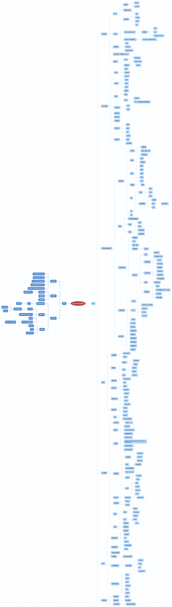
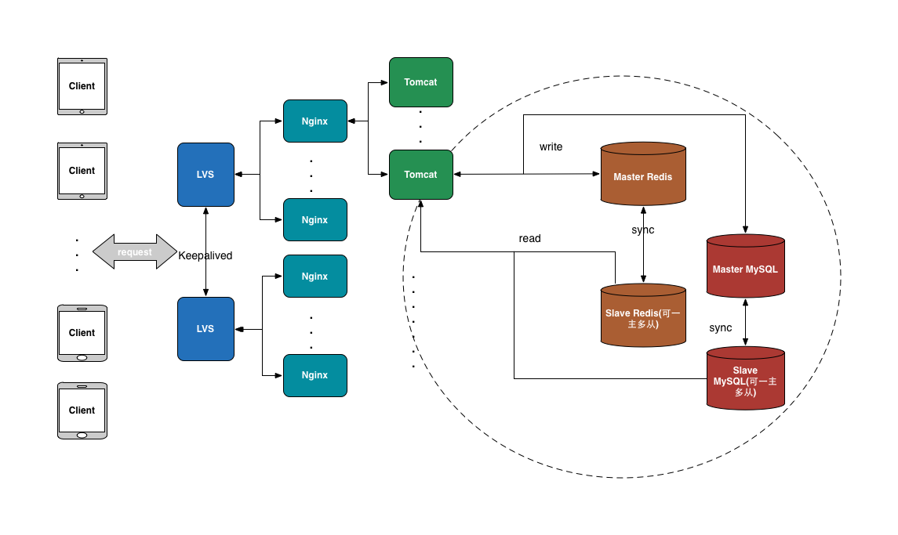

# 1.2 Java后端技术概览

基于上一节讲述的后端基础设施，可以从中引出其需要的技能列表。进一步细化可以得到更为具体的技能树，也是Java后端工程师技能的一个总体概览图：

可以通过扫描下面的二维码查看：

本书知识点围绕此技能树进行。

## 1.2.1 软件开发的核心原则

此处所说的是软件开发应该遵循的一些核心原则：

- Don't Repeat Yourself: 这是软件开发的一个基础原则，即不要做重复性劳动。也是现在所说的“极客文化”的一种。代码重复、工作重复在软件开发中都是不合理的存在。利用各种手段消除这些重复是软件开发的一个核心工作准则。
- Keep it simple stupid：即KISS原则。在做软件设计的工作中，很多时候都不要想得过于复杂，也不要过度设计和过早优化，用最简单且行之有效的方案也就避免了复杂方案带来的各种额外成本。既有利于后续的维护，也利于进一步的扩展。
- You Ain’t Gonna Need It: 即YAGNI原则。只需要将应用程序必需的功能包含进来，而不要试图添加任何其他你认为可能需要的功能。因为在一个软件中，往往80%的请求都花费在20%的功能上。
- Done is better than perfect: 在面对一个开发任务时，最佳的一个思路就是先把东西做出来，再去迭代优化。如果一开始就面面俱到，考虑到各种细节，那么很容易陷入牛角尖而延误项目进度。
- Choose the most suitable things: 这是在做方案选择、技术选型时候的一个很重要的原则。在面对许多技术方案、开源实现的时候，务必做到的是不能盲目求新，要选择最合适的而非被吹得天花乱坠的。

## 1.2.2 软件过程

一个软件的生命周期中，除了开发还有很多其他步骤，也都是需要掌握的一些技术。

- 项目管理：项目管理对于一个软件的开发是非常重要的，能够保证项目进度有条不紊地进行，在可控的时间内以一定的质量交付。瀑布开发模型、螺旋开发模型是传统的项目管理模型。在互联网的开发工作中，敏捷开发则是比较受推崇的开发方式。所谓敏捷开发即快速实现原型，然后快速迭代。Scrum是目前普遍流行的敏捷开发方式之一。
- 测试驱动开发：在平时的开发过程中，目前比较流行也是行之有效的一种方式就是Test Driven Develop，即测试驱动开发。此种方式的核心就是编写单元测试。简单来讲，就是先完成某一个功能的单元测试用例，然后在逐步消除测试用例的编译错误的过程中完成功能的开发。
- 持续集成：某一个软件功能完成开发之后，后续还有测试、预发布、部署等过程。整个过程称之为集成，而持续集成指的是无需人工干预可以不断地进行这个过程。Jenkins、Quick Build都是比较典型的持续集成工具。 

## 1.2.3 日常开发

日常开发指的是一些日常需要掌握的技能、工具等。
    
- 编辑器：开发中现在用的比较多的编辑器包括Emacs、Vim和SublimeText。笔者用的最多的就是SublimeText，基本能够满足自己的开发需求，包括编写脚本代码、查看代码文件等。Vim和Emacs这两款编辑器相对SublimeText来说需要记住很多命令，有一定的上手门槛。
- 源码版本管理：代码的版本管理工具由CVS到SVN再到现在的Git，已经在事实上形成了以分布式版本管理为主的版本管理方案。基于Git，可以采用Git Flow做为源码管理模型。
- 项目工具：Github是一个第三方Git中央仓库，目前是世界最大的开源代码库，也能够做为私人的代码管理软件；Facebook开源的Phabrictor提供了非常强大的任务管理、Bug管理、测试、代码管理等，但其上手门槛相对较高；禅道是国人开发的一款项目管理工具，但是其免费版功能有限；以Tower.im为代表的第三方项目管理服务也是一个可选择的方案，风险在于数据都不再是私有的。

## 1.2.4 运行环境

后端应用开发完成之后是需要部署到服务器上对外提供服务的。从最开始的直接在物理机上部署服务到后来的虚拟环境、云环境再到现在火热的容器，直至最近兴起的无服务器技术。都是为了让服务的运行环境能够更加便于建立、更容易维护、更容易扩展。
    
- Linux: 说到后端服务器肯定绕不过Linux。至少现在互联网的后端服务绝大多数都是部署在Linux的各种服务器版本中的。其中CentOS、Ubuntu以及Debian是用的比较多的版本。对于Linux，需要熟练掌握的就是很多常用Shell命令如ps、netstat、lsof、ss、df、dh等等。此外，很多性能分析命令如top、vmstat、iostat、sar等也需要熟练使用。
- 应用服务器：就Java来讲，很多时候开发的都是Web应用，以HTTP协议对外提供服务。除了对性能要求比较苛刻的情况下会自己构建HTTP服务之外，大部分情况是需要依赖于支持Java程序的应用服务器的。目前最为常用的有：Tomcat、Jetty。严格来讲，这两者只是Servlet容器，真正的JavaEE应用服务器如Jboss、Weblogic在互联网领域很少使用。当然，这些软件并没有提供URL重写、请求委托等Web服务器功能，还不足以担当完整Web服务器的角色。Nginx则是目前最为流行的Web服务器。
- 负载均衡：在高并发流量环境下，后端服务会以集群的模式对外提供服务。在集群的前面，需要负载均衡器将请求分配到集群的各个结点上。LVS是最为流行的四层负载均衡软件,HAProxy是另一个即支持四层又支持七层负载均衡的软件，Nginx则是七层负载均衡最为流行的解决方案。当然，性能最为好的负载均衡方案是以F5为代表的硬件负载均衡，但由于其昂贵的成本因此在互联网团队中很少使用。此外，这里需要补充的是为了保证同等角色的服务的高可用，如LVS经常作为流量的入口，因此会部署多个LVS结点互为主备防止一个挂掉的时候造成服务不可用。而实现互为主备的技术目前用的最多的就是Keepalived。
- 虚拟化：虚拟化技术是前几年经常用来做私有云的一种技术。即将自己的物理主机通过虚拟化技术分裂为多个虚拟主机，能够隔离资源。其中，VPS（虚拟专用服务器）的代表技术包括：微软的Virtual Server、VMware的ESX Server、SWsoft的Virtuozzo。此外，OpenStack提供的构建私有IIAS的功能、Cloud Foundry提供的构建私有平台运行环境以及Docker带来的容器服务都是虚拟化技术的一种。

## 1.2.5 第三方服务

虽然从根本上讲所有的软件服务都是可以自己开发的或者部署到自己服务器上的。但是受限于成本、周期或者其他客观因素，很多服务还是需要使用第三方的。
    
- IAAS：Infrastructure As A Service, 是云计算最开始的一种模式，现在基本上所有的云服务商都有IAAS的服务。其中，全球最强大的云服务提供商是亚马逊的AWS，国内的则当属阿里云。就目前来看，即使是强如AWS也会出现一些运维故障，因此国内的这些云计算提供商很多时候的服务健壮性、运维响应更是经常被人吐糟。就笔者自己的经历来看。2010年左右，盛大云的云服务其实做的还不错，但后来由于种种原因现在基本已经没啥份额了。国内除了阿里云，UCloud算是专注做云计算的一个比较靠谱的公司了。此外，还有一个青云，做的东西略显高大上，也是一个不错的选择。当然，现在这些云服务商早就不仅仅是IAAS了，也做了很多PAAS的服务。
- PAAS：Platform As A Service，即只需要提交代码到指定的运行环境，其他的诸如代码打包、部署、IP绑定都由平台完成。除了可以使用Cloud Foundry构建自己的PAAS平台以外，现在最为流行的第三方PAAS服务有：新浪的SAE、百度的BAE以及Google的GAE。
- 域名：有个可以提供服务的应用后，那么域名也是一个必须的基础设施。一个好的域名不仅仅代表企业的形象，也能够更加方便用户的记忆与传播。目前购买域名可以通过国外的name.com、godaddy以及国内的万网等。有了域名之后下一步就得进行备案，域名提供商一般都提供了配套服务或者去找一些代理也可以办下来。此外，对于域名的解析，域名提供商一般会内置解析功能，也可以使用独立的DNS服务，如dnspod。
- CDN: 内容分发网络，即就近请求的一种技术实现。服务提供方将会被大量访问的内容在全国的多个结点都做缓存，这样当用户访问时就能够就近选择，从而减少网络传输延时，提高访问速度。国内目前七牛和又拍都提供了不错的CDN服务，当然像阿里云、UCloud这种综合云服务商也都有cdn服务。
- 邮件发送：这个主要需要依赖邮件服务器，然后通过SMTP协议就可以实现发送。可以选择自己搭建，也可以选择诸如腾讯邮箱、网易邮箱等。
- 短信发送：使用短信发送验证码、营销短信是很常见的应用场景。由于短信是需要运营商支持的，所以这一块基本上都是需要依赖第三方代理的。市面上也有很多短信网关代理。
- 消息推送：在移动应用上，推送已经成为一个标配功能。目前个推应该是第三方推送服务中的佼佼者，而且由于其客户很多，在联盟唤醒上有很大的优势。
- 开放平台：通过开放平台，可以使用OAuth等协议获取用户在第三方平台上的信息实现第三方平台登录等。目前，微博、微信、QQ是最常见的第三方登录方式，基本上都是使用OAuth协议为第三方开发者提供服务的。
- 支付接口：支付接口是很多内置购买功能软件的必备组件。目前，接入最多的无非是支付宝和微信，都提供了开放平台供商家接入。当然，也有直接绑定银行卡支付的，此时需要走的就是银行或者银联的网关接口。
    
## 1.2.6 计算机基础科学知识

对于像数据结构、算法、计算机网络、操作系统、计算机组成原理这些计算机科学基础知识，不管是后端还是其他领域都是必须的技能，也是所有软件开发的基础。扎实的计算机科学基础才能让你在学习、使用某种技术开发软件、调试软件、排查问题时能够心里有底、有据可循。
    
- 数据结构：数据结构是组成程序的基础。经典的数据结构包括：字符串、数组、链表、哈希表、树（二叉树、平衡树、红黑树、B树）、堆栈、队列、图。
- 算法: 经典的排序和查找算法在平时的开发工作中经常会用到，如：冒泡排序、插入排序、选择排序、归并排序、快速排序、希尔排序、堆排序以及二分查找等。此外，在函数/方法的算法实现中要注意递归和迭代各自的优缺点。而衡量算法性能无外乎空间复杂度和时间复杂度。
- 业务相关算法：除了上面的基本算法之外，业务中还会经常涉及到一些更为复杂的算法，如：压缩算法、LRU缓存算法、缓存一致性、编译原理中的状态机等。此外，目前越来越火的机器学习中有很多算法也是在很多业务场景中有很大用途的，如：用于文本分词的结巴分词和中科院ICTCLAS；用于关键词提取的TF-IDF和TextRank；用于计算文本相似度的主题模型、Word2Vec、余弦相似度以及欧几里得距离；用于文本分类的朴素贝叶斯；用于推荐的聚类、协同过滤、用户画像、隐语义模型等。
- 计算机网络： TCP/IP协议是网络最根本的协议，其七层/四层协议栈的设计都是非常精华的东西，连接的建立、断开以及连接的各种状态的转换都是排查、解决网络问题的根本依据。从TCP/IP往上，HTTP协议是现在绝大多数后端应用对外提供的协议，发展到现在已经将要步入HTTP2.0时代，带来了持久连接、连接复用等令人振奋的新特性。此外，基于HTTP的HTTPS协议由于其安全性在逐渐的成为后端服务对外开放的主流协议。业务层面，基于HTTP协议的RESTful规范正成为对外接口的主流规范，而OAuth2.0协议也在成为开放平台对外的主流协议。除了HTTP之外，SMTP是另一个基于TCP/IP的应用协议，主要用在发送邮件上。
- 设计模式： 在软件开发中，前人的经验形成了很多经典设计模式供我们使用，能够使得软件的实现可服用、可扩展、可维护。经典的工厂模式、简单工厂模式、单例模式、观察者模式、代理模式、建筑者模式、门面模式、适配器模式、装饰器模式在日常的很多开发场景下都具有很重要的意义。

## 1.2.7 数据

现在互联网的所有业务其实都是围绕数据来进行的。而数据传输、数据存储、数据分析处理都是关键的部分。
  
- 高速缓存：目前用的最为广泛的缓存软件Redis能够支持丰富的数据结构，如：字符串、列表、有序集合等多种数据的存储。了解缓存实现的原理、内存淘汰的策略能够更好地使用缓存。此外由于缓存的成本较高，在使用缓存的时候一定要做好量化和存储优化工作。
- 数据库：掌握数据库的很大一个关键点就在于对索引的使用，可以说，正确地使用索引就基本等于掌握了数据库的使用。目前绝大多数据库都是使用B树做为索引的数据结构，目的就是为了利用磁盘顺序读写的特性。不同的数据库由于本身设计目的的不同，都有一些独特的优势，如：MongoDB天然支持sharding，但受限于NoSQL，在重事务、有关联关系的场景下并不适用；HBase使用LSM作为底层数据结构，牺牲了读性能来换取高速的写性能。
- 搜索引擎：搜索引擎主要应对全文检索以及多维度查询的业务场景。掌握搜索引擎使用的数据结构、集群方式、配置的关键点有助于更好地使用搜索引擎服务于业务应用。
- 消息队列：消息队列有两种角色：生产者和消费者，两种角色对于消息队列的需求也不一样。其中，对于消费者来说，消息消费的方式包括发布-订阅和队列两种。消息队列在语义保证上分为：At Most Once、At Least Once、Exactly Once三种模式，需要更具特定的业务场景选择合适的语义保证。此外，消息队列对于高可用、消息安全的保证决定了此消息队列的可靠性。
- 数据存储和处理：数据存储下来最终还是要用来做分析和处理的。数据的处理分为离线处理和实时处理。离线处理的优势在于能够处理大量数据，但是一般会有T+1的延迟，适用于计算量大但是对于结果允许有延时的场景。但对于离线数据分析，还有一个很关键的就是数据倾斜问题。所谓数据倾斜指的是region数据分布不均，造成有的结点负载很低，而有些却负载很高，从而影响整体的性能。因此，处理好数据倾斜问题对于离线数据处理是很关键的。而实时处理一般是流式处理方式，适用于数据能够转换为数据流，对于结果要求及时性的场景。对于实时数据分析，需要注意的就是实时数据处理结果写入存储的时候，要考虑并发的问题，虽然对于Storm的Bolt程序来说不会有并发的问题，但是写入的存储介质是会面临多任务同时读写的。通常采用的方案就是采用时间窗口的方式对数据做缓冲后批量写入。
- 数据同步：数据仓库的数据来源除了直接的日志外还有一个很关键的就是业务数据库。从业务数据库到数据仓库的过程称为数据同步。有基于SQL的同步方案，也有基于MySQL binglog的增量同步方案。
    
## 1.2.8 Java

对于Java方面的技能来说，主要有两个大的部分，包括Java编程和JVM。
    
先来看一下Java编程部分，这也是Java工程师最最基础的技能。
   
- IDE: 目前用的最多的Java IDE当属Eclipse和Intellij IDEA。前者是老牌IDE，逐步淘汰了Jbuilder以及Netbeans，占领了大部分Java IDE市场。后者则是后起之秀，由于其增量编译、智能分析代码等带来的性能提升，现在已经得到了大规模使用，大有取代Eclipse之势。
- 核心语法：目前用的最多的当属JDK6的Java语法。而到了Java7引入了try with resource、switch string、diamonds等语法。Java8则又引入了lambda、stream等语法。
- 集合类：集合类是Java语言中非常精华的部分，包括：HashMap、ArrayList、LinkedList、HashSet、TreeSet以及线程安全的ConcurrentHashMap、ConcurrentLinkedQueue等线程安全集合。了解他们的实现原理以及查询、修改的性能以及使用场景是非常必要的。
- 工具类：Google Guava、Apache commons、FastJson提供了很多JDK本身没有的工具类、集合等。此外，ASM字节码操作以及CGLIB代码生成能够提供更底层的java编程功能。
- 高级特性：抛开Java核心的基本编程，并发编程、泛型、网络编程、序列化RPC都属于java的高级编程特性。其中并发编程需要掌握Executors提供的各种并发工具、Java7带来的fork/join框架以及CountDownLatch、Semaphore、CyclicBarrier等同步工具；网络编程要区分好BIO、NIO以及AIO；序列化中除了JDK自带的序列化实现之外，Protobuf和Kryo是比较高效的第三方实现；RPC的实现中，Thrift、Hessian、Dubbo以及RMI则是比较常用的几个协议,其中的Hessian是基于Http协议的，Dubbo是基于TCP协议，而Thrift则同时支持。
- JavaEE: JavaEE现在是Java应用最为普遍的一个领域。Servlet是JavaEE中最根本的组件之一。而Servlet3.0带来的异步Servlet提高了其处理请求的性能。
- 项目构建：目前用的最多的Java项目构建工具包括Maven和Gradle，提供了源码包依赖管理、编译、打包、部署等一系列功能。
- 编程框架：Spring是Java编程中避不开的一个框架，发展到现在除了Spring核心的IOC、AOP之外，SpringMvc、Spring Data、Spring Cloud等等都给Java开发者们带来了开发上的便利，大大提高了开发效率。除此之外，ORM框架MyBatis也是Java领域比较火的框架之一，实现了数据库记录到Java对象的映射操作。此外，Jersey提供了从客户端到服务端的一整套符合RESTful规范的开发框架。
- 测试：测试是任何编程都需要的一步。黑盒测试主要指的通常进行的功能测试，白盒测试则主要指的对代码功能、质量进行的测试。此外，关键的单元测试则是开发工程师需要着重注意的地方，“测试驱动开发”的理念也是值得推崇的开发方式。JUnit是目前Java中实现单元测试的主流方案。

一般来说掌握上面所述的Java编程技能是能够应付大多编程工作的。但是如果在代码层面已经做到最大努力却还是达不到性能要求的时候，就需要在JVM虚拟机层面做一些努力了。可以说掌握JVM相关技术是Java开发进阶的一个关键步骤。
    
- 虚拟机实现: Java的虚拟机实现除了我们常用的HotSpot外，还有JRockit、J9以及移动平台的Dalvkit。我们通常锁描述的JVM优化绝大多是是针对HotSpot虚拟机来说的。
- 类加载机制：JVM的类加载机器遵循双亲委派原则，即当前类加载器需要先去请求父加载器去加载当前类，如果无法完成自己才去尝试进行加载。OSGI框架则打破了此机制，采用了平等的、网状的类加载机制，以实现模块化的加载方案。
- 运行时内存组成: 程序计数器、堆栈、方法区、堆、堆外内存，这些一起组成了JVM的运行时内存。
- Java内存模型：Java的主内存+线程私有内存的模型是线程安全问题产生的根本。
- GC原理和调优：与C、C++这些语言相比，GC是Java的优势，但因为GC的细节被JVM屏蔽了，在对内存、性能要求非常苛刻的情况下难以进行自由控制，某种程度这也是劣势。如果想在某些场景下发挥GC的最大性能，能做的就是对GC的各种参数做优化配置，如新生代和老年代的垃圾回收器选择、各种垃圾回收参数的配置等。此外，很多时候由于代码质量或者外部客观因素，造成了JVM频繁GC，需要使用相关的工具快速进行问题定位和解决。
- 性能调优和监控工具：JDK自带了很多强大的调优和监控工具，包括jmap、jstack、jcmd、jconsole、jinfo等。此外，btrace是一款非常强大的在线问题动态排查工具，能够无须重启Java进程，动态的插入一些代码逻辑，从而拦截代码执行逻辑打印日志，从而排查问题。
    
## 1.2.9 系统架构

一个应用从0开始一般会经历单体应用、垂直应用到分布式服务架构的演化。如下图所示：
    

- 单体应用：当应用规模、团队规模比较小的时候，只需要一个包括了所有功能的应用即可。减少部署结点，也减少了部署成本。此时，对数据库的ORM操作是架构实现的关键点。
- 垂直应用：当应用的用户规模越来越大，请求量越来越高的时候。单体应用增加结点带来的资源浪费会凸现出来，因为绝大多数接口请求量并没有特别大，根本没必要扩充到多个结点。此时，就可以将单体应用拆分成互不相关的几个应用，分别对外提供服务。此时，加速每个应用开发的MVC框架是架构实现的关键点。
- 分布式服务：当垂直应用越来越多，应用之间的交互不可避免。抽离核心业务单独部署，逐渐形成稳定的服务中心。而随着团队规模的相应扩大，服务会随着团队的增多变得越来越多，粒度也会变得越来越小,也就逐步形成了分布式服务的架构，而当粒度细到某种程度、服务数量多到一定程度则可以称之为微服务。即在设计好业务边界之后将原来的单体应用分解成一个个细粒度的服务，彼此之间通过某种方式进行通信。微服务架构的关键在于如何做好服务的治理、调度、维护工作。目前，Dubbo算是微服务架构中用的比较多的框架，但Dubbo仅仅解决了微服务架构中的一部分问题。Spring Cloud则基本上涵盖了微服务架构的各个方面。

## 1.2.10 部署架构

对于Web应用来说，LVS+Nginx+Tomcat+MySQL+Redis即可构成一个简单通用的部署架构，如下图所示：

- LVS作为最前置的结点，负责在网络第四层转发流量、负载均衡。
- 多个LVS使用Keepalived互为主备实现高可用。
- Nginx作为反向代理，负责在网络第七层转发流量、负载均衡。
- Tomcat做为业务容器，主要的应用代码都在这里面。
- Redis作为缓存，隔离高并发请求和后端数据库。
- MySQL以主从模式对数据做持久化。

其中，虚线部分是数据库层，采用的是主从模式。也可以使用Redis Cluster（Codis等）以及MySQL Cluster（Cobar等）来替换。

